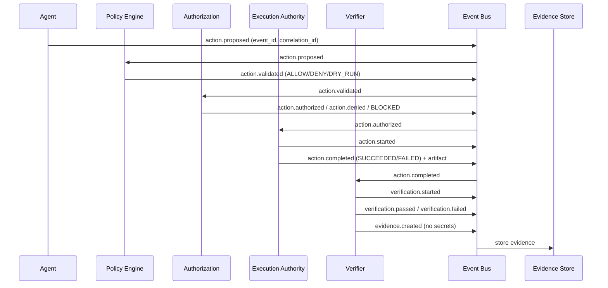

# LINEX.OS — Event Model (P8)

## Event Model — Append-Only, Immutable, No Secrets

Events are the data plane for action lifecycle, verification, evidence, audit.

### Event Types

- action.proposed
- action.validated
- action.authorized
- action.denied
- action.started
- action.completed
- action.failed
- verification.started
- verification.passed
- verification.failed
- evidence.created

### Event Structure

Each event must have:

- event_id: unique (UUID or similar)
- timestamp: UTC ISO8601 (e.g., 2026-10-04T18:07:31Z)
- actor: identity (User, Agent, Service, Tool, MCP Server, Execution Authority)
- action: what action (e.g., package-install, fs-write, network-connect)
- capability: which capability required (e.g., CAP_PACKAGE_INSTALL)
- resource: which resource (file path, package name, domain)
- scope: workspace, repository, project, user, host, network, production
- result: ALLOW, DENY, REQUIRE_APPROVAL, DRY_RUN, SUCCEEDED, FAILED, BLOCKED, VERIFIED, UNVERIFIED, etc.
- correlation_id: to link related events (e.g., same action across lifecycle)
- evidence: reference to evidence artifact (hash, not secret value)
- No secrets in event (must not log secret value, must not contain password, token, key)

Example:

```json
{
  "event_id": "evt_123456",
  "timestamp": "2026-10-04T18:07:31Z",
  "actor": "agent:planner-01",
  "action": "package-install",
  "capability": "CAP_PACKAGE_INSTALL",
  "resource": "pkg-config",
  "scope": "project",
  "result": "DRY_RUN",
  "correlation_id": "corr_abc123",
  "evidence": {
    "action": "package-install",
    "class": "PACKAGE_INSTALL",
    "policy": "PASS",
    "decision": "DRY-RUN",
    "execution": "NOT EXECUTED",
    "would_execute": "sudo apt-get install -y pkg-config",
    "exit_code": 0,
    "timestamp": "2026-10-04T18:07:31Z"
  }
}
```

### Event Flow Diagram (Mermaid)



### Event Store

- Interface: Event Store (append-only, immutable, queryable with policy)
- Local: must work offline, local file or SQLite, no cloud required
- Optional remote: can sync to remote if configured (future)
- Replaceable: vendor-neutral, interface-based

### No Secrets in Events

- Forbidden: log secret value, log password, token, key, credential
- Must: reference evidence by hash, not value; use placeholders for secret-like text in tests (build at runtime)
- Secret scanning: repository-wide including tests/ and .github, fail-closed, smart filtering for detection patterns vs real secrets (P7)

### Observability Distinction

- DEBUG LOG: for debugging, not audit, may contain detailed info but no secrets
- AUDIT EVENT: who did what, when, with what authorization, for security, no secrets
- SECURITY EVENT: policy violation, authorization failure, secret access attempt, etc., no secrets
- VERIFICATION EVIDENCE: STATUS/RESULT/EVIDENCE/NEXT, with PASS/VERIFIED/NOT VERIFIED/BLOCKED/SKIPPED, no PASS without evidence, no secrets

Do not mix.

### References

- execution-model.md (action lifecycle)
- data-model.md (state model)
- security-boundaries.md (secret boundaries)
- capability-model.md (capability required for event)
