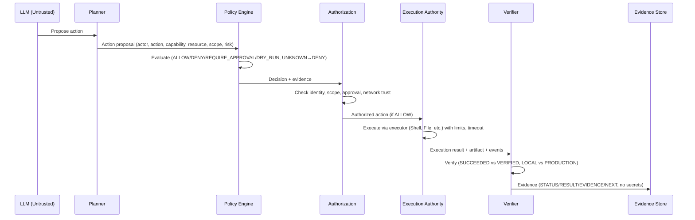

# LINEX.OS — Execution Model (P8)

## Primary Execution Model

```
LLM
  ↓ (proposes, may be prompt-injected, untrusted)
Planner (Agent Runtime)
  ↓ (action proposal: actor, action, capability, resource, scope, risk, justification)
Policy Engine (inputs: actor, action, capability, resource, scope, risk, env, context, approval, network)
  ↓ (decision: ALLOW, DENY, REQUIRE_APPROVAL, DRY_RUN, UNKNOWN→DENY, evidence)
Authorization Layer (checks identity, scope, approval, network trust)
  ↓ (authorized action or DENY/BLOCKED)
Execution Authority (Shell, Process, File, Browser, Computer, Network, Package executors)
  ↓ (execution result, artifact, events)
Verifier (Verification Engine)
  ↓ (verification evidence STATUS/RESULT/EVIDENCE/NEXT)
Evidence Store / Audit
```

Forbidden direct paths:

- LLM → shell (must go via Planner→Policy→Execution)
- LLM → sudo (must go via Policy→Execution Authority)
- LLM → filesystem mutation directly (must go via File Executor via Policy)
- Agent → production database directly (requires CAP + production auth + production evidence)
- UI → privileged execution directly (UI→API only)
- MCP server → unrestricted host access (via MCP Gateway)

## Action Lifecycle

```
PROPOSED
  ↓
VALIDATING (Policy Engine validates)
  ↓
AUTHORIZED / DENIED / REQUIRE_APPROVAL / DRY_RUN / BLOCKED
  ↓ (if AUTHORIZED)
EXECUTING (Execution Authority)
  ↓
SUCCEEDED / FAILED / BLOCKED / CANCELLED
  ↓
VERIFIED / UNVERIFIED (Verification Engine)
```

Important distinctions:

- SUCCEEDED ≠ VERIFIED (execution may succeed but verification may fail or be missing)
- EXECUTED ≠ SAFE (execution may happen but be unsafe, need policy check)
- LOCAL PASS ≠ PRODUCTION PASS (Arena sandbox PASS is REAL LOCAL TEST, not PRODUCTION EVIDENCE)
- MOCK PASS ≠ PRODUCTION PASS (Fake provider MOCK, Local DB REAL LOCAL TEST, Production API REAL PRODUCTION EVIDENCE)

## Execution Authority Executors

```
Execution Authority
├── Shell Executor (bash, sh) — CAP_PROCESS_EXEC, CLASS-1..2, scope workspace/repository
├── Process Executor (process spawn) — CAP_PROCESS_EXEC
├── File Executor (Filesystem Service) — CAP_FS_READ (LOW), CAP_FS_WRITE (MEDIUM), scope workspace/repository/project/user/host (host requires explicit)
├── Browser Executor (future) — CAP_BROWSER, HIGH risk
├── Computer Executor (future) — CAP_COMPUTER, HIGH risk
├── Network Executor (Network Service) — CAP_NETWORK_READ (LOW), CAP_NETWORK_CONNECT (MEDIUM/HIGH), allowlist official sources only, network state AVAILABLE/PARTIALLY/BLOCKED
└── Package Executor (via privilege-gate.sh) — CAP_PACKAGE_INSTALL, HIGH risk, allowlist + structured actions + dry-run default + --execute explicit, no arbitrary sudo
```

Each executor must pass Policy/Authorization, with resource limits (CPU, memory, disk, process count, file descriptors, network, execution time, output size) — design only in P8, not implemented.

## DRY-RUN Semantics

Any risk (package install, config, service, DB migration, permission changes) → DRY-RUN first.

Gate DRY-RUN default shows WOULD EXECUTE, NOT EXECUTED with full structured evidence ACTION/CLASS/POLICY/DECISION/EXECUTION/EXIT_CODE/TIMESTAMP/SYSTEM_SUDO/PROJECT_POLICY.

Agent must not jump PLAN→EXECUTE without DRY-RUN.

## Approval Levels

- AUTO: READ_ONLY, SAFE_WORKSPACE, BUILD_TEST, NETWORK_READ (if network PASS and official source)
- DRY_RUN: PACKAGE_INSTALL, PRIVILEGED_OPERATION — Gate dry-run first
- EXPLICIT_APPROVAL: PACKAGE_INSTALL with --execute, PRIVILEGED_OPERATION with --execute, git commit, git push, production deploy, CAP_SECRET_ACCESS, CAP_PACKAGE_INSTALL, host scope, network unrestricted
- DENY: DESTRUCTIVE_OPERATION (rm -rf /, mkfs, dd, shutdown, etc.), modify sudoers, bypass policy/auth, secret exposure, untrusted source, production access without auth

## Resource Scoping

- workspace: /home/user/linex.os, safe file operations
- repository: git repository
- project: broader project including config, but not host
- user: user home, not system
- host: host OS, /etc, /usr, etc. — requires explicit host capability + policy, even if SYSTEM_SUDO_POLICY is NOPASSWD:ALL, PROJECT_POLICY does NOT allow same
- network: outbound network, specific domains; no default network in the P1 MVP proposal (final policy requires P1 ADRs)
- production: production DB, production APIs, cloud production — outside the P1 MVP proposal; any future use requires separate production authorization + production evidence

Agent does not get host scope merely by getting workspace scope. Capability elevation explicit via Policy Engine.

## Event Flow

```
action.proposed → action.validated → action.authorized → action.started → action.completed → verification.started → verification.passed → evidence.created
       ↓                ↓                 ↓                   ↓                  ↓                     ↓                      ↓
   DENIED/BLOCKED    DENIED/BLOCKED   DENIED/BLOCKED     FAILED             FAILED              verification.failed
```

Each event: event_id, timestamp UTC, actor, action, scope, result, correlation_id, no secrets.

## Diagrams

### Runtime Layers

```
Hardware
  ↓
Host OS (Linux)
  ↓
LINEX.OS Substrate (detection, abstraction)
  ↓
Core Runtime (bootstrap, verification, toolchain)
  ↓
Policy / Authorization (allowlist, capability, risk)
  ↓
Execution Authority (executors)
  ↓
Verification / Evidence (logs, evidence, tests, attestations)
  ↓
Agents / Tools / Skills / MCP / Applications
```

### Action Execution (Mermaid)



### Trust Boundaries in Execution

```
Untrusted: LLM, User input, External APIs, MCP servers, Plugins
    ↓ (must be validated)
Semi-trusted: Agent Runtime, Tool Runtime, MCP Gateway, Configuration
    ↓ (must pass Policy)
Trusted: Policy Engine, Execution Authority, Verification Engine, Substrate
    ↓ (assumed, but still verified)
Host OS (trusted but not modified by LINEX.OS)
```

## Sandboxing Roadmap

- Level 0: Project Gate (current) — allowlist + structured actions + dry-run + evidence, no kernel sandbox
- Level 1: Dedicated unprivileged process — Execution Authority in separate unprivileged process
- Level 2: Filesystem isolation — chroot or mount namespace, workspace only
- Level 3: Network isolation — network namespace, allowlist domains only
- Level 4: Container / sandbox — Docker/Podman with resource limits, no privileged
- Level 5: VM / stronger isolation — VM/microVM for high-risk
- Level 6: Optional deeper OS integration — custom OS layer, modular

No implementation in P8, only roadmap.

## Failure Handling

- Policy Failure → BLOCKED
- Authorization Failure → DENY/BLOCKED
- Validation Failure → DENY
- Execution Failure → FAILED
- Network Failure → BLOCKED or FAILED (if essential)
- Dependency Failure → NOT VERIFIED or BLOCKED
- Resource Failure → BLOCKED
- Verification Failure → UNVERIFIED

Each failure must not become success automatically. Fail-closed.

## References

- AGENTS.md (execution rules, CLASS-0..6, Decision Matrix)
- ARENA.md (operating loop LOAD CONTRACT→STOP)
- docs/agent-contract.md (Policy vs Execution separation)
- capability-model.md (CAP_* model)
- security-boundaries.md (trust boundaries)
- event-model.md (events)
