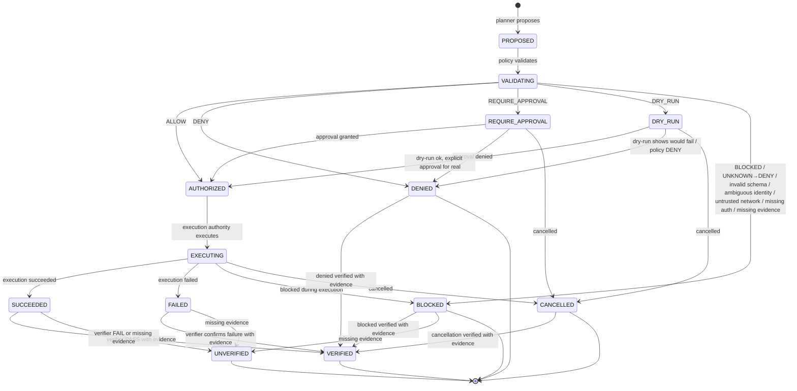

# Action Contract — P9

> Contract only, no implementation, no language chosen, respects P8 freeze.
> Action is proposed by Agent/Planner, validated by Policy, authorized, executed by Execution Authority, verified.

## Purpose

Action is atomic unit proposed by Planner/Agent, validated by Policy Engine, authorized by Authorization Layer, executed by Execution Authority (Shell, Process, File, Network, Package, future Browser, Computer), verified by Verifier, with evidence.

```
Task created
→ Plan (Planner proposes Actions)
→ Action proposed
→ Policy (ALLOW/DENY/REQUIRE_APPROVAL/DRY_RUN, UNKNOWN→DENY)
→ Authorization (Actor, Capability, Resource, Scope, Risk, Env, Context, Approval, Network)
→ Execution (via Execution Authority, capability, resource limits design only)
→ Result
→ Verify
→ Evidence
→ Learn
```

Without LLM→shell direct, without UI→privileged direct, without Agent→prod DB direct, without MCP→unrestricted host.

## Action Definition

Schema (contract, no implementation):

```json
{
  "action_id": "string, unique, immutable, e.g., action-uuid",
  "version": "string, semver",
  "type": "string, e.g., 'fs.read', 'fs.write', 'process.exec', 'shell.exec', 'network.read', 'network.connect', 'package.install', 'browser.open', 'computer.use', 'mcp.call', 'tool.call', 'skill.exec', 'workflow.step'",
  "name": "string, human readable, e.g., 'Read privilege policy'",
  "description": "string, what action does, why, which task/run it belongs to",
  "task_id": "string, reference to Task",
  "run_id": "string, reference to Run",
  "actor": {
    "id": "string, user | agent | service | tool | mcp server | execution authority",
    "type": "user | agent | service | tool | mcp_server | execution_authority",
    "role": "string, role of actor",
    "capabilities": ["CAP_FS_READ", "..., capabilities actor has"]
  },
  "capability_required": "string, e.g., 'CAP_FS_READ', must be explicit, DEFAULT DENY, UNKNOWN→DENY",
  "resource": "string, e.g., file path, process name, network URL, package name, tool id, mcp server id, must be validated, no path traversal",
  "scope": "workspace | repository | project | user | host | network | production, explicit elevation, Agent does not get host scope merely by workspace scope",
  "risk_class": "CLASS-0 | CLASS-1 | CLASS-2 | CLASS-3 | CLASS-4 | CLASS-5 | CLASS-6",
  "inputs": {
    "schema": "JSON Schema, defines expected inputs, no secrets",
    "example": {}
  },
  "outputs": {
    "schema": "JSON Schema, defines expected outputs, no secrets",
    "example": {}
  },
  "execution": {
    "authority": "shell | process | file | network | package | browser | computer | mcp | tool | skill | workflow",
    "executor": "string, specific executor id, e.g., 'shell-executor', 'file-executor'",
    "timeout": "number, seconds, max execution time, resource limits design only",
    "resource_limits": {
      "cpu": "number | null, design only",
      "memory": "number | null, design only",
      "disk": "number | null, design only",
      "process_count": "number | null",
      "fd": "number | null",
      "network": "boolean",
      "execution_time": "number, seconds",
      "output_size": "number, max bytes"
    },
    "dry_run": "boolean, true if DRY_RUN, false if real execution, DRY_RUN default for CLASS-4..5",
    "approval_required": "AUTO | DRY_RUN | EXPLICIT_APPROVAL | DENY"
  },
  "policy": {
    "decision": "ALLOW | DENY | REQUIRE_APPROVAL | DRY_RUN | BLOCKED | UNKNOWN",
    "reason": "string, why decision, which policy rule, which capability",
    "allowlist_checked": true,
    "capability_checked": true,
    "scope_checked": true,
    "risk_checked": true,
    "network_checked": true
  },
  "authorization": {
    "decision": "AUTHORIZED | DENIED | REQUIRE_APPROVAL | BLOCKED",
    "actor_verified": true,
    "capability_verified": true,
    "resource_verified": true,
    "scope_verified": true,
    "approval_verified": true
  },
  "state": "PROPOSED | VALIDATING | AUTHORIZED | DENIED | REQUIRE_APPROVAL | DRY_RUN | EXECUTING | SUCCEEDED | FAILED | BLOCKED | CANCELLED | VERIFIED | UNVERIFIED",
  "result_id": "string | null, reference to Result",
  "evidence_id": "string | null, reference to Evidence",
  "events": ["event_id, list of events for this action"],
  "created_at": "timestamp UTC, immutable",
  "created_by": "actor id",
  "correlation_id": "string, ties action to task, run, workflow, events, results, evidence",
  "parent_action_id": "string | null, if action is part of workflow/skill, parent action"
}
```

### Action Types (examples, not exhaustive, extensible via Tool Contract)

- fs.read — File read, CAP_FS_READ, LOW, AUTO, workspace scope, File Executor
- fs.write — File write, CAP_FS_WRITE, MEDIUM/HIGH, EXPLICIT for host, File Executor
- process.exec — Process execution, CAP_PROCESS_EXEC, HIGH, DRY_RUN + EXPLICIT, Process Executor
- shell.exec — Shell execution, CAP_PROCESS_EXEC, HIGH, DRY_RUN + EXPLICIT, Shell Executor
- network.read — Network read official allowlisted, CAP_NETWORK_READ, LOW, AUTO with allowlist check, Network Executor
- network.connect — Network connect unrestricted, CAP_NETWORK_CONNECT, MEDIUM/HIGH/CRITICAL, EXPLICIT, Network Executor
- package.install — Package install, CAP_PACKAGE_INSTALL, HIGH, DRY_RUN first + --execute explicit + allowlist official only, Package Executor via Gate
- browser.open — Browser open, CAP_BROWSER, HIGH, EXPLICIT, Browser Executor future
- computer.use — Computer use, CAP_COMPUTER, HIGH, EXPLICIT, Computer Executor future
- mcp.call — MCP call, CAP_MCP, MEDIUM trusted HIGH untrusted, EXPLICIT, MCP Gateway
- tool.call — Tool call, capability per Tool Contract, risk per Tool Contract, Tool Runtime
- skill.exec — Skill execution, composes tools, capability per Skill, Skill Runtime
- workflow.step — Workflow step, orchestrated sequence, Workflow Engine

Each Action type must have Tool Contract with ID, Version, Input/Output schema, Capability required, Risk class, Execution authority, Timeout, Resource limits, Evidence, Unknown Tool→BLOCKED.

## Action State Machine (P8 frozen, P9 extends with contract)

```
PROPOSED (Planner proposes Action)
  ↓
VALIDATING (Policy Engine validates: capability, resource, scope, risk, env, context, approval, network)
  ↓
AUTHORIZED / DENIED / REQUIRE_APPROVAL / DRY_RUN / BLOCKED (Policy decision, Authorization)
  ↓
EXECUTING (Execution Authority executes via executor, resource limits design only, DRY_RUN if required)
  ↓
SUCCEEDED / FAILED / BLOCKED / CANCELLED (execution finished)
  ↓
VERIFIED / UNVERIFIED (Verifier produces evidence, checks)

Any state → CANCELLED on cancellation (cooperative, timeout, explicit)
Any state → BLOCKED on Policy DENY during execution, capability DENY, validation failure
Any state → FAILED on unrecoverable error
```

Mermaid:



## Action Execution

- Action execution via Execution Authority only, not directly by Agent/Planner/LLM/UI/MCP
- Execution Authority checks Policy decision AUTHORIZED, Authorization AUTHORIZED, capability, resource, scope, risk, timeout, resource limits design only, DRY_RUN if required
- Executors: Shell, Process, File, Network, Package via Gate Level 0 current, future Browser, Computer, Level 1-6 sandboxing roadmap
- Each executor via Policy, with capability required, risk class, resource limits, evidence
- DRY-RUN semantics mandatory for CLASS-4..5: Gate shows WOULD EXECUTE, NOT EXECUTED with full structured evidence ACTION/CLASS/POLICY/DECISION/EXECUTION/EXIT_CODE/TIMESTAMP/SYSTEM_SUDO/PROJECT_POLICY, then --execute explicit for real
- No arbitrary sudo, no sudo bash/sh/env/-i/su, no bash -c "$INPUT", no eval as executable, no curl|bash executable, no sudo sh -c, no /etc/sudoers modification CLASS-6 DENY, no rm -rf / CLASS-6 DENY
- Resource limits design only in P9: CPU, memory, disk, process count, FD, network, execution time, output size — no enforcement, but defined and reported
- Execution produces Result with output, error, metrics, resource usage, evidence reference, no secrets

## Cancellation

- Action cancellation cooperative/timeout/explicit, no orphaned resources, CANCELLED≠FAILED but needs verification
- On cancellation, Execution Authority stops, releases resources, flushes events, persists state, produces evidence

## Recovery

- Action retry only on transient failures (network, dependency, resource temporarily unavailable) with backoff, not on Policy DENY, capability DENY, validation failure, secret exfiltration, path traversal, command injection
- No auto-success on recovery, must go through Verification → Evidence → Verified

## Configuration

- Action config via Task/Run, not file mutation directly
- No secrets in inputs/outputs, no commit/print/log secrets
- Env local/arena/ci/production, LOCAL≠PRODUCTION, MOCK≠PRODUCTION

## Health

- Action health via events: action.proposed, validated, authorized, denied, started, completed, failed, verification.started/passed/failed, evidence.created
- Health does not bypass Policy, does not expose secrets

## Events

- Action emits: action.proposed, action.validated, action.authorized, action.denied, action.started, action.completed, action.failed, action.blocked, action.cancelled, verification.started, verification.passed, verification.failed, evidence.created
- Each event with event_id, timestamp, actor, action_id, task_id, run_id, capability, resource, scope, result, correlation_id, evidence hash, no secrets
- Event Bus append-only immutable, no secrets

## Verification Hooks

- Action provides hooks: before_action, after_action, on_cancel, on_recover
- Verifier uses hooks to produce evidence, no PASS without evidence, SUCCEEDED≠VERIFIED, EXECUTED≠SAFE
- Evidence model STATUS/RESULT/EVIDENCE/NEXT, ACTION/CLASS/POLICY/DECISION/EXECUTION/EXIT_CODE/TIMESTAMP/SYSTEM_SUDO/PROJECT_POLICY

## Invariants

- Action is atomic, proposed by Planner/Agent, validated by Policy, authorized, executed by Execution Authority, verified, with evidence
- Action has unique immutable action_id, version, type, name, description, task_id, run_id, actor, capability_required explicit, resource validated no path traversal, scope explicit elevation, risk_class, inputs/outputs schemas no secrets, execution authority/executor/timeout/resource_limits/dry_run/approval_required, policy decision, authorization decision, state, result_id, evidence_id, events, created_at, created_by, correlation_id, parent_action_id
- Capability explicit DEFAULT DENY UNKNOWN→DENY, resource validated no ../ to escape workspace no /etc/sudoers, scope explicit, Agent does not get host scope merely by workspace scope
- State transitions explicit PROPOSED→VALIDATING→AUTHORIZED/DENIED/REQUIRE_APPROVAL/DRY_RUN/BLOCKED→EXECUTING→SUCCEEDED/FAILED/BLOCKED/CANCELLED→VERIFIED/UNVERIFIED, no implicit jumps, fail-closed UNKNOWN→BLOCKED, invalid schema→DENY, ambiguous identity→DENY, untrusted network→BLOCKED, missing auth→DENY, missing evidence→UNVERIFIED
- No auto-success SUCCEEDED≠VERIFIED EXECUTED≠SAFE LOCAL≠PRODUCTION MOCK≠PRODUCTION
- Execution via Execution Authority only via Policy, with capability, resource limits design only, DRY_RUN mandatory for CLASS-4..5, no arbitrary sudo, no eval, no curl|bash executable, no /etc/sudoers modification, no rm -rf /
- Cancellation cooperative/timeout/explicit no orphaned resources CANCELLED≠FAILED
- Recovery retry only transient not Policy DENY etc., no auto-success
- No secrets in inputs/outputs, no commit/print/log secrets
- Events append-only immutable no secrets with event_id timestamp actor action_id task_id run_id correlation_id
- Evidence with STATUS/RESULT/EVIDENCE/NEXT ACTION/CLASS/POLICY/DECISION/EXECUTION/EXIT_CODE/TIMESTAMP/SYSTEM_SUDO/PROJECT_POLICY no PASS without evidence
- UI client only UI→API only no privileged logic in UI
- LLM→shell forbidden must go via Planner→Policy→Execution→Verifier
- MCP via Gateway no unbounded host access
- Tool Contract for each Action type with ID Version Input/Output schema Capability Risk class Execution authority Timeout Resource limits Evidence Unknown Tool→BLOCKED
- Storage abstraction interfaces local/optional remote/replaceable no vendor free-first vendor-neutral self-hostable local-capable no mandatory paid API/cloud DB
- Resource limits design only no enforcement P9
- Respects P8 frozen baseline no violation without ADR

## May Do

- Define Action as atomic unit with declarative schema
- Propose Action via Planner/Agent
- Validate via Policy Engine, authorize via Authorization Layer
- Execute via Execution Authority via capability, resource limits design only, DRY_RUN if required
- Emit action.* events with event_id timestamp actor correlation_id no secrets
- Provide hooks for Verifier
- Produce Result and Evidence with STATUS/RESULT/EVIDENCE/NEXT no PASS without evidence
- Support cancellation cooperative/timeout/explicit no orphaned resources
- Support recovery retry only transient no auto-success
- Support Tool Contract per Action type
- Support low-resource modes CORE/STANDARD/HEAVY

## Must Never Do

- Choose implementation language
- Implement Action execution (no product code)
- Install packages as executable without Gate
- Modify system
- Commit/print/log secrets, include secrets in inputs/outputs
- Create /tmp inside repo, *.deb inside repo
- Allow LLM→shell direct, UI→privileged direct, Agent→prod DB direct, MCP→unrestricted host
- Bypass Policy, allow unknown capability/tool/executor, allow missing auth, allow missing evidence as PASS
- Implicit state jumps, auto-success, SUCCEEDED=VERIFIED, LOCAL=PRODUCTION, MOCK=PRODUCTION
- Events with secrets, mutable events, no event_id/timestamp/actor/correlation_id
- Evidence without STATUS/RESULT/EVIDENCE/NEXT, PASS without evidence
- Arbitrary sudo, sudo bash/sh/env/-i/su, bash -c "$INPUT", eval as executable, curl|bash executable, /etc/sudoers modification, rm -rf /
- Retry on Policy DENY, capability DENY, validation failure, secret exfiltration, path traversal, command injection
- Orphaned resources on cancellation
- Auto-success on recovery
- Choose vendor for storage, require paid API/cloud DB, require GPU/K8s
- Violate P8 frozen baseline without ADR

## References

- docs/architecture/frozen-baseline.md
- docs/architecture/execution-model.md
- docs/architecture/security-boundaries.md
- docs/architecture/capability-model.md
- docs/agent-contract.md (AI PROPOSES→POLICY→EXECUTION→VERIFIER)
- docs/contracts/README.md
- docs/contracts/runtime.md, task.md, lifecycle.md, event.md, result.md
- docs/architecture/adr/0002-execution-boundary.md, 0003-capability-security-model.md, 0004-policy-vs-execution.md
