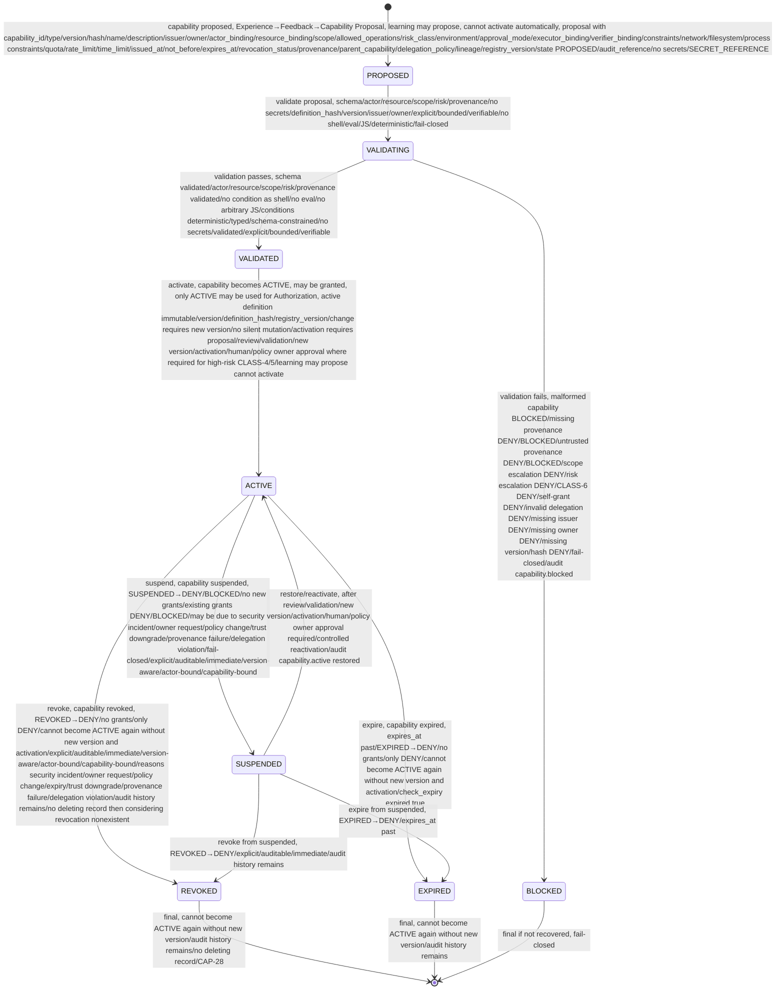
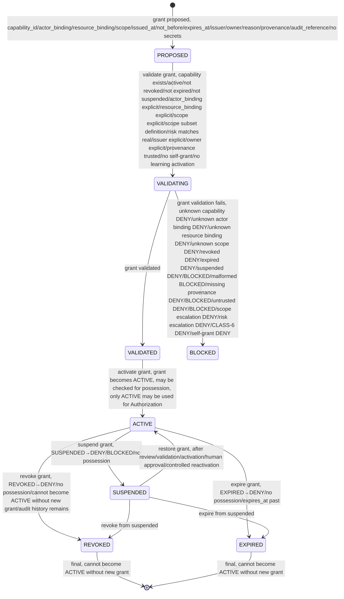
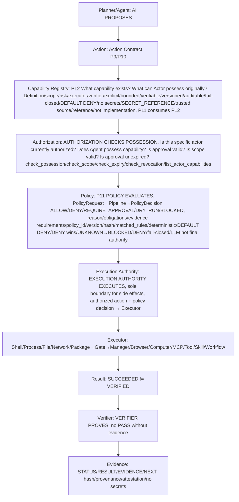

# Capability Lifecycle — State Machines — P12

> CONTRACTS ONLY — No implementation, no package install, no system changes, repository-only.
> Explicit state machines, no implicit transitions, fail-closed, DEFAULT DENY, DENY wins over ALLOW, CAP-01..30.

## Purpose

Capability Lifecycle defines state machines for Capabilities and Grants and Registry, from PROPOSED to ACTIVE/REVOKED/EXPIRED and UNINITIALIZED to READY/BLOCKED/FAILED, with explicit transitions, no implicit jumps, fail-closed, DEFAULT DENY, CAP-01..30.

## Capability Lifecycle

States:

- PROPOSED: capability proposed, not yet validated, no active, no grant, e.g., Experience→Feedback→Capability Proposal, learning may propose, cannot activate automatically, proposal must have capability_id, type, version, hash, name, description, issuer, owner, actor_binding, resource_binding, scope, allowed_operations, risk_class, environment, approval_mode, executor_binding, verifier_binding, constraints, network/filesystem/process constraints, quota, rate_limit, time_limit, issued_at, not_before, expires_at, revocation_status, provenance, parent_capability, delegation_policy, lineage, registry_version, state PROPOSED, audit_reference, no secrets, SECRET_REFERENCE
- VALIDATING: validating capability definition, schema, actor, resource, scope, risk, provenance, no secrets, definition_hash, version, issuer, owner, explicit, bounded, verifiable, no shell/eval/JS, deterministic, fail-closed, unknown→DENY, malformed→BLOCKED, missing provenance→DENY/BLOCKED, untrusted provenance→DENY/BLOCKED, scope escalation→DENY, risk escalation→DENY, CLASS-6→DENY, self-grant→DENY
- VALIDATED: validated, schema validated, actor/resource/scope/risk/provenance validated, no condition as shell, no eval, no arbitrary JS execution, conditions deterministic, typed, schema-constrained, no secrets, validated, explicit, bounded, verifiable
- ACTIVE: active, capability active, may be granted, may be checked for possession, only ACTIVE may be used for Authorization, active definition immutable, version, definition_hash, registry_version, change requires new version, no silent mutation, normal state
- SUSPENDED: suspended, DENY/BLOCKED, capability suspended, no longer active, SUSPENDED→DENY/BLOCKED, no new grants, existing grants DENY/BLOCKED, may become ACTIVE again after review, validation, new version, activation, controlled reactivation, explicit, auditable, immediate
- REVOKED: revoked, DENY, capability revoked, no longer active, REVOKED→DENY, no grants, only DENY, cannot become ACTIVE again without new version and activation, explicit, auditable, immediate, version-aware, actor-bound, capability-bound, reasons security incident, owner request, policy change, expiry, trust downgrade, provenance failure, delegation violation, audit history remains, no deleting record then considering revocation nonexistent
- EXPIRED: expired, DENY, capability expired, expires_at past, EXPIRED→DENY, no grants, only DENY, cannot become ACTIVE again without new version and activation

Transitions:

```
PROPOSED → VALIDATING: validate proposal, schema, actor, resource, scope, risk, provenance, no secrets, definition_hash, version, issuer, owner, explicit, bounded, verifiable, no shell/eval/JS, deterministic, fail-closed, e.g., Experience→Feedback→Capability Proposal → Validation

VALIDATING → VALIDATED: validation passes, schema validated, actor/resource/scope/risk/provenance validated, no condition as shell, no eval, no arbitrary JS, conditions deterministic, typed, schema-constrained, no secrets, validated, explicit, bounded, verifiable, e.g., validate_definition(definition) → ValidationResult valid

VALIDATING → BLOCKED: validation fails, e.g., malformed capability BLOCKED, missing provenance DENY/BLOCKED, untrusted provenance DENY/BLOCKED, scope escalation DENY, risk escalation DENY, CLASS-6 DENY, self-grant DENY, invalid delegation DENY, missing issuer DENY, missing owner DENY, missing version/hash DENY, fail-closed, audit event capability.blocked

VALIDATED → ACTIVE: activate, capability becomes ACTIVE, may be granted, only ACTIVE may be used for Authorization, active definition immutable, version, definition_hash, registry_version, change requires new version, no silent mutation, activation requires proposal, review, validation, new version, activation, human/policy owner approval where required for high-risk CLASS-4/5, learning may propose cannot activate, e.g., register_definition(definition) → definition_id, version, hash, ValidationResult valid, grant may follow

ACTIVE → SUSPENDED: suspend, capability suspended, SUSPENDED→DENY/BLOCKED, no new grants, existing grants DENY/BLOCKED, may be due to security incident, owner request, policy change, trust downgrade, provenance failure, delegation violation, fail-closed, explicit, auditable, immediate, version-aware, actor-bound, capability-bound, e.g., suspend(capability_id, reason, suspended_by, audit_reference) → boolean

SUSPENDED → ACTIVE: restore/reactivate, after review, validation, new version, activation, human/policy owner approval required, controlled reactivation, e.g., restore(capability_id, reason, restored_by, audit_reference) → boolean, audit event capability.active (restored)

ACTIVE → REVOKED: revoke, capability revoked, REVOKED→DENY, no grants, only DENY, cannot become ACTIVE again without new version and activation, explicit, auditable, immediate, version-aware, actor-bound, capability-bound, reasons security incident, owner request, policy change, expiry, trust downgrade, provenance failure, delegation violation, audit history remains, no deleting record then considering revocation nonexistent, e.g., revoke(capability_id, reason, revoked_by, audit_reference) → boolean

ACTIVE → EXPIRED: expire, capability expired, expires_at past, EXPIRED→DENY, no grants, only DENY, cannot become ACTIVE again without new version and activation, e.g., check_expiry(capability_id) → expired true, expires_at past

SUSPENDED → REVOKED: revoke from suspended, REVOKED→DENY, explicit, auditable, immediate, audit history remains

SUSPENDED → EXPIRED: expire from suspended, EXPIRED→DENY, expires_at past

REVOKED → [*]: final, cannot become ACTIVE again without new version, audit history remains, no deleting record then considering revocation nonexistent, CAP-28

EXPIRED → [*]: final, cannot become ACTIVE again without new version, audit history remains

No implicit transitions, all explicit, logged as events capability.proposed, validating, validated, active, suspended, revoked, expired, blocked, granted, possession_checked, scope_checked, expiry_checked, revocation_checked, delegated, audit, with event_id, capability_id, version, actor, resource, scope, decision, reason, correlation_id, timestamp, no secrets, append-only immutable, audit history immutable CAP-28

Fail-closed: unknown state → BLOCKED, invalid transition → BLOCKED + event + audit + SECURITY EVENT if injection, missing fields → DENY/BLOCKED, DEFAULT DENY, no ASSUME ALLOW, CAP-01..30
```

Mermaid:



## Grant Lifecycle

States for Grants (grants of Capability to Actor):

- PROPOSED: grant proposed, not yet validated
- VALIDATING: validating grant, capability exists, active, not revoked, not expired, not suspended, actor_binding explicit, resource_binding explicit, scope explicit, scope ⊆ definition scope, risk ≤ definition risk but must match real risk, issuer explicit, owner explicit, provenance trusted, no self-grant, no learning activation
- VALIDATED: grant validated
- ACTIVE: grant active, may be checked for possession, only ACTIVE grants may be used for Authorization, active grant immutable? Grant may have expiry, revocation, suspension, but definition immutable, grant itself may be revoked/suspended/expired
- SUSPENDED: grant suspended, DENY/BLOCKED, no possession, may become ACTIVE again after review, validation, activation, controlled reactivation
- REVOKED: grant revoked, DENY, no possession, cannot become ACTIVE again without new grant and activation, audit history remains
- EXPIRED: grant expired, DENY, no possession, cannot become ACTIVE again without new grant

Transitions similar to Capability lifecycle, with explicit checks:

- PROPOSED → VALIDATING → VALIDATED → ACTIVE → SUSPENDED → ACTIVE or ACTIVE → REVOKED or ACTIVE → EXPIRED, no implicit, fail-closed, DEFAULT DENY

Mermaid for Grant Lifecycle:



## Registry Lifecycle (Overview — Detailed in capability-registry.md)

States:

- UNINITIALIZED: registry uninitialized, no grant, no authorize, no definitions, fail-closed
- LOADING: registry loading, no authorize, no grant, loading definitions, fail-closed
- READY: registry ready, only definitions/grants validated, may grant, may check possession, only ACTIVE may be used, normal state
- DEGRADED: registry degraded, no unknown→ALLOW, fail-closed for unknown, only validated may be used
- BLOCKED: registry blocked, fail-closed, no grant, no authorize, all DENY/BLOCKED
- FAILED: registry failed, fail-closed, no grant, no authorize, all DENY/BLOCKED

Transitions as in capability-registry.md, with ASCII+Mermaid stateDiagram-v2, no implicit, fail-closed.

## Combined Flow — Capability → Authorization → Policy → Execution Authority → Verifier

```
Capability Definition (capability_id, type, version, hash, name, description, issuer, owner, actor_binding, resource_binding, scope, allowed_operations, risk_class, environment, approval_mode, executor_binding, verifier_binding, constraints, network/filesystem/process constraints, quota, rate_limit, time_limit, issued_at, not_before, expires_at, revocation_status, provenance, parent_capability, delegation_policy, lineage, registry_version, state, audit_reference, no secrets, SECRET_REFERENCE)
  ↓
Validation (schema, actor, resource, scope, risk, provenance, no secrets, definition_hash, version, issuer, owner, explicit, bounded, verifiable, no shell/eval/JS, deterministic, fail-closed, unknown→DENY, malformed→BLOCKED, missing provenance→DENY/BLOCKED, untrusted provenance→DENY/BLOCKED, scope escalation→DENY, risk escalation→DENY, CLASS-6→DENY, self-grant→DENY)
  ↓
Registry (register_definition, validate_definition, get_definition, get_active_definition, trusted source, reference, not implementation, state UNINITIALIZED→LOADING→READY→DEGRADED→BLOCKED→FAILED, fail-closed, DEFAULT DENY)
  ↓
Grant (grant to Actor, actor_binding explicit, resource_binding explicit, scope explicit, issued_at, not_before, expires_at, issuer, owner, reason, provenance, audit_reference, explicit, bounded, auditable, no self-grant, no learning activation, no memory-based grant, no implicit inheritance, delegation bounded)
  ↓
Possession Check (check_possession actor_id/capability_id/resource/scope boolean+reason fail-closed unknown→DENY revoked→DENY expired→DENY suspended→DENY/BLOCKED malformed→BLOCKED missing provenance→DENY/BLOCKED untrusted→DENY/BLOCKED scope escalation→DENY risk escalation→DENY CLASS-6→DENY self-grant→DENY no ASSUME ALLOW)
  ↓
Scope Check (check_scope capability_id/requested_scope boolean+reason scope escalation DENY workspace→host DENY repository→production DENY user→system DENY github.com→unrestricted network DENY single file→entire filesystem DENY single process→arbitrary process DENY single domain→arbitrary web DENY capability must not auto-expand scope)
  ↓
Expiry Check (check_expiry capability_id boolean+expires_at+reason expired!=active not_before future→DENY expires_at past→DENY fail-closed)
  ↓
Revocation Check (check_revocation capability_id boolean+revocation_status+reason revoked!=active revoked→DENY audit history remains no deleting record then considering revocation nonexistent)
  ↓
Authorization (Is this specific actor currently authorized? Does Agent possess capability? Is approval valid? Is scope valid? Is approval unexpired? Is actor authenticated? Is provenance trusted? Is network trust available? Is evidence requirement satisfied? list_actor_capabilities, check_possession, check_scope, check_expiry, check_revocation)
  ↓
Policy (WHAT IS ALLOWED? PolicyRequest→Pipeline→PolicyDecision ALLOW/DENY/REQUIRE_APPROVAL/DRY_RUN/BLOCKED reason obligations evidence requirements policy_id/version/hash matched_rules deterministic DEFAULT DENY DENY wins UNKNOWN→BLOCKED/DENY fail-closed LLM not final authority)
  ↓
Execution Authority (sole boundary for host/external side effects, receives authorized Action, revalidates execution contract, binds capability/scope/resource limits, selects approved Executor, establishes execution context, enforces timeout/output limits, collects execution result, emits execution events, provides Result to Verifier)
  ↓
Executor (File, Process, Shell, Network, Package→Gate→Manager, Browser, Computer, MCP boundary, Tool, Skill)
  ↓
Result (ExecutionResult → Result, SUCCEEDED≠VERIFIED)
  ↓
Verifier (no PASS without evidence, SUCCEEDED≠VERIFIED, Verifier not Authorization Authority, AI not Verifier)
  ↓
Evidence (STATUS/RESULT/EVIDENCE/NEXT, hash, provenance, attestation, no secrets, no PASS without evidence)
  ↓
Audit (capability.proposed, validating, validated, active, suspended, revoked, expired, blocked, granted, possession_checked, scope_checked, expiry_checked, revocation_checked, delegated, audit, event_id, capability_id, version, actor, resource, scope, decision, reason, correlation_id, timestamp, no secrets, append-only immutable, audit history immutable CAP-28)
```

Mermaid for combined flow see capability.md Capability Evaluation Flow and capability-registry.md Registry Evaluation Flow.

## System Execution Flow with Capability Registry (P8/P9/P10/P11/P12 extended)

```
Planner / Agent
      ↓
Action (Task/Run Contract, Action Contract P9/P10)
      ↓
Capability Registry (P12: What capability exists? What can Actor possess originally? Definition, scope, risk, executor, verifier, explicit, bounded, verifiable, versioned, auditable, fail-closed, DEFAULT DENY, no secrets, SECRET_REFERENCE, trusted source, reference, not implementation)
      ↓
Authorization (Actor, Capability, Resource, Scope, Risk, Approval, Is this specific actor currently authorized? Does Agent possess capability? Is approval valid? Is scope valid? Is approval unexpired? Is actor authenticated? Is provenance trusted? Is network trust available? Is evidence requirement satisfied? check_possession, check_scope, check_expiry, check_revocation, list_actor_capabilities)
      ↓
Policy (P11: PolicyRequest → Policy Evaluation Pipeline → PolicyDecision ALLOW/DENY/REQUIRE_APPROVAL/DRY_RUN/BLOCKED, reason, obligations, evidence requirements, policy_id/version/hash, matched_rules, deterministic, LLM does not enter final authorization calculation, DEFAULT DENY, DENY wins over ALLOW, UNKNOWN→BLOCKED/DENY, fail-closed)
      ↓
Execution Authority (sole architectural boundary for host/external side effects, receives authorized Action, revalidates execution contract, binds capability/scope/resource limits, selects approved Executor, establishes execution context, enforces timeout/output limits, collects execution result, emits execution events, provides Result to Verifier)
      ↓
Executor (Shell, Process, File, Network, Package→Gate→Manager, future Browser, Computer, MCP, Tool, Skill, Workflow)
      ↓
Result (ExecutionResult → Result, SUCCEEDED≠VERIFIED)
      ↓
Verifier (no PASS without evidence, SUCCEEDED≠VERIFIED, Verifier not Authorization Authority, AI not Verifier)
      ↓
Evidence (STATUS/RESULT/EVIDENCE/NEXT, hash, provenance, attestation, no secrets, no PASS without evidence)
```

ASCII:

```
┌──────────────┐
│ Planner/Agent│  AI PROPOSES
└──────┬───────┘
       ↓
┌──────────────┐
│    Action    │  Action Contract P9/P10
└──────┬───────┘
       ↓
┌──────────────────┐
│ Capability       │  P12 CAPABILITY REGISTRY: What capability exists? What can Actor possess originally? Definition, scope, risk, executor, verifier, explicit, bounded, verifiable, versioned, auditable, fail-closed, DEFAULT DENY, no secrets, SECRET_REFERENCE, trusted source, reference, not implementation, P11 consumes P12
│ Registry         │
└──────┬───────────┘
       ↓
┌──────────────┐
│ Authorization│  AUTHORIZATION CHECKS POSSESSION: Is this specific actor currently authorized? Does Agent possess capability? Is approval valid? Is scope valid? Is approval unexpired? Is actor authenticated? Is provenance trusted? Is network trust available? Is evidence requirement satisfied? check_possession, check_scope, check_expiry, check_revocation, list_actor_capabilities
└──────┬───────┘
       ↓
┌──────────────┐
│    Policy    │  P11 POLICY EVALUATES: PolicyRequest → Pipeline → PolicyDecision ALLOW/DENY/REQUIRE_APPROVAL/DRY_RUN/BLOCKED, reason, obligations, evidence requirements, policy_id/version/hash, matched_rules, deterministic, DEFAULT DENY, DENY wins, UNKNOWN→BLOCKED/DENY, fail-closed, LLM not final authority, Policy cannot execute, Policy cannot self-grant capabilities, P11 consumes P12
└──────┬───────┘
       ↓
┌─────────────────────┐
│ Execution Authority │  EXECUTION AUTHORITY EXECUTES: sole boundary for side effects, authorized action + policy decision → Executor, revalidate, bind capability/scope/limits, select Executor, establish context, enforce timeout/output, emit events, provide Result to Verifier
└──────┬──────────────┘
       ↓
┌──────────────┐
│   Executor   │  Shell, Process, File, Network, Package→Gate→Manager, future Browser, Computer, MCP, Tool, Skill, Workflow
└──────┬───────┘
       ↓
┌──────────────┐
│    Result    │  Result, ExecutionResult, STARTED/SUCCEEDED/FAILED/BLOCKED/CANCELLED/TIMEOUT/RESOURCE_EXCEEDED/UNVERIFIED, SUCCEEDED≠VERIFIED
└──────┬───────┘
       ↓
┌──────────────┐
│   Verifier   │  VERIFIER PROVES: no PASS without evidence, SUCCEEDED≠VERIFIED, Verifier not Authorization Authority, AI not Verifier
└──────┬───────┘
       ↓
┌──────────────┐
│   Evidence   │  STATUS/RESULT/EVIDENCE/NEXT, hash, provenance, attestation, no secrets, no PASS without evidence
└──────────────┘
```

Mermaid:



## Invariants

- No implementation language chosen in P12, no product code, no package installation, no system changes, repository-only, only capability contracts, schemas, registry contract, lifecycle, invariants, ADR, tests, verification scripts, documentation, ASCII/Mermaid diagrams, respects P8 frozen baseline, P9 Core Runtime Contracts, P10 Execution Authority Contracts, P11 Policy Engine Contract, any violation requires ADR
- Capability lifecycle PROPOSED→VALIDATING→VALIDATED→ACTIVE→SUSPENDED→ACTIVE→REVOKED→EXPIRED, PROPOSED no grant, VALIDATED no grant, only ACTIVE may be used for Authorization, SUSPENDED DENY/BLOCKED, REVOKED DENY, EXPIRED DENY, no implicit transitions, invalid transition→BLOCKED, unknown state→BLOCKED, fail-closed, DEFAULT DENY, no ASSUME ALLOW, CAP-01..30
- Grant lifecycle PROPOSED→VALIDATING→VALIDATED→ACTIVE→SUSPENDED→ACTIVE→REVOKED→EXPIRED, only ACTIVE grants may be used, SUSPENDED DENY/BLOCKED, REVOKED DENY, EXPIRED DENY, no implicit, fail-closed
- Registry lifecycle UNINITIALIZED→LOADING→READY→DEGRADED→BLOCKED→FAILED, UNINITIALIZED no grant, LOADING no authorize, BLOCKED fail-closed, FAILED fail-closed, DEGRADED no unknown→ALLOW, READY only validated, no implicit, fail-closed
- Combined flow Capability Definition→Validation→Registry→Grant→Possession Check→Scope Check→Expiry Check→Revocation Check→Authorization→Policy→Execution Authority→Executor→Result→Verifier→Evidence→Audit, no implicit, fail-closed, DEFAULT DENY, CAPABILITY≠AUTHORIZATION≠POLICY ALLOW≠EXECUTION≠VERIFICATION
- System execution flow with Capability Registry ASCII+Mermaid Planner/Agent→Action→Capability Registry→Authorization→Policy→Execution Authority→Executor→Result→Verifier→Evidence, AI PROPOSES→CAPABILITY REGISTRY DEFINES WHAT EXISTS→AUTHORIZATION CHECKS POSSESSION→POLICY EVALUATES→EXECUTION AUTHORITY EXECUTES→VERIFIER PROVES
- Diagrams ASCII+Mermaid Capability Lifecycle, Grant Lifecycle, Registry Lifecycle, Combined Flow, System Execution Flow with Capability Registry, Delegation Chain, Scope Escalation Prevention
- Respects P8 frozen baseline and P9/P10/P11 contracts, no violation without ADR, free-first vendor-neutral self-hostable local-capable no mandatory paid API/cloud DB, low-resource modes CORE/STANDARD/HEAVY respected no GPU/K8s assumed, open decisions PENDING with criteria no fill gap, no OPA Cedar Casbin OpenFGA custom language Rego JavaScript Python Rust Go in P12 can mention in FUTURE OPTIONS but DECISION PENDING Technology Selection remains P18

## References

- docs/contracts/capability.md (P12 Capability Contract, object, semantics, built-in capabilities, default deny, scope, risk, actor/resource/executor/verifier binding, leases, revocation, delegation, graph, no self-grant, learning boundary, provenance, lifecycle overview, registry overview, invariants CAP-01..30, diagrams)
- docs/contracts/capability-registry.md (P12 Registry Contract, interface, state machine, P11 consumes P12, P2/P10/P11 compatibility, invariants, diagrams)
- docs/architecture/frozen-baseline.md (P8 freeze)
- docs/architecture/adr/0007-core-runtime-contracts.md (P9), 0008-execution-authority-contract.md (P10), 0009-policy-engine-contract.md (P11), 0010-capability-registry-contract.md (P12)
- docs/contracts/runtime.md, task.md, action.md, event.md, result.md, lifecycle.md (P9)
- docs/contracts/execution-authority.md, executor-shell.md, executor-process.md, executor-file.md, executor-network.md, executor-package.md, executor-matrix.md, execution-lifecycle.md (P10)
- docs/contracts/policy.md, policy-matrix.md, policy-lifecycle.md (P11)
- docs/architecture/components.md (23 components)
- docs/architecture/execution-model.md (LLM→Planner→Policy→Execution→Verifier)
- docs/architecture/security-boundaries.md (trust boundaries)
- docs/architecture/capability-model.md (CAP_* high-level)
- ops/security/privilege-policy.md, privilege-gate.sh (P2/P10 compatibility)
```

