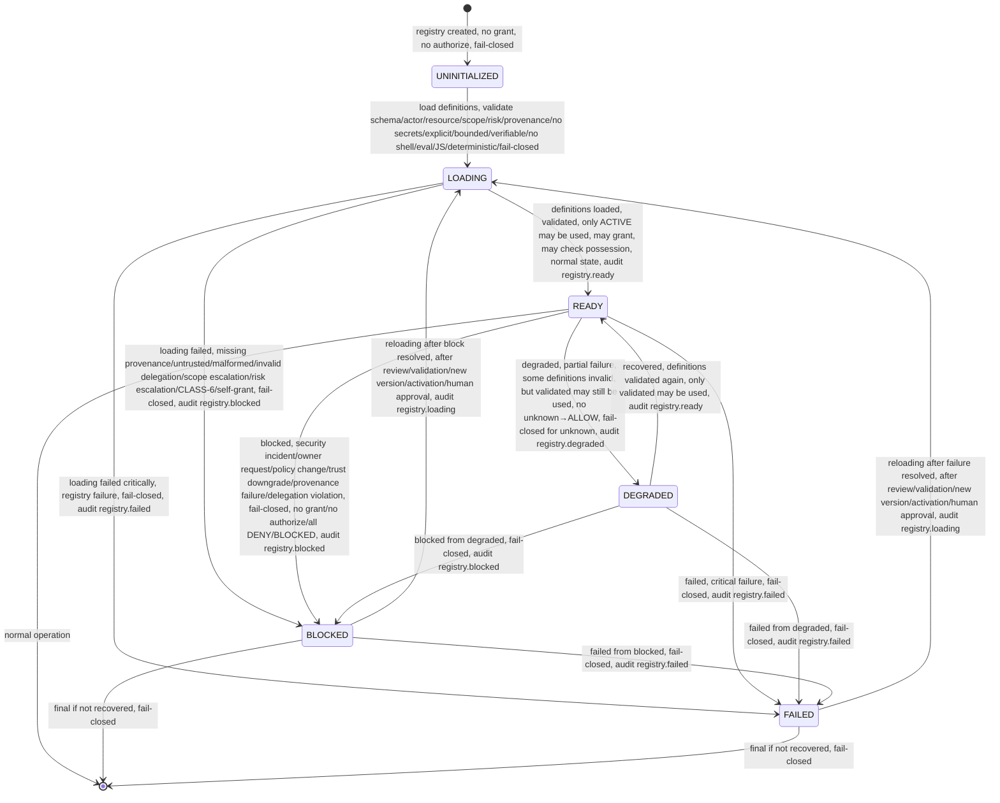
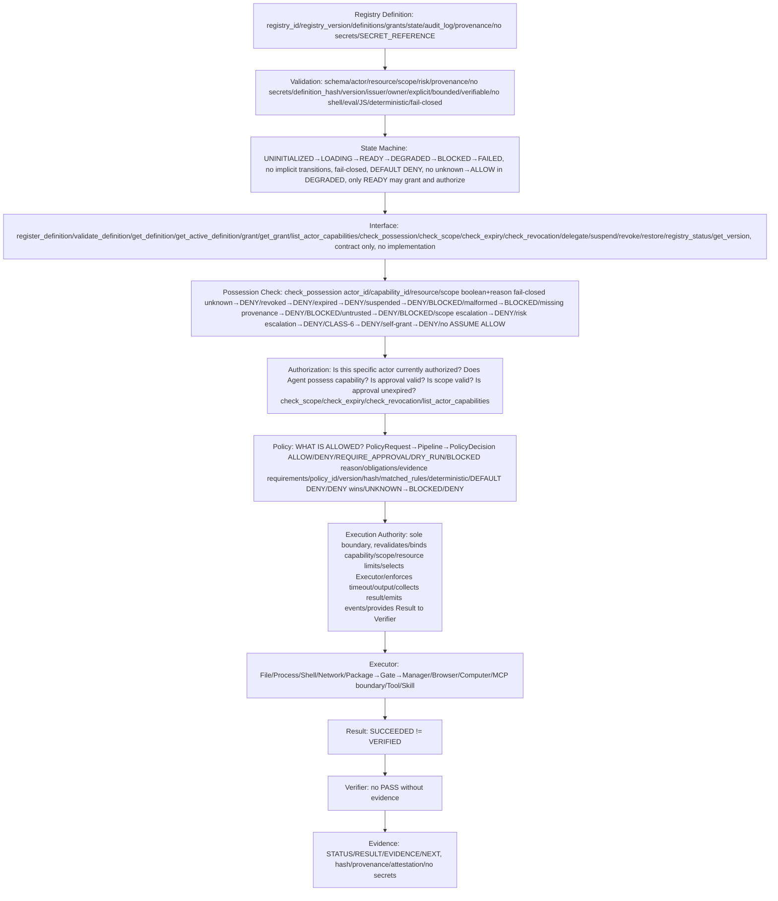

# Capability Registry Contract — P12

> **P12 = CAPABILITY CONTRACT ONLY — No Capability Registry implementation, no database implementation, no API implementation, no UI implementation, no Authorization implementation, no Policy implementation, no Executor implementation, no package installation, no PowerShell installation, no Docker, no production deployment, no system changes.**
> CONTRACTS ONLY — Markdown + shell test/verification scripts, repository-only, deterministic static checks, no product code, no technology choice.
> Respects P8 Architecture Freeze, P9 Core Runtime Contracts, P10 Execution Authority Contracts, P11 Policy Engine Contract. Any violation requires ADR.
> Technology Selection PENDING — P18.

## Purpose

Capability Registry is trusted source for capability definitions and grants, reference, not implementation, not database, not API, only contract. It answers **What capability exists? What can Actor possess originally?** with explicit, bounded, verifiable, versioned, auditable definitions, fail-closed, DEFAULT DENY.

It is NOT:

- Policy Engine (P11) — Policy decides WHAT IS ALLOWED?
- Authorization — Authorization checks Can this actor possess it now? Is this specific actor currently authorized?
- Execution Authority (P10) — Execution Authority executes only authorized actions, sole boundary for host/external side effects
- Verifier — Verifier proves Did it actually happen? Is it verified? No PASS without evidence, SUCCEEDED≠VERIFIED

It preserves:

```
CAPABILITY ≠ AUTHORIZATION ≠ POLICY ALLOW ≠ EXECUTION ≠ VERIFICATION
```

Capability possession alone does NOT mean action allowed. No ASSUME ALLOW.

## Registry Contract — Trusted Source

Registry is trusted source for capability definitions/grants, reference, not implementation, deterministic, fail-closed, DEFAULT DENY, no secrets, SECRET_REFERENCE not secret_value.

### Registry Object Fields

Registry MUST contain:

- `registry_id`: unique identifier, e.g., `registry-main`, UUID
- `registry_version`: version, e.g., `1.0.0`, immutable for version, new version creates new registry version, no silent mutation
- `definitions`: list of Capability definitions, e.g., CAP_FS_READ, CAP_FS_WRITE, CAP_PROCESS_EXEC, etc., each with capability_id, type, version, hash, name, description, issuer, owner, actor_binding, resource_binding, scope, allowed_operations, risk_class, environment, approval_mode, executor_binding, verifier_binding, constraints, network/filesystem/process constraints, quota, rate_limit, time_limit, issued_at, not_before, expires_at, revocation_status, provenance, parent_capability, delegation_policy, lineage, registry_version, state, audit_reference, no secrets, SECRET_REFERENCE
- `grants`: list of grants, e.g., grant of CAP_FS_READ to agent:main for workspace/project/docs, with grant_id, capability_id, version, actor_binding, resource_binding, scope, issued_at, not_before, expires_at, issuer, owner, reason, provenance, audit_reference, revocation_status, state
- `state`: registry state, e.g., UNINITIALIZED, LOADING, READY, DEGRADED, BLOCKED, FAILED, fail-closed, only READY may grant and authorize
- `audit_log`: audit log, append-only immutable, events capability.proposed, validating, validated, active, suspended, revoked, expired, granted, possession_checked, scope_checked, expiry_checked, revocation_checked, delegated, audit, with event_id, capability_id, version, actor, resource, scope, decision, reason, correlation_id, timestamp, no secrets
- `provenance`: registry provenance, e.g., source, source_version, definition_hash, issuer, trust_level, created_at, signature/reference if applicable, verifiable

No product code, no database implementation, no API implementation, only contract.

## Registry Interface Contract — Contract Interfaces Only, No Implementation

All interfaces are contract only, no implementation, no database, no API, no runtime, no executor, no package install, repository-only.

### register_definition

- **Signature**: `register_definition(definition) → definition_id, version, hash, ValidationResult`
- **Purpose**: register capability definition, e.g., register CAP_FS_READ definition
- **Inputs**: definition with capability_id, type, version, hash, name, description, issuer, owner, actor_binding, resource_binding, scope, allowed_operations, risk_class, environment, approval_mode, executor_binding, verifier_binding, constraints, network/filesystem/process constraints, quota, rate_limit, time_limit, issued_at, not_before, expires_at, revocation_status, provenance, parent_capability, delegation_policy, lineage, registry_version, state, audit_reference, no secrets, SECRET_REFERENCE
- **Validation**: schema, actor, resource, scope, risk, provenance, no secrets, definition_hash, version, issuer, owner, explicit, bounded, verifiable, no shell/eval/JS, deterministic, fail-closed, unknown→DENY, malformed→BLOCKED, missing provenance→DENY/BLOCKED, untrusted provenance→DENY/BLOCKED, scope escalation→DENY, risk escalation→DENY, CLASS-6→DENY, self-grant→DENY
- **Outputs**: definition_id, version, hash, ValidationResult, audit event capability.proposed/validating/validated/active
- **Rules**: no self-grant, no learning activation, no memory-based grant, no implicit inheritance, delegation must be explicit bounded, version/hash mandatory, active definition immutable, audit history immutable, registry failure fail-closed, registry cannot bypass Policy/Authorization/Execution Authority/Verifier
- **No implementation**: contract only, no database, no API, no runtime

### validate_definition

- **Signature**: `validate_definition(definition) → ValidationResult`
- **Purpose**: validate capability definition without registering
- **Inputs**: definition as above
- **Validation**: same as register_definition, schema, actor, resource, scope, risk, provenance, no secrets, explicit, bounded, verifiable, no shell/eval/JS, deterministic, fail-closed
- **Outputs**: ValidationResult with valid boolean, reason, errors, warnings, no secrets
- **Rules**: same as register_definition, no implementation

### get_definition

- **Signature**: `get_definition(capability_id, version) → Capability|null`
- **Purpose**: get definition by capability_id and version, e.g., get CAP_FS_READ version 1.0.0
- **Inputs**: capability_id, version, e.g., `CAP_FS_READ`, `1.0.0`
- **Outputs**: Capability or null if unknown, unknown→DENY, unknown definition→DENY, verifiable hash, version, provenance, no secrets
- **Rules**: unknown capability→DENY, unknown definition→DENY, fail-closed, no ASSUME ALLOW, no implementation

### get_active_definition

- **Signature**: `get_active_definition(capability_id) → Capability|null`
- **Purpose**: get active definition, only ACTIVE, e.g., get active CAP_FS_READ
- **Inputs**: capability_id, e.g., `CAP_FS_READ`
- **Outputs**: Capability or null if not active, only ACTIVE may be used for Authorization, active definition immutable
- **Rules**: only ACTIVE may be used, DRAFT no authorize, SUSPENDED DENY/BLOCKED, REVOKED DENY, EXPIRED DENY, fail-closed

### grant

- **Signature**: `grant(capability_id, actor_binding, resource_binding, scope, issued_at, not_before, expires_at, issuer, owner, reason, provenance, audit_reference) → Grant|null`
- **Purpose**: grant capability to Actor, e.g., grant CAP_FS_READ to agent:main for workspace/project/docs
- **Inputs**: capability_id, actor_binding explicit, resource_binding explicit, scope explicit, issued_at, not_before, expires_at, issuer, owner, reason, provenance, audit_reference, no secrets, SECRET_REFERENCE
- **Validation**: capability exists, active, not revoked, not expired, not suspended, actor_binding explicit, resource_binding explicit, scope explicit, scope ⊆ definition scope, risk ≤ definition risk but must match real risk, issuer explicit, owner explicit, provenance trusted, no self-grant, no learning activation, no memory-based grant, no implicit inheritance, delegation bounded if applicable, version/hash mandatory, audit history immutable
- **Outputs**: Grant or null if validation fails, grant_id, capability_id, version, actor_binding, resource_binding, scope, issued_at, not_before, expires_at, issuer, owner, reason, provenance, audit_reference, revocation_status, state ACTIVE
- **Rules**: explicit, bounded, auditable, no self-grant (CAP-18), no learning activation (CAP-19), no memory-based grant (CAP-20), no implicit inheritance (CAP-21), delegation cannot broaden scope (CAP-22), cannot lower verification (CAP-23), parent expiry constrains child (CAP-24), revoked parent invalidates dependent grants where contract requires (CAP-25), active definition immutable (CAP-26), version/hash mandatory (CAP-27), audit history immutable (CAP-28), registry failure fail-closed (CAP-29), registry cannot bypass Policy/Authorization/Execution Authority/Verifier (CAP-30), package path preserved, P2 Privilege Gate preserved

### get_grant

- **Signature**: `get_grant(grant_id) → Grant|null` or `get_grant(capability_id, actor_id) → Grant|null`
- **Purpose**: get grant by grant_id or capability_id+actor, checks expiry, revocation, suspension
- **Inputs**: grant_id or capability_id+actor_id, e.g., `grant-001` or `CAP_FS_READ` + `agent:main`
- **Outputs**: Grant or null if unknown, expired, revoked, suspended, with expiry_checked, revocation_checked, scope_checked, possession_checked, reason, no secrets
- **Rules**: unknown grant→DENY, expired→DENY, revoked→DENY, suspended→DENY/BLOCKED, fail-closed, no ASSUME ALLOW

### list_actor_capabilities

- **Signature**: `list_actor_capabilities(actor_id) → Capability[]`
- **Purpose**: list capabilities for Actor, only ACTIVE, not expired, not revoked, not suspended
- **Inputs**: actor_id, e.g., `agent:main`, `user:alice`
- **Outputs**: list of Capability, only ACTIVE, not expired, not revoked, not suspended, with possession, scope, expiry, revocation checks, fail-closed, unknown actor→DENY? Actually unknown actor binding→DENY, but list may return empty, not error, but possession check must DENY for unknown
- **Rules**: only ACTIVE, not expired, not revoked, not suspended, fail-closed, no implicit inheritance, no implicit trust

### check_possession

- **Signature**: `check_possession(actor_id, capability_id, resource, scope) → boolean + reason`
- **Purpose**: check if Actor possesses Capability for resource/scope, fail-closed, unknown→DENY
- **Inputs**: actor_id, capability_id, resource, scope, e.g., `agent:main`, `CAP_FS_READ`, `workspace/project/docs/file.md`, `file`
- **Outputs**: boolean + reason, e.g., `possession: true/false`, `reason: active grant found / revoked / expired / suspended / unknown capability / unknown actor binding / unknown resource binding / unknown scope / scope escalation / risk escalation / CLASS-6 / missing provenance / untrusted provenance / missing issuer / missing owner / missing version/hash / invalid delegation`
- **Rules**: unknown capability→DENY (CAP-02), unknown actor binding→DENY, unknown resource binding→DENY, unknown scope→DENY, revoked→DENY (CAP-03), expired→DENY (CAP-04), suspended→DENY/BLOCKED (CAP-05), malformed→BLOCKED (CAP-06), missing provenance→DENY/BLOCKED (CAP-07), untrusted provenance→DENY/BLOCKED (CAP-08), scope escalation→DENY (CAP-11), risk escalation→DENY (CAP-12), CLASS-6→DENY (CAP-13), self-grant→DENY (CAP-18), no ASSUME ALLOW, fail-closed, DEFAULT DENY

### check_scope

- **Signature**: `check_scope(capability_id, requested_scope) → boolean + reason`
- **Purpose**: check if scope is allowed for Capability, scope escalation DENY
- **Inputs**: capability_id, requested_scope, e.g., `CAP_FS_READ`, `workspace/project/docs/file.md`
- **Outputs**: boolean + reason, e.g., `scope_allowed: true/false`, `reason: scope ⊆ definition scope / scope escalation workspace→host DENY / repository→production DENY / user→system DENY / github.com→unrestricted network DENY / single file→entire filesystem DENY / single process→arbitrary process DENY`
- **Rules**: scope escalation DENY (CAP-11), capability must not auto-expand scope, explicit allowlists/selectors, no unrestricted wildcards *, no unrestricted filesystem/network/process/host/MCP/production unless explicit special + bounded by CLASS-6/Policy/Authorization/Execution Authority/Verifier

### check_expiry

- **Signature**: `check_expiry(capability_id) → boolean + expires_at + reason`
- **Purpose**: check if Capability expired, expired→DENY
- **Inputs**: capability_id, e.g., `CAP_FS_READ`
- **Outputs**: boolean + expires_at + reason, e.g., `expired: true/false`, `expires_at: 2026-11-04T19:30:00Z`, `reason: expired / not expired / not_before not yet valid`
- **Rules**: expired != active, CAP-04, not_before future → DENY, expires_at past → DENY, fail-closed

### check_revocation

- **Signature**: `check_revocation(capability_id) → boolean + revocation_status + reason`
- **Purpose**: check if Capability revoked, revoked→DENY
- **Inputs**: capability_id, e.g., `CAP_FS_READ`
- **Outputs**: boolean + revocation_status + reason, e.g., `revoked: true/false`, `revocation_status: active/revoked/suspended/expired`, `reason: security incident / owner request / policy change / expiry / trust downgrade / provenance failure / delegation violation`
- **Rules**: revoked != active, CAP-03, revoked→DENY, audit history remains, no deleting record then considering revocation nonexistent, CAP-28 audit history immutable

### delegate

- **Signature**: `delegate(parent_capability_id, child_definition, recipient, scope, risk, expiration, reason, provenance) → child_capability_id|null`
- **Purpose**: delegate capability, explicit, bounded by parent, auditable, fail-closed
- **Inputs**: parent_capability_id, child_definition with capability_id, type, version, hash, name, description, issuer, owner, actor_binding recipient, resource_binding, scope, allowed_operations, risk_class, environment, approval_mode, executor_binding, verifier_binding, constraints, network/filesystem/process constraints, quota, rate_limit, time_limit, issued_at, not_before, expires_at, revocation_status, provenance, parent_capability, delegation_policy, lineage, registry_version, state, audit_reference, no secrets, SECRET_REFERENCE, recipient explicit, scope explicit, risk explicit, expiration explicit, reason explicit, provenance explicit
- **Validation**: parent exists, active, not revoked, not expired, not suspended, child scope ⊆ parent scope, child risk ≤ parent risk but must match real risk, cannot increase scope, cannot decrease verification, cannot bypass policy/authorization/execution authority, cannot create CLASS-6, cannot broader than parent, cannot outlive parent unless explicitly defined and independently valid with its own issuer/owner/provenance/approval, delegation chain auditable, recursive unbounded DENY, self-delegation escalation DENY, explicit, bounded, auditable, no self-grant, no learning activation
- **Outputs**: child_capability_id or null if validation fails, with lineage ROOT→DELEGATED→CHILD, parent, child, issuer, recipient, scope, risk, timestamp, expiration, reason, provenance, audit_reference
- **Rules**: CAP-22 delegation cannot broaden scope, CAP-23 cannot lower verification, CAP-24 parent expiry constrains child, CAP-25 revoked parent invalidates dependent grants where contract requires, CAP-13 CLASS-6 impossible, CAP-18 no self-grant, CAP-21 no implicit inheritance, CAP-28 audit history immutable, CAP-30 registry cannot bypass Policy/Authorization/Execution Authority/Verifier, fail-closed

### suspend

- **Signature**: `suspend(capability_id, reason, suspended_by, audit_reference) → boolean`
- **Purpose**: suspend capability, explicit, auditable, immediate, SUSPENDED→DENY/BLOCKED
- **Inputs**: capability_id, reason, suspended_by, audit_reference, e.g., `CAP_FS_READ`, `reason: security incident`, `suspended_by: system`, `audit_reference: event-003`
- **Outputs**: boolean success, with state SUSPENDED, suspended_at timestamp, reason, audit event capability.suspended
- **Rules**: explicit, auditable, immediate for normal authorization decisions, version-aware, actor-bound, capability-bound, SUSPENDED→DENY/BLOCKED, no new grants, existing grants DENY/BLOCKED, may become ACTIVE again after review, validation, new version, activation, controlled reactivation, audit history remains

### revoke

- **Signature**: `revoke(capability_id, reason, revoked_by, audit_reference) → boolean`
- **Purpose**: revoke capability, explicit, auditable, immediate, version-aware, actor-bound, capability-bound, REVOKED→DENY, audit history remains
- **Inputs**: capability_id, reason, revoked_by, audit_reference, e.g., `CAP_FS_READ`, `reason: security incident`, `revoked_by: owner`, `audit_reference: event-004`
- **Outputs**: boolean success, with state REVOKED, revoked_at timestamp, reason, audit event capability.revoked
- **Rules**: explicit, auditable, immediate for normal authorization decisions, version-aware, actor-bound, capability-bound, REVOKED→DENY, no grants, only DENY, cannot become ACTIVE again without new version and activation, audit history remains, no deleting record then considering revocation nonexistent, CAP-03, CAP-28, reasons security incident, owner request, policy change, expiry, trust downgrade, provenance failure, delegation violation

### restore (or equivalent controlled reactivation)

- **Signature**: `restore(capability_id, reason, restored_by, audit_reference) → boolean` or `reactivate(capability_id, reason, restored_by, audit_reference) → boolean`
- **Purpose**: restore/reactivate suspended capability, controlled reactivation, after review, validation, new version, activation, human approval
- **Inputs**: capability_id, reason, restored_by, audit_reference, e.g., `CAP_FS_READ`, `reason: security incident resolved`, `restored_by: system`, `audit_reference: event-005`
- **Outputs**: boolean success, with state ACTIVE again, after review, validation, new version, activation, human/policy owner approval where required, audit event capability.active (restored)
- **Rules**: SUSPENDED→ACTIVE only after review, validation, new version, activation, human/policy owner approval, controlled reactivation, not automatic, no REVOKED→ACTIVE without new version and activation, no EXPIRED→ACTIVE automatically, audit history remains, fail-closed

### registry_status

- **Signature**: `registry_status() → RegistryStatus`
- **Purpose**: get registry status, states UNINITIALIZED, LOADING, READY, DEGRADED, BLOCKED, FAILED
- **Inputs**: none
- **Outputs**: RegistryStatus with state, version, timestamp, reason, e.g., `state: READY`, `registry_version: 1.0.0`, `timestamp: 2026-10-04T19:30:00Z`, `reason: ready`
- **Rules**: UNINITIALIZED→no grant, LOADING→no authorize, BLOCKED→fail-closed, FAILED→fail-closed, DEGRADED→no unknown→ALLOW, READY only validated, fail-closed, DEFAULT DENY

### get_version

- **Signature**: `get_version() → version`
- **Purpose**: get registry version, e.g., 1.0.0
- **Inputs**: none
- **Outputs**: version, e.g., `1.0.0`, registry_version, immutable for version, new version creates new registry version, no silent mutation
- **Rules**: version mandatory, hash mandatory, verifiable, no implementation

All interfaces contract only, no implementation, no database, no API, no runtime, no executor, no package install, repository-only, deterministic, read-only, fail-closed.

## Registry State Machine

States:

- UNINITIALIZED: registry uninitialized, no grant, no authorize, no definitions, fail-closed, e.g., UNINITIALIZED→no grant
- LOADING: registry loading, no authorize, no grant, loading definitions, fail-closed, e.g., LOADING→no authorize
- READY: registry ready, only definitions/grants validated, may grant, may check possession, only ACTIVE may be used, normal state
- DEGRADED: registry degraded, no unknown→ALLOW, fail-closed for unknown, e.g., DEGRADED→no unknown capability to ALLOW, only validated may be used
- BLOCKED: registry blocked, fail-closed, no grant, no authorize, all DENY/BLOCKED
- FAILED: registry failed, fail-closed, no grant, no authorize, all DENY/BLOCKED

Transitions:

```
UNINITIALIZED → LOADING: load definitions, validate schema, actor, resource, scope, risk, provenance, no secrets, explicit, bounded, verifiable, no shell/eval/JS, deterministic, fail-closed

LOADING → READY: definitions loaded, validated, only ACTIVE may be used, may grant, may check possession, normal state, audit event registry.ready

LOADING → BLOCKED: loading failed, e.g., missing provenance, untrusted provenance, malformed definition, invalid delegation, scope escalation, risk escalation, CLASS-6, self-grant, fail-closed, audit event registry.blocked

LOADING → FAILED: loading failed critically, e.g., registry failure, fail-closed, audit event registry.failed

READY → DEGRADED: degraded, e.g., partial failure, some definitions invalid, but validated may still be used, no unknown→ALLOW, fail-closed for unknown, audit event registry.degraded

DEGRADED → READY: recovered, definitions validated again, only validated may be used, audit event registry.ready

READY → BLOCKED: blocked, e.g., security incident, owner request, policy change, trust downgrade, provenance failure, delegation violation, fail-closed, no grant, no authorize, all DENY/BLOCKED, audit event registry.blocked

DEGRADED → BLOCKED: blocked from degraded, fail-closed, audit event registry.blocked

BLOCKED → LOADING: reloading after block resolved, after review, validation, new version, activation, human approval, audit event registry.loading

FAILED → LOADING: reloading after failure resolved, after review, validation, new version, activation, human approval, audit event registry.loading

READY → FAILED: failed, e.g., critical failure, fail-closed, audit event registry.failed

DEGRADED → FAILED: failed from degraded, fail-closed, audit event registry.failed

BLOCKED → FAILED: failed from blocked, fail-closed, audit event registry.failed

No implicit transitions, all explicit, logged as events registry.uninitialized, loading, ready, degraded, blocked, failed, with event_id, registry_version, capability_id, version, actor, resource, scope, decision, reason, correlation_id, timestamp, no secrets, append-only immutable

Fail-closed: unknown state → BLOCKED, invalid transition → BLOCKED + event + audit + SECURITY EVENT if injection, missing fields → DENY/BLOCKED
```

Mermaid:



See `docs/contracts/capability-lifecycle.md` for Capability lifecycle state machine.

## Capability vs Policy — P11 Consumes P12

| Question | Owner |
|----------|-------|
| What capability exists? | Capability Registry (P12, trusted source for capability definitions/grants, reference, not implementation, explicit, bounded, verifiable, versioned, auditable, fail-closed, DEFAULT DENY) |
| Can this actor possess it? | Authorization / Registry (checks possession/validity/expiry/revocation/scope, Is this specific actor currently authorized? Does Agent possess capability? Is approval valid? Is scope valid? Is approval unexpired? Is actor authenticated? Is provenance trusted? Is network trust available? Is evidence requirement satisfied?, e.g., check_possession, check_scope, check_expiry, check_revocation, list_actor_capabilities) |
| Is this action allowed now? | Policy Engine (P11, WHAT IS ALLOWED? PolicyRequest → Pipeline → PolicyDecision ALLOW/DENY/REQUIRE_APPROVAL/DRY_RUN/BLOCKED, reason, obligations, evidence requirements, policy_id/version/hash, matched_rules, deterministic, DEFAULT DENY, DENY wins, UNKNOWN→BLOCKED/DENY, fail-closed, LLM not final authority, Policy does not execute) |
| Which executor may run it? | Execution Authority / Contract (P10, sole architectural boundary for host/external side effects, receives authorized Action, revalidates execution contract, binds capability/scope/resource limits, selects approved Executor, establishes execution context, enforces timeout/output limits, collects execution result, emits execution events, provides Result to Verifier) |
| Did it actually happen? | Execution Result (Result, ExecutionResult, STARTED/SUCCEEDED/FAILED/BLOCKED/CANCELLED/TIMEOUT/RESOURCE_EXCEEDED/UNVERIFIED, SUCCEEDED≠VERIFIED) |
| Is it verified? | Verifier (no PASS without evidence, SUCCEEDED≠VERIFIED, Verifier not Authorization Authority, AI not Verifier, AI not final authority, evidence hash, provenance, attestation, no secrets, no PASS without evidence) |

**P11 consumes Capability Registry and does NOT redefine it:**

- P11 Policy Engine Contract says: Capability input uses capability_required and reads capability definition from Capability Registry but does not create Capability Registry semantics in P11, P12 will be Capability Contract, Policy only checks capability exists, active, trusted, scope, risk, approval requirement, unknown DENY, inactive DENY, revoked DENY, expired DENY.
- P12 Capability Contract defines formal details of Capabilities themselves (what Actor can possess originally, definition, scope, risk, executor, verifier), while P11 Policy asks "Is this action allowed? And why? And under which conditions?" P12 Capability asks "What can this Actor/Agent possess originally? And what is definition of this capability and its scope and risk and executor?"
- Then P11 Policy ↓ P12 Capability Registry ↓ P10 Execution Authority prevents hidden permissions inside Agent or Executor.
- Capability Registry does NOT replace Policy, Authorization, Execution Authority, Verifier, Privilege Gate.
- Policy consumes Registry, Authorization checks possession/validity via Registry, Execution Authority executes only authorized actions, Verifier proves result.

## P2 / P10 / P11 Compatibility

Package installation path MUST remain:

```
Action → Policy → Authorization → Package Executor → Privilege Gate → Package Manager → Result → Verification → Evidence
```

Capability Registry does NOT replace:

- P2 Privilege Gate (ops/security/privilege-policy.md, ops/security/privilege-gate.sh, SYSTEM_SUDO_POLICY vs PROJECT_POLICY, must not be bypassed, no arbitrary apt, gate_path ops/security/privilege-gate.sh, dry_run_first, execute_explicit, DEFERRED/RESTRICTED for remove future, SYSTEM_SIDE_EFFECT via Gate)
- P10 Execution Authority (sole boundary, mandatory path, ExecutionRequest/Result/Context/Registry, 5 Executors Shell/Process/File/Network/Package, Shell vs Process separation, DRY-RUN, side-effects, resource limits, timeout, cancellation, retry, idempotency, secrets REFERENCE ONLY, evidence, etc.)
- P11 Policy Engine (deterministic, fail-closed, DEFAULT DENY, DENY wins, UNKNOWN→BLOCKED/DENY, LLM not final authority, no execution, no auto mutation)

Example:

- `CAP_PACKAGE_INSTALL` does NOT mean `sudo allowed` (no arbitrary sudo, must go via Gate, Gate must not be bypassed, P2)
- `CAP_PACKAGE_INSTALL` does NOT mean `package installation automatically authorized` (requires Policy ALLOW + Authorization checks possession/validity/expiry/revocation/scope + Approval EXPLICIT_APPROVAL+DRY_RUN first + very strong auth + P10 Execution Authority)
- `CAP_PACKAGE_INSTALL` does NOT mean `Execution Authority bypassed` (Execution Authority still sole boundary, revalidates, binds limits, selects Executor, enforces timeout/output, collects result, emits events, provides Result to Verifier)
- Package path remains Action→Policy→Authorization→Package Executor→Privilege Gate→Package Manager→Result→Verification→Evidence, Policy does NOT replace Gate, Capability Registry does NOT replace Gate, Execution Authority does NOT replace Gate, Gate must not be bypassed.

## Security Invariants — CAP-01..CAP-30 (Summary, Detailed in capability.md)

- CAP-01 DEFAULT DENY
- CAP-02 UNKNOWN capability never ALLOW
- CAP-03 revoked capability denied
- CAP-04 expired capability denied
- CAP-05 suspended capability denied/blocked
- CAP-06 malformed capability blocked
- CAP-07 missing provenance denied
- CAP-08 untrusted provenance denied/blocked
- CAP-09 actor binding mandatory
- CAP-10 resource binding mandatory
- CAP-11 scope escalation denied
- CAP-12 risk escalation denied
- CAP-13 CLASS-6 impossible to grant for normal operation
- CAP-14 capability possession ≠ policy allow
- CAP-15 capability possession ≠ authorization
- CAP-16 capability ≠ execution permission
- CAP-17 capability cannot execute itself
- CAP-18 no self-grant
- CAP-19 no learning activation
- CAP-20 no memory-based capability grant
- CAP-21 no implicit inheritance
- CAP-22 delegation cannot broaden scope
- CAP-23 delegation cannot lower verification
- CAP-24 parent expiry constrains child delegation
- CAP-25 revoked parent invalidates dependent grants where contract requires
- CAP-26 active definition immutable
- CAP-27 version/hash mandatory
- CAP-28 audit history immutable
- CAP-29 registry failure fail-closed
- CAP-30 registry cannot bypass Policy/Authorization/Execution Authority/Verifier

## Diagrams

### Registry Evaluation Flow

ASCII:

```
Registry Definition (registry_id, registry_version, definitions, grants, state, audit_log, provenance, no secrets, SECRET_REFERENCE)
  ↓
Validation (schema, actor, resource, scope, risk, provenance, no secrets, definition_hash, version, issuer, owner, explicit, bounded, verifiable, no shell/eval/JS, deterministic, fail-closed, unknown→DENY, malformed→BLOCKED, missing provenance→DENY/BLOCKED, untrusted provenance→DENY/BLOCKED, scope escalation→DENY, risk escalation→DENY, CLASS-6→DENY, self-grant→DENY)
  ↓
State Machine (UNINITIALIZED→LOADING→READY→DEGRADED→BLOCKED→FAILED, no implicit transitions, fail-closed, DEFAULT DENY, no unknown→ALLOW in DEGRADED, only READY may grant and authorize)
  ↓
Interface (register_definition, validate_definition, get_definition, get_active_definition, grant, get_grant, list_actor_capabilities, check_possession, check_scope, check_expiry, check_revocation, delegate, suspend, revoke, restore, registry_status, get_version, contract only, no implementation)
  ↓
Possession Check (check_possession actor_id/capability_id/resource/scope boolean+reason fail-closed unknown→DENY revoked→DENY expired→DENY suspended→DENY/BLOCKED malformed→BLOCKED missing provenance→DENY/BLOCKED untrusted→DENY/BLOCKED scope escalation→DENY risk escalation→DENY CLASS-6→DENY self-grant→DENY no ASSUME ALLOW)
  ↓
Authorization (Is this specific actor currently authorized? Does Agent possess capability? Is approval valid? Is scope valid? Is approval unexpired? Is actor authenticated? Is provenance trusted? Is network trust available? Is evidence requirement satisfied? check_scope, check_expiry, check_revocation, list_actor_capabilities)
  ↓
Policy (WHAT IS ALLOWED? PolicyRequest→Pipeline→PolicyDecision ALLOW/DENY/REQUIRE_APPROVAL/DRY_RUN/BLOCKED reason obligations evidence requirements policy_id/version/hash matched_rules deterministic DEFAULT DENY DENY wins UNKNOWN→BLOCKED/DENY fail-closed LLM not final authority)
  ↓
Execution Authority (sole boundary, revalidates, binds capability/scope/resource limits, selects approved Executor, establishes execution context, enforces timeout/output limits, collects execution result, emits execution events, provides Result to Verifier)
  ↓
Executor (File, Process, Shell, Network, Package→Gate→Manager, Browser, Computer, MCP boundary, Tool, Skill)
  ↓
Result (SUCCEEDED≠VERIFIED)
  ↓
Verifier (no PASS without evidence)
  ↓
Evidence (STATUS/RESULT/EVIDENCE/NEXT, hash, provenance, attestation, no secrets)
```

Mermaid:



## Technology Freeze

P12 does NOT choose implementation technology, no Rust, no Go, no Python, no Node, no TypeScript runtime, no OPA, no Cedar, no Casbin, no OpenFGA, no Postgres, no SQLite, no Redis, no D1, no KV, no framework, DECISION PENDING — Technology Selection P18.

## References

- docs/contracts/capability.md (P12 Capability Contract, object, semantics, built-in capabilities, default deny, scope, risk, actor/resource/executor/verifier binding, leases, revocation, delegation, graph, no self-grant, learning boundary, provenance, lifecycle overview, registry overview, invariants CAP-01..30, diagrams)
- docs/contracts/capability-lifecycle.md (P12 Lifecycle)
- docs/architecture/frozen-baseline.md (P8 freeze)
- docs/architecture/roadmap.md (P8→...→P12→...→P18→Implementation)
- docs/architecture/adr/0010-capability-registry-contract.md (P12 ADR)
- docs/contracts/policy.md, policy-matrix.md, policy-lifecycle.md (P11 Policy Engine)
- docs/contracts/execution-authority.md, executor-*.md, executor-matrix.md, execution-lifecycle.md (P10 Execution Authority)
- docs/contracts/runtime.md, task.md, action.md, event.md, result.md, lifecycle.md (P9 Core Runtime)
- ops/security/privilege-policy.md, privilege-gate.sh (P2/P10 compatibility)
- AGENTS.md, ARENA.md, privilege-policy.md, security.md
```

