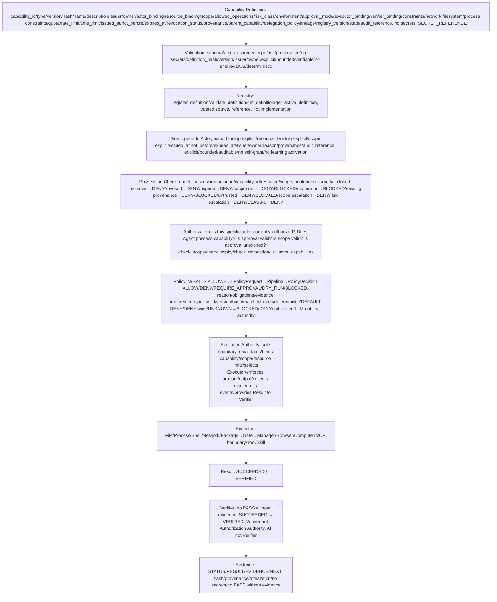
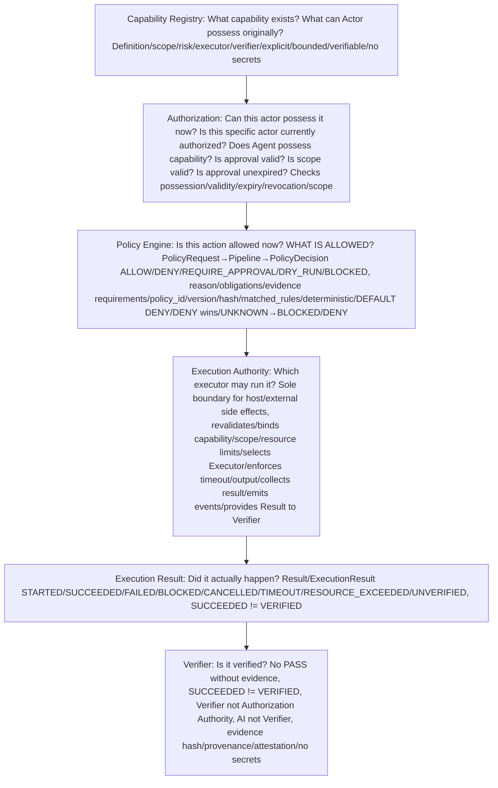
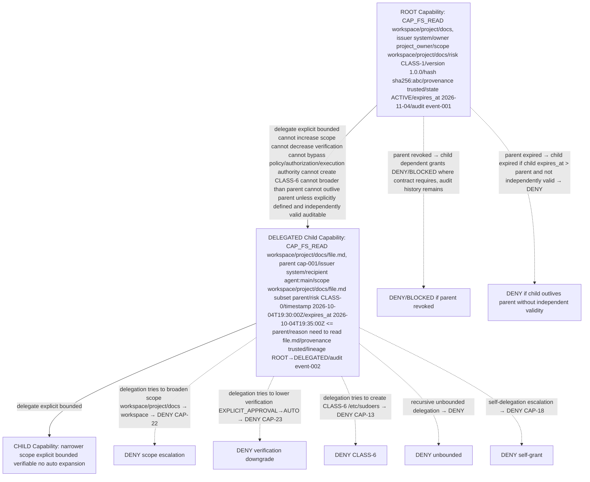
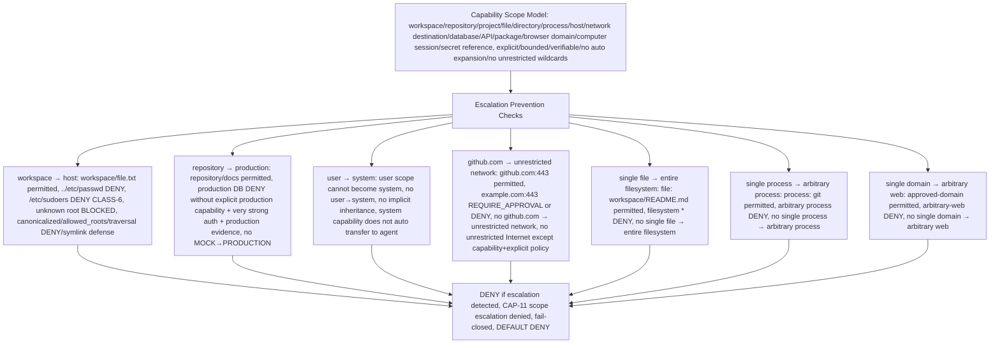

# Capability Contract — P12

> **P12 = CAPABILITY CONTRACT ONLY — No Capability Registry implementation, no Authorization implementation, no Policy implementation, no Executor implementation, no database implementation, no API implementation, no UI implementation, no Agent implementation, no package installation, no PowerShell installation, no Docker, no production deployment, no system changes.**
> CONTRACTS ONLY — Markdown + shell test/verification scripts, repository-only, deterministic static checks, no product code, no technology choice.
> Respects P8 Architecture Freeze, P9 Core Runtime Contracts, P10 Execution Authority Contracts, P11 Policy Engine Contract. Any violation requires ADR.
> Technology Selection PENDING — P18, no Rust/Go/Python/Node/TypeScript/OPA/Cedar/Casbin/OpenFGA/Postgres/SQLite/Redis/D1/KV/framework chosen in P12.

## Core Principle

```
LLM → Planner → Action Proposal → Policy Engine → Authorization → Execution Authority → Executor → Result → Verifier → Evidence
                 ↑                    ↑                ↑
                 |                    |                |
           Policy consumes      Authorization checks   Execution Authority
           Capability Registry  possession/validity    executes only authorized
                               via Registry           actions
```

**Mandatory distinction:**

- **Capability Registry** = ما الذي يستطيع Actor امتلاكه أصلاً؟ What capability exists? What can this Actor possess originally?
- **Authorization** = هل هذا Actor يملك Capability فعالة الآن؟ Can this actor possess it now? Is it active, bound, valid, not expired, not revoked?
- **Policy Engine** = هل هذا الفعل مسموح وفق السياسة وفي هذا السياق؟ Is this action allowed now? WHAT IS ALLOWED?
- **Execution Authority** = من يحول القرار المصرح به إلى side effect؟ Which executor may run it? Sole boundary for host/external side effects.
- **Verifier** = من يثبت ما حدث وهل استوفى الشروط؟ Did it actually happen? Is it verified?

**Invariant:**

```
CAPABILITY ≠ AUTHORIZATION ≠ POLICY ALLOW ≠ EXECUTION ≠ VERIFICATION
```

Possession of Capability alone does NOT mean action allowed. No ASSUME ALLOW.

## Capability Object Contract

Capability is immutable/versioned, verifiable, explicit, auditable, fail-closed, no secrets, no anonymous, no implicit inheritance.

### Required Fields (40+)

Capability Object MUST contain at minimum:

- `capability_id`: unique identifier, e.g., `cap-001`, UUID, immutable for version, e.g., `CAP_FS_READ`
- `capability_type`: type, e.g., `filesystem`, `process`, `network`, `package`, `browser`, `computer`, `mcp`, `secret`, `api`, `database`, `tool`, `skill`
- `version`: semantic version, e.g., `1.0.0`, immutable per definition, new version creates new definition, no silent mutation
- `definition_hash`: SHA256 hash of canonical definition, verifiable, immutable, e.g., `sha256:abc...`, for provenance and verification
- `name`: human readable name, e.g., `Filesystem Read Workspace`
- `description`: purpose, what it allows, what it does NOT allow, explicit boundaries
- `issuer`: who issued capability definition, e.g., `system`, `policy_owner`, `security_admin`, must be explicit, missing issuer → DENY
- `owner`: who owns capability grant, e.g., `user`, `project_owner`, must be explicit, missing owner → DENY
- `actor_binding`: which Actor(s) bound, explicit Actor ID(s), e.g., `agent:main`, `user:alice`, `tool:git`, no anonymous
- `actor_type`: actor_type from P11: `user`, `agent`, `service`, `tool`, `mcp_server`, `execution_authority`, `system`
- `resource_binding`: explicit resource selector, e.g., `workspace/project/docs`, `api.github.com:443`, `approved-domain`, not `filesystem`, not `internet`, verifiable
- `resource_type`: type of resource, e.g., `workspace`, `repository`, `file`, `directory`, `process`, `host`, `network`, `database`, `API`, `package`, `browser`, `computer`, `secret-reference`
- `resource_selector`: explicit allowlist/selector, e.g., `path:workspace/project/docs/**`, `domain:api.github.com`, `port:443`, `protocol:https`, no `*` unrestricted unless explicit capability definition special and still bounded by CLASS-6/Policy/Authorization/Execution Authority/Verifier
- `scope`: scope level, e.g., `workspace`, `repository`, `project`, `file`, `directory`, `process`, `host`, `network`, `database`, `API`, `package`, `browser`, `computer`, `secret`, explicit, no auto expansion
- `allowed_operations`: operations allowed, e.g., `read`, `write`, `list`, `stat`, `exec`, `connect`, `install`, `open`, `use`, explicit
- `risk_class`: CLASS-0 READ_ONLY, CLASS-1 SAFE_WORKSPACE, CLASS-2 BUILD_TEST, CLASS-3 NETWORK_READ, CLASS-4 PACKAGE/NETWORK_CONNECT/HIGH, CLASS-5 HOST/PRODUCTION/CRITICAL, CLASS-6 FORBIDDEN, must match real risk, cannot claim lower, CLASS-6 impossible to grant for normal operation
- `environment`: environment restrictions, e.g., `local`, `arena`, `ci`, `staging`, `production`, e.g., production requires stronger policy, LOCAL≠PRODUCTION, MOCK≠PRODUCTION, ARENA≠PRODUCTION
- `approval_mode`: approval expectations, e.g., `AUTO`, `DRY_RUN`, `EXPLICIT_APPROVAL`, `DENY`, e.g., CLASS-4/5 requires EXPLICIT_APPROVAL+DRY_RUN first
- `executor_binding`: which Executor(s) may execute, e.g., `File Executor`, `Process Executor`, `Shell Executor`, `Network Executor`, `Package Executor`, `Browser Executor`, `Computer Executor`, `MCP boundary`, explicit, no choosing new executor during execution, capability contract does not execute itself
- `verifier_binding`: which Verifier expectations, e.g., `filesystem evidence`, `process result + exit code + execution evidence`, `network evidence`, `package + execution + privilege evidence`, `browser evidence`, `computer interaction evidence`, capability does not issue PASS itself
- `constraints`: general constraints, e.g., `LIMIT_SCOPE`, `LIMIT_NETWORK`, `LIMIT_OUTPUT`, `LIMIT_TIME`, `LIMIT_RESOURCE`, `REQUIRE_VERIFICATION`, `AUDIT_REQUIRED`
- `network_constraints`: network specific, e.g., `network_mode: allowlist`, `destination: api.github.com`, `protocol: https`, `port: 443`, `domain: api.github.com`, `ip: allowlisted`, `allowlist_status: allowlisted`, `trust_level: trusted`, `rate_limit: 10 req/s`, `payload_limit: 1MB`, `unknown destination BLOCKED`
- `filesystem_constraints`: filesystem specific, e.g., `filesystem_scope: workspace`, `root: /workspace`, `path: workspace/project/docs`, `operation: read`, `sensitivity: low`, `canonicalized: true`, `allowed_roots: [/workspace]`, `traversal: DENY`, `symlink: follow only within allowed_roots`, `../etc/passwd DENY`, `/etc/sudoers DENY CLASS-6`, `unknown root BLOCKED`
- `process_constraints`: process specific, e.g., `executable: git`, `argv: ["git","status"]`, `no shell parsing`, `no bash -c`, `no sh -c`, `ARGV MODE preferred`, `shell vs process separation`, `resource_limits: cpu/memory/time/output`, `timeout`
- `quota`: quota, e.g., `max_executions: 100`, `max_files: 1000`, `max_network_requests: 100`, `max_package_installs: 10`
- `rate_limit`: rate limit, e.g., `10 req/s`, `100 exec/min`, `no unbounded`
- `time_limit`: time limit, e.g., `timeout: 30s`, `max_duration: 5m`
- `issued_at`: timestamp issued, e.g., `2026-10-04T19:30:00Z`
- `not_before`: not valid before, e.g., `2026-10-04T19:30:00Z`
- `expires_at`: expiration, e.g., `2026-11-04T19:30:00Z`, expired != active, no eternal default for high-risk
- `revocation_status`: revocation status, e.g., `active`, `revoked`, `suspended`, `expired`, `pending_revocation`
- `provenance`: source, source_version, definition_hash, issuer, trust_level, created_at, signature/reference if applicable, hash/version verifiable, untrusted → DENY/BLOCKED, no auto trust to plugins/MCP/external tools/downloaded/generated
- `parent_capability`: parent capability_id if delegated, e.g., `cap-001`, null for ROOT, lineage auditable
- `delegation_policy`: delegation policy, e.g., `allow_delegation: true/false`, `max_depth: 2`, `can_broaden_scope: false`, `can_lower_verification: false`, `can_create_CLASS-6: false`, `can_outlive_parent: false`, `require_explicit: true`
- `lineage`: lineage/graph, e.g., `ROOT → DELEGATED → CHILD`, with parent, child, issuer, recipient, scope, risk, timestamp, expiration, reason, provenance, auditable, no uncontrolled multiplication
- `registry_version`: registry version, e.g., `1.0.0`, for registry compatibility
- `state`: state, e.g., `PROPOSED`, `VALIDATING`, `VALIDATED`, `ACTIVE`, `SUSPENDED`, `REVOKED`, `EXPIRED`, see lifecycle
- `audit_reference`: audit event reference, e.g., `event_id`, `correlation_id`, `registry_version`, `policy_version`, immutable audit history

**No secret values in ordinary Capability object:**

- MUST use `SECRET_REFERENCE`, e.g., `secret_ref: env:GITHUB_TOKEN`, `secret_ref: vault:api_key`
- MUST NOT use `secret_value`, e.g., `secret_value: ghp_xxx` is FORBIDDEN, CLASS-6, SECURITY EVENT
- See P11 secret policy, P10 Execution Authority secrets REFERENCE ONLY, no secret logging.

## Capability Semantics

### Necessary but not sufficient

Capability may be necessary condition for Action, but not sufficient for automatic execution permission.

**Correct path:**

```
Capability exists + active + bound + valid (in Registry)
  ↓
Authorization checks possession/validity/expiry/revocation/scope (Is this specific Actor currently authorized? Does Agent possess capability? Is approval valid? Is scope valid? Is approval unexpired? Is actor authenticated? Is provenance trusted?)
  ↓
Policy Engine evaluates Action + Actor + Capability + Resource + Scope + Risk + Environment + Network + Provenance + Approval (WHAT IS ALLOWED? Deterministic, fail-closed, DEFAULT DENY, DENY wins, UNKNOWN→BLOCKED/DENY)
  ↓
Execution Authority executes only authorized actions (sole boundary, revalidates, binds limits, selects Executor, enforces timeout/output, collects result, emits events)
  ↓
Verifier proves result (no PASS without evidence, SUCCEEDED≠VERIFIED, Verifier not Authorization Authority, AI not Verifier)
  ↓
Evidence (STATUS/RESULT/EVIDENCE/NEXT, hash, provenance, attestation, no secrets)
```

**Forbidden:**

- `Capability → direct execution` is BLOCKED, violates INV-EA-01..20, EA-01..20, POL-01..30, CAP-01..30
- LLM cannot call Executor directly, Agent cannot call Executor directly, UI cannot call Executor directly, must go via Planner→Action→Policy→Authorization→Execution Authority→Executor
- Capability possession ≠ policy allow (CAP-14)
- Capability possession ≠ authorization (CAP-15)
- Capability ≠ execution permission (CAP-16)
- Capability cannot execute itself (CAP-17)

## Built-in Capabilities (Canonical Definitions — Contracts Only, No Implementation)

### CAP_FS_READ

- **capability_id**: `CAP_FS_READ`
- **capability_type**: `filesystem`
- **purpose**: read files, list directories, stat, within allowed roots, workspace/repository
- **minimum scope**: `workspace` or `repository` or `file` or `directory`, explicit path, e.g., `workspace/project/docs`
- **default risk**: CLASS-0 READ_ONLY or CLASS-1 SAFE_WORKSPACE, LOW/MEDIUM, but may be CLASS-3..5 if host/production/sensitive
- **allowed resource types**: `workspace`, `repository`, `file`, `directory`, `project`
- **resource_binding**: explicit, e.g., `workspace/project/docs`, `workspace/project/docs/**`, `file: workspace/README.md`, not `filesystem`, not `/`, not `*`, no unrestricted filesystem
- **executor_binding**: `File Executor`
- **verifier_binding**: `filesystem evidence` (hash SHA256, provenance, attestation, no secrets)
- **approval expectations**: AUTO for workspace/repository low sensitivity, REQUIRE_APPROVAL for host /etc/passwd, high sensitivity, production
- **environment restrictions**: local/arena/ci allowed, production requires stronger policy, LOCAL≠PRODUCTION
- **constraints**: canonicalized path, allowed_roots, traversal DENY, symlink follow only within allowed_roots, ../etc/passwd DENY, /etc/sudoers DENY CLASS-6, unknown root BLOCKED, no secrets in evidence
- **risk notes**: CLASS-0..1 normally, but fs.read host scope CLASS-4..5

### CAP_FS_WRITE

- **capability_id**: `CAP_FS_WRITE`
- **capability_type**: `filesystem`
- **purpose**: write, create, copy, move, delete files within allowed roots
- **minimum scope**: `workspace`, explicit path, e.g., `workspace/project/docs/file.md`
- **default risk**: CLASS-1 SAFE_WORKSPACE MEDIUM, but CLASS-2 BUILD_TEST MEDIUM/HIGH for delete, CLASS-4..5 HIGH/CRITICAL for host scope
- **allowed resource types**: `workspace`, `repository`, `file`, `directory`, `project`
- **resource_binding**: explicit, e.g., `workspace/project/docs/file.md`, not `filesystem`, not `/`, not `*`
- **executor_binding**: `File Executor`
- **verifier_binding**: `filesystem evidence` (hash, provenance, attestation, reversible for write, irreversible for delete)
- **approval expectations**: AUTO with evidence for workspace write, REQUIRE_APPROVAL for delete high sensitivity, EXPLICIT_APPROVAL+DRY_RUN first for host scope
- **environment restrictions**: local/arena/ci allowed, production requires stronger policy + production evidence
- **constraints**: canonicalized, allowed_roots, traversal DENY, symlink defense, no /etc/sudoers, no root filesystem mutation unless explicit host scope + very strong auth + DRY_RUN first

### CAP_PROCESS_READ

- **capability_id**: `CAP_PROCESS_READ`
- **capability_type**: `process`
- **purpose**: read process info, list processes, stat, within allowed scope
- **minimum scope**: `process` or `workspace` or `project`
- **default risk**: CLASS-0 READ_ONLY LOW or CLASS-1 SAFE_WORKSPACE MEDIUM
- **allowed resource types**: `process`, `workspace`, `project`
- **executor_binding**: `Process Executor` (read-only)
- **verifier_binding**: `process evidence` (process info, no secrets)
- **approval expectations**: AUTO for workspace, REQUIRE_APPROVAL for host processes
- **environment restrictions**: local/arena/ci allowed, production stronger

### CAP_PROCESS_EXEC

- **capability_id**: `CAP_PROCESS_EXEC`
- **capability_type**: `process`
- **purpose**: execute process with argv, no shell parsing, ARGV MODE preferred, no bash -c, no sh -c
- **minimum scope**: `workspace` or `process`, explicit executable, e.g., `git`, `make`, `npm`
- **default risk**: CLASS-2 BUILD_TEST MEDIUM/HIGH, but CLASS-4..5 HIGH/CRITICAL for shell.exec host
- **allowed resource types**: `process`, `workspace`, `project`, `host` (with strong auth)
- **resource_binding**: explicit executable, e.g., `executable: git`, `argv: ["git","status"]`, not arbitrary command text
- **executor_binding**: `Process Executor` preferred, `Shell Executor` only if explicitly permitted and high risk
- **verifier_binding**: `process result + exit code + execution evidence` (exit_code, stdout/stderr refs, resource_usage, side_effects, artifacts, evidence_ref, SUCCEEDED≠VERIFIED)
- **approval expectations**: AUTO for git status workspace, EXPLICIT_APPROVAL for make, EXPLICIT_APPROVAL+DRY_RUN first for shell.exec, host, production
- **environment restrictions**: local/arena/ci allowed, production requires stronger policy
- **constraints**: resource_limits cpu/memory/time/output, timeout, no orphaned processes, bounded retry, idempotency_key, no arbitrary shell, shell.command vs process.argv separated, pipelines only if explicitly permitted

### CAP_NETWORK_READ

- **capability_id**: `CAP_NETWORK_READ`
- **capability_type**: `network`
- **purpose**: read from network, e.g., GET official allowlisted, READ_ONLY
- **minimum scope**: `network`, explicit destination, e.g., `api.github.com:443`, `github.com:443`
- **default risk**: CLASS-3 NETWORK_READ LOW/MEDIUM
- **allowed resource types**: `network`, `API`, `repository` (remote)
- **resource_binding**: explicit, e.g., `api.github.com:443`, `github.com:443`, not `internet`, not `*`, no unrestricted Internet
- **executor_binding**: `Network Executor` (read)
- **verifier_binding**: `network evidence` (content hash/evidence, READ_ONLY)
- **approval expectations**: AUTO with allowlist check for official, EXPLICIT for unrestricted
- **environment restrictions**: local/arena/ci allowed, production stronger, official sources only
- **constraints**: network_mode allowlist, destination explicit, protocol https, port 443, domain allowlisted, ip allowlisted, allowlist_status allowlisted, trust_level trusted, rate_limit, payload_limit, Unknown destination BLOCKED, no unrestricted Internet except capability+explicit policy

### CAP_NETWORK_CONNECT

- **capability_id**: `CAP_NETWORK_CONNECT`
- **capability_type**: `network`
- **purpose**: connect, download, upload, external side effects
- **minimum scope**: `network`, explicit destination, e.g., `api.github.com:443`
- **default risk**: CLASS-3..4 MEDIUM/HIGH for official allowlisted, CLASS-4..5 HIGH/CRITICAL for unrestricted, external, upload, production
- **allowed resource types**: `network`, `API`, `database`, `host`, `external`
- **resource_binding**: explicit, e.g., `api.github.com:443`, not `internet`, not `*`
- **executor_binding**: `Network Executor` (connect/download/upload)
- **verifier_binding**: `network evidence` (connection result + evidence, file + evidence, network+evidence, no secret exfiltration)
- **approval expectations**: AUTO with allowlist for official, EXPLICIT_APPROVAL for unrestricted, EXPLICIT_APPROVAL+DRY_RUN for upload, production, external
- **environment restrictions**: local/arena/ci allowed with allowlist, production stronger, official sources only
- **constraints**: allowlist+explicit policy required, Unknown destination BLOCKED, no unrestricted Internet, rate_limit, payload_limit, audit, no secret exfiltration

### CAP_PACKAGE_INSTALL

- **capability_id**: `CAP_PACKAGE_INSTALL`
- **capability_type**: `package`
- **purpose**: install packages via Package Executor → Privilege Gate → Package Manager
- **minimum scope**: `host`, explicit package, e.g., `powershell`, `gcc`, `make`
- **default risk**: CLASS-4 PACKAGE/NETWORK_CONNECT/HIGH SIDE EFFECT HIGH, e.g., package.install powershell HIGH
- **allowed resource types**: `package`, `host`
- **resource_binding**: explicit package, e.g., `package: powershell`, not `*`, no arbitrary apt
- **executor_binding**: `Package Executor` → `Privilege Gate` (ops/security/privilege-gate.sh) → Package Manager, must not be bypassed, no arbitrary apt, DRY_RUN first
- **verifier_binding**: `package metadata + execution evidence + DRY-RUN evidence + ACTION/CLASS/POLICY/DECISION/EXECUTION/EXIT_CODE/TIMESTAMP/SYSTEM_SUDO/PROJECT_POLICY`, package metadata + execution evidence
- **approval expectations**: EXPLICIT_APPROVAL+DRY_RUN first mandatory, very strong auth for host
- **environment restrictions**: local/arena/ci allowed with Gate, production requires stronger policy + production evidence, no MOCK→PRODUCTION
- **constraints**: gate_path ops/security/privilege-gate.sh, dry_run_first, execute_explicit, no arbitrary apt, DEFERRED/RESTRICTED for remove future, SYSTEM_SIDE_EFFECT via Gate
- **P2/P10 compatibility**: CAP_PACKAGE_INSTALL does NOT mean sudo allowed, does NOT mean package installation automatically authorized, does NOT mean Execution Authority bypassed, path remains Action→Policy→Authorization→Package Executor→Privilege Gate→Package Manager→Result→Verification→Evidence

### CAP_BROWSER

- **capability_id**: `CAP_BROWSER`
- **capability_type**: `browser`
- **purpose**: open browser, navigate, interact, within approved domains
- **minimum scope**: `browser`, explicit domain, e.g., `approved-domain`, `github.com`
- **default risk**: CLASS-4..5 HIGH/CRITICAL, e.g., browser.open HIGH
- **allowed resource types**: `browser`, `network`, `workspace`
- **resource_binding**: explicit, e.g., `approved-domain`, not `arbitrary-web`, not `*`, no unrestricted web
- **executor_binding**: `Browser Executor` (future)
- **verifier_binding**: `browser evidence + execution evidence`
- **approval expectations**: EXPLICIT_APPROVAL+DRY_RUN first, very strong auth for production
- **environment restrictions**: local/arena/ci allowed with approval, production stronger
- **constraints**: approved domains allowlist, no arbitrary web, rate_limit, audit

### CAP_COMPUTER

- **capability_id**: `CAP_COMPUTER`
- **capability_type**: `computer`
- **purpose**: computer use, interact with host UI, computer session
- **minimum scope**: `computer`, explicit session, e.g., `computer session`
- **default risk**: CLASS-4..5 HIGH/CRITICAL, e.g., computer.use HIGH
- **allowed resource types**: `computer`, `host`, `network`
- **resource_binding**: explicit session, not arbitrary host access, not `*`
- **executor_binding**: `Computer Executor` (future)
- **verifier_binding**: `computer evidence + execution evidence` (interaction evidence)
- **approval expectations**: EXPLICIT_APPROVAL+DRY_RUN first, very strong auth
- **environment restrictions**: local/arena/ci allowed with strong auth, production stronger
- **constraints**: session binding, no unbounded host access, audit, rate_limit

### CAP_MCP

- **capability_id**: `CAP_MCP`
- **capability_type**: `mcp`
- **purpose**: call MCP server via Gateway, no unbounded host access, UNTRUSTED BY DEFAULT
- **minimum scope**: `network` or `mcp`, explicit server, e.g., `mcp:trusted-server`
- **default risk**: CLASS-3..4 MEDIUM/HIGH for trusted, CLASS-4..5 HIGH/CRITICAL for untrusted
- **allowed resource types**: `network`, `mcp`, `tool`
- **resource_binding**: explicit server, e.g., `mcp:trusted-server`, not arbitrary, not `*`
- **executor_binding**: `MCP boundary` via Gateway, no unbounded host access
- **verifier_binding**: `mcp evidence + execution evidence`
- **approval expectations**: AUTO/EXPLICIT depending trust for trusted, EXPLICIT_APPROVAL+DRY_RUN for untrusted, via Gateway/Sandbox
- **environment restrictions**: local/arena/ci allowed with Gateway, production stronger, UNTRUSTED BY DEFAULT need Gateway/Sandbox
- **constraints**: via Gateway, no unbounded host access, provenance check, trust_level, audit

### CAP_SECRET_ACCESS

- **capability_id**: `CAP_SECRET_ACCESS`
- **capability_type**: `secret`
- **purpose**: access secret via SECRET_REFERENCE, not VALUE, CRITICAL, EXPLICIT_APPROVAL, AUDIT_REQUIRED, NO_LOG_VALUE
- **minimum scope**: `secret-reference`, explicit ref, e.g., `env:GITHUB_TOKEN`, `vault:api_key`, `secret_ref: env:GITHUB_TOKEN`
- **default risk**: CLASS-5 HOST/PRODUCTION/CRITICAL CRITICAL, or CLASS-4..5 HIGH/CRITICAL
- **allowed resource types**: `secret-reference`, `secret`, `API`, `database`
- **resource_binding**: explicit ref, e.g., `secret_ref: env:GITHUB_TOKEN`, not arbitrary secret, not `*`, no secret_value
- **executor_binding**: via Secret Service future, not direct file read of secrets, REFERENCE ONLY
- **verifier_binding**: `secret access evidence` (access logged, but NO_LOG_VALUE, no secret_value in evidence, audit required)
- **approval expectations**: EXPLICIT_APPROVAL mandatory, CRITICAL, AUDIT_REQUIRED, NO_LOG_VALUE, very strong auth
- **environment restrictions**: local/arena/ci allowed with strong auth, production stronger, no secret commit/print/log
- **constraints**: SECRET_REFERENCE not SECRET_VALUE, no secret_value in action input except via future Secret Service contract P11 does not implement Secret Service, no commit/print/log secrets, CLASS-6 FORBIDDEN if secret commit/print/log, SECURITY EVENT

**All above are definitions/contracts only, no implementations, no database, no API, no runtime, no executor implementation, no package install, repository-only.**

## Default Deny — Fail-Closed

Capability Registry MUST be fail-closed, DEFAULT DENY, no ASSUME ALLOW, core invariant CAP-01.

Mandatory DENY/BLOCKED cases:

- unknown capability = DENY (CAP-02)
- unknown definition = DENY
- unknown actor binding = DENY
- unknown resource binding = DENY
- unknown scope = DENY
- revoked capability = DENY (CAP-03)
- expired capability = DENY (CAP-04)
- suspended capability = DENY/BLOCKED (CAP-05)
- malformed capability = BLOCKED (CAP-06)
- missing provenance = DENY/BLOCKED (CAP-07)
- untrusted provenance = DENY/BLOCKED (CAP-08)
- missing issuer = DENY
- missing owner = DENY
- missing version/hash = DENY (CAP-27)
- invalid delegation = DENY (CAP-22..25)
- scope escalation = DENY (CAP-11)
- risk escalation = DENY (CAP-12)
- CLASS-6 impossible to grant for normal operation = DENY (CAP-13)
- self-grant = DENY (CAP-18)
- learning activation = DENY (CAP-19)
- memory-based grant = DENY (CAP-20)
- implicit inheritance = DENY (CAP-21)
- parent expiry constrains child = DENY if child outlives parent without explicit independent validity (CAP-24)
- revoked parent invalidates dependent grants where contract requires = DENY (CAP-25)
- registry failure = fail-closed (CAP-29)
- registry cannot bypass Policy/Authorization/Execution Authority/Verifier = DENY (CAP-30)
- no ASSUME ALLOW

## Capability Scope Model

Explicit, bounded, verifiable, no auto expansion.

### Allowed Scope Examples

- `workspace`: e.g., `workspace/project/docs`, `workspace/file.txt`, permitted per capability, e.g., fs.read workspace
- `repository`: e.g., `repository/docs`, `repository/src`
- `project`: e.g., `project:linex.os`
- `file`: e.g., `file: workspace/README.md`, `file: workspace/project/docs/file.md`
- `directory`: e.g., `directory: workspace/project/docs`, `directory: workspace/project/docs/**`
- `process`: e.g., `process: git`, `process: make`, `process: npm`
- `host`: e.g., `host: /tmp`, `host: /usr/local/bin`, requires very strong auth + DRY_RUN first + production evidence, no /etc/sudoers
- `network destination`: e.g., `api.github.com:443`, `github.com:443`, `approved-domain`
- `database`: e.g., `database: production`, requires stronger policy, very strong auth, production evidence, no MOCK→PRODUCTION
- `API`: e.g., `API: production`, requires stronger policy
- `package`: e.g., `package: powershell`, `package: gcc`, explicit, no arbitrary apt
- `browser domain`: e.g., `browser: approved-domain`, `browser: github.com`, not arbitrary-web
- `computer session`: e.g., `computer: session-123`, explicit session
- `secret reference`: e.g., `secret_ref: env:GITHUB_TOKEN`, `secret_ref: vault:api_key`, not secret_value

### Escalation Prevention — MUST DENY

- `workspace → host`: workspace capability cannot escalate to host, e.g., workspace/file.txt permitted, ../etc/passwd DENY, /etc/sudoers DENY CLASS-6
- `repository → production`: repository capability cannot escalate to production, e.g., repository/docs permitted, production DB DENY without explicit production capability + very strong auth + production evidence
- `user → system`: user capability cannot escalate to system, e.g., user scope cannot become system, no user→system
- `github.com → unrestricted network`: github.com allowlisted cannot escalate to unrestricted network, e.g., github.com:443 permitted, example.com:443 REQUIRE_APPROVAL or DENY, no github.com → unrestricted network
- `single file → entire filesystem`: single file capability cannot escalate to entire filesystem, e.g., file: workspace/README.md permitted, filesystem * DENY, no single file → entire filesystem
- `single process → arbitrary process`: single process capability cannot escalate to arbitrary process, e.g., process: git permitted, arbitrary process DENY, no single process → arbitrary process
- `single domain → arbitrary web`: single domain capability cannot escalate to arbitrary web, e.g., approved-domain permitted, arbitrary-web DENY

Capability MUST NOT auto-expand Scope. Scope must be explicit, bounded, verifiable.

## No Unrestricted Wildcards

FORBIDDEN unless explicit capability definition special, and even then bounded by CLASS-6/Policy/Authorization/Execution Authority/Verifier, prefer explicit allowlists/selectors.

Forbidden wildcards:

- `*` unrestricted: e.g., `filesystem: *` DENY, `network: *` DENY, `process: *` DENY, `host: *` DENY, `mcp: *` DENY, `production: *` DENY
- `unrestricted filesystem`: e.g., `/`, `/*`, `**`, entire filesystem, DENY, CLASS-6 if /etc/sudoers, rm -rf /
- `unrestricted network`: e.g., `internet`, `unrestricted network`, `0.0.0.0/0`, DENY unless explicit capability definition special + very strong auth + explicit policy + Execution Authority + Verifier
- `unrestricted process execution`: e.g., arbitrary command, arbitrary shell, `*` executable, DENY, no arbitrary user-generated command text, no shell parsing unless explicitly permitted
- `unrestricted host access`: e.g., host *, arbitrary host mutation, DENY, requires very strong auth + DRY_RUN first + production evidence + Gate
- `unrestricted MCP access`: e.g., mcp *, arbitrary MCP server, DENY, UNTRUSTED BY DEFAULT need Gateway/Sandbox
- `unrestricted production access`: e.g., production *, arbitrary production DB/API, DENY, requires stronger policy + very strong auth + production evidence + no MOCK→PRODUCTION

**Better:** explicit allowlists/selectors, e.g., `path: workspace/project/docs/**`, `domain: api.github.com`, `executable: git`, `package: powershell`, verifiable.

## Risk Binding

Capability MUST be bound to Risk Class, cannot claim lower risk than real, cannot lower via Agent/LLM/learning/delegation, any major risk change needs new Capability version, not silent mutation.

- CLASS-0 READ_ONLY: e.g., fs.read workspace, fs.list workspace, process.read workspace, low risk
- CLASS-1 SAFE_WORKSPACE: e.g., fs.write workspace new file, fs.copy workspace, medium risk
- CLASS-2 BUILD_TEST: e.g., process.exec workspace ["make"], fs.delete workspace, medium/high risk
- CLASS-3 NETWORK_READ: e.g., network.read official allowlisted github.com, low/medium risk, READ_ONLY
- CLASS-4 PACKAGE/NETWORK_CONNECT/HIGH SIDE EFFECT: e.g., package.install powershell, network.connect unrestricted, fs.write host scope, shell.exec, network.upload, browser.open, computer.use, mcp.call untrusted, high/critical risk, REQUIRE_APPROVAL+DRY_RUN
- CLASS-5 HOST/PRODUCTION/CRITICAL: e.g., production write production database, production write production API, host OS, production DB, production API, critical risk, REQUIRE_APPROVAL strong auth + production evidence + DRY_RUN
- CLASS-6 FORBIDDEN: e.g., /etc/sudoers modification, rm -rf /, mkfs, eval, curl|bash executable, secret commit/print/log, DENY Always, impossible to grant for normal operation, SECURITY EVENT

Rules:

- CLASS-6 = FORBIDDEN, cannot grant for normal operation, CAP-13
- Capability cannot claim Risk lower than real definition, e.g., CAP_PACKAGE_INSTALL cannot claim CLASS-1, must be CLASS-4
- Cannot lower CLASS-5→CLASS-2 via Agent/LLM/learning/delegation, any change needs new Capability version + review + validation + activation + human approval, e.g., CLASS-5→CLASS-2 without explicit rule+review DENY
- Risk escalation DENY (CAP-12)

## Actor Binding

Capability MUST be bound to Actor explicitly, not anonymous, no implicit inheritance, no implicit trust.

Actors from P11 — canonical actor types `user/agent/service/tool/mcp_server/execution_authority/system`:

- `user`: e.g., `user:alice`, `user:bob`
- `agent`: e.g., `agent:main`, `agent:planner`
- `service`: e.g., `service:api`, `service:worker`
- `tool`: e.g., `tool:git`, `tool:make`, `tool:fs`
- `mcp_server`: e.g., `mcp_server:trusted-server`, `mcp_server:untrusted-server`
- `execution_authority`: e.g., `execution_authority:main`
- `system`: e.g., `system:registry`, `system:policy`, `system:verifier`

Rules:

- capability is not anonymous: must have actor_binding explicit, no anonymous capability, CAP-09 actor binding mandatory
- no implicit inheritance: child does not automatically inherit parent's capabilities, must be explicit delegation, CAP-21
- no implicit trust: trust must be explicit, not assumed, untrusted provenance DENY/BLOCKED, CAP-08
- actor cannot grant itself capability: e.g., agent cannot grant itself CAP_FS_WRITE, DENY, CAP-18 no self-grant
- agent cannot grant itself capability: DENY, CAP-18
- LLM cannot grant capability: LLM proposes, Policy evaluates, LLM does not grant, DENY, CAP-18
- MCP server cannot grant itself capability: MCP server cannot self-grant, DENY, CAP-18, UNTRUSTED BY DEFAULT
- execution authority cannot create permissions for itself: Execution Authority cannot self-escalate, cannot create capabilities for itself, DENY, CAP-18
- system capability does not automatically transfer to agent: system capability e.g., CAP_SECRET_ACCESS system does not auto transfer to agent, must be explicit grant + validation + approval, CAP-21 no implicit inheritance
- Actor binding mandatory: missing actor_binding → DENY, CAP-09

## Resource Binding

Capability MUST specify resource binding explicitly, verifiable, not vague.

Examples:

- `CAP_FS_READ → workspace/project/docs` (good, explicit)
  - NOT `CAP_FS_READ → filesystem` (bad, vague, DENY, no unrestricted filesystem)
- `CAP_NETWORK_CONNECT → api.github.com:443` (good, explicit destination, protocol, port, domain, ip allowlisted)
  - NOT `CAP_NETWORK_CONNECT → internet` (bad, unrestricted network, DENY)
- `CAP_BROWSER → approved-domain` (good, explicit domain allowlist)
  - NOT `CAP_BROWSER → arbitrary-web` (bad, arbitrary-web, DENY)
- `CAP_PROCESS_EXEC → executable: git, argv: ["git","status"]` (good, explicit)
  - NOT `CAP_PROCESS_EXEC → arbitrary command` (bad, arbitrary, DENY, no arbitrary user-generated command text)
- `CAP_PACKAGE_INSTALL → package: powershell` (good, explicit package)
  - NOT `CAP_PACKAGE_INSTALL → *` (bad, wildcard, DENY, no arbitrary apt)
- `CAP_SECRET_ACCESS → secret_ref: env:GITHUB_TOKEN` (good, SECRET_REFERENCE)
  - NOT `CAP_SECRET_ACCESS → secret_value: ghp_xxx` (bad, FORBIDDEN, CLASS-6, SECURITY EVENT, no secret_value)

Resource binding mandatory: missing resource_binding → DENY, CAP-10.

## Executor Binding

Every Capability that is executable MUST specify executor_binding explicit, no choosing new executor during execution, capability contract does not execute itself.

Examples:

- `CAP_FS_READ` → `File Executor`
- `CAP_FS_WRITE` → `File Executor`
- `CAP_PROCESS_READ` → `Process Executor` (read-only)
- `CAP_PROCESS_EXEC` → `Process Executor` preferred, `Shell Executor` only if explicitly permitted and high risk (shell.command vs process.argv separated, ARGV MODE preferred, no bash -c, no sh -c, pipelines only if explicitly permitted)
- `CAP_NETWORK_READ` → `Network Executor` (read)
- `CAP_NETWORK_CONNECT` → `Network Executor` (connect/download/upload)
- `CAP_PACKAGE_INSTALL` → `Package Executor` → `Privilege Gate` → Package Manager, must not be bypassed, DRY_RUN first
- `CAP_BROWSER` → `Browser Executor` (future)
- `CAP_COMPUTER` → `Computer Executor` (future)
- `CAP_MCP` → `MCP boundary` via Gateway, no unbounded host access
- `CAP_SECRET_ACCESS` → via Secret Service future, REFERENCE ONLY, no direct file read of secrets

Rules:

- Capability cannot choose executor new during execution: executor_binding immutable for version, new version needed for change
- Capability contract does not execute: Policy does NOT execute, Capability does NOT execute, Execution Authority executes only authorized actions, CAP-16, CAP-17
- Executor binding mandatory for executable capabilities: missing executor_binding → DENY/BLOCKED for execution, but definition may still be validated as non-executable? For P12, executable capabilities must have executor_binding.

## Verifier Binding

Capability that allows side effects MUST specify verifier expectations, capability does not issue PASS itself.

Examples:

- `CAP_FS_WRITE` → `filesystem evidence` (hash SHA256, provenance, attestation, reversible for write, irreversible for delete, no secrets, no PASS without evidence)
- `CAP_PROCESS_EXEC` → `process result + exit code + execution evidence` (exit_code, stdout/stderr refs, resource_usage, side_effects, artifacts, evidence_ref, SUCCEEDED≠VERIFIED, no PASS without evidence, Verifier not Authorization Authority, AI not Verifier)
- `CAP_NETWORK_CONNECT` → `network evidence` (connection result + evidence, content hash, no secret exfiltration)
- `CAP_PACKAGE_INSTALL` → `package metadata + execution evidence + DRY-RUN evidence + ACTION/CLASS/POLICY/DECISION/EXECUTION/EXIT_CODE/TIMESTAMP/SYSTEM_SUDO/PROJECT_POLICY` (package metadata + execution evidence, DRY-RUN evidence, ACTION/CLASS/POLICY/DECISION/EXECUTION/EXIT_CODE/TIMESTAMP/SYSTEM_SUDO/PROJECT_POLICY)
- `CAP_BROWSER` → `browser evidence + execution evidence`
- `CAP_COMPUTER` → `computer interaction evidence + execution evidence`
- `CAP_MCP` → `mcp evidence + execution evidence` (via Gateway)
- `CAP_SECRET_ACCESS` → `secret access evidence` (access logged, but NO_LOG_VALUE, audit required, no secret_value in evidence)

Rules:

- Capability does not issue PASS itself: capability cannot mark VERIFIED, cannot call Executor, cannot bypass Execution Authority, CAP-17, POL-24
- Verifier binding mandatory for side-effect capabilities: missing verifier_binding → DENY/BLOCKED for side effects, but definition may still be validated?

## Leases / Expiration

Capability grants/leases MUST support:

- `issued`: issued state, e.g., `issued: true`, `issued_at: 2026-10-04T19:30:00Z`
- `not_before`: not valid before, e.g., `not_before: 2026-10-04T19:30:00Z`, if current time < not_before → DENY
- `expires_at`: expiration, e.g., `expires_at: 2026-11-04T19:30:00Z`, if current time > expires_at → DENY, expired != active, CAP-04
- `renewable`: renewable, e.g., `renewable: true/false`, renewal requires validation + approval + new version + audit
- `revocable`: revocable, e.g., `revocable: true`, revocation explicit, auditable, immediate
- `revoked_at`: revoked timestamp, e.g., `revoked_at: 2026-10-05T10:00:00Z`, revoked != active, CAP-03
- `suspended_at`: suspended timestamp, e.g., `suspended_at: 2026-10-05T10:00:00Z`, suspended = DENY/BLOCKED, CAP-05
- `reason`: reason for lease/revocation/suspension/expiry, e.g., `reason: security incident`, `reason: owner request`, `reason: policy change`, `reason: expiry`, `reason: trust downgrade`, `reason: provenance failure`, `reason: delegation violation`

Rules:

- `expired capability != active capability`: expired → DENY, CAP-04
- `revoked capability != active capability`: revoked → DENY, CAP-03
- No eternal default for high-risk capabilities: CLASS-4/5/6 must have expires_at, not eternal, e.g., CAP_PACKAGE_INSTALL, CAP_NETWORK_CONNECT unrestricted, CAP_BROWSER, CAP_COMPUTER, CAP_SECRET_ACCESS must expire, renewable only with explicit approval

## Revocation Contract

Revocation MUST be:

- explicit: e.g., `revoke: explicit`, not implicit, not silent
- auditable: e.g., `audit_reference: event_id`, `reason: security incident`, `revoked_at`, `revoked_by`, immutable audit history
- immediate for normal authorization decisions: e.g., once revoked, immediate DENY for new authorizations, no grace period for high-risk unless explicitly defined with reason
- version-aware: e.g., revocation bound to capability_id, version, definition_hash, registry_version
- actor-bound: e.g., revocation bound to actor_binding, actor_type, actor_id
- capability-bound: e.g., revocation bound to capability_id, capability_type, resource_binding, scope

Reasons for revocation may include:

- security incident: e.g., compromise, vulnerability, exploit
- owner request: e.g., owner revokes grant
- policy change: e.g., policy updated, capability no longer allowed
- expiry: e.g., expires_at past, lease expired
- trust downgrade: e.g., trust_level downgraded, untrusted provenance
- provenance failure: e.g., hash mismatch, signature failure, source untrusted
- delegation violation: e.g., delegation tried to broaden scope, lower verification, create CLASS-6, outlive parent

Rules:

- No deleting record then considering revocation nonexistent: audit history immutable, CAP-28, revocation record must remain, cannot delete then assume active
- Audit history must remain: CAP-28 audit history immutable, no deletion, no rewrite, append-only

## Delegation Contract

Delegation MUST be explicit, bounded, auditable, fail-closed.

Mandatory rules:

- delegation must be explicit: e.g., `delegation: explicit`, `parent_capability: cap-001`, `child_capability: cap-002`, `issuer: explicit`, `recipient: explicit`, no implicit delegation, no implicit inheritance, CAP-21
- bounded by parent capability: e.g., child scope ⊆ parent scope, child risk ≤ parent risk? Actually child risk cannot be lower than real, but also cannot be higher than parent? Child cannot increase risk beyond parent? For P12, child risk must be ≤ parent risk or equal, but cannot claim lower than real. Child cannot have more permissive scope than parent.
- cannot increase scope: e.g., parent `CAP_FS_READ workspace/project/docs` child `CAP_FS_READ workspace/project/docs/file.md` allowed (narrower), child `CAP_FS_READ workspace` DENY (broader), child `CAP_FS_WRITE workspace` DENY (broader + write), CAP-22 delegation cannot broaden scope
- cannot decrease required verification: e.g., parent requires EXPLICIT_APPROVAL+DRY_RUN, child cannot require AUTO, must require at least same verification, CAP-23 delegation cannot lower verification
- cannot bypass policy: delegation cannot bypass Policy Engine, Policy must still evaluate Action, CAP-30 registry cannot bypass Policy
- cannot bypass authorization: delegation cannot bypass Authorization, Authorization must still check possession/validity/expiry/revocation/scope, CAP-30
- cannot bypass execution authority: delegation cannot bypass Execution Authority, Execution Authority still sole boundary, CAP-30
- cannot create CLASS-6 permissions: delegation cannot create CLASS-6 FORBIDDEN, e.g., /etc/sudoers, rm -rf /, mkfs, eval, curl|bash, secret commit, DENY, CAP-13
- cannot become broader than parent: child cannot be broader than parent in scope, operations, resource, CAP-22
- cannot outlive parent unless explicitly defined and independently valid: e.g., child expires_at ≤ parent expires_at unless child explicitly defined and independently valid with its own issuer/owner/provenance/approval, CAP-24 parent expiry constrains child
- delegation chain must be auditable: e.g., lineage ROOT→DELEGATED→CHILD with parent, child, issuer, recipient, scope, risk, timestamp, expiration, reason, provenance, audit_reference, immutable, CAP-28
- recursive unbounded delegation = DENY: e.g., delegation depth must be bounded, max_depth, e.g., max_depth: 2, unbounded recursive DENY, CAP-22..25
- self-delegation escalation = DENY: e.g., agent delegating to itself to escalate scope/risk DENY, CAP-18 no self-grant

Examples:

- Parent: `CAP_FS_READ workspace/project/docs` (scope workspace/project/docs, risk CLASS-0..1, operations read, list, stat)
  - Allowed Child: `CAP_FS_READ workspace/project/docs/file.md` (narrower scope, same operations, same or lower risk, same verification, explicit delegation, auditable)
  - NOT Allowed Child: `CAP_FS_WRITE workspace` (broader scope workspace vs workspace/project/docs, write vs read, escalation DENY, CAP-11, CAP-22)
  - NOT Allowed Child: `CAP_FS_READ /` (unrestricted filesystem, escalation DENY, CAP-11, CAP-22)
  - NOT Allowed Child: `CAP_FS_READ workspace/project/docs` with lower verification (e.g., parent requires EXPLICIT_APPROVAL, child AUTO) DENY, CAP-23
  - NOT Allowed Child: `CAP_PACKAGE_INSTALL *` from `CAP_FS_READ` DENY, cannot create CLASS-6 or broader, CAP-13, CAP-22

## Capability Graph / Lineage Model

Must represent ROOT→DELEGATED→CHILD with:

- parent: parent capability_id, e.g., `cap-001`
- child: child capability_id, e.g., `cap-002`
- issuer: who issued delegation, e.g., `system`, `policy_owner`, `user:alice`
- recipient: who receives delegation, e.g., `agent:main`, `tool:git`
- scope: scope of child, e.g., `workspace/project/docs/file.md`, must be ⊆ parent scope
- risk: risk of child, e.g., CLASS-0, must be ≤ parent risk? But also must match real risk, cannot claim lower than real
- timestamp: when delegated, e.g., `2026-10-04T19:30:00Z`
- expiration: when child expires, e.g., `expires_at: 2026-11-04T19:30:00Z`, must be ≤ parent expires_at unless explicitly defined and independently valid
- reason: reason for delegation, e.g., `reason: need to read file.md for task`
- provenance: provenance of delegation, e.g., source, source_version, definition_hash, issuer, trust_level, created_at, signature/reference
- audit_reference: audit event reference, immutable

Forbidden:

- capability multiplication uncontrolled: e.g., one weak capability → arbitrary stronger capabilities, DENY, CAP-11, CAP-12, CAP-22
- one weak capability → arbitrary stronger capabilities: DENY, e.g., CAP_FS_READ workspace/project/docs cannot become CAP_FS_WRITE workspace or CAP_PACKAGE_INSTALL * or CAP_NETWORK_CONNECT internet

## No Self-Grant — Mandatory

- Agent cannot grant itself capability: DENY, CAP-18, e.g., agent:main cannot grant itself CAP_FS_WRITE workspace
- LLM cannot grant itself capability: DENY, CAP-18, LLM proposes, Policy evaluates, LLM does not grant
- Tool cannot grant itself capability: DENY, CAP-18, e.g., tool:git cannot grant itself CAP_NETWORK_CONNECT internet
- MCP server cannot grant itself capability: DENY, CAP-18, MCP server cannot self-grant, UNTRUSTED BY DEFAULT, need Gateway
- Learning system cannot activate new capabilities: DENY, CAP-19, learning may propose, cannot activate automatically
- Memory cannot grant capabilities: DENY, CAP-20, memory cannot grant, Experience→Feedback→Proposal but Proposal≠Activation
- Policy cannot silently mutate Registry: DENY, CAP-30, Policy consumes Registry, does not mutate Registry silently, Policy WHAT ALLOWED, Registry WHAT EXISTS
- Execution Authority cannot self-escalate: DENY, CAP-18, Execution Authority cannot create permissions for itself, cannot self-escalate

Allowed:

```
Proposal → Validation → Authorization/Owner Approval → Registry Activation
```

E.g., Agent proposes need CAP_FS_READ workspace/project/docs/file.md, Validation checks schema, actor, resource, scope, risk, provenance, no secrets, Authorization checks owner approval, Registry Activation creates new capability version, audit event, immutable.

## Learning Boundary

Preserve P11 learning boundary:

```
Experience → Feedback → Capability Proposal
```

But:

```
Capability Proposal ≠ Capability Activation
```

Learning may propose:

- new capability definition: e.g., need CAP_FS_READ workspace/project/docs/file.md for new task
- tighter scope: e.g., propose narrower scope workspace/project/docs/file.md instead of workspace/project/docs
- safer default: e.g., propose lower risk CLASS-0 instead of CLASS-1, or AUTO instead of EXPLICIT? Actually safer default means tighter, not looser
- revocation recommendation: e.g., recommend revoke CAP_NETWORK_CONNECT unrestricted due to security incident
- expiry adjustment recommendation: e.g., recommend shorter expiry for high-risk capabilities

But learning MUST NOT activate capability automatically.

Activation requires:

- validation: schema, actor, resource, scope, risk, provenance, no secrets, definition_hash, version, issuer, owner
- policy owner/human approval where required: e.g., high-risk CLASS-4/5 requires human/policy owner approval
- version creation: new version, immutable, definition_hash, registry_version
- audit event: event_id, capability_id, version, actor, resource, scope, decision, reason, correlation_id, timestamp, no secrets, immutable

CAP-19 no learning activation.

## Provenance

Capability MUST contain provenance:

- source: source of definition, e.g., `builtin`, `policy_owner`, `security_admin`, `plugin`, `mcp_server`, `external_tool`, `downloaded`, `generated`
- source_version: version of source, e.g., `1.0.0`
- definition_hash: SHA256 hash of canonical definition, verifiable, immutable
- issuer: who issued, e.g., `system`, `policy_owner`, `user:alice`
- trust_level: trust level, e.g., `trusted`, `untrusted`, `semi-trusted`, `unknown`
- created_at: timestamp, e.g., `2026-10-04T19:30:00Z`
- signature/reference if applicable: e.g., signature, attestation, but no secrets

Untrusted capability provenance:

```
DENY/BLOCKED
```

Must NOT grant automatic trust to:

- plugins: e.g., plugin capability untrusted by default, need explicit trust + validation + approval
- MCP servers: e.g., mcp_server capability untrusted by default, need Gateway/Sandbox + explicit trust
- external tools: e.g., external tool capability untrusted by default
- downloaded definitions: e.g., downloaded capability definition untrusted by default, need hash verification + issuer trust + approval
- generated capability definitions: e.g., generated by LLM/Agent untrusted by default, need validation + human approval

Hash/version must be verifiable, e.g., definition_hash SHA256, registry_version, capability version.

CAP-07 missing provenance DENY/BLOCKED, CAP-08 untrusted provenance DENY/BLOCKED.

## Capability Lifecycle (Overview — Detailed in capability-lifecycle.md)

States:

- PROPOSED: capability proposed, not yet validated, no active, no grant, e.g., Experience→Feedback→Proposal
- VALIDATING: validating schema, actor, resource, scope, risk, provenance, no secrets, definition_hash, version, issuer, owner, checks explicit, bounded, verifiable
- VALIDATED: validated, schema validated, actor/resource/scope/risk/provenance validated, no condition as shell, no eval, no arbitrary JS, conditions deterministic, typed, schema-constrained, no secrets, validated
- ACTIVE: active, capability active, may be granted, may be checked for possession, only ACTIVE may be used for Authorization, active definition immutable, version, hash, registry_version
- SUSPENDED: suspended, DENY/BLOCKED, capability suspended, no longer active, SUSPENDED→DENY/BLOCKED, no new grants, existing grants DENY/BLOCKED, may become ACTIVE again after review, validation, new version, activation, controlled reactivation
- REVOKED: revoked, DENY, capability revoked, no longer active, REVOKED→DENY, no grants, only DENY, cannot become ACTIVE again without new version and activation, audit history remains
- EXPIRED: expired, DENY, capability expired, expires_at past, EXPIRED→DENY, no grants, only DENY, cannot become ACTIVE again without new version and activation

Transitions:

- PROPOSED → VALIDATING: validate proposal, schema, actor, resource, scope, risk, provenance, no secrets
- VALIDATING → VALIDATED: validation passes, no shell/eval/JS, deterministic, no secrets, explicit, bounded
- VALIDATED → ACTIVE: activate, capability becomes ACTIVE, may be granted, only ACTIVE may be used, activation requires proposal, review, validation, new version, activation, human/policy owner approval where required, learning may propose cannot activate
- ACTIVE → SUSPENDED: suspend, capability suspended, SUSPENDED→DENY/BLOCKED, no new grants, existing grants DENY/BLOCKED, may be due to security incident, owner request, policy change, trust downgrade, provenance failure, delegation violation, fail-closed
- SUSPENDED → ACTIVE: restore/reactivate, after review, validation, new version, activation, human/policy owner approval required, controlled reactivation
- ACTIVE → REVOKED: revoke, capability revoked, REVOKED→DENY, no grants, only DENY, cannot become ACTIVE again without new version and activation, explicit, auditable, immediate, version-aware, actor-bound, capability-bound
- ACTIVE → EXPIRED: expire, capability expired, expires_at past, EXPIRED→DENY, no grants, only DENY, cannot become ACTIVE again without new version and activation
- SUSPENDED → REVOKED: revoke from suspended, REVOKED→DENY
- SUSPENDED → EXPIRED: expire from suspended, EXPIRED→DENY
- REVOKED → [*]: final, cannot become ACTIVE again without new version
- EXPIRED → [*]: final, cannot become ACTIVE again without new version
- No implicit transitions, all explicit, logged as events capability.proposed, validating, validated, active, suspended, revoked, expired, granted, possession_checked, scope_checked, expiry_checked, revocation_checked, delegated, audit, with event_id, capability_id, version, actor, resource, scope, decision, reason, correlation_id, timestamp, no secrets, append-only immutable
- Fail-closed: unknown state → BLOCKED, invalid transition → BLOCKED + event + audit + SECURITY EVENT if injection, missing fields → DENY/BLOCKED

See `docs/contracts/capability-lifecycle.md` for detailed state machine ASCII+Mermaid.

## Registry Contract (Overview — Detailed in capability-registry.md)

Capability Registry is trusted source for capability definitions/grants, reference, not implementation, not database, not API, only contract.

Interface contract (contract interfaces only, no implementation):

- `register_definition`: register capability definition, e.g., register_definition(definition) → definition_id, version, hash, validation, no secrets, explicit, bounded, verifiable
- `validate_definition`: validate definition, e.g., validate_definition(definition) → ValidationResult, checks schema, actor, resource, scope, risk, provenance, no secrets, no shell/eval/JS, deterministic
- `get_definition`: get definition by capability_id, version, e.g., get_definition(capability_id, version) → Capability|null, verifiable hash
- `get_active_definition`: get active definition, e.g., get_active_definition(capability_id) → Capability|null, only ACTIVE
- `grant`: grant capability to Actor, e.g., grant(capability_id, actor_binding, resource_binding, scope, issued_at, not_before, expires_at, issuer, owner, reason, provenance, audit_reference) → Grant|null, explicit, bounded, auditable, no self-grant, no learning activation
- `get_grant`: get grant by grant_id, capability_id, actor, e.g., get_grant(grant_id) → Grant|null, checks expiry, revocation, suspension
- `list_actor_capabilities`: list capabilities for Actor, e.g., list_actor_capabilities(actor_id) → Capability[], only ACTIVE, not expired, not revoked, not suspended
- `check_possession`: check if Actor possesses Capability, e.g., check_possession(actor_id, capability_id, resource, scope) → boolean + reason, fail-closed, unknown → DENY
- `check_scope`: check if scope is allowed for Capability, e.g., check_scope(capability_id, requested_scope) → boolean + reason, scope escalation DENY, e.g., workspace→host DENY
- `check_expiry`: check if Capability expired, e.g., check_expiry(capability_id) → boolean + expires_at + reason, expired → DENY
- `check_revocation`: check if Capability revoked, e.g., check_revocation(capability_id) → boolean + revocation_status + reason, revoked → DENY
- `delegate`: delegate capability, e.g., delegate(parent_capability_id, child_definition, recipient, scope, risk, expiration, reason, provenance) → child_capability_id|null, explicit, bounded by parent, cannot increase scope, cannot decrease verification, cannot bypass policy/authorization/execution authority, cannot create CLASS-6, cannot broader than parent, cannot outlive parent unless explicitly defined and independently valid, delegation chain auditable, recursive unbounded DENY, self-delegation escalation DENY
- `suspend`: suspend capability, e.g., suspend(capability_id, reason, suspended_by, audit_reference) → boolean, explicit, auditable, immediate, SUSPENDED→DENY/BLOCKED
- `revoke`: revoke capability, e.g., revoke(capability_id, reason, revoked_by, audit_reference) → boolean, explicit, auditable, immediate, version-aware, actor-bound, capability-bound, REVOKED→DENY, audit history remains
- `restore` or equivalent controlled reactivation: restore/reactivate suspended capability, e.g., restore(capability_id, reason, restored_by, audit_reference) → boolean, controlled reactivation, after review, validation, new version, activation, human approval, SUSPENDED→ACTIVE
- `registry_status`: get registry status, e.g., registry_status() → RegistryStatus, states UNINITIALIZED, LOADING, READY, DEGRADED, BLOCKED, FAILED
- `get_version`: get registry version, e.g., get_version() → version, registry_version, e.g., 1.0.0

All above are contract interfaces only, no implementation, no database, no API, no runtime, no executor, no package install, repository-only.

## Registry State

Registry states:

- UNINITIALIZED: registry uninitialized, no grant, no authorize, no definitions, fail-closed, e.g., UNINITIALIZED→no grant
- LOADING: registry loading, no authorize, no grant, loading definitions, fail-closed, e.g., LOADING→no authorize
- READY: registry ready, only definitions/grants validated, may grant, may check possession, only ACTIVE may be used, normal state
- DEGRADED: registry degraded, no unknown→ALLOW, fail-closed for unknown, e.g., DEGRADED→no unknown capability to ALLOW, only validated may be used
- BLOCKED: registry blocked, fail-closed, no grant, no authorize, all DENY/BLOCKED, e.g., BLOCKED→fail-closed
- FAILED: registry failed, fail-closed, no grant, no authorize, all DENY/BLOCKED, e.g., FAILED→fail-closed

Rules:

- UNINITIALIZED → no grant, no authorize, DENY/BLOCKED, fail-closed
- LOADING → no authorize, no grant, DENY/BLOCKED, fail-closed
- BLOCKED → fail-closed, no grant, no authorize, all DENY/BLOCKED
- FAILED → fail-closed, no grant, no authorize, all DENY/BLOCKED
- DEGRADED → no unknown capability to ALLOW, only validated may be used, fail-closed for unknown, e.g., unknown → DENY/BLOCKED
- READY → only definitions/grants validated, may grant, may check possession, only ACTIVE may be used, normal state

See `docs/contracts/capability-registry.md` and `docs/contracts/capability-lifecycle.md` for detailed state machines ASCII+Mermaid.

## Capability vs Policy vs Authorization vs Execution vs Verifier

| Question | Owner |
|----------|-------|
| What capability exists? | Capability Registry (trusted source for capability definitions/grants, reference, not implementation, P12) |
| Can this actor possess it? | Authorization / Registry (checks possession/validity/expiry/revocation/scope, Is this specific actor currently authorized? Does Agent possess capability? Is approval valid? Is scope valid? Is approval unexpired? Is actor authenticated? Is provenance trusted? Is network trust available? Is evidence requirement satisfied?) |
| Is this action allowed now? | Policy Engine (P11, WHAT IS ALLOWED? Deterministic, fail-closed, DEFAULT DENY, DENY wins, UNKNOWN→BLOCKED/DENY, LLM not final authority, Policy does not execute) |
| Which executor may run it? | Execution Authority / Contract (P10, sole architectural boundary for host/external side effects, receives authorized Action, revalidates execution contract, binds capability/scope/resource limits, selects approved Executor, establishes execution context, enforces timeout/output limits, collects execution result, emits execution events, provides Result to Verifier) |
| Did it actually happen? | Execution Result (Result, ExecutionResult, STARTED/SUCCEEDED/FAILED/BLOCKED/CANCELLED/TIMEOUT/RESOURCE_EXCEEDED/UNVERIFIED, SUCCEEDED≠VERIFIED) |
| Is it verified? | Verifier (no PASS without evidence, SUCCEEDED≠VERIFIED, Verifier not Authorization Authority, AI not Verifier, AI not final authority, evidence hash, provenance, attestation, no secrets, no PASS without evidence) |

**P11 consumes Capability Registry and does NOT redefine it:**

- P11 Policy Engine Contract says: Capability input uses capability_required and reads capability definition from Capability Registry but does not create Capability Registry semantics in P11, P12 will be Capability Contract, Policy only checks capability exists, active, trusted, scope, risk, approval requirement, unknown DENY, inactive DENY, revoked DENY, expired DENY.
- P12 Capability Contract defines formal details of Capabilities themselves (what Actor can possess originally, definition, scope, risk, executor, verifier), while P11 Policy asks "Is this action allowed? And why? And under which conditions?" P12 Capability asks "What can this Actor/Agent possess originally? And what is definition of this capability and its scope and risk and executor?"
- Then P11 Policy ↓ P12 Capability Registry ↓ P10 Execution Authority prevents hidden permissions inside Agent or Executor.

## P2 / P10 Compatibility — Package Path Preserved

Package installation path MUST remain:

```
Action → Policy → Authorization → Package Executor → Privilege Gate → Package Manager → Result → Verification → Evidence
```

Capability Registry does NOT replace:

- P2 Privilege Gate (ops/security/privilege-policy.md, ops/security/privilege-gate.sh, SYSTEM_SUDO_POLICY vs PROJECT_POLICY, must not be bypassed, no arbitrary apt, gate_path ops/security/privilege-gate.sh, dry_run_first, execute_explicit)
- P10 Execution Authority (sole boundary, mandatory path, ExecutionRequest/Result/Context/Registry, 5 Executors Shell/Process/File/Network/Package, Shell vs Process separation, DRY-RUN, side-effects, resource limits, timeout, cancellation, retry, idempotency, secrets REFERENCE ONLY, evidence, etc.)
- P11 Policy Engine (deterministic, fail-closed, DEFAULT DENY, DENY wins, UNKNOWN→BLOCKED/DENY, LLM not final authority, no execution, no auto mutation)

Example:

- `CAP_PACKAGE_INSTALL` does NOT mean `sudo allowed` (no arbitrary sudo, must go via Gate, Gate must not be bypassed)
- `CAP_PACKAGE_INSTALL` does NOT mean `package installation automatically authorized` (requires Policy ALLOW + Authorization checks possession/validity/expiry/revocation/scope + Approval EXPLICIT_APPROVAL+DRY_RUN first + very strong auth)
- `CAP_PACKAGE_INSTALL` does NOT mean `Execution Authority bypassed` (Execution Authority still sole boundary, revalidates, binds limits, selects Executor, enforces timeout/output, collects result, emits events, provides Result to Verifier)
- Package path remains Action→Policy→Authorization→Package Executor→Privilege Gate→Package Manager→Result→Verification→Evidence, Policy does NOT replace Gate, Capability Registry does NOT replace Gate, Execution Authority does NOT replace Gate, Gate must not be bypassed.

## Security Invariants — CAP-01..CAP-30

- **CAP-01**: DEFAULT DENY — Capability Registry default deny, any unknown capability DENY, no ASSUME ALLOW, core invariant.
- **CAP-02**: UNKNOWN capability never ALLOW — unknown capability → DENY, unknown definition → DENY, fail-closed.
- **CAP-03**: revoked capability denied — revoked capability → DENY, revoked != active, audit history remains.
- **CAP-04**: expired capability denied — expired capability → DENY, expired != active, expires_at past → DENY.
- **CAP-05**: suspended capability denied/blocked — suspended capability → DENY/BLOCKED, SUSPENDED→DENY/BLOCKED, no new grants, existing grants DENY/BLOCKED.
- **CAP-06**: malformed capability blocked — malformed capability → BLOCKED, invalid schema → BLOCKED, missing fields → DENY/BLOCKED, fail-closed.
- **CAP-07**: missing provenance denied — missing provenance → DENY/BLOCKED, provenance mandatory, source/version/hash/issuer/trust_level/timestamp required.
- **CAP-08**: untrusted provenance denied/blocked — untrusted provenance → DENY/BLOCKED, no auto trust to plugins/MCP/external tools/downloaded/generated, hash/version verifiable.
- **CAP-09**: actor binding mandatory — capability must have actor_binding explicit, no anonymous, missing actor_binding → DENY.
- **CAP-10**: resource binding mandatory — capability must have resource_binding explicit, verifiable, not vague, missing resource_binding → DENY, e.g., CAP_FS_READ → workspace/project/docs not filesystem.
- **CAP-11**: scope escalation denied — scope escalation DENY, e.g., workspace→host DENY, repository→production DENY, user→system DENY, github.com→unrestricted network DENY, single file→entire filesystem DENY, single process→arbitrary process DENY, single domain→arbitrary web DENY, capability must not auto-expand scope.
- **CAP-12**: risk escalation denied — risk escalation DENY, cannot claim lower risk than real, cannot lower CLASS-5→CLASS-2 via Agent/LLM/learning/delegation, any major risk change needs new Capability version, not silent mutation, CLASS-6 FORBIDDEN.
- **CAP-13**: CLASS-6 impossible to grant for normal operation — CLASS-6 FORBIDDEN, e.g., /etc/sudoers, rm -rf /, mkfs, eval, curl|bash, secret commit/print/log, DENY Always, SECURITY EVENT, impossible to grant for normal operation.
- **CAP-14**: capability possession ≠ policy allow — possession of Capability alone does NOT mean action allowed, Policy must still evaluate WHAT IS ALLOWED? Deterministic, fail-closed, DEFAULT DENY.
- **CAP-15**: capability possession ≠ authorization — possession ≠ authorization, Authorization must still check possession/validity/expiry/revocation/scope, Is this specific actor currently authorized?
- **CAP-16**: capability ≠ execution permission — capability ≠ execution permission, Execution Authority still sole boundary, must still authorize, revalidate, bind limits, select Executor.
- **CAP-17**: capability cannot execute itself — capability cannot execute itself, cannot mark VERIFIED, cannot call Executor, cannot bypass Execution Authority, capability contract does not execute.
- **CAP-18**: no self-grant — Agent cannot grant itself capability, LLM cannot grant itself, Tool cannot grant itself, MCP server cannot grant itself, Execution Authority cannot self-escalate, Learning cannot activate, Memory cannot grant, Policy cannot silently mutate Registry, DENY.
- **CAP-19**: no learning activation — learning may propose new capability definition, tighter scope, safer default, revocation recommendation, expiry adjustment, but cannot activate automatically, requires validation + human/policy owner approval + version creation + audit.
- **CAP-20**: no memory-based capability grant — Memory cannot grant capabilities, Experience→Feedback→Proposal but Proposal≠Activation, DENY.
- **CAP-21**: no implicit inheritance — no implicit inheritance, no implicit trust, child does not automatically inherit parent, system capability does not auto transfer to agent, delegation must be explicit, bounded, auditable.
- **CAP-22**: delegation cannot broaden scope — delegation must be explicit, bounded by parent, cannot increase scope, cannot become broader than parent, e.g., parent workspace/project/docs child workspace/project/docs/file.md allowed, child workspace DENY.
- **CAP-23**: delegation cannot lower verification — delegation cannot decrease required verification, cannot bypass policy/authorization/execution authority, parent requires EXPLICIT_APPROVAL+DRY_RUN child cannot require AUTO.
- **CAP-24**: parent expiry constrains child delegation — parent expiry constrains child, child expires_at ≤ parent expires_at unless explicitly defined and independently valid with its own issuer/owner/provenance/approval.
- **CAP-25**: revoked parent invalidates dependent grants where contract requires — revoked parent invalidates dependent grants where contract requires, e.g., if parent revoked, child grants that depend on parent → DENY/BLOCKED, audit history remains, no deleting record then considering revocation nonexistent.
- **CAP-26**: active definition immutable — active definition immutable, version, definition_hash, registry_version, change requires new version, no silent mutation, no rewrite old decision.
- **CAP-27**: version/hash mandatory — version mandatory, definition_hash mandatory, missing version/hash → DENY, hash verifiable SHA256, registry_version.
- **CAP-28**: audit history immutable — audit history immutable, no deletion, no rewrite, append-only, events capability.proposed, validating, validated, active, suspended, revoked, expired, granted, possession_checked, scope_checked, expiry_checked, revocation_checked, delegated, audit, with event_id, capability_id, version, actor, resource, scope, decision, reason, correlation_id, timestamp, no secrets.
- **CAP-29**: registry failure fail-closed — registry failure fail-closed, UNINITIALIZED→no grant, LOADING→no authorize, BLOCKED→fail-closed, FAILED→fail-closed, DEGRADED→no unknown→ALLOW, READY only validated.
- **CAP-30**: registry cannot bypass Policy/Authorization/Execution Authority/Verifier — registry cannot bypass Policy/Authorization/Execution Authority/Verifier, Policy consumes registry, Authorization checks possession/validity, Execution Authority executes only authorized actions, Verifier proves result, CAPABILITY≠AUTHORIZATION≠POLICY ALLOW≠EXECUTION≠VERIFICATION.

## Diagrams

### Capability Evaluation Flow

ASCII:

```
Capability Definition (capability_id, type, version, hash, name, description, issuer, owner, actor_binding, resource_binding, scope, allowed_operations, risk_class, environment, approval_mode, executor_binding, verifier_binding, constraints, network/filesystem/process constraints, quota, rate_limit, time_limit, issued_at, not_before, expires_at, revocation_status, provenance, parent_capability, delegation_policy, lineage, registry_version, state, audit_reference, no secrets, SECRET_REFERENCE not secret_value)
  ↓
Validation (schema, actor, resource, scope, risk, provenance, no secrets, definition_hash, version, issuer, owner, explicit, bounded, verifiable, no shell/eval/JS, deterministic)
  ↓
Registry (register_definition, validate_definition, get_definition, get_active_definition, trusted source, reference, not implementation)
  ↓
Grant (grant to Actor, actor_binding explicit, resource_binding explicit, scope explicit, issued_at, not_before, expires_at, issuer, owner, reason, provenance, audit_reference, explicit, bounded, auditable, no self-grant, no learning activation)
  ↓
Possession Check (check_possession, actor_id, capability_id, resource, scope, boolean+reason, fail-closed, unknown→DENY, revoked→DENY, expired→DENY, suspended→DENY/BLOCKED, malformed→BLOCKED, missing provenance→DENY/BLOCKED, untrusted provenance→DENY/BLOCKED, scope escalation→DENY, risk escalation→DENY, CLASS-6→DENY)
  ↓
Authorization (Is this specific actor currently authorized? Does Agent possess capability? Is approval valid? Is scope valid? Is approval unexpired? Is actor authenticated? Is provenance trusted? Is network trust available? Is evidence requirement satisfied? check_scope, check_expiry, check_revocation, list_actor_capabilities)
  ↓
Policy (WHAT IS ALLOWED? PolicyRequest → Pipeline → PolicyDecision ALLOW/DENY/REQUIRE_APPROVAL/DRY_RUN/BLOCKED, reason, obligations, evidence requirements, policy_id/version/hash, matched_rules, deterministic, DEFAULT DENY, DENY wins, UNKNOWN→BLOCKED/DENY, fail-closed, LLM not final authority)
  ↓
Execution Authority (sole boundary, revalidates execution contract, binds capability/scope/resource limits, selects approved Executor, establishes execution context, enforces timeout/output limits, collects execution result, emits execution events, provides Result to Verifier)
  ↓
Executor (File, Process, Shell, Network, Package→Gate→Manager, Browser, Computer, MCP boundary, Tool, Skill)
  ↓
Result (ExecutionResult → Result, SUCCEEDED≠VERIFIED)
  ↓
Verifier (no PASS without evidence, SUCCEEDED≠VERIFIED, Verifier not Authorization Authority, AI not Verifier)
  ↓
Evidence (STATUS/RESULT/EVIDENCE/NEXT, hash, provenance, attestation, no secrets, no PASS without evidence)
```

Mermaid:



### Capability vs Authorization vs Policy vs Execution vs Verification

ASCII:

```
Capability Registry: What capability exists? What can Actor possess originally? Definition, scope, risk, executor, verifier, explicit, bounded, verifiable, no secrets, SECRET_REFERENCE
      ↓
Authorization: Can this actor possess it now? Is this specific actor currently authorized? Does Agent possess capability? Is approval valid? Is scope valid? Is approval unexpired? Is actor authenticated? Is provenance trusted? Checks possession/validity/expiry/revocation/scope
      ↓
Policy Engine: Is this action allowed now? WHAT IS ALLOWED? PolicyRequest→Pipeline→PolicyDecision ALLOW/DENY/REQUIRE_APPROVAL/DRY_RUN/BLOCKED, reason, obligations, evidence requirements, policy_id/version/hash, matched_rules, deterministic, DEFAULT DENY, DENY wins, UNKNOWN→BLOCKED/DENY, fail-closed, LLM not final authority
      ↓
Execution Authority: Which executor may run it? Sole boundary for host/external side effects, receives authorized Action, revalidates execution contract, binds capability/scope/resource limits, selects approved Executor, establishes execution context, enforces timeout/output limits, collects execution result, emits execution events, provides Result to Verifier
      ↓
Execution Result: Did it actually happen? Result, ExecutionResult, STARTED/SUCCEEDED/FAILED/BLOCKED/CANCELLED/TIMEOUT/RESOURCE_EXCEEDED/UNVERIFIED, SUCCEEDED≠VERIFIED
      ↓
Verifier: Is it verified? No PASS without evidence, SUCCEEDED≠VERIFIED, Verifier not Authorization Authority, AI not Verifier, evidence hash/provenance/attestation/no secrets
```

Mermaid:



### Delegation Chain

ASCII:

```
ROOT Capability (e.g., CAP_FS_READ workspace/project/docs, issuer system, owner project_owner, scope workspace/project/docs, risk CLASS-1, version 1.0.0, hash sha256:abc, provenance trusted, state ACTIVE, expires_at 2026-11-04, audit_reference event-001)
  ↓ delegate explicit bounded cannot increase scope cannot decrease verification cannot bypass policy/authorization/execution authority cannot create CLASS-6 cannot broader than parent cannot outlive parent unless explicitly defined and independently valid auditable
DELEGATED Child Capability (e.g., CAP_FS_READ workspace/project/docs/file.md, parent cap-001, issuer system, recipient agent:main, scope workspace/project/docs/file.md ⊆ parent scope, risk CLASS-0 ⊆ parent risk, timestamp 2026-10-04T19:30:00Z, expires_at 2026-10-04T19:35:00Z ≤ parent expires_at, reason need to read file.md for task, provenance trusted, lineage ROOT→DELEGATED, audit_reference event-002)
  ↓ delegate explicit bounded
CHILD Capability (e.g., CAP_FS_READ workspace/project/docs/file.md/subset? Actually narrower scope, e.g., file.md line range? But must be explicit, bounded, verifiable, no auto expansion)
  ↓
If parent revoked → child dependent grants DENY/BLOCKED where contract requires, audit history remains, no deleting record then considering revocation nonexistent
If parent expired → child expired if child expires_at > parent expires_at and not independently valid → DENY
If delegation tries to broaden scope (e.g., workspace/project/docs → workspace) → DENY CAP-22
If delegation tries to lower verification (e.g., EXPLICIT_APPROVAL→AUTO) → DENY CAP-23
If delegation tries to create CLASS-6 (e.g., /etc/sudoers) → DENY CAP-13
If recursive unbounded delegation → DENY
If self-delegation escalation → DENY CAP-18
```

Mermaid:



### Scope Escalation Prevention

ASCII:

```
Capability Scope Model: workspace, repository, project, file, directory, process, host, network destination, database, API, package, browser domain, computer session, secret reference, explicit, bounded, verifiable, no auto expansion, no unrestricted wildcards *, no unrestricted filesystem, no unrestricted network, no unrestricted process execution, no unrestricted host access, no unrestricted MCP access, no unrestricted production access, prefer explicit allowlists/selectors

Escalation Prevention:

workspace → host: workspace capability cannot escalate to host, e.g., workspace/file.txt permitted, ../etc/passwd DENY, /etc/sudoers DENY CLASS-6, unknown root BLOCKED, canonicalized, allowed_roots, traversal DENY, symlink defense

repository → production: repository capability cannot escalate to production, e.g., repository/docs permitted, production DB DENY without explicit production capability + very strong auth + production evidence, no MOCK→PRODUCTION, no LOCAL→PRODUCTION, no ARENA→PRODUCTION

user → system: user capability cannot escalate to system, e.g., user scope cannot become system, no user→system, no implicit inheritance, system capability does not auto transfer to agent

github.com → unrestricted network: github.com allowlisted cannot escalate to unrestricted network, e.g., github.com:443 permitted, example.com:443 REQUIRE_APPROVAL or DENY, no github.com → unrestricted network, no unrestricted Internet except capability+explicit policy+Execution Authority+Verifier

single file → entire filesystem: single file capability cannot escalate to entire filesystem, e.g., file: workspace/README.md permitted, filesystem * DENY, no single file → entire filesystem

single process → arbitrary process: single process capability cannot escalate to arbitrary process, e.g., process: git permitted, arbitrary process DENY, no single process → arbitrary process

single domain → arbitrary web: single domain capability cannot escalate to arbitrary web, e.g., approved-domain permitted, arbitrary-web DENY, no single domain → arbitrary web
```

Mermaid:



## Technology Freeze

P12 does NOT choose implementation technology, no Rust, no Go, no Python, no Node, no TypeScript runtime, no OPA, no Cedar, no Casbin, no OpenFGA, no Postgres, no SQLite, no Redis, no D1, no KV, no framework, DECISION PENDING — Technology Selection P18, can mention in FUTURE OPTIONS but DECISION PENDING.

## References

- docs/architecture/frozen-baseline.md (P8 freeze, Model C, system boundary, trust boundary, capability model, resource scoping, Policy Engine, Execution Authority, Verifier, Evidence, etc.)
- docs/architecture/roadmap.md (P8→P9→P10→P11→P12→...→P18→Implementation)
- docs/architecture/components.md (23 components, Purpose/Inputs/Outputs/Trust/Dependencies/May Do/Must Never Do)
- docs/architecture/execution-model.md (LLM→Planner→Policy→Execution→Verifier)
- docs/architecture/security-boundaries.md (trust boundaries, Test/Policy Boundary, capability model, etc.)
- docs/architecture/capability-model.md (CAP_* high-level)
- docs/contracts/README.md (P9 overview, Contract First)
- docs/contracts/runtime.md, task.md, action.md, event.md, result.md, lifecycle.md (P9 Core Runtime Contracts)
- docs/contracts/execution-authority.md, executor-shell.md, executor-process.md, executor-file.md, executor-network.md, executor-package.md, executor-matrix.md, execution-lifecycle.md (P10 Execution Authority)
- docs/contracts/policy.md, policy-matrix.md, policy-lifecycle.md (P11 Policy Engine)
- docs/contracts/capability-registry.md (P12 Registry Contract)
- docs/contracts/capability-lifecycle.md (P12 Lifecycle)
- docs/agent-contract.md (AI PROPOSES→POLICY→EXECUTION→VERIFIER, evidence model)
- ops/security/privilege-policy.md, ops/security/privilege-gate.sh (Gate, must not be bypassed, P2/P10 compatibility, package path)
- ADR 0001-0009 (P8/P9/P10/P11), ADR 0010 (P12)
- AGENTS.md, ARENA.md, privilege-policy.md, security.md
```

