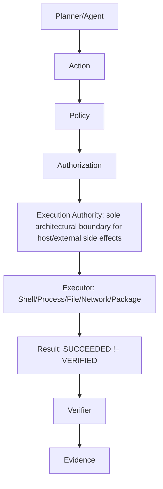
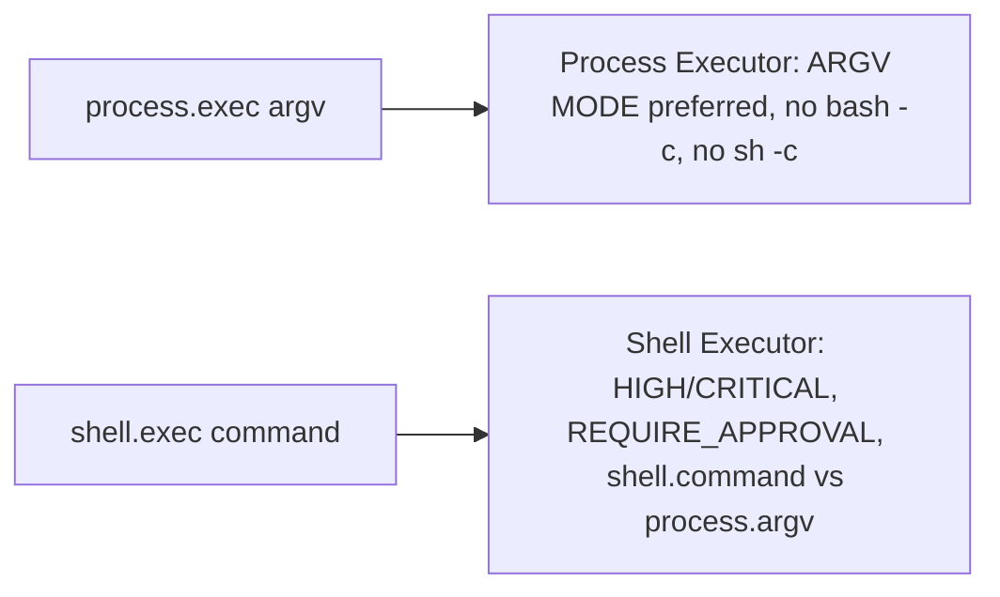
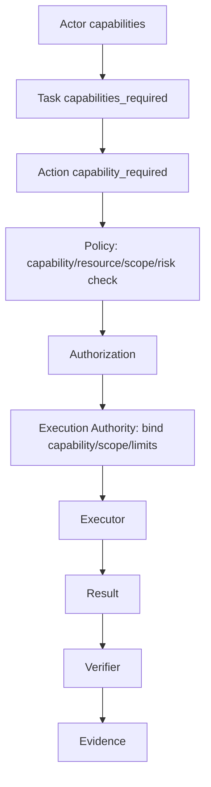

# Execution Authority Contract — P10

> **CONTRACTS ONLY — No implementation, no executor implementation, no shell framework, no process runner, no file service, no network client, no package installer, no browser, no computer-use, no Docker, no PowerShell install, no package install, no system changes, no production deployment.**
> Only contracts, schemas, state machines, invariants, ADRs, test specs, architecture documentation.
> Respects P8 Architecture Freeze and P9 Core Runtime Contracts. Any violation requires ADR.

## Purpose

Execution Authority is the **sole architectural boundary** allowed to transform:

```
AUTHORIZED ACTION → REAL SIDE EFFECT
```

Mandatory path (P8 frozen, P9 extended, P10 detailed):

```
Planner / Agent
      ↓
Action (Task/Run Contract, Action Contract)
      ↓
Policy (ALLOW/DENY/REQUIRE_APPROVAL/DRY_RUN, UNKNOWN→DENY)
      ↓
Authorization (Actor, Capability, Resource, Scope, Risk, Env, Context, Approval, Network)
      ↓
Execution Authority ← the ONLY component that owns Side Effects
      ↓
Executor (Shell, Process, File, Network, Package, future Browser, Computer, MCP, Tool, Skill, Workflow)
      ↓
Result (ExecutionResult → Result)
      ↓
Verifier (no PASS without evidence, SUCCEEDED≠VERIFIED)
      ↓
Evidence (STATUS/RESULT/EVIDENCE/NEXT, hash, provenance, attestation)
```

Without LLM→Executor direct, without Planner→Executor direct, without Agent→Executor direct, without UI→Executor direct, without MCP Server→Executor direct.

## Core Security Principle — INV-EA-01 to INV-EA-20

```
INV-EA-01: LLM cannot call an Executor directly.
INV-EA-02: Planner cannot call an Executor directly.
INV-EA-03: Agent cannot call an Executor directly.
INV-EA-04: UI cannot call an Executor directly.
INV-EA-05: MCP Server cannot call an Executor directly.
INV-EA-06: Every execution requires an Action Contract.
INV-EA-07: Every execution requires Policy Decision.
INV-EA-08: Every privileged execution requires Authorization.
INV-EA-09: Unknown Executor = BLOCKED.
INV-EA-10: Unknown Capability = DENY.
INV-EA-11: Invalid Input Schema = DENY.
INV-EA-12: Missing Evidence Requirement = BLOCKED / UNVERIFIED.
INV-EA-13: Executor cannot elevate its own capability.
INV-EA-14: Executor cannot modify Policy.
INV-EA-15: Executor cannot modify Authorization.
INV-EA-16: Verifier cannot authorize execution.
INV-EA-17: Execution success != Verification success (SUCCEEDED≠VERIFIED).
INV-EA-18: Cancellation must not orphan resources.
INV-EA-19: Timeout must terminate or quarantine execution according to policy.
INV-EA-20: Retry cannot bypass Policy/Authorization.
```

All invariants fail-closed: violation → DENY/BLOCKED/UNVERIFIED + event + audit + SECURITY EVENT if secret/injection.

## Execution Authority Boundary

### Responsibilities

- receive authorized Action (must have Action Contract, Policy Decision AUTHORIZED, Authorization AUTHORIZED, capability, resource, scope, risk, approval)
- revalidate execution contract (Action schema, ExecutionRequest schema, capability, resource, scope, risk, timeout, resource limits, input, environment, working_directory, network_policy, filesystem_policy, evidence_requirements, correlation_id, no secrets)
- bind capability (CAP_* explicit, DEFAULT DENY, UNKNOWN→DENY, capability_required must be in Capability Registry, must be subset of Task capabilities_required and actor capabilities)
- bind scope (workspace, repository, project, user, host, network, production, explicit elevation, workspace scope ≠ host scope, Agent does not get host scope merely by workspace scope, elevation needs explicit authorization)
- bind resource limits (cpu, memory, disk, process_count, file_descriptors, network, execution_time, output_size, design only enforcement in P10, but required, missing → policy-defined behavior, high-risk requires limits)
- select approved Executor (from ExecutorRegistry, must be known, unknown → BLOCKED, must match capability, risk, scope, policy_requirements, verification_requirements, status must be active)
- establish execution context (ExecutionContext: identity, capabilities, scope, cwd, environment_policy, filesystem_scope, network_scope, timeout, resource_limits, output_limits, secrets_policy, audit_context, correlation_id, workspace_root, repository_root, project_root, sandbox_level)
- enforce timeout (timeout_requested, timeout_enforced, timeout_result, statuses TIMEOUT, principle Timeout must not automatically become SUCCESS, must terminate or quarantine per policy, emit execution.timeout event, evidence)
- enforce output limits (max_output_size, truncation_policy, hash, artifact_reference, OUTPUT_LIMIT_EXCEEDED does not fail system in uninterpretable way, emits event, evidence)
- collect execution result (ExecutionResult: execution_id, status STARTED/SUCCEEDED/FAILED/BLOCKED/CANCELLED/TIMEOUT/RESOURCE_EXCEEDED/UNVERIFIED, exit_code, stdout_reference, stderr_reference, output_metadata, resource_usage, duration, started_at, completed_at, executor_id, executor_version, side_effects classification, artifacts, error, evidence_reference, correlation_id, no secrets)
- emit execution events (execution.proposed, validating, authorized, started, completed, failed, blocked, cancelled, timeout, resource_exceeded, verification_required, all with event_id, execution_id, action_id, task_id, run_id, actor, executor, capability, resource, scope, result, correlation_id, timestamp, no secrets)
- provide Result to Verifier (Result → Evidence, no PASS without evidence, SUCCEEDED≠VERIFIED, Verifier not Authorization Authority, AI not Verifier)

### Must NOT

- create authorization (Authorization is separate, from Authorization Layer, not Execution Authority)
- modify policy (Policy is separate, from Policy Engine, immutable by Execution Authority, INV-EA-14)
- infer permission from natural language (must use explicit capability, scope, approval, not LLM inference)
- grant capabilities (capabilities from Capability Registry, not granted by Executor)
- bypass Gate (Privilege Gate ops/security/privilege-gate.sh is mandatory for package install and privileged operations, no Executor can bypass)
- alter security policy (no Executor can modify security policy, no arbitrary sudo, no sudo bash/sh/env/-i/su, no /etc/sudoers modification)
- silently retry denied actions (retry cannot bypass Policy/Authorization, INV-EA-20, every retry re-does Policy validation, Authorization check, Resource allocation, Evidence)
- turn BLOCKED into success (BLOCKED must stay BLOCKED, must not become SUCCEEDED, must go through verification before VERIFIED, no auto-success)

## Execution Request Contract

File: docs/contracts/execution-authority.md (this file)

ExecutionRequest is extension of Action Contract, logical next step after Action authorized.

Schema (contract, no implementation):

```json
{
  "execution_id": "string, unique, immutable, e.g., exec-uuid, ULID",
  "version": "string, semver, e.g., '1.0.0'",
  "action_id": "string, reference to Action, must exist, must be AUTHORIZED",
  "task_id": "string, reference to Task",
  "run_id": "string, reference to Run",
  "actor": {
    "id": "string, user | agent | service | tool | mcp_server | execution_authority | system",
    "type": "user | agent | service | tool | mcp_server | execution_authority | system",
    "role": "string, role",
    "capabilities": ["CAP_* that actor has, must include capability_required"]
  },
  "executor_id": "string, e.g., 'shell-executor', 'process-executor', 'file-executor', 'network-executor', 'package-executor', must be known, unknown → BLOCKED",
  "executor_type": "shell | process | file | network | package | browser | computer | mcp | tool | skill | workflow, must match executor_id type",
  "capability_required": "string, e.g., 'CAP_FS_READ', 'CAP_FS_WRITE', 'CAP_PROCESS_EXEC', 'CAP_NETWORK_READ', 'CAP_NETWORK_CONNECT', 'CAP_PACKAGE_INSTALL', explicit, DEFAULT DENY, UNKNOWN→DENY",
  "resource": "string, e.g., file path, executable, URL, package name, must be validated, no path traversal, no ../, no /etc/sudoers, no root filesystem mutation unless explicit host scope + very strong auth + production evidence",
  "scope": "workspace | repository | project | user | host | network | production, explicit elevation, workspace scope ≠ host scope, Agent does not get host scope merely by workspace scope",
  "risk_class": "CLASS-0 | CLASS-1 | CLASS-2 | CLASS-3 | CLASS-4 | CLASS-5 | CLASS-6, from Action",
  "policy_decision": "ALLOW | DRY_RUN | REQUIRE_APPROVAL (already approved) | AUTHORIZED, must be AUTHORIZED before Execution Authority accepts, DENY/BLOCKED/UNKNOWN must not reach Execution Authority",
  "authorization": {
    "decision": "AUTHORIZED, must be AUTHORIZED",
    "actor_verified": true,
    "capability_verified": true,
    "resource_verified": true,
    "scope_verified": true,
    "approval_verified": true,
    "approval_id": "string | null, if approval required"
  },
  "approval": "AUTO | DRY_RUN | EXPLICIT_APPROVAL, must be satisfied",
  "dry_run": "boolean, true if DRY_RUN, false if real, DRY_RUN mandatory for CLASS-4..5",
  "timeout": {
    "requested": "number, seconds, requested timeout",
    "enforced": "number, seconds, enforced timeout by Execution Authority, must be bounded",
    "result": "TIMEOUT | SUCCEEDED | FAILED | null, result of timeout handling"
  },
  "resource_limits": {
    "cpu": "number | null, design only, P10 no enforcement but required, missing → policy-defined, high-risk requires limits",
    "memory": "number | null, design only",
    "disk": "number | null, design only",
    "process_count": "number | null",
    "file_descriptors": "number | null",
    "network": "boolean",
    "execution_time": "number, seconds, max execution time, must be bounded",
    "output_size": "number, max bytes, max_output_size, truncation_policy"
  },
  "input": {
    "schema": "JSON Schema, validated, no secrets, invalid → DENY",
    "data": "actual input, no secrets, validated against schema, no API keys, tokens, private keys, credentials"
  },
  "environment": {
    "policy": "ALLOWLISTED ENV only, no full environment auto-pass, must be explicit allowlist",
    "allowlist": ["PATH", "HOME", "LANG", "..., explicit allowlist, no secrets"],
    "secrets_policy": "REFERENCE ONLY, no SECRET_VALUE, no stdout/stderr/event/result/evidence logging of secret, SECRET_REFERENCE only"
  },
  "working_directory": "string, e.g., workspace_root, repository_root, project_root, must be within allowed roots, canonicalized, no path traversal, Unknown path scope → BLOCKED",
  "network_policy": {
    "mode": "allowlist | deny | unrestricted (only with CAP_NETWORK_CONNECT + explicit policy)",
    "allowed_domains": ["github.com", "..., allowlist, no random mirror"],
    "allowed_ips": ["..."],
    "allowed_ports": [443, 80, "..."],
    "protocols": ["https", "http", "..."],
    "max_bytes": "number, max payload",
    "timeout": "number, seconds",
    "audit": true
  },
  "filesystem_policy": {
    "workspace_root": "string, e.g., /home/user/linex.os, canonicalized",
    "repository_root": "string, canonicalized",
    "project_root": "string | null, canonicalized",
    "allowed_roots": ["workspace_root", "repository_root", "..., explicit, no /etc, no /etc/sudoers, no root filesystem unless explicit host scope + very strong auth"],
    "symlink_policy": "follow | no_follow | restricted, must be defined",
    "path_traversal_defense": true
  },
  "evidence_requirements": {
    "required": true,
    "hash": "SHA256 required",
    "provenance": "who/when/how required",
    "attestation": "verifier_id required, not AI",
    "no_pass_without_evidence": true,
    "succeeded_not_verified": true
  },
  "correlation_id": "string, ties execution to workflow, task, run, action, events, results, evidence, must be present",
  "idempotency_key": "string | null, for idempotency, prevents replay, especially network, package, external APIs, production",
  "sandbox_level": "0 | 1 | 2 | 3 | 4 | 5 | 6, design only, current 0 Gate, P10 no isolation implementation, only contracts allow passing sandbox_level",
  "created_at": "timestamp UTC, immutable",
  "created_by": "actor id, immutable"
}
```

Rules:

- immutable after acceptance (once Execution Authority accepts ExecutionRequest, fields immutable, no modification)
- no secrets (no API keys, tokens, private keys, credentials, no commit/print/log secrets, validated via secret-scan)
- schemas validated (input schema, resource, scope, capability, timeout, resource_limits, environment, working_directory, network_policy, filesystem_policy, evidence_requirements, correlation_id, idempotency_key, sandbox_level all validated, invalid → DENY)
- unknown field handling defined: unknown field → DENY/BLOCKED/UNVERIFIED, fail-closed UNKNOWN→DENY/BLOCKED, no silent ignore
- unknown capability denied: UNKNOWN→DENY, capability_required must be in Capability Registry, must be subset of Task capabilities_required and actor capabilities
- unknown executor blocked: unknown executor_id or executor_type → BLOCKED, must be in ExecutorRegistry, status must be active

## Execution Result Contract

ExecutionResult is extension of Result Contract, produced by Executor via Execution Authority.

Schema:

```json
{
  "execution_id": "string, reference to ExecutionRequest",
  "version": "string, semver",
  "status": "STARTED | SUCCEEDED | FAILED | BLOCKED | CANCELLED | TIMEOUT | RESOURCE_EXCEEDED | UNVERIFIED",
  "exit_code": "number | null, e.g., 0 for SUCCEEDED, non-zero for FAILED, null for BLOCKED/CANCELLED/TIMEOUT/RESOURCE_EXCEEDED",
  "stdout_reference": "string | null, reference to stdout artifact, not inline if large, with hash, no secrets, max_output_size, truncation_policy",
  "stderr_reference": "string | null, reference to stderr artifact, not inline if large, with hash, no secrets, max_output_size, truncation_policy",
  "output_metadata": {
    "stdout_size": "number, bytes",
    "stderr_size": "number, bytes",
    "stdout_hash": "string, SHA256 hash of stdout, no secrets",
    "stderr_hash": "string, SHA256 hash of stderr, no secrets",
    "truncated": "boolean, true if truncated due to max_output_size",
    "truncation_policy": "string, e.g., 'head+tail', 'head', 'hash_only'"
  },
  "resource_usage": {
    "cpu": "number, actual",
    "memory": "number, actual",
    "disk": "number, actual",
    "process_count": "number, actual",
    "file_descriptors": "number, actual",
    "network": "boolean, used?",
    "execution_time": "number, seconds, actual",
    "output_size": "number, bytes, actual"
  },
  "duration": "number, seconds, actual duration",
  "started_at": "timestamp UTC",
  "completed_at": "timestamp UTC",
  "executor_id": "string, e.g., 'shell-executor', 'process-executor', must match ExecutionRequest",
  "executor_version": "string, version of executor",
  "side_effects": {
    "classification": "READ_ONLY | NO_SIDE_EFFECT | REVERSIBLE_SIDE_EFFECT | IRREVERSIBLE_SIDE_EFFECT | EXTERNAL_SIDE_EFFECT | PRODUCTION_SIDE_EFFECT | SYSTEM_SIDE_EFFECT | DENY (destructive system operation)",
    "description": "string, what side effects occurred, e.g., 'read file', 'wrote file', 'installed package', 'network upload', 'production write', no secrets",
    "reversible": "boolean, true if reversible, false if irreversible",
    "external": "boolean, true if external side effect",
    "production": "boolean, true if production side effect, requires stronger auth"
  },
  "artifacts": ["artifact_id, list of artifacts produced, with owner, scope, hash SHA256, provenance, retention, no /tmp inside repo, no *.deb inside repo, no secrets"],
  "error": {
    "code": "string | null, e.g., 'execution.invalid_request', 'execution.policy_denied', 'execution.authorization_denied', 'execution.capability_denied', 'execution.scope_denied', 'execution.executor_unknown', 'execution.input_invalid', 'execution.timeout', 'execution.resource_exceeded', 'execution.network_blocked', 'execution.filesystem_blocked', 'execution.package_blocked', 'execution.executor_failed', 'execution.verification_failed'",
    "message": "string | null, human readable, no secrets, no stack trace with secrets",
    "details": "object | null, error details, no secrets"
  },
  "evidence_reference": "string | null, reference to Evidence, must be present for VERIFIED, no PASS without evidence",
  "correlation_id": "string, ties result to workflow, task, run, action, events, evidence"
}
```

Statuses:

- STARTED — execution started, not yet finished
- SUCCEEDED — execution succeeded, exit_code 0 or equivalent, outputs produced, but NOT YET VERIFIED, need Verifier → Evidence → VERIFIED, SUCCEEDED≠VERIFIED
- FAILED — execution failed, exit_code non-zero or equivalent, error code, message, details, no secrets, needs Evidence → VERIFIED failure
- BLOCKED — blocked by Policy/Authorization/Capability/Scope/Validation/Network/Filesystem/Package, needs Evidence → VERIFIED blocked
- CANCELLED — cancelled cooperative/timeout/explicit, no orphaned resources, needs Evidence → VERIFIED cancellation
- TIMEOUT — timeout, timeout_requested, timeout_enforced, timeout_result, principle Timeout must not automatically become SUCCESS, must terminate or quarantine per policy, emits execution.timeout event, evidence
- RESOURCE_EXCEEDED — resource limits exceeded cpu/memory/disk/process_count/fd/network/execution_time/output_size, emits execution.resource_exceeded event, evidence, does not fail system in uninterpretable way
- UNVERIFIED — result unverified, missing evidence or verifier FAIL, e.g., SUCCEEDED but no evidence → UNVERIFIED

Important: SUCCEEDED لا يعني VERIFIED. SUCCEEDED must go through verification before VERIFIED. EXECUTED≠SAFE, LOCAL≠PRODUCTION, MOCK≠PRODUCTION, no production claims without production evidence.

## Execution Context

ExecutionContext is context established by Execution Authority for Executor, includes identity, capabilities, scope, cwd, environment_policy, filesystem_scope, network_scope, timeout, resource_limits, output_limits, secrets_policy, audit_context, correlation_id, workspace_root, repository_root, project_root, sandbox_level.

Schema:

```json
{
  "identity": {
    "id": "string, actor id",
    "type": "user | agent | service | tool | mcp_server | execution_authority | system",
    "role": "string"
  },
  "capabilities": ["CAP_* that are bound for this execution, must be subset of actor capabilities and Task capabilities_required, explicit, DEFAULT DENY"],
  "scope": "workspace | repository | project | user | host | network | production, explicit elevation, workspace scope ≠ host scope",
  "cwd": "string, working directory, must be within allowed_roots, canonicalized, no path traversal",
  "environment_policy": {
    "allowlist": ["PATH", "HOME", "LANG", "..., explicit allowlist, no secrets"],
    "secrets_policy": "REFERENCE ONLY, no SECRET_VALUE, no stdout/stderr/event/result/evidence logging of secret"
  },
  "filesystem_scope": {
    "workspace_root": "string, canonicalized",
    "repository_root": "string, canonicalized",
    "project_root": "string | null, canonicalized",
    "allowed_roots": ["workspace_root", "repository_root", "..., explicit, no /etc, no /etc/sudoers, no root filesystem unless explicit host scope + very strong auth"],
    "symlink_policy": "follow | no_follow | restricted",
    "path_traversal_defense": true
  },
  "network_scope": {
    "mode": "allowlist | deny | unrestricted (only with CAP_NETWORK_CONNECT + explicit policy)",
    "allowed_domains": ["github.com", "..."],
    "allowed_ips": ["..."],
    "allowed_ports": [443, 80, "..."],
    "protocols": ["https", "http", "..."],
    "max_bytes": "number",
    "timeout": "number, seconds",
    "audit": true
  },
  "timeout": {
    "requested": "number, seconds",
    "enforced": "number, seconds, bounded"
  },
  "resource_limits": {
    "cpu": "number | null, design only",
    "memory": "number | null, design only",
    "disk": "number | null, design only",
    "process_count": "number | null",
    "file_descriptors": "number | null",
    "network": "boolean",
    "execution_time": "number, seconds",
    "output_size": "number, max bytes"
  },
  "output_limits": {
    "max_output_size": "number, bytes",
    "truncation_policy": "head+tail | head | hash_only",
    "hash": "SHA256 required for large output",
    "artifact_reference": "reference to artifact if output large"
  },
  "secrets_policy": "REFERENCE ONLY, no SECRET_VALUE, no logging",
  "audit_context": {
    "correlation_id": "string, ties to workflow",
    "causation_id": "string | null, which event caused this execution",
    "parent_execution_id": "string | null, if execution is child of another execution"
  },
  "correlation_id": "string, must be present",
  "sandbox_level": "0 | 1 | 2 | 3 | 4 | 5 | 6, design only, current 0 Gate"
}
```

Environment policy: لا تمرر Environment كاملة تلقائيا. يجب أن يكون ALLOWLISTED ENV وأي secret REFERENCE ONLY لا value logging. No stdout/stderr/event/result/evidence logging of secret.

## Executor Registry

ExecutorRegistry is registry of approved Executors, with executor_id, type, version, capabilities, risk_class, supported_platforms, input_schema, output_schema, resource_limits, sandbox_level, policy_requirements, verification_requirements, status.

Schema:

```json
{
  "executors": [
    {
      "executor_id": "string, unique, e.g., 'shell-executor', 'process-executor', 'file-executor', 'network-executor', 'package-executor'",
      "type": "shell | process | file | network | package | browser | computer | mcp | tool | skill | workflow",
      "version": "string, semver",
      "capabilities": ["CAP_* that executor can handle, e.g., CAP_PROCESS_EXEC for Shell/Process, CAP_FS_READ/WRITE for File, CAP_NETWORK_READ/CONNECT for Network, CAP_PACKAGE_INSTALL for Package"],
      "risk_class": "CLASS-0 | CLASS-1 | CLASS-2 | CLASS-3 | CLASS-4 | CLASS-5 | CLASS-6, default risk for executor type",
      "supported_platforms": ["linux", "debian12", "arena", "ci", "production", "..."],
      "input_schema": "JSON Schema, defines expected input for executor, no secrets, validated, invalid → DENY",
      "output_schema": "JSON Schema, defines expected output for executor, no secrets",
      "resource_limits": {
        "cpu": "number | null, design only",
        "memory": "number | null, design only",
        "disk": "number | null, design only",
        "process_count": "number | null",
        "file_descriptors": "number | null",
        "network": "boolean",
        "execution_time": "number, seconds",
        "output_size": "number, max bytes"
      },
      "sandbox_level": "0 | 1 | 2 | 3 | 4 | 5 | 6, design only, current 0 Gate, P10 no isolation implementation, only contracts allow passing sandbox_level",
      "policy_requirements": {
        "allowlist_required": true,
        "capability_required": true,
        "scope_required": true,
        "approval_required": "AUTO | DRY_RUN | EXPLICIT_APPROVAL | DENY",
        "dry_run_required": "boolean, true for CLASS-4..5",
        "resource_limits_required": "boolean, true for high-risk",
        "timeout_required": true
      },
      "verification_requirements": {
        "evidence_required": true,
        "hash_required": true,
        "provenance_required": true,
        "attestation_required": true,
        "no_pass_without_evidence": true
      },
      "status": "active | deprecated | blocked, unknown → BLOCKED"
    }
  ]
}
```

Unknown Executor: BLOCKED. Unknown executor_id or executor_type → BLOCKED, fail-closed, must not be executed, must emit execution.blocked event, evidence, SECURITY EVENT if injection attempt.

## Security Invariants — EA-01 to EA-20

```
EA-01: No direct Agent→Executor (Agent must go via Planner→Action→Policy→Authorization→Execution Authority→Executor)
EA-02: No direct LLM→Executor (LLM must go via Planner→Policy→Execution Authority→Executor, LLM cannot call Executor directly)
EA-03: No direct UI→Executor (UI client only, UI→API only, API→Runtime→Policy→Authorization→Execution Authority→Executor, UI cannot call Executor directly)
EA-04: Policy required (every execution requires Policy Decision AUTHORIZED, no execution without Policy)
EA-05: Authorization required for elevated operations (every privileged execution requires Authorization AUTHORIZED, host scope, network connect, package install, production, etc.)
EA-06: Capability required (every execution requires capability_required explicit, CAP_*, DEFAULT DENY, UNKNOWN→DENY)
EA-07: Scope required (every execution requires scope explicit, workspace/repository/project/user/host/network/production, explicit elevation, workspace scope ≠ host scope)
EA-08: Unknown executor blocked (unknown executor_id or executor_type → BLOCKED, fail-closed)
EA-09: Unknown capability denied (unknown capability_required → DENY, fail-closed)
EA-10: No arbitrary sudo (forbidden sudo <arbitrary command>, sudo bash, sudo sh, sudo -i, sudo su, sudo env, no Executor can bypass privilege-gate.sh, Package Executor must use Privilege Gate, privileged execution must contain SYSTEM_SUDO_POLICY, PROJECT_POLICY, CAPABILITY, AUTHORIZATION, EXECUTOR, SCOPE, APPROVAL, EVIDENCE)
EA-11: No arbitrary shell (forbidden arbitrary shell command text without Policy and explicit authorization, Shell Executor high risk, REQUIRE_APPROVAL, especially host scope, network connect, privileged operations, production, must separate shell.command vs process.argv, ARGV MODE preferred for Process Executor, no bash -c, no sh -c by default, no shell parsing by default for Process Executor)
EA-12: Dry-run required where policy says so (every Executor must support DRY_RUN if risk_class requires, CLASS-4..5 mandatory DRY_RUN, Dry-run must produce WOULD_EXECUTE but NO SIDE EFFECT and must mention executor, command/action abstraction, scope, capability, policy, authorization, resource limits, expected side effects, no expose secrets)
EA-13: Resource limits required where policy says so (ExecutionRequest must have resource_limits cpu/memory/disk/process_count/file_descriptors/network/execution_time/output_size, design only enforcement in P10, but required, missing → policy-defined behavior, high-risk requires limits)
EA-14: Timeout bounded (timeout_requested, timeout_enforced, timeout_result, statuses TIMEOUT, principle Timeout must not automatically become SUCCESS, must terminate or quarantine per policy, bounded)
EA-15: Retry bounded and reauthorized (Execution Authority does not retry automatically if Policy DENY, Authorization DENY, Capability DENY, Validation DENY, Security violation, allowed future only transient failure, but every retry re-does Policy validation, Authorization check, Resource allocation, Evidence, does not consider retry continuation of old permission without review, bounded retry count, backoff, no bypass)
EA-16: Secrets not logged (Execution Authority must never receive raw secrets unless explicitly authorized by future secret capability, origin SECRET_REFERENCE not SECRET_VALUE, no stdout logging of secret, stderr logging of secret, event payload secret, result payload secret, evidence secret, validated via secret-scan)
EA-17: Execution success != verification (SUCCEEDED لا يعني VERIFIED, SUCCEEDED must go through verification before VERIFIED, EXECUTED≠SAFE, LOCAL≠PRODUCTION, MOCK≠PRODUCTION, no production claims without production evidence, no PASS without evidence)
EA-18: Evidence required (every execution requires evidence, Evidence Store append-only immutable, no secrets, hash SHA256, provenance who/when/how, attestation verifier_id, no PASS without evidence, SUCCEEDED≠VERIFIED)
EA-19: Production side effects require stronger authorization (production side effects PRODUCTION_SIDE_EFFECT require stronger authorization, very strong auth, production evidence, no MOCK→PRODUCTION, production database write PRODUCTION_SIDE_EFFECT, network upload EXTERNAL_SIDE_EFFECT, package install SYSTEM_SIDE_EFFECT, fs.write workspace REVERSIBLE_SIDE_EFFECT, fs.read workspace READ_ONLY)
EA-20: Executor cannot modify Policy (Executor cannot elevate its own capability, cannot modify Policy, cannot modify Authorization, Verifier cannot authorize execution, hook cannot authorize, hook cannot bypass Policy, hook cannot mark VERIFIED, hook can only provide evidence/context)
```

## Privileged Execution

Any privileged execution must contain:

- SYSTEM_SUDO_POLICY (EXTERNAL / NOT CONTROLLED, e.g., NOPASSWD:ALL in Arena, but PROJECT_POLICY CONTROLLED)
- PROJECT_POLICY (CONTROLLED BY LINEX.OS, Gate allowlist, structured actions, dry-run default, --execute explicit, evidence ACTION/CLASS/POLICY/DECISION/EXECUTION/EXIT_CODE/TIMESTAMP/SYSTEM_SUDO/PROJECT_POLICY)
- CAPABILITY (CAP_* explicit, e.g., CAP_PACKAGE_INSTALL, CAP_PROCESS_EXEC, CAP_NETWORK_CONNECT, CAP_FS_WRITE host scope)
- AUTHORIZATION (AUTHORIZED, actor_verified, capability_verified, resource_verified, scope_verified, approval_verified)
- EXECUTOR (executor_id, executor_type, must be known, active)
- SCOPE (host, network, production, explicit elevation, workspace scope ≠ host scope)
- APPROVAL (EXPLICIT_APPROVAL, approval_id if required, DRY_RUN first for CLASS-4..5)
- EVIDENCE (evidence_id, hash SHA256, provenance who/when/how, attestation verifier_id, no secrets, no PASS without evidence)

Forbidden:

- sudo <arbitrary command> (no sudo with arbitrary command, must be via Gate with validated package/service names, not arbitrary)
- sudo bash, sudo sh, sudo -i, sudo su, sudo env (forbidden, must be via Gate, no sudo bash/sh/env/-i/su)
- Any Executor cannot bypass ops/security/privilege-gate.sh (Package Executor must use Privilege Gate, Package Action→Policy→Authorization→Package Executor→Privilege Gate→Package Manager→Result→Verification, no arbitrary apt, no sudo apt "$USER_INPUT")

## DRY-RUN Contract

Every Executor must support DRY_RUN if risk_class requires (CLASS-4..5 mandatory, CLASS-3 optional, CLASS-0..2 may not require but can support).

Dry-run must produce:

- WOULD_EXECUTE (not EXECUTED, shows what would be executed)
- NO SIDE EFFECT (no real side effect, no filesystem mutation, no process execution, no network connect, no package install, no browser open, no computer use)
- Must mention: executor, command/action abstraction, scope, capability, policy, authorization, resource limits, expected side effects classification READ_ONLY/REVERSIBLE/IRREVERSIBLE/EXTERNAL/PRODUCTION/SYSTEM/DENY, no expose secrets

Example DRY-RUN evidence:

```
ACTION: package.install
CLASS: CLASS-4
POLICY: ALLOW with DRY_RUN
DECISION: DRY_RUN
EXECUTION: WOULD_EXECUTE package.install powershell via Package Executor via Privilege Gate
EXIT_CODE: N/A (DRY_RUN)
TIMESTAMP: 2026-10-04T18:12:00Z
SYSTEM_SUDO: AVAILABLE_NOPASSWD (EXTERNAL)
PROJECT_POLICY: CONTROLLED (Gate allowlist, structured action, dry-run default, --execute explicit)
SCOPE: host
CAPABILITY: CAP_PACKAGE_INSTALL
AUTHORIZATION: AUTHORIZED (actor_verified, capability_verified, resource_verified, scope_verified, approval_verified)
RESOURCE_LIMITS: cpu=null, memory=null, disk=null, process_count=null, fd=null, network=false, execution_time=60, output_size=1024
EXPECTED_SIDE_EFFECTS: SYSTEM_SIDE_EFFECT (package install)
EVIDENCE: evidence_id, hash SHA256, provenance who/when/how, attestation verifier_id, no secrets
```

## Side-Effect Classification

```
READ_ONLY / NO_SIDE_EFFECT — no side effect, e.g., fs.read workspace, process.exec with read-only, network.read official allowlisted, no mutation
REVERSIBLE_SIDE_EFFECT — reversible side effect, e.g., fs.write workspace (can be reverted), fs.copy, fs.move within workspace, not host scope
IRREVERSIBLE_SIDE_EFFECT — irreversible side effect, e.g., fs.delete, fs.move to trash? Actually delete may be irreversible, fs.write host scope may be irreversible, need Policy/Approval
EXTERNAL_SIDE_EFFECT — external side effect, e.g., network.upload, network.connect, external API call, may affect external system
PRODUCTION_SIDE_EFFECT — production side effect, e.g., production database write, production API call, requires stronger authorization, very strong auth, production evidence, no MOCK→PRODUCTION
SYSTEM_SIDE_EFFECT — system side effect, e.g., package.install, package.remove (DEFERRED/RESTRICTED in P10), system configuration change, requires host scope, explicit authorization, DRY_RUN first
DENY — destructive system operation, e.g., rm -rf /, mkfs, modify /etc/sudoers, path traversal to /etc/sudoers, root filesystem mutation without explicit host scope + very strong auth, CLASS-6 FORBIDDEN → DENY always
```

Mapping to risk:

- fs.read workspace: READ_ONLY, CLASS-0, LOW, AUTO, workspace scope, File Executor, file hash/evidence
- fs.write workspace: REVERSIBLE_SIDE_EFFECT, CLASS-1, MEDIUM, AUTO with evidence, workspace scope, File Executor
- fs.delete workspace: IRREVERSIBLE_SIDE_EFFECT, CLASS-2..3, MEDIUM/HIGH, REQUIRE_APPROVAL may be required, workspace scope, File Executor
- fs.write host scope: IRREVERSIBLE_SIDE_EFFECT or SYSTEM_SIDE_EFFECT, CLASS-4..5, HIGH/CRITICAL, EXPLICIT_APPROVAL, host scope, File Executor, DRY_RUN first
- process.exec ["git","status"]: NO_SIDE_EFFECT or READ_ONLY if read-only, CLASS-2, MEDIUM, AUTO or DRY_RUN depending, workspace scope, Process Executor, ARGV MODE preferred
- shell.exec "git status && ...": IRREVERSIBLE_SIDE_EFFECT or SYSTEM_SIDE_EFFECT depending, CLASS-3..5, HIGH/CRITICAL, EXPLICIT_APPROVAL, Shell Executor, shell syntax, pipelines only if explicitly permitted, high risk, REQUIRE_APPROVAL especially host scope, network connect, privileged, production
- network.read official allowlisted: READ_ONLY, CLASS-3, LOW/MEDIUM, AUTO with allowlist check, Network Executor
- network.connect unrestricted: EXTERNAL_SIDE_EFFECT, CLASS-4..5, HIGH/CRITICAL, EXPLICIT_APPROVAL, Network Executor, allowlist + explicit policy required, unknown destination BLOCKED, no unrestricted Internet except capability + explicit policy
- network.upload: EXTERNAL_SIDE_EFFECT, CLASS-4..5, HIGH/CRITICAL, EXPLICIT_APPROVAL, Network Executor
- package.install: SYSTEM_SIDE_EFFECT, CLASS-4, HIGH, DRY_RUN + EXPLICIT, host scope, Package Executor via Privilege Gate, must use Gate, no arbitrary apt, no sudo apt "$USER_INPUT", Package Action→Policy→Authorization→Package Executor→Privilege Gate→Package Manager→Result→Verification, evidence package metadata + result + evidence
- production database write: PRODUCTION_SIDE_EFFECT, CLASS-5, CRITICAL, EXPLICIT_APPROVAL + very strong auth + production evidence, production scope, requires stronger authorization, no MOCK→PRODUCTION
- Destructive system operation rm -rf /, mkfs, modify /etc/sudoers: DENY, CLASS-6 FORBIDDEN, BLOCKED always, no execution, SECURITY EVENT

## Resource Limits

ExecutionRequest must have:

- cpu (number | null, design only, P10 no enforcement but required, missing → policy-defined behavior, high-risk requires limits)
- memory (number | null, design only)
- disk (number | null, design only)
- process_count (number | null)
- file_descriptors (number | null)
- network (boolean)
- execution_time (number, seconds, max execution time, must be bounded)
- output_size (number, max bytes, max_output_size, truncation_policy)

No enforcement in P10, but missing resource limits → policy-defined behavior, and for high-risk execution require limits (CLASS-4..5 must have resource_limits, timeout, output_size).

## Timeout

- timeout_requested (number, seconds, requested timeout, from Task/Action/ExecutionRequest)
- timeout_enforced (number, seconds, enforced timeout by Execution Authority, must be bounded, must be <= requested? Or policy may enforce smaller, but must be bounded)
- timeout_result (TIMEOUT | SUCCEEDED | FAILED | null, result of timeout handling)

Statuses: TIMEOUT

Principle: Timeout must not automatically become SUCCESS. TIMEOUT must terminate or quarantine execution according to policy, emit execution.timeout event, evidence, resource cleanup no orphaned resources, must not orphan processes/mounts/open resources/temporary privileged state unless documented RECOVERY REQUIRED, must not become SUCCEEDED automatically, must go through verification before VERIFIED.

## Cancellation

- CANCEL_REQUESTED (cancellation requested via API→Policy→Authorization→Execution Authority)
- CANCELLING (Execution Authority signalling cancellation, Executor stopping gracefully)
- CANCELLED (cancelled, no orphaned resources, evidence, verification)

Executor must not leave:

- orphaned processes (must terminate child processes, no orphaned)
- orphaned mounts (must unmount if mounted, no orphaned mounts)
- open resources (must close FD, release memory, disk, etc., no open resources)
- temporary privileged state (must drop privileges, no temporary privileged state left)

Unless documented RECOVERY REQUIRED (e.g., compensation needed, rollback, cleanup via Policy+Execution Authority, with evidence).

## Retry

Execution Authority does not retry automatically if:

- Policy DENY (no retry, must not bypass Policy)
- Authorization DENY (no retry, must not bypass Authorization)
- Capability DENY (no retry, must not bypass Capability)
- Validation DENY (no retry, invalid schema, missing fields, secrets, path traversal, command injection)
- Security violation (secret exfiltration attempt, path traversal, command injection, no retry, SECURITY EVENT)

Allowed future only transient failure (network failure, dependency failure, resource temporarily unavailable) with backoff, max_retries, but every retry re-does Policy validation, Authorization check, Resource allocation, Evidence, and does not consider retry continuation of old permission without review, bounded retry count, no bypass.

## Idempotency

- idempotency_key (string | null, for idempotency, prevents replay, especially network, package, external APIs, production, e.g., idempotency-key-uuid)

Separate same logical execution vs new execution, especially in network, package, external APIs, production, goal prevent replay, prevent double package install, double network upload, double production write.

Same idempotency_key with same input, capability, resource, scope, actor should be treated as same logical execution, not new execution, but must still re-validate Policy, Authorization, Resource allocation, Evidence, not bypass.

New execution with different idempotency_key or different input is new execution.

## Workspace Isolation

ExecutionContext must know:

- workspace_root (string, e.g., /home/user/linex.os, canonicalized)
- repository_root (string, e.g., /home/user/linex.os, canonicalized, may equal workspace_root)
- project_root (string | null, e.g., /home/user/linex.os/project, canonicalized)

And not equal workspace scope = host scope. Any elevation needs explicit authorization.

- workspace scope = workspace_root only, not host, not /etc, not /usr, not root filesystem
- repository scope = repository_root, may be same as workspace_root or parent
- project scope = project_root, if defined
- host scope = host OS, /etc, /usr, etc., requires explicit host capability + policy, even if SYSTEM_SUDO_POLICY is NOPASSWD:ALL, PROJECT_POLICY does NOT allow same, requires very strong auth, DRY_RUN first, evidence
- network scope = network, requires CAP_NETWORK_CONNECT + explicit policy, allowlist, unknown destination BLOCKED
- production scope = production DB, production API, requires CAP_* production, very strong auth, production evidence, no MOCK→PRODUCTION

## Filesystem Isolation Roadmap

Keep P8:

- Level 0: Project Gate (current, P2) — allowlist + structured actions + dry-run + evidence, no kernel sandbox, governance layer
- Level 1: Unprivileged process — Execution Authority in separate unprivileged process, not NOPASSWD:ALL
- Level 2: Filesystem isolation — chroot or mount namespace, workspace only
- Level 3: Network isolation — network namespace, allowlist domains only
- Level 4: Container / sandbox — Docker/Podman with resource limits, no privileged
- Level 5: VM / stronger isolation — VM/microVM for high-risk
- Level 6: Optional deeper OS integration — custom OS layer, modular

P10 does not implement isolation, only contracts must allow passing sandbox_level (0-6, design only, current 0 Gate) in ExecutionRequest and ExecutionContext.

## Network Policy Context

ExecutionContext contains:

- network_mode (allowlist | deny | unrestricted (only with CAP_NETWORK_CONNECT + explicit policy))
- allowed_domains (array, allowlist, e.g., github.com, no random mirror)
- allowed_ips (array)
- allowed_ports (array, e.g., 443, 80)
- protocols (array, e.g., https, http)
- max_bytes (number, max payload)
- timeout (number, seconds)
- audit (boolean, true, audit network operations)

No network policy: BLOCKED for restricted operations (network connect, network upload, network download unrestricted without allowlist + explicit policy → BLOCKED).

## Secrets

Execution Authority must never receive raw secrets unless explicitly authorized by future secret capability (CAP_SECRET_ACCESS CRITICAL).

Origin: SECRET_REFERENCE not SECRET_VALUE.

- SECRET_REFERENCE: reference to secret, e.g., secret_id, env var name, secret manager reference, not value
- SECRET_VALUE: actual secret value, e.g., API key, token, private key, password, must NOT be in ExecutionRequest, ExecutionResult, ExecutionContext, Event, Result, Evidence, logs, stdout, stderr, artifacts, unless explicitly authorized by future secret capability and even then must not be logged

No:

- stdout logging of secret
- stderr logging of secret
- event payload secret
- result payload secret
- evidence secret
- artifact secret (unless artifact is secret store with encryption, access policy, retention, deletion, but not in P10, future)

Validated via secret-scan repository-wide including tests/ and .github with smart filtering, no directory exclusion.

## Output Handling

- stdout (reference to artifact, not inline if large, with hash, no secrets, max_output_size, truncation_policy)
- stderr (reference to artifact, not inline if large, with hash, no secrets, max_output_size, truncation_policy)
- structured_output (object, structured output, e.g., JSON, with schema, no secrets, max_output_size)

With:

- max_output_size (number, bytes, max output size, from resource_limits, ExecutionContext output_limits)
- truncation_policy (head+tail | head | hash_only, e.g., head+tail keeps first N and last N lines, hash_only keeps hash only, head keeps first N)
- hash (SHA256 hash of stdout, stderr, structured_output, no secrets)
- artifact_reference (reference to artifact if output large, with owner, scope, hash, provenance, retention, no /tmp inside repo, no *.deb inside repo, no secrets)

Output larger than limit: OUTPUT_LIMIT_EXCEEDED, does not fail system in uninterpretable way, emits event execution.resource_exceeded or execution.completed with truncated flag, evidence with hash, provenance, attestation, no secrets, no auto-success.

## Executor Health

Each Executor Contract must have:

- health() → health status, e.g., active, degraded, blocked, version, capabilities, resource usage, no secrets, conceptual, no implementation P10
- capabilities() → array of CAP_* that executor can handle
- version() → version of executor
- status() → active | deprecated | blocked

But health does not grant authority. Health check does not bypass Policy, does not grant capability, does not authorize execution, only reports status.

## Executor Trust

- TRUSTED_EXECUTOR: trusted code, but still CONTROLLED / RESTRICTED BY POLICY, e.g., Shell/Process/File/Network/Package executors currently are CONTROLLED / RESTRICTED BY POLICY even if code itself trusted, because they can cause side effects, need Policy, Authorization, Capability, Scope, Approval, Evidence, no arbitrary sudo, no arbitrary shell
- RESTRICTED_EXECUTOR: restricted by policy, needs explicit approval, DRY_RUN, resource limits, etc.
- UNTRUSTED_EXECUTOR: untrusted by default, e.g., MCP/Plugin future executors, need Gateway/Sandbox, trust classification, capability mapping, input/output validation, timeout, network policy, audit, isolation, no unbounded host access, UNTRUSTED BY DEFAULT

Currently: Shell/Process/File/Network/Package all CONTROLLED / RESTRICTED BY POLICY even if Executor itself trusted code.

MCP/Plugin future executors: UNTRUSTED BY DEFAULT and need Gateway/Sandbox.

## Execution Events

Events:

- execution.proposed (ExecutionRequest proposed, not yet validating)
- execution.validating (Execution Authority validating ExecutionRequest schema, capability, resource, scope, risk, timeout, resource limits, input, environment, working_directory, network_policy, filesystem_policy, evidence_requirements, correlation_id, no secrets)
- execution.authorized (ExecutionRequest authorized, Policy AUTHORIZED, Authorization AUTHORIZED, capability verified, resource verified, scope verified, approval verified)
- execution.started (execution started, Executor selected, ExecutionContext established, timeout enforced, resource limits bound, side effects classification, DRY_RUN if required)
- execution.completed (execution completed, SUCCEEDED, Result produced, resource_usage, duration, artifacts, no secrets)
- execution.failed (execution failed, FAILED, error code, message, details, no secrets, resource_usage)
- execution.blocked (execution blocked, BLOCKED, reason policy_denied, authorization_denied, capability_denied, scope_denied, executor_unknown, input_invalid, network_blocked, filesystem_blocked, package_blocked, etc., evidence, SECURITY EVENT if injection)
- execution.cancelled (execution cancelled, CANCELLED, CANCEL_REQUESTED, CANCELLING, no orphaned resources, evidence)
- execution.timeout (execution timeout, TIMEOUT, timeout_requested, timeout_enforced, timeout_result, must terminate or quarantine per policy, no auto SUCCESS, evidence)
- execution.resource_exceeded (resource limits exceeded, RESOURCE_EXCEEDED, cpu/memory/disk/process_count/fd/network/execution_time/output_size exceeded, evidence, does not fail system in uninterpretable way)
- execution.verification_required (verification required, Result produced, needs Verifier, Evidence, no PASS without evidence, SUCCEEDED≠VERIFIED)

All with:

- event_id (unique, immutable)
- execution_id (reference)
- action_id (reference)
- task_id (reference)
- run_id (reference)
- actor (user, agent, service, tool, mcp_server, execution_authority, system)
- executor (executor_id, executor_type)
- capability (CAP_*)
- resource (file path, executable, URL, package name, no secrets, validated)
- scope (workspace, repository, project, user, host, network, production, explicit)
- result (success, failure, blocked, cancelled, timeout, resource_exceeded, verification_required)
- correlation_id (ties to workflow, task, run, action, events, results, evidence)
- timestamp (UTC, immutable)
- no secrets (no API keys, tokens, private keys, credentials, no commit/print/log secrets)

Event Bus append-only immutable, no secrets, ordering best-effort, retention policy, replay protection future, local/optional remote/replaceable, no vendor, free-first, vendor-neutral, self-hostable, local-capable, no mandatory paid API/cloud DB.

## Verification Hooks

Execution Authority must support hooks:

- before_execute (before execution, provide evidence/context, not authorize, not bypass Policy, not mark VERIFIED)
- after_execute (after execution, provide evidence/context, Result, resource_usage, artifacts, no secrets)
- on_block (on blocked, provide evidence, reason, policy decision, authorization decision, capability, resource, scope, no secrets)
- on_fail (on failed, provide evidence, error code, message, details, no secrets)
- on_cancel (on cancelled, provide evidence, no orphaned resources)
- on_timeout (on timeout, provide evidence, timeout_requested, timeout_enforced, timeout_result, no orphaned resources)
- on_resource_exceeded (on resource exceeded, provide evidence, resource limits, resource usage, no secrets)

But:

- hook cannot authorize (Authorization is separate, from Authorization Layer)
- hook cannot bypass Policy (Policy is separate, from Policy Engine)
- hook cannot mark VERIFIED (Verifier is separate, Verifier not Authorization Authority, AI not Verifier, no PASS without evidence, SUCCEEDED≠VERIFIED)
- hook can only provide evidence/context (logs, artifacts, hash, provenance, attestation, resource usage, no secrets)

## Executor Contract Matrix

See docs/contracts/executor-matrix.md for table:

Executor | Capability | Default Risk | Default Approval | Scope | DRY-RUN | Gate | Verifier

For: Shell, Process, File, Network, Package

## Action → Execution Mapping

See docs/contracts/executor-matrix.md for mapping:

Action Type → Executor → Capability → Risk → Approval → Verification

Examples:

- process.exec → Process Executor → CAP_PROCESS_EXEC → HIGH → EXPLICIT_APPROVAL → execution result + evidence (ARGV MODE preferred, no bash -c, no sh -c, no shell parsing by default)
- shell.exec → Shell Executor → CAP_PROCESS_EXEC → HIGH → EXPLICIT_APPROVAL → output + trace + evidence (shell syntax, pipelines only if explicitly permitted, high risk, REQUIRE_APPROVAL especially host scope, network connect, privileged, production, shell.command vs process.argv separated, not same)
- fs.read → File Executor → CAP_FS_READ → LOW → AUTO → file hash/evidence (READ_ONLY, workspace scope, path normalization, canonicalization, allowed roots, scope enforcement, symlink policy, path traversal defense, Unknown path scope BLOCKED, no ../, no /etc/sudoers)
- fs.write → File Executor → CAP_FS_WRITE → MEDIUM/HIGH → AUTO/EXPLICIT depending scope → file hash/evidence (REVERSIBLE_SIDE_EFFECT workspace, IRREVERSIBLE/SYSTEM_SIDE_EFFECT host scope, EXPLICIT_APPROVAL, DRY_RUN first for host)
- fs.list → File Executor → CAP_FS_READ → LOW → AUTO → list + evidence
- fs.stat → File Executor → CAP_FS_READ → LOW → AUTO → stat + evidence
- fs.copy → File Executor → CAP_FS_WRITE → MEDIUM → AUTO/EXPLICIT depending scope → evidence
- fs.move → File Executor → CAP_FS_WRITE → MEDIUM/HIGH → REQUIRE_APPROVAL for host → evidence
- fs.delete → File Executor → CAP_FS_WRITE → MEDIUM/HIGH → REQUIRE_APPROVAL → evidence, IRREVERSIBLE_SIDE_EFFECT
- network.read → Network Executor → CAP_NETWORK_READ → LOW → AUTO with allowlist check → content hash/evidence (READ_ONLY, official allowlisted)
- network.connect → Network Executor → CAP_NETWORK_CONNECT → MEDIUM/HIGH/CRITICAL → EXPLICIT_APPROVAL → connection result + evidence (EXTERNAL_SIDE_EFFECT, allowlist + explicit policy required, unknown destination BLOCKED, no unrestricted Internet except capability + explicit policy)
- network.download → Network Executor → CAP_NETWORK_READ/CONNECT → MEDIUM/HIGH → AUTO/EXPLICIT → file + evidence
- network.upload → Network Executor → CAP_NETWORK_CONNECT → HIGH/CRITICAL → EXPLICIT_APPROVAL → upload result + evidence (EXTERNAL_SIDE_EFFECT)
- package.install → Package Executor → CAP_PACKAGE_INSTALL → HIGH → DRY_RUN + EXPLICIT → package metadata + result + evidence (SYSTEM_SIDE_EFFECT, host scope, via Privilege Gate, no arbitrary apt, no sudo apt "$USER_INPUT", Package Action→Policy→Authorization→Package Executor→Privilege Gate→Package Manager→Result→Verification)
- package.remove → DEFERRED/RESTRICTED in P10, future CAP_PACKAGE_REMOVE, not allowed now without explicit ADR

## Error Model

- execution.invalid_request (invalid ExecutionRequest schema, missing fields, invalid capability, invalid resource, invalid scope, invalid timeout, invalid resource_limits, invalid input, invalid environment, invalid working_directory, invalid network_policy, invalid filesystem_policy, invalid evidence_requirements, invalid correlation_id, invalid idempotency_key, invalid sandbox_level, no secrets)
- execution.policy_denied (Policy DENY, Policy decision DENY/BLOCKED/UNKNOWN, fail-closed UNKNOWN→DENY, no retry without re-validation)
- execution.authorization_denied (Authorization DENY, Authorization decision DENIED/BLOCKED, actor not verified, capability not verified, resource not verified, scope not verified, approval not verified)
- execution.capability_denied (Capability DENY, capability_required unknown or not in Capability Registry or not subset of actor capabilities or Task capabilities_required, UNKNOWN→DENY)
- execution.scope_denied (Scope DENY, scope unknown or not allowed, workspace scope ≠ host scope, elevation needs explicit authorization, Unknown path scope BLOCKED, Unknown destination BLOCKED)
- execution.executor_unknown (Executor unknown, unknown executor_id or executor_type, not in ExecutorRegistry, status blocked/deprecated, unknown → BLOCKED)
- execution.input_invalid (Input invalid, input schema invalid, input data invalid, no secrets, path traversal, command injection, secret exfiltration attempt, invalid schema → DENY)
- execution.timeout (Timeout, timeout_requested, timeout_enforced, timeout_result TIMEOUT, must terminate or quarantine per policy, no auto SUCCESS, emits execution.timeout event, evidence)
- execution.resource_exceeded (Resource limits exceeded, cpu/memory/disk/process_count/fd/network/execution_time/output_size exceeded, emits execution.resource_exceeded event, evidence, OUTPUT_LIMIT_EXCEEDED, does not fail system in uninterpretable way)
- execution.network_blocked (Network blocked, network_policy violation, allowed_domains/ips/ports/protocols violation, unknown destination BLOCKED, no unrestricted Internet except capability + explicit policy, emits execution.blocked event, evidence)
- execution.filesystem_blocked (Filesystem blocked, filesystem_policy violation, allowed_roots violation, path traversal, symlink policy violation, Unknown path scope BLOCKED, no ../, no /etc/sudoers, no root filesystem mutation unless explicit host scope + very strong auth, emits execution.blocked event, evidence)
- execution.package_blocked (Package blocked, package policy violation, not via Privilege Gate, arbitrary apt, sudo apt "$USER_INPUT", not in allowlist, emits execution.blocked event, evidence)
- execution.executor_failed (Executor failed, execution failed, exit_code non-zero, error code, message, details, no secrets, resource_usage, emits execution.failed event, evidence)
- execution.verification_failed (Verification failed, verification failed or missing evidence, no PASS without evidence, SUCCEEDED≠VERIFIED, emits verification.failed event, evidence, UNVERIFIED)

All errors with event_id, execution_id, action_id, task_id, run_id, actor, executor, capability, resource, scope, result, correlation_id, timestamp, no secrets, evidence, SECURITY EVENT if injection/secret exfiltration.

## Invariants (P10)

- No implementation language chosen in P10, no product code, no package installation, no system changes, repository-only, only contracts/schemas/state machines/invariants/tests diagrams-as-text ASCII/Mermaid, respects P8 frozen baseline and P9 contracts, any violation requires ADR
- Execution Authority is sole architectural boundary for host/external side effects, receives authorized Action, revalidates execution contract, binds capability/scope/resource limits, selects approved Executor, establishes execution context, enforces timeout/output limits, collects execution result, emits execution events, provides Result to Verifier
- Must NOT create authorization, modify policy, infer permission from natural language, grant capabilities, bypass Gate, alter security policy, silently retry denied actions, turn BLOCKED into success
- ExecutionRequest immutable after acceptance, no secrets, schemas validated, unknown field handling defined fail-closed UNKNOWN→DENY/BLOCKED, unknown capability denied, unknown executor blocked
- ExecutionResult with status STARTED/SUCCEEDED/FAILED/BLOCKED/CANCELLED/TIMEOUT/RESOURCE_EXCEEDED/UNVERIFIED, exit_code, stdout_reference/stderr_reference/output_metadata/resource_usage/duration/started_at/completed_at/executor_id/executor_version/side_effects classification/artifacts/error/evidence_reference/correlation_id, no secrets, SUCCEEDED≠VERIFIED
- ExecutionContext with identity/capabilities/scope/cwd/environment_policy ALLOWLISTED ENV only filesystem_scope network_scope timeout resource_limits output_limits secrets_policy REFERENCE ONLY audit_context correlation_id workspace_root/repository_root/project_root sandbox_level 0-6 design only current 0 Gate, no full environment auto-pass, no SECRET_VALUE, no stdout/stderr/event/result/evidence logging of secret
- ExecutorRegistry with executor_id/type/version/capabilities/risk_class/supported_platforms/input_schema/output_schema/resource_limits/sandbox_level/policy_requirements/verification_requirements/status active/deprecated/blocked, unknown executor BLOCKED
- 5 Executor Contracts: Shell (CAP_PROCESS_EXEC HIGH/CRITICAL per scope interprets shell syntax supports pipelines only if explicitly permitted MUST NOT receive arbitrary user-generated command text without Policy and explicit authorization separate shell.command vs process.argv Shell default REQUIRE_APPROVAL especially host scope network connect privileged production), Process (preferred when no Shell semantics needed Input executable argv[] cwd environment_allowlist timeout resource_limits no bash -c no sh -c no shell parsing by default ARGV MODE preferred), File (CAP_FS_READ/CAP_FS_WRITE operations read/write/list/stat/copy/move/delete but delete/move/write host scope need Policy/Approval per risk path normalization canonicalization workspace root allowed roots scope enforcement symlink policy path traversal defense Unknown path scope BLOCKED no ../ ../../ /etc /etc/sudoers root filesystem mutation), Network (CAP_NETWORK_READ/CONNECT request/connect/download/upload must contain destination protocol port domain/IP policy allowlist scope timeout rate limit payload limit audit Unknown destination BLOCKED no unrestricted Internet except capability + explicit policy), Package (CAP_PACKAGE_INSTALL future CAP_PACKAGE_REMOVE but P10 package-remove DEFERRED/RESTRICTED must use LINEX.OS Privilege Gate no arbitrary apt no sudo apt "$USER_INPUT" path Package Action→Policy→Authorization→Package Executor→Privilege Gate→Package Manager→Result→Verification)
- Privileged execution must contain SYSTEM_SUDO_POLICY PROJECT_POLICY CAPABILITY AUTHORIZATION EXECUTOR SCOPE APPROVAL EVIDENCE and forbid sudo <arbitrary> sudo bash sudo sh sudo -i sudo su sudo env and any Executor cannot bypass privilege-gate.sh
- DRY-RUN contract every Executor must support DRY_RUN if risk_class requires CLASS-4..5 mandatory DRY_RUN must produce WOULD_EXECUTE but NO SIDE EFFECT and must mention executor command/action abstraction scope capability policy authorization resource limits expected side effects no expose secrets
- Side-effect classification READ_ONLY/NO_SIDE_EFFECT REVERSIBLE_SIDE_EFFECT IRREVERSIBLE_SIDE_EFFECT EXTERNAL_SIDE_EFFECT PRODUCTION_SIDE_EFFECT SYSTEM_SIDE_EFFECT DENY destructive system operation and mapping to risk examples fs.read workspace READ_ONLY fs.write workspace REVERSIBLE_SIDE_EFFECT package.install SYSTEM_SIDE_EFFECT network.upload EXTERNAL_SIDE_EFFECT production database write PRODUCTION_SIDE_EFFECT rm -rf / DENY CLASS-6 FORBIDDEN
- Resource limits cpu/memory/disk/process_count/file_descriptors/network/execution_time/output_size design only enforcement P10 but required missing → policy-defined behavior high-risk requires limits
- Timeout timeout_requested timeout_enforced timeout_result statuses TIMEOUT principle Timeout must not automatically become SUCCESS must terminate or quarantine per policy
- Cancellation CANCEL_REQUESTED CANCELLING CANCELLED Executor must not leave orphaned processes/mounts/open resources/temporary privileged state unless documented RECOVERY REQUIRED
- Retry Execution Authority does not retry automatically if Policy DENY Authorization DENY Capability DENY Validation DENY Security violation allowed future only transient failure but every retry re-does Policy validation Authorization check Resource allocation Evidence and does not consider retry continuation of old permission without review bounded retry
- Idempotency idempotency_key separate same logical execution vs new execution especially network package external APIs production goal prevent replay
- Workspace isolation ExecutionContext must know workspace_root repository_root project_root and not equal workspace scope = host scope any elevation needs explicit authorization
- Filesystem isolation roadmap keep P8 Level 0 Project Gate Level 1 Unprivileged process Level 2 Filesystem isolation Level 3 Network isolation Level 4 Container/sandbox Level 5 VM Level 6 Deeper OS integration P10 does not implement isolation only contracts must allow passing sandbox_level
- Network policy context ExecutionContext contains network_mode allowed_domains allowed_ips allowed_ports protocols max_bytes timeout audit No network policy BLOCKED for restricted operations
- Secrets Execution Authority must never receive raw secrets unless explicitly authorized by future secret capability origin SECRET_REFERENCE not SECRET_VALUE no stdout/stderr/event/result/evidence logging of secret
- Output handling stdout stderr structured_output with max_output_size truncation_policy hash artifact_reference Output larger than limit OUTPUT_LIMIT_EXCEEDED and does not fail system in uninterpretable way
- Executor health each Executor Contract must have health() capabilities() version() status() but health does not grant authority
- Executor trust TRUSTED_EXECUTOR RESTRICTED_EXECUTOR UNTRUSTED_EXECUTOR currently Shell/Process/File/Network/Package all CONTROLLED/RESTRICTED BY POLICY even if Executor itself trusted code MCP/Plugin future executors UNTRUSTED BY DEFAULT and need Gateway/Sandbox
- Execution events execution.proposed validating authorized started completed failed blocked cancelled timeout resource_exceeded verification_required all with event_id execution_id action_id task_id run_id actor executor capability resource scope result correlation_id timestamp no secrets Event Bus append-only immutable no secrets
- Verification hooks Execution Authority must support hooks before_execute after_execute on_block on_fail on_cancel on_timeout on_resource_exceeded but hook cannot authorize hook cannot bypass Policy hook cannot mark VERIFIED hook can only provide evidence/context
- Executor contract matrix table Executor Capability Default Risk Default Approval Scope DRY-RUN Gate Verifier for Shell Process File Network Package
- Action → Execution mapping Action Type → Executor → Capability → Risk → Approval → Verification e.g., process.exec → Process Executor → CAP_PROCESS_EXEC → HIGH → EXPLICIT_APPROVAL → execution result + evidence
- Error model execution.invalid_request execution.policy_denied execution.authorization_denied execution.capability_denied execution.scope_denied execution.executor_unknown execution.input_invalid execution.timeout execution.resource_exceeded execution.network_blocked execution.filesystem_blocked execution.package_blocked execution.executor_failed execution.verification_failed
- Security invariants EA-01 to EA-20 No direct Agent→Executor No direct LLM→Executor No direct UI→Executor Policy required Authorization required for elevated operations Capability required Scope required Unknown executor blocked Unknown capability denied No arbitrary sudo No arbitrary shell Dry-run required where policy says so Resource limits required where policy says so Timeout bounded Retry bounded and reauthorized Secrets not logged Execution success != verification Evidence required Production side effects require stronger authorization Executor cannot modify Policy
- No implementation language chosen, no product code, no package installation, no system changes, no /tmp inside repo, no *.deb inside repo, no secrets in repo, repository-only, diagrams ASCII/Mermaid, respects P8 frozen baseline and P9 contracts, any violation requires ADR, free-first vendor-neutral self-hostable local-capable no mandatory paid API/cloud DB, low-resource modes CORE/STANDARD/HEAVY respected no GPU/K8s assumed, open decisions PENDING with criteria no fill gap

## Explicit Boundary Patterns (for verification)

```
Planner / Agent → Action → Policy → Authorization → Execution Authority → Executor → Result → Verifier → Evidence
Planner / Agent -> Action -> Policy -> Authorization -> Execution Authority -> Executor -> Result -> Verifier
Action → Policy → Authorization → Execution Authority → Executor → Result → Verifier → Evidence
Action -> Policy -> Authorization -> Execution Authority -> Executor -> Result -> Verifier -> Evidence
```

Security patterns (explicit for tests):

- LLM direct executor forbidden: LLM cannot call an Executor directly (INV-EA-01)
- Planner direct executor forbidden: Planner cannot call an Executor directly (INV-EA-02)
- Agent direct executor forbidden: Agent cannot call an Executor directly (INV-EA-03)
- UI direct executor forbidden: UI cannot call an Executor directly (INV-EA-04, UI→API only)
- MCP Server direct executor forbidden: MCP Server cannot call an Executor directly (INV-EA-05)
- Forbidden LLM Executor: LLM → Executor direct is BLOCKED
- Forbidden Agent Executor: Agent → Executor direct is BLOCKED
- Forbidden UI Executor: UI → Executor direct is BLOCKED
- No direct Agent→Executor, No direct LLM→Executor, No direct UI→Executor

## Diagrams

### System Execution Flow

```
Planner / Agent
      ↓
Action (Task/Run Contract, Action Contract)
      ↓
Policy (ALLOW/DENY/REQUIRE_APPROVAL/DRY_RUN, UNKNOWN→DENY)
      ↓
Authorization (Actor, Capability, Resource, Scope, Risk, Approval)
      ↓
Execution Authority ← the ONLY component that owns Side Effects (sole architectural boundary for host/external side effects)
      ↓
Executor (Shell, Process, File, Network, Package, future Browser, Computer, MCP, Tool, Skill, Workflow)
      ↓
Result (ExecutionResult → Result, SUCCEEDED≠VERIFIED)
      ↓
Verifier (no PASS without evidence, SUCCEEDED≠VERIFIED)
      ↓
Evidence (STATUS/RESULT/EVIDENCE/NEXT, hash, provenance, attestation, no secrets)
```

Mermaid:



### Process Executor vs Shell Executor

```
process.exec(["git","status"]) → Process Executor → direct argv → no shell parsing → safer
shell.exec("git status && ...") → Shell Executor → shell syntax → pipelines → high risk → REQUIRE_APPROVAL
Shell Executor ≠ Process Executor, shell.command vs process.argv separated, ARGV MODE preferred
```

Mermaid:



### Capability/Scope Flow

```
Actor capabilities → Task capabilities_required → Action capability_required → Policy checks capability/resource/scope/risk → Authorization checks actor_verified/capability_verified/resource_verified/scope_verified → Execution Authority binds capability/scope/limits → Executor executes → Result → Verifier → Evidence
Capability required explicit CAP_*, DEFAULT DENY, UNKNOWN→DENY, Scope required workspace/repository/project/user/host/network/production explicit elevation
```

Mermaid:



## References

- docs/architecture/frozen-baseline.md (P8 freeze)
- docs/architecture/adr/0001-0006 (P8), 0007 (P9), 0008 (P10)
- docs/architecture/execution-model.md (LLM→Planner→Policy→Execution→Verifier)
- docs/architecture/security-boundaries.md (trust boundaries, Test/Policy Boundary)
- docs/architecture/capability-model.md (CAP_*)
- docs/contracts/README.md (P9 overview, Contract First)
- docs/contracts/runtime.md, task.md, action.md, event.md, result.md, lifecycle.md (P9)
- docs/contracts/executor-shell.md, executor-process.md, executor-file.md, executor-network.md, executor-package.md, executor-matrix.md, execution-lifecycle.md (P10)
- docs/agent-contract.md (AI PROPOSES→POLICY→EXECUTION→VERIFIER, evidence model)
- ops/security/privilege-gate.sh (Gate, must not be bypassed)
- AGENTS.md, ARENA.md, privilege-policy.md, security.md
