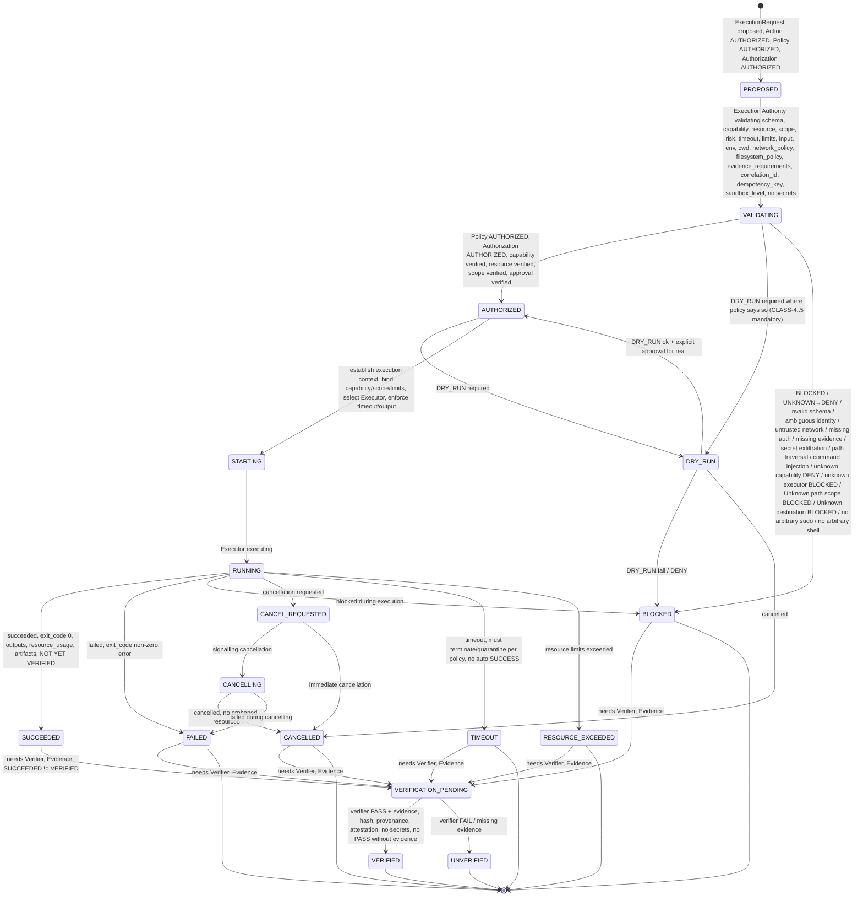
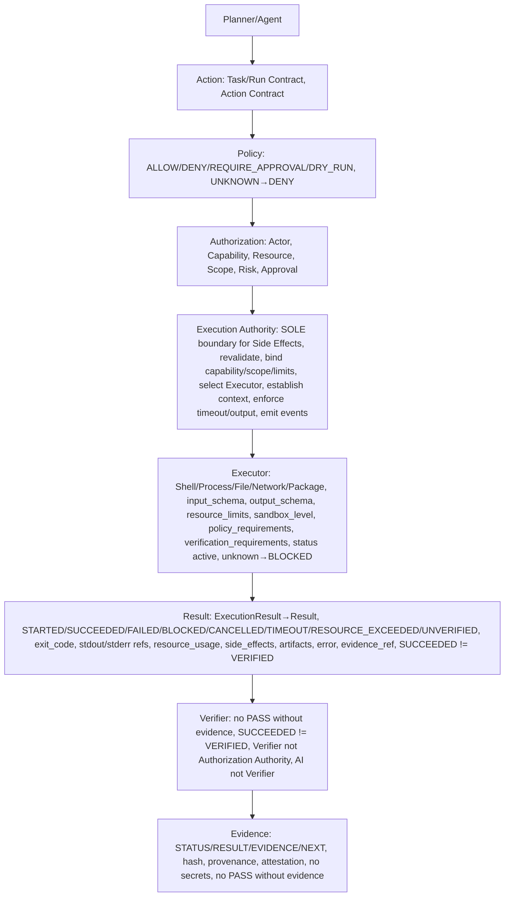
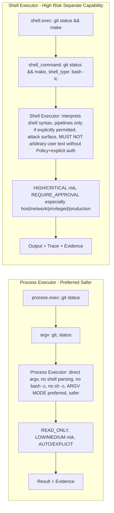
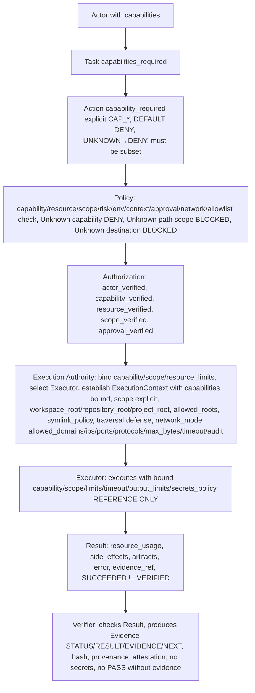

# Execution Lifecycle — State Machine — P10

> CONTRACTS ONLY — No implementation, no package install, no system changes, repository-only.
> Explicit state machine, no implicit transitions, fail-closed, SUCCEEDED≠VERIFIED.

## Purpose

Execution Lifecycle defines state machine for Execution Authority and Executors, from PROPOSED to VERIFIED/UNVERIFIED, with explicit transitions, no implicit jumps, fail-closed, policy denial → DENIED/BLOCKED path, success must go through verification before VERIFIED.

```
Action → Policy → Authorization → Execution Authority → Executor → Result → Verifier → Evidence
```

Execution Authority is sole architectural boundary for host/external side effects, receives authorized Action, revalidates execution contract, binds capability/scope/resource limits, selects approved Executor, establishes execution context, enforces timeout/output limits, collects execution result, emits execution events, provides Result to Verifier.

## States

- PROPOSED — ExecutionRequest proposed, not yet validating, Action must be AUTHORIZED, Policy AUTHORIZED, Authorization AUTHORIZED, capability, resource, scope, risk, approval verified, but Execution Authority not yet validating
- VALIDATING — Execution Authority validating ExecutionRequest schema, capability, resource, scope, risk, timeout, resource limits, input, environment, working_directory, network_policy, filesystem_policy, evidence_requirements, correlation_id, idempotency_key, sandbox_level, no secrets, schemas validated, unknown field handling fail-closed UNKNOWN→DENY/BLOCKED, unknown capability denied, unknown executor blocked
- AUTHORIZED — ExecutionRequest authorized, Policy AUTHORIZED, Authorization AUTHORIZED, capability verified, resource verified, scope verified, approval verified, ready for execution
- DRY_RUN — DRY_RUN, if risk_class requires (CLASS-4..5 mandatory), must produce WOULD_EXECUTE but NO SIDE EFFECT and must mention executor, command/action abstraction, scope, capability, policy, authorization, resource limits, expected side effects, no expose secrets, must use Privilege Gate if Package Executor, must show Gate would execute
- STARTING — STARTING, Execution Authority establishing execution context, binding capability/scope/resource limits, selecting approved Executor from ExecutorRegistry, establishing ExecutionContext (identity, capabilities, scope, cwd, environment_policy ALLOWLISTED ENV only, filesystem_scope, network_scope, timeout, resource_limits, output_limits, secrets_policy REFERENCE ONLY, audit_context, correlation_id, workspace_root, repository_root, project_root, sandbox_level), enforcing timeout/output limits
- RUNNING — RUNNING, Executor executing, e.g., Shell Executor interpreting shell syntax (pipelines only if explicitly permitted), Process Executor executing executable with argv[] (no bash -c, no sh -c, no shell parsing by default, ARGV MODE preferred), File Executor handling filesystem operations with path normalization, canonicalization, allowed roots, scope enforcement, symlink policy, path traversal defense, Network Executor handling network operations with destination, protocol, port, domain/IP policy, allowlist, scope, timeout, rate limit, payload limit, audit, Package Executor handling package operations via Privilege Gate (must not be bypassed)
- SUCCEEDED — SUCCEEDED, execution succeeded, exit_code 0 or equivalent, outputs produced, resource_usage, duration, artifacts, but NOT YET VERIFIED, need Verifier → Evidence → VERIFIED, SUCCEEDED≠VERIFIED, EXECUTED≠SAFE, LOCAL≠PRODUCTION, MOCK≠PRODUCTION, no production claims without production evidence, no PASS without evidence
- FAILED — FAILED, execution failed, exit_code non-zero or equivalent, error code execution.executor_failed, execution.timeout, execution.resource_exceeded, etc., message, details, no secrets, resource_usage, needs Evidence → VERIFIED failure
- BLOCKED — BLOCKED, blocked by Policy/Authorization/Capability/Scope/Validation/Network/Filesystem/Package, error code execution.policy_denied, execution.authorization_denied, execution.capability_denied, execution.scope_denied, execution.executor_unknown, execution.input_invalid, execution.network_blocked, execution.filesystem_blocked, execution.package_blocked, etc., needs Evidence → VERIFIED blocked, SECURITY EVENT if injection/secret exfiltration
- CANCEL_REQUESTED — CANCEL_REQUESTED, cancellation requested via API→Policy→Authorization→Execution Authority
- CANCELLING — CANCELLING, Execution Authority signalling cancellation, Executor stopping gracefully, no orphaned resources
- CANCELLED — CANCELLED, cancelled, no orphaned processes/mounts/open resources/temporary privileged state unless documented RECOVERY REQUIRED, evidence, verification, CANCELLED≠FAILED but needs verification
- TIMEOUT — TIMEOUT, timeout, timeout_requested, timeout_enforced, timeout_result TIMEOUT, must terminate or quarantine per policy, no auto SUCCESS, emits execution.timeout event, evidence, resource cleanup no orphaned resources, must not become SUCCEEDED automatically, must go through verification before VERIFIED
- RESOURCE_EXCEEDED — RESOURCE_EXCEEDED, resource limits exceeded cpu/memory/disk/process_count/fd/network/execution_time/output_size, emits execution.resource_exceeded event, evidence, OUTPUT_LIMIT_EXCEEDED, does not fail system in uninterpretable way
- VERIFICATION_PENDING — VERIFICATION_PENDING, Result produced, needs Verifier, Evidence, no PASS without evidence, SUCCEEDED≠VERIFIED
- VERIFIED — VERIFIED, result verified with evidence, Evidence with STATUS PASS/VERIFIED, RESULT summary, EVIDENCE logs/artifacts/hash/provenance/attestation/policy/execution/verification, NEXT next steps, hash SHA256, provenance who/when/how, attestation verifier_id, no secrets, no PASS without evidence
- UNVERIFIED — UNVERIFIED, result unverified, missing evidence or verifier FAIL, e.g., SUCCEEDED but no evidence → UNVERIFIED, needs Evidence

## Transitions

```
PROPOSED → VALIDATING: Execution Authority validating ExecutionRequest schema, capability, resource, scope, risk, timeout, resource limits, input, environment, working_directory, network_policy, filesystem_policy, evidence_requirements, correlation_id, idempotency_key, sandbox_level, no secrets

VALIDATING → AUTHORIZED: Policy AUTHORIZED, Authorization AUTHORIZED, capability verified, resource verified, scope verified, approval verified, ready for execution

VALIDATING → DRY_RUN: DRY_RUN required where policy says so (CLASS-4..5 mandatory), must produce WOULD_EXECUTE but NO SIDE EFFECT

VALIDATING → BLOCKED: BLOCKED / UNKNOWN→DENY / invalid schema / ambiguous identity / untrusted network / missing auth / missing evidence / secret exfiltration / path traversal / command injection / unknown capability DENY / unknown executor BLOCKED / Unknown path scope BLOCKED / Unknown destination BLOCKED / no arbitrary sudo / no arbitrary shell / etc., fail-closed, emits execution.blocked event, evidence, SECURITY EVENT if injection

AUTHORIZED → DRY_RUN: DRY_RUN required where policy says so, before real execution

AUTHORIZED → STARTING: Execution Authority establishing execution context, binding capability/scope/resource limits, selecting approved Executor, establishing ExecutionContext, enforcing timeout/output limits

DRY_RUN → AUTHORIZED: DRY_RUN ok, explicit approval for real execution, DRY_RUN produces WOULD_EXECUTE but NO SIDE EFFECT

DRY_RUN → BLOCKED: DRY_RUN shows would fail / policy DENY / capability DENY / scope DENY / etc.

DRY_RUN → CANCELLED: cancelled during DRY_RUN

STARTING → RUNNING: Executor executing, STARTING → RUNNING

RUNNING → SUCCEEDED: execution succeeded, exit_code 0, outputs produced, resource_usage, duration, artifacts, but NOT YET VERIFIED, need Verifier → Evidence → VERIFIED

RUNNING → FAILED: execution failed, exit_code non-zero, error code, message, details, no secrets, resource_usage

RUNNING → BLOCKED: blocked during execution, e.g., policy DENY during execution, capability DENY, scope DENY, network blocked, filesystem blocked, package blocked, etc.

RUNNING → CANCEL_REQUESTED: cancellation requested via API→Policy→Authorization→Execution Authority

RUNNING → TIMEOUT: timeout, timeout_requested, timeout_enforced, timeout_result TIMEOUT, must terminate or quarantine per policy, no auto SUCCESS

RUNNING → RESOURCE_EXCEEDED: resource limits exceeded, cpu/memory/disk/process_count/fd/network/execution_time/output_size exceeded

CANCEL_REQUESTED → CANCELLING: Execution Authority signalling cancellation, Executor stopping gracefully

CANCELLING → CANCELLED: cancelled, no orphaned resources, evidence, verification

CANCEL_REQUESTED → CANCELLED: immediate cancellation if possible, no orphaned resources

CANCELLING → FAILED: failed during cancelling

CANCELLED → VERIFICATION_PENDING: Result produced, needs Verifier, Evidence

SUCCEEDED → VERIFICATION_PENDING: Result produced, needs Verifier, Evidence, no PASS without evidence, SUCCEEDED≠VERIFIED

FAILED → VERIFICATION_PENDING: Result produced, needs Verifier, Evidence, verification of failure

BLOCKED → VERIFICATION_PENDING: Result produced, needs Verifier, Evidence, verification of blocked

TIMEOUT → VERIFICATION_PENDING: Result produced, needs Verifier, Evidence, verification of timeout

RESOURCE_EXCEEDED → VERIFICATION_PENDING: Result produced, needs Verifier, Evidence, verification of resource exceeded

VERIFICATION_PENDING → VERIFIED: verifier PASS with evidence, hash, provenance, attestation, no secrets, no PASS without evidence, SUCCEEDED→VERIFIED, FAILED→VERIFIED failure, BLOCKED→VERIFIED blocked, CANCELLED→VERIFIED cancellation, TIMEOUT→VERIFIED timeout, RESOURCE_EXCEEDED→VERIFIED resource exceeded

VERIFICATION_PENDING → UNVERIFIED: verifier FAIL or missing evidence, e.g., SUCCEEDED but no evidence → UNVERIFIED, missing evidence_id/timestamp/actor/correlation_id/hash/provenance/attestation → DENY/UNVERIFIED, evidence with secrets → DENY + SECURITY EVENT

Any state → CANCEL_REQUESTED: cancellation requested

Any state → BLOCKED: blocked, e.g., policy DENY during execution, capability DENY, scope DENY, etc.

Any state → FAILED: unrecoverable error

No implicit transitions, all explicit, logged as events execution.* with event_id, execution_id, action_id, task_id, run_id, actor, executor, capability, resource, scope, result, correlation_id, timestamp, no secrets.

Invalid transition → BLOCKED, unknown state → BLOCKED, policy denial → DENIED/BLOCKED path, success must go through verification before VERIFIED.

Fail-closed: unknown state → BLOCKED, invalid transition → BLOCKED + event + audit + SECURITY EVENT if injection, missing fields → DENY/BLOCKED/UNVERIFIED.
```

## Mermaid



## Combined Flow (Action → Policy → Authorization → Execution Authority → Executor → Result → Verifier → Evidence)

```
Action PROPOSED (Planner proposes Action, Task/Run Contract, Action Contract with action_id, task_id, run_id, actor, capability_required, resource, scope, risk_class, inputs/outputs schemas no secrets, execution authority/executor/timeout/resource_limits/dry_run/approval_required, policy decision, authorization decision, state, result_id, evidence_id, events, created_at, created_by, correlation_id, parent_action_id)

  ↓ action.proposed event

Action VALIDATING (Policy Engine validates capability, resource, scope, risk, env, context, approval, network, allowlist, Unknown path scope BLOCKED, Unknown destination BLOCKED, no arbitrary sudo, no arbitrary shell, no path traversal, no secret exfiltration, no command injection, no eval, no curl|bash executable, no rm -rf /, no mkfs, no /etc/sudoers modification)

  ↓ action.validated event

Action AUTHORIZED/DENIED/REQUIRE_APPROVAL/DRY_RUN/BLOCKED (Policy decision ALLOW/DENY/REQUIRE_APPROVAL/DRY_RUN/BLOCKED/UNKNOWN, fail-closed UNKNOWN→DENY, Authorization decision AUTHORIZED/DENIED/REQUIRE_APPROVAL/BLOCKED, actor_verified, capability_verified, resource_verified, scope_verified, approval_verified)

  ↓ action.authorized/denied event, execution.proposed event

ExecutionRequest PROPOSED (ExecutionRequest with execution_id, version, action_id, task_id, run_id, actor, executor_id, executor_type, capability_required, resource, scope, risk_class, policy_decision AUTHORIZED, authorization AUTHORIZED, approval, dry_run, timeout requested/enforced/result, resource_limits cpu/memory/disk/process_count/fd/network/execution_time/output_size, input schema/data no secrets, environment policy ALLOWLISTED ENV only, working_directory within allowed_roots canonicalized, network_policy mode allowed_domains allowed_ips allowed_ports protocols max_bytes timeout audit, filesystem_policy workspace_root/repository_root/project_root allowed_roots symlink_policy path_traversal_defense, evidence_requirements required hash provenance attestation no_pass_without_evidence succeeded_not_verified, correlation_id, idempotency_key, sandbox_level 0-6 design only current 0 Gate, created_at, created_by, immutable after acceptance, no secrets, schemas validated, unknown field handling fail-closed UNKNOWN→DENY/BLOCKED, unknown capability denied, unknown executor blocked)

  ↓ execution.proposed event

ExecutionRequest VALIDATING (Execution Authority validating ExecutionRequest schema, capability, resource, scope, risk, timeout, resource limits, input, environment, working_directory, network_policy, filesystem_policy, evidence_requirements, correlation_id, idempotency_key, sandbox_level, no secrets)

  ↓ execution.validating event

ExecutionRequest AUTHORIZED/DRY_RUN/BLOCKED (Policy AUTHORIZED, Authorization AUTHORIZED, capability verified, resource verified, scope verified, approval verified, or DRY_RUN required where policy says so, or BLOCKED for unknown capability DENY, unknown executor BLOCKED, Unknown path scope BLOCKED, Unknown destination BLOCKED, etc.)

  ↓ execution.authorized event, or execution.blocked event

ExecutionRequest STARTING (Execution Authority establishing execution context, binding capability/scope/resource limits, selecting approved Executor from ExecutorRegistry, establishing ExecutionContext identity/capabilities/scope/cwd/environment_policy ALLOWLISTED ENV only/filesystem_scope/network_scope/timeout/resource_limits/output_limits/secrets_policy REFERENCE ONLY/audit_context/correlation_id/workspace_root/repository_root/project_root/sandbox_level, enforcing timeout/output limits)

  ↓ execution.started event? Actually STARTING → RUNNING, execution.started event on RUNNING

Execution RUNNING (Executor executing: Shell Executor interprets shell syntax supports pipelines only if explicitly permitted has shell-specific attack surface MUST NOT receive arbitrary user-generated command text without Policy and explicit authorization separate shell.command vs process.argv Shell default REQUIRE_APPROVAL especially host scope network connect privileged production, Process Executor preferred when no Shell semantics needed Input executable argv[] cwd environment_allowlist timeout resource_limits no bash -c no sh -c no shell parsing by default ARGV MODE preferred, File Executor operations read/write/list/stat/copy/move/delete but delete/move/write host scope need Policy/Approval per risk path normalization canonicalization workspace root allowed roots scope enforcement symlink policy path traversal defense Unknown path scope BLOCKED no ../ /etc /etc/sudoers root filesystem mutation, Network Executor request/connect/download/upload must contain destination protocol port domain/IP policy allowlist scope timeout rate limit payload limit audit Unknown destination BLOCKED no unrestricted Internet except capability + explicit policy, Package Executor operation install/remove remove DEFERRED/RESTRICTED in P10 package_name package_version package_source allowlist official only no third-party no snap no unofficial mirror cwd environment_allowlist timeout resource_limits network_policy filesystem_policy evidence_requirements correlation_id idempotency_key sandbox_level privilege_gate required gate_path ops/security/privilege-gate.sh must not be bypassed dry_run_first true execute_explicit true evidence ACTION/CLASS/POLICY/DECISION/EXECUTION/EXIT_CODE/TIMESTAMP/SYSTEM_SUDO/PROJECT_POLICY required Package Action→Policy→Authorization→Package Executor→Privilege Gate→Package Manager→Result→Verification no arbitrary apt no sudo apt "$USER_INPUT")

  ↓ execution.started event

Execution SUCCEEDED/FAILED/BLOCKED/CANCELLED/TIMEOUT/RESOURCE_EXCEEDED (ExecutionResult with execution_id, status STARTED/SUCCEEDED/FAILED/BLOCKED/CANCELLED/TIMEOUT/RESOURCE_EXCEEDED/UNVERIFIED, exit_code, stdout_reference/stderr_reference/output_metadata/resource_usage/duration/started_at/completed_at/executor_id/executor_version/side_effects classification READ_ONLY/NO_SIDE_EFFECT/REVERSIBLE_SIDE_EFFECT/IRREVERSIBLE_SIDE_EFFECT/EXTERNAL_SIDE_EFFECT/PRODUCTION_SIDE_EFFECT/SYSTEM_SIDE_EFFECT/DENY/artifacts/error/evidence_reference/correlation_id, no secrets, SUCCEEDED≠VERIFIED)

  ↓ execution.completed/failed/blocked/cancelled/timeout/resource_exceeded event

Result SUCCEEDED/FAILED/BLOCKED/CANCELLED/DENIED (Result Contract from P9, result_id, action_id, task_id, run_id, status SUCCEEDED/FAILED/BLOCKED/CANCELLED/DENIED, outputs schema/data no secrets, error code/message/details no secrets, metrics duration/resource_usage, evidence_id, events, created_at, created_by, correlation_id, no secrets)

  ↓ result created

Verification STARTED (Verifier checks Result, produces Evidence, no PASS without evidence, SUCCEEDED≠VERIFIED, Verifier not Authorization Authority, AI not Verifier)

  ↓ verification.started event

Verification PASSED/FAILED (Verification PASSED with evidence, hash, provenance, attestation, or FAILED/missing evidence)

  ↓ verification.passed/failed event

Evidence CREATED (Evidence Contract from P9, evidence_id, result_id, action_id, task_id, run_id, status PASS/FAIL/BLOCKED/NOT VERIFIED/VERIFIED/UNVERIFIED, result_summary no secrets, evidence logs/artifacts/hash/provenance/attestation/policy/execution/verification, next steps, created_at, created_by verifier not AI, correlation_id, append-only immutable, no secrets, hash SHA256, provenance who/when/how, attestation verifier_id, no PASS without evidence)

  ↓ evidence.created event

Task SUCCEEDED/FAILED/CANCELLED/BLOCKED → VERIFIED/UNVERIFIED (Task State Machine from P9)

  ↓ task.completed/failed/cancelled/blocked/verified/unverified event

Learn (optional via Memory Service)

All with same correlation_id, causation_id, parent_event_id, no secrets, append-only immutable, fail-closed, SUCCEEDED≠VERIFIED, EXECUTED≠SAFE, LOCAL≠PRODUCTION, MOCK≠PRODUCTION, no production claims without production evidence.
```

## System Execution Flow Diagram

```
Planner / Agent
      ↓
Action (Task/Run Contract, Action Contract)
      ↓
Policy (ALLOW/DENY/REQUIRE_APPROVAL/DRY_RUN, UNKNOWN→DENY, capability check, resource check, scope check, risk check, network check, allowlist check)
      ↓
Authorization (Actor, Capability, Resource, Scope, Risk, Env, Context, Approval, Network)
      ↓
Execution Authority ← the ONLY component that owns Side Effects (sole architectural boundary for host/external side effects)
      ↓
Executor (Shell, Process, File, Network, Package, future Browser, Computer, MCP, Tool, Skill, Workflow)
      ↓
Result (ExecutionResult → Result, SUCCEEDED≠VERIFIED)
      ↓
Verifier (no PASS without evidence, SUCCEEDED≠VERIFIED, Verifier not Authorization Authority, AI not Verifier)
      ↓
Evidence (STATUS/RESULT/EVIDENCE/NEXT, hash, provenance, attestation, no secrets, no PASS without evidence)
```

ASCII:

```
┌──────────────┐
│ Planner/Agent│
└──────┬───────┘
       ↓
┌──────────────┐
│    Action    │  Action Contract, Task/Run Contract
└──────┬───────┘
       ↓
┌──────────────┐
│    Policy    │  ALLOW/DENY/REQUIRE_APPROVAL/DRY_RUN, UNKNOWN→DENY
└──────┬───────┘
       ↓
┌──────────────┐
│ Authorization│  Actor, Capability, Resource, Scope, Risk, Approval
└──────┬───────┘
       ↓
┌─────────────────────┐
│ Execution Authority │  ← SOLE boundary for Side Effects, revalidate, bind capability/scope/limits, select Executor, establish context, enforce timeout/output, emit events, provide Result to Verifier
└──────┬──────────────┘
       ↓
┌──────────────┐
│   Executor   │  Shell, Process, File, Network, Package, future Browser, Computer, MCP, Tool, Skill, Workflow, input_schema, output_schema, resource_limits, sandbox_level, policy_requirements, verification_requirements, status active, unknown → BLOCKED
└──────┬───────┘
       ↓
┌──────────────┐
│    Result    │  ExecutionResult → Result, STARTED/SUCCEEDED/FAILED/BLOCKED/CANCELLED/TIMEOUT/RESOURCE_EXCEEDED/UNVERIFIED, exit_code, stdout/stderr refs, resource_usage, side_effects, artifacts, error, evidence_ref, SUCCEEDED≠VERIFIED
└──────┬───────┘
       ↓
┌──────────────┐
│   Verifier   │  no PASS without evidence, SUCCEEDED≠VERIFIED, Verifier not Authorization Authority, AI not Verifier
└──────┬───────┘
       ↓
┌──────────────┐
│   Evidence   │  STATUS/RESULT/EVIDENCE/NEXT, hash, provenance, attestation, no secrets, no PASS without evidence
└──────────────┘
```

Mermaid:



## Process Executor vs Shell Executor Diagram

```
Process Executor (preferred, safer):

process.exec(["git","status"])
  ↓
Process Executor
  ↓
executable: git
argv: ["status"]
cwd: /home/user/linex.os
environment_allowlist: [PATH, HOME, LANG]
timeout: 60
resource_limits: cpu=null, memory=null, disk=null, process_count=null, fd=null, network=false, execution_time=60, output_size=1024
  ↓
direct argv, no shell parsing, no bash -c, no sh -c, no shell syntax, ARGV MODE preferred, safer, READ_ONLY, LOW/MEDIUM risk, AUTO/EXPLICIT depending scope
  ↓
Result + Evidence

Shell Executor (high risk, separate capability):

shell.exec("git status && make")
  ↓
Shell Executor
  ↓
shell_command: "git status && make"
shell_type: "bash -lc"
cwd: /home/user/linex.os
environment_allowlist: [PATH, HOME, LANG]
timeout: 60
resource_limits: ...
  ↓
interprets shell syntax, supports pipelines only if explicitly permitted, has shell-specific attack surface, MUST NOT receive arbitrary user-generated command text without Policy and explicit authorization, shell.command vs process.argv separated, Shell default REQUIRE_APPROVAL especially host scope, network connect, privileged operations, production, HIGH/CRITICAL risk
  ↓
Output + Trace + Evidence

Default: Process Executor preferred when no Shell semantics needed. Shell Executor capability separate and high risk.
```

Mermaid:



## Capability/Scope Flow Diagram

```
Capability Flow:

Actor (user, agent, service, tool, mcp_server, execution_authority, system) with capabilities [CAP_FS_READ, CAP_FS_WRITE, CAP_PROCESS_EXEC, CAP_NETWORK_READ, CAP_NETWORK_CONNECT, CAP_PACKAGE_INSTALL, ...]
  ↓
Task capabilities_required [CAP_FS_READ, ...] must be subset of actor capabilities? Actually Task defines required, Run capabilities_used must be subset of Task capabilities_required and actor capabilities
  ↓
Action capability_required explicit CAP_*, must be in Capability Registry, must be subset of Task capabilities_required and actor capabilities, DEFAULT DENY, UNKNOWN→DENY
  ↓
Policy checks capability, resource, scope, risk, env, context, approval, network, allowlist, Unknown capability DENY, Unknown path scope BLOCKED, Unknown destination BLOCKED
  ↓
Authorization checks actor_verified, capability_verified, resource_verified, scope_verified, approval_verified
  ↓
Execution Authority binds capability, scope, resource limits, selects Executor, establishes ExecutionContext with capabilities bound, scope explicit, workspace_root/repository_root/project_root, allowed_roots, symlink_policy, path_traversal_defense, network_mode allowed_domains allowed_ips allowed_ports protocols max_bytes timeout audit
  ↓
Executor executes with bound capability, scope, resource limits, timeout, output limits, secrets_policy REFERENCE ONLY, no SECRET_VALUE, no logging of secret
  ↓
Result with resource_usage, side_effects classification, artifacts, error, evidence_reference
  ↓
Verifier checks Result, produces Evidence with STATUS/RESULT/EVIDENCE/NEXT, hash, provenance, attestation, no secrets, no PASS without evidence, SUCCEEDED≠VERIFIED
```

Mermaid:



## Invariants

- No implementation language chosen in P10, no product code, no package installation, no system changes, repository-only, only contracts/schemas/state machines/invariants/tests diagrams-as-text ASCII/Mermaid, respects P8 frozen baseline and P9 contracts, any violation requires ADR
- Execution Lifecycle state machine explicit no implicit transitions fail-closed invalid transition → BLOCKED unknown state → BLOCKED policy denial → DENIED/BLOCKED path success must go through verification before VERIFIED
- States PROPOSED/VALIDATING/AUTHORIZED/DRY_RUN/STARTING/RUNNING/SUCCEEDED/FAILED/BLOCKED/CANCEL_REQUESTED/CANCELLING/CANCELLED/TIMEOUT/RESOURCE_EXCEEDED/VERIFICATION_PENDING/VERIFIED/UNVERIFIED
- Transitions explicit as defined, no implicit jumps, all logged as events execution.* with event_id execution_id action_id task_id run_id actor executor capability resource scope result correlation_id timestamp no secrets, invalid transition → BLOCKED + event + audit + SECURITY EVENT if injection, unknown state → BLOCKED, fail-closed UNKNOWN→DENY/BLOCKED
- Combined flow Action→Policy→Authorization→Execution Authority→Executor→Result→Verifier→Evidence with same correlation_id causation_id parent_event_id no secrets append-only immutable fail-closed SUCCEEDED≠VERIFIED EXECUTED≠SAFE LOCAL≠PRODUCTION MOCK≠PRODUCTION no production claims without production evidence
- System Execution Flow diagram ASCII + Mermaid Action→Policy→Authorization→Execution Authority→Executor→Result→Verifier→Evidence
- Process Executor vs Shell Executor diagram ASCII + Mermaid showing direct argv vs shell syntax, ARGV MODE preferred, Shell high risk separate capability
- Capability/Scope flow diagram ASCII + Mermaid showing Actor capabilities → Task capabilities_required → Action capability_required → Policy checks → Authorization checks → Execution Authority binds capability/scope/limits → Executor executes → Result → Verifier → Evidence
- Diagrams ASCII/Mermaid for System Execution Flow, Process vs Shell, Capability/Scope flow
- Respects P8 frozen baseline and P9 contracts, no violation without ADR, free-first vendor-neutral self-hostable local-capable no mandatory paid API/cloud DB, low-resource modes CORE/STANDARD/HEAVY respected no GPU/K8s assumed, open decisions PENDING with criteria no fill gap

## References

- docs/contracts/execution-authority.md (Execution Authority, ExecutionRequest, ExecutionResult, ExecutionContext, ExecutorRegistry, security invariants, etc.)
- docs/contracts/executor-shell.md, executor-process.md, executor-file.md, executor-network.md, executor-package.md, executor-matrix.md (5 executor contracts + matrix)
- docs/contracts/runtime.md, task.md, action.md, event.md, result.md, lifecycle.md (P9)
- docs/architecture/frozen-baseline.md (P8 freeze)
- docs/architecture/adr/0007-core-runtime-contracts.md (P9), 0008-execution-authority-contract.md (P10)
```

