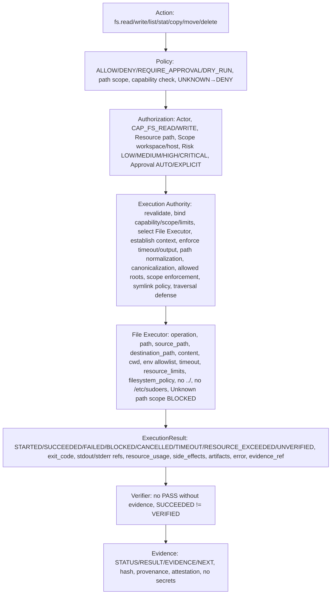

# File Executor Contract — P10

> CONTRACTS ONLY — No implementation, no file service implementation, no package install, no system changes, repository-only.

## Purpose

File Executor handles filesystem operations: read, write, list, stat, copy, move, delete, with capabilities CAP_FS_READ, CAP_FS_WRITE, path normalization, canonicalization, workspace root, allowed roots, scope enforcement, symlink policy, path traversal defense, Unknown path scope BLOCKED, no ../, no /etc/sudoers, no root filesystem mutation.

```
fs.read("/path") → File Executor → CAP_FS_READ → LOW → AUTO → file hash/evidence, READ_ONLY
fs.write("/path") → File Executor → CAP_FS_WRITE → MEDIUM/HIGH → AUTO/EXPLICIT depending scope → file hash/evidence, REVERSIBLE_SIDE_EFFECT workspace, IRREVERSIBLE/SYSTEM_SIDE_EFFECT host scope
```

## Capabilities

- CAP_FS_READ (LOW, AUTO, workspace scope, File Executor, READ_ONLY)
- CAP_FS_WRITE (MEDIUM/HIGH, AUTO for workspace, EXPLICIT for host, File Executor, REVERSIBLE_SIDE_EFFECT workspace, IRREVERSIBLE/SYSTEM_SIDE_EFFECT host scope, delete/move/write host scope need Policy/Approval per risk)

## Risk

- LOW for fs.read workspace, fs.list workspace, fs.stat workspace (READ_ONLY, no mutation)
- MEDIUM for fs.write workspace, fs.copy workspace, fs.move within workspace (REVERSIBLE_SIDE_EFFECT, can be reverted)
- MEDIUM/HIGH for fs.delete workspace, fs.move host scope, fs.write host scope (IRREVERSIBLE_SIDE_EFFECT or SYSTEM_SIDE_EFFECT, may be irreversible, need Policy/Approval)
- HIGH/CRITICAL for fs.write host scope /etc, /etc/sudoers, root filesystem mutation, fs.delete host scope, etc. → DENY CLASS-6 FORBIDDEN or REQUIRE_APPROVAL with very strong auth + production evidence + DRY_RUN first
- Risk depends on operation, path, scope, etc.

## Operations

- read — read file, CAP_FS_READ, LOW, AUTO, workspace scope, READ_ONLY, path normalization, canonicalization, allowed roots, scope enforcement, symlink policy, path traversal defense, Unknown path scope BLOCKED, no ../, no /etc/sudoers
- write — write file, CAP_FS_WRITE, MEDIUM/HIGH, AUTO for workspace, EXPLICIT for host, REVERSIBLE_SIDE_EFFECT workspace, IRREVERSIBLE/SYSTEM_SIDE_EFFECT host scope, path normalization, canonicalization, allowed roots, scope enforcement, symlink policy, path traversal defense, Unknown path scope BLOCKED, no ../, no /etc/sudoers, no root filesystem mutation unless explicit host scope + very strong auth
- list — list directory, CAP_FS_READ, LOW, AUTO, workspace scope, READ_ONLY, path normalization, canonicalization, allowed roots, scope enforcement, symlink policy, path traversal defense
- stat — stat file, CAP_FS_READ, LOW, AUTO, workspace scope, READ_ONLY
- copy — copy file, CAP_FS_WRITE (and CAP_FS_READ for source), MEDIUM, AUTO for workspace, EXPLICIT for host, REVERSIBLE_SIDE_EFFECT workspace, IRREVERSIBLE/SYSTEM_SIDE_EFFECT host scope
- move — move file, CAP_FS_WRITE, MEDIUM/HIGH, REQUIRE_APPROVAL for host, REVERSIBLE_SIDE_EFFECT workspace (can be reverted), IRREVERSIBLE_SIDE_EFFECT host scope
- delete — delete file, CAP_FS_WRITE, MEDIUM/HIGH, REQUIRE_APPROVAL, IRREVERSIBLE_SIDE_EFFECT, need Policy/Approval per risk, path normalization, canonicalization, allowed roots, scope enforcement, symlink policy, path traversal defense, Unknown path scope BLOCKED, no ../, no /etc/sudoers, no root filesystem mutation

But delete/move/write host scope need Policy/Approval per risk.

## Input Schema

```json
{
  "operation": "read | write | list | stat | copy | move | delete, must be known, unknown → BLOCKED",
  "path": "string, e.g., '/home/user/linex.os/README.md', must be validated, path normalization, canonicalization, workspace root, allowed roots, scope enforcement, symlink policy, path traversal defense, Unknown path scope → BLOCKED, no ../, no ../../, no /etc, no /etc/sudoers, no root filesystem mutation unless explicit host scope + very strong auth + production evidence + DRY_RUN first, no secrets, no path traversal",
  "source_path": "string | null, for copy/move, source path, must be validated, same rules as path",
  "destination_path": "string | null, for copy/move, destination path, must be validated, same rules as path",
  "content": "string | null, for write, content to write, no secrets, validated, no secret exfiltration, no path traversal, no command injection, no eval, no curl|bash executable",
  "cwd": "string, working directory, must be within allowed_roots, canonicalized, no path traversal, Unknown path scope → BLOCKED",
  "environment_allowlist": ["string, explicit allowlist of env vars, e.g., ['PATH','HOME','LANG'], no full environment auto-pass, no secrets, SECRET_REFERENCE only"],
  "timeout": {
    "requested": "number, seconds",
    "enforced": "number, seconds, bounded"
  },
  "resource_limits": {
    "cpu": "number | null, design only",
    "memory": "number | null, design only",
    "disk": "number | null, design only",
    "process_count": "number | null",
    "file_descriptors": "number | null",
    "network": "boolean",
    "execution_time": "number, seconds",
    "output_size": "number, max bytes"
  },
  "input": {
    "schema": "JSON Schema, validated, no secrets, invalid → DENY",
    "data": "actual input, no secrets"
  },
  "working_directory": "string, alias for cwd, must be within allowed_roots",
  "network_policy": {
    "mode": "allowlist | deny | unrestricted (only with CAP_NETWORK_CONNECT + explicit policy)",
    "allowed_domains": ["..."],
    "allowed_ips": ["..."],
    "allowed_ports": [443, 80, "..."],
    "protocols": ["https", "http", "..."],
    "max_bytes": "number",
    "timeout": "number, seconds",
    "audit": true
  },
  "filesystem_policy": {
    "workspace_root": "string, canonicalized, e.g., /home/user/linex.os",
    "repository_root": "string, canonicalized",
    "project_root": "string | null, canonicalized",
    "allowed_roots": ["workspace_root", "repository_root", "..., explicit, no /etc, no /etc/sudoers, no root filesystem unless explicit host scope + very strong auth"],
    "symlink_policy": "follow | no_follow | restricted, must be defined",
    "path_traversal_defense": true
  },
  "evidence_requirements": {
    "required": true,
    "hash": "SHA256 required",
    "provenance": "who/when/how required",
    "attestation": "verifier_id required, not AI",
    "no_pass_without_evidence": true,
    "succeeded_not_verified": true
  },
  "correlation_id": "string, must be present",
  "idempotency_key": "string | null, for idempotency, prevents replay",
  "sandbox_level": "0 | 1 | 2 | 3 | 4 | 5 | 6, design only, current 0 Gate"
}
```

Rules:

- Path normalization, canonicalization, workspace root, allowed roots, scope enforcement, symlink policy, path traversal defense, Unknown path scope BLOCKED, no ../, no ../../, no /etc, no /etc/sudoers, no root filesystem mutation unless explicit host scope + very strong auth + production evidence + DRY_RUN first
- Source_path and destination_path for copy/move must be validated same rules as path
- Content for write must be validated, no secrets, no secret exfiltration, no path traversal, no command injection, no eval, no curl|bash executable, no secrets
- Cwd must be within allowed_roots, canonicalized, no path traversal, Unknown path scope → BLOCKED
- Environment allowlist only, no full environment auto-pass, no secrets, SECRET_REFERENCE only
- Timeout bounded, must terminate or quarantine per policy, no auto SUCCESS
- Resource limits design only P10 but required, missing → policy-defined, high-risk requires limits
- Input schema validated, invalid → DENY, no secrets
- Network policy must contain destination, protocol, port, domain/IP policy, allowlist, scope, timeout, rate limit, payload limit, audit, Unknown destination BLOCKED, no unrestricted Internet except capability + explicit policy (for File Executor network may not be needed, but if file operation involves network, e.g., copy from network, must have network policy)
- Filesystem policy must contain workspace_root, repository_root, project_root, allowed_roots, symlink_policy, path traversal defense, Unknown path scope BLOCKED
- Evidence requirements required, hash SHA256, provenance who/when/how, attestation verifier_id, no_pass_without_evidence, succeeded_not_verified
- Correlation_id must be present, idempotency_key for idempotency, sandbox_level 0-6 design only current 0 Gate

## Output Schema

```json
{
  "execution_id": "string, reference",
  "status": "STARTED | SUCCEEDED | FAILED | BLOCKED | CANCELLED | TIMEOUT | RESOURCE_EXCEEDED | UNVERIFIED",
  "exit_code": "number | null, 0 for SUCCEEDED, non-zero for FAILED, null for BLOCKED/CANCELLED/TIMEOUT/RESOURCE_EXCEEDED",
  "stdout_reference": "string | null, reference to stdout artifact, e.g., file content hash, not inline if large, with hash, no secrets, max_output_size, truncation_policy",
  "stderr_reference": "string | null, reference to stderr artifact, not inline if large, with hash, no secrets",
  "output_metadata": {
    "stdout_size": "number, bytes",
    "stderr_size": "number, bytes",
    "stdout_hash": "string, SHA256 hash, no secrets",
    "stderr_hash": "string, SHA256 hash, no secrets",
    "truncated": "boolean",
    "truncation_policy": "head+tail | head | hash_only"
  },
  "resource_usage": {
    "cpu": "number, actual",
    "memory": "number, actual",
    "disk": "number, actual",
    "process_count": "number, actual",
    "file_descriptors": "number, actual",
    "network": "boolean, used?",
    "execution_time": "number, seconds, actual",
    "output_size": "number, bytes, actual"
  },
  "duration": "number, seconds, actual",
  "started_at": "timestamp UTC",
  "completed_at": "timestamp UTC",
  "executor_id": "string, 'file-executor'",
  "executor_version": "string, version",
  "side_effects": {
    "classification": "READ_ONLY | NO_SIDE_EFFECT | REVERSIBLE_SIDE_EFFECT | IRREVERSIBLE_SIDE_EFFECT | EXTERNAL_SIDE_EFFECT | PRODUCTION_SIDE_EFFECT | SYSTEM_SIDE_EFFECT | DENY",
    "description": "string, e.g., 'read file', 'wrote file', no secrets",
    "reversible": "boolean",
    "external": "boolean",
    "production": "boolean"
  },
  "artifacts": ["artifact_id, list of artifacts, e.g., file read, file written, with owner, scope, hash SHA256, provenance, retention, no /tmp inside repo, no *.deb inside repo, no secrets"],
  "error": {
    "code": "string | null, e.g., 'execution.filesystem_blocked', 'execution.input_invalid', etc.",
    "message": "string | null, human readable, no secrets",
    "details": "object | null, error details, no secrets"
  },
  "evidence_reference": "string | null, reference to Evidence, must be present for VERIFIED, no PASS without evidence",
  "correlation_id": "string"
}
```

## Execution Context

See execution-authority.md.

## DRY-RUN

File Executor must support DRY_RUN if risk_class requires (CLASS-4..5 mandatory, delete/move/write host scope).

DRY-RUN must produce WOULD_EXECUTE but NO SIDE EFFECT and must mention executor, command/action abstraction (operation, path, source_path, destination_path, content hash), scope, capability, policy, authorization, resource limits, expected side effects, no expose secrets.

Example:

```
ACTION: fs.write
CLASS: CLASS-4 (host scope)
POLICY: ALLOW with DRY_RUN + EXPLICIT_APPROVAL
DECISION: DRY_RUN
EXECUTION: WOULD_EXECUTE fs.write path=/etc/hosts content_hash=abc123 via File Executor
EXIT_CODE: N/A (DRY_RUN)
TIMESTAMP: 2026-10-04T18:12:00Z
SYSTEM_SUDO: AVAILABLE_NOPASSWD (EXTERNAL)
PROJECT_POLICY: CONTROLLED
SCOPE: host
CAPABILITY: CAP_FS_WRITE
AUTHORIZATION: AUTHORIZED
RESOURCE_LIMITS: ...
EXPECTED_SIDE_EFFECTS: SYSTEM_SIDE_EFFECT (write host file)
EVIDENCE: evidence_id, hash SHA256, provenance, attestation, no secrets
```

## Side-Effect Classification

- fs.read workspace: READ_ONLY, CLASS-0, LOW, AUTO, workspace scope, File Executor, file hash/evidence
- fs.write workspace: REVERSIBLE_SIDE_EFFECT, CLASS-1, MEDIUM, AUTO with evidence, workspace scope, File Executor
- fs.list workspace: READ_ONLY, CLASS-0, LOW, AUTO
- fs.stat workspace: READ_ONLY, CLASS-0, LOW, AUTO
- fs.copy workspace: REVERSIBLE_SIDE_EFFECT, CLASS-1, MEDIUM, AUTO
- fs.move workspace: REVERSIBLE_SIDE_EFFECT (can be reverted), CLASS-1..2, MEDIUM, AUTO
- fs.move host scope: IRREVERSIBLE_SIDE_EFFECT or SYSTEM_SIDE_EFFECT, CLASS-4..5, HIGH/CRITICAL, EXPLICIT_APPROVAL, DRY_RUN first
- fs.delete workspace: IRREVERSIBLE_SIDE_EFFECT, CLASS-2..3, MEDIUM/HIGH, REQUIRE_APPROVAL may be required
- fs.write host scope /etc/hosts: SYSTEM_SIDE_EFFECT, CLASS-4..5, HIGH/CRITICAL, EXPLICIT_APPROVAL, DRY_RUN first, host scope
- fs.write /etc/sudoers: DENY, CLASS-6 FORBIDDEN, BLOCKED always, no execution, SECURITY EVENT

## Resource Limits, Timeout, Cancellation, Retry, Idempotency, Workspace Isolation, Filesystem Isolation Roadmap, Network Policy, Secrets, Output Handling, Health, Trust, Events, Verification Hooks, Matrix, Mapping, Error Model, Security Invariants

See execution-authority.md and executor-matrix.md.

## Diagrams

```
File Executor Flow:

Action (fs.read, fs.write, etc.)
  ↓
Policy (ALLOW/DENY/REQUIRE_APPROVAL/DRY_RUN, UNKNOWN→DENY, path scope check, capability check)
  ↓
Authorization (Actor, Capability CAP_FS_READ/CAP_FS_WRITE, Resource path, Scope workspace/host, Risk LOW/MEDIUM/HIGH/CRITICAL, Approval AUTO/EXPLICIT_APPROVAL)
  ↓
Execution Authority (revalidate contract, bind capability/scope/resource limits, select File Executor, establish ExecutionContext, enforce timeout/output limits, path normalization, canonicalization, allowed roots, scope enforcement, symlink policy, path traversal defense)
  ↓
File Executor (operation, path, source_path, destination_path, content, cwd, environment_allowlist, timeout, resource_limits, filesystem_policy, etc., no ../, no /etc/sudoers, Unknown path scope BLOCKED)
  ↓
Result (ExecutionResult STARTED/SUCCEEDED/FAILED/BLOCKED/CANCELLED/TIMEOUT/RESOURCE_EXCEEDED/UNVERIFIED, exit_code, stdout_reference/stderr_reference/output_metadata/resource_usage/duration/started_at/completed_at/executor_id/executor_version/side_effects/artifacts/error/evidence_reference/correlation_id, no secrets, SUCCEEDED≠VERIFIED)
  ↓
Verifier (no PASS without evidence, SUCCEEDED≠VERIFIED)
  ↓
Evidence (STATUS/RESULT/EVIDENCE/NEXT, hash, provenance, attestation, no secrets)
```

Mermaid:



```
Path Traversal Defense:

Input path: "../../etc/passwd" → canonicalization → outside allowed_roots → BLOCKED → execution.filesystem_blocked → SECURITY EVENT

Input path: "/etc/sudoers" → allowed_roots check → not in allowed_roots (workspace_root, repository_root only) → BLOCKED → execution.filesystem_blocked → SECURITY EVENT, CLASS-6 FORBIDDEN DENY

Input path: "/home/user/linex.os/README.md" → canonicalization → inside workspace_root → allowed → Policy check → Capability CAP_FS_READ → LOW → AUTO → File Executor → read → hash → evidence

Input path: "/home/user/linex.os/../.ssh/id_rsa" → canonicalization → /home/user/.ssh/id_rsa → outside allowed_roots → BLOCKED

Symlink: /home/user/linex.os/link → points to /etc/passwd → symlink_policy no_follow or restricted → BLOCKED or canonicalized target outside allowed_roots → BLOCKED
```

## May Do / Must Never Do

May Do: Define File Executor Contract with operation, path, source_path, destination_path, content, cwd, environment_allowlist, timeout, resource_limits, input, working_directory, network_policy, filesystem_policy, evidence_requirements, correlation_id, idempotency_key, sandbox_level, no secrets, schemas validated, unknown field handling fail-closed UNKNOWN→DENY/BLOCKED, unknown capability denied, unknown executor blocked, path normalization, canonicalization, workspace root, allowed roots, scope enforcement, symlink policy, path traversal defense, Unknown path scope BLOCKED, no ../, no /etc/sudoers, no root filesystem mutation unless explicit host scope + very strong auth, execute via File Executor only after Policy AUTHORIZED, Authorization AUTHORIZED, capability, resource, scope, risk, approval verified, resource limits bound, timeout enforced, ExecutionContext established, support DRY_RUN if risk_class requires, produce WOULD_EXECUTE but NO SIDE EFFECT, mention executor, command/action abstraction, scope, capability, policy, authorization, resource limits, expected side effects, no expose secrets, classify side effects READ_ONLY/REVERSIBLE/IRREVERSIBLE/EXTERNAL/PRODUCTION/SYSTEM/DENY and map to risk, enforce resource limits design only P10 but required, timeout bounded, cancellation no orphaned resources, retry bounded and reauthorized, idempotency prevents replay, know workspace_root/repository_root/project_root, workspace scope ≠ host scope, elevation needs explicit authorization, filesystem isolation roadmap Level 0-6 design only, network policy context, secrets REFERENCE ONLY no logging, output handling with max_output_size truncation_policy hash artifact_reference, health() capabilities() version() status() but health does not grant authority, trust CONTROLLED/RESTRICTED BY POLICY even if trusted code, emit execution events with event_id execution_id action_id task_id run_id actor executor capability resource scope result correlation_id timestamp no secrets, support verification hooks before_execute/after_execute/on_block/on_fail/on_cancel/on_timeout/on_resource_exceeded but hook cannot authorize/bypass Policy/mark VERIFIED only provide evidence/context, support executor contract matrix and Action→Execution mapping and error model and security invariants.

Must Never Do: Choose implementation language, implement file service (no product code), install packages, modify system, commit/print/log secrets, create /tmp inside repo, *.deb inside repo, allow LLM→Executor direct, Planner→Executor direct, Agent→Executor direct, UI→Executor direct, MCP Server→Executor direct, bypass Policy, allow unknown capability/tool/executor, allow missing auth, allow missing evidence as PASS, implicit state jumps, auto-success, SUCCEEDED=VERIFIED, LOCAL=PRODUCTION, MOCK=PRODUCTION, events with secrets, mutable events, no event_id/timestamp/actor/correlation_id, evidence without STATUS/RESULT/EVIDENCE/NEXT, PASS without evidence, arbitrary sudo, arbitrary shell, path traversal, ../, ../../, /etc, /etc/sudoers, root filesystem mutation without explicit host scope + very strong auth + production evidence + DRY_RUN first, symlink bypass, secret exfiltration, command injection, eval, curl|bash executable, rm -rf /, retry on Policy DENY/Authorization DENY/Capability DENY/Validation DENY/Security violation, orphaned resources on cancellation, auto-success on recovery, choose vendor for storage, require paid API/cloud DB, require GPU/K8s, violate P8 frozen baseline without ADR, violate P9 contracts without ADR.

## References

Same as Process Executor.

