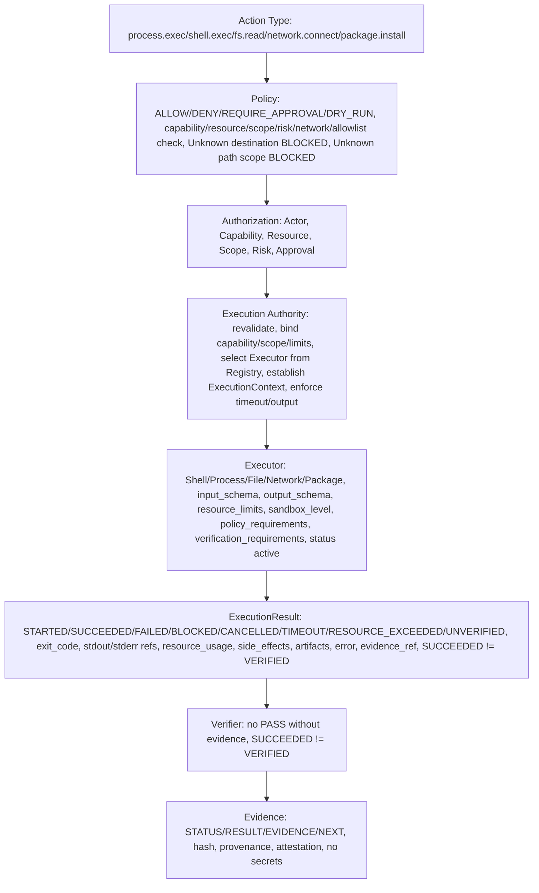

# Executor Contract Matrix — P10

> CONTRACTS ONLY — No implementation, no package install, no system changes, repository-only.

## Purpose

Executor Contract Matrix defines table Executor, Capability, Default Risk, Default Approval, Scope, DRY-RUN, Gate, Verifier for Shell, Process, File, Network, Package, and Action → Execution mapping Action Type → Executor → Capability → Risk → Approval → Verification.

## Executor Contract Matrix

| Executor | Capability | Default Risk | Default Approval | Scope | DRY-RUN | Gate | Verifier |
|----------|------------|--------------|------------------|-------|---------|------|----------|
| Shell Executor | CAP_PROCESS_EXEC (also CAP_FS_READ/WRITE, CAP_NETWORK_READ/CONNECT depending on shell command) | HIGH / CRITICAL (per scope, host/network/production/privileged) | REQUIRE_APPROVAL (especially host scope, network connect, privileged, production) | workspace (default) / host (explicit + very strong auth + DRY_RUN first + production evidence) / network (explicit + allowlist + policy) / production (very strong auth + production evidence, no MOCK→PRODUCTION) | Required for CLASS-4..5, optional for CLASS-3, Shell high risk, must support DRY_RUN, produce WOULD_EXECUTE but NO SIDE EFFECT, mention executor, command abstraction, scope, capability, policy, authorization, resource limits, expected side effects, no secrets | No (Shell Executor does not use Privilege Gate directly, but if shell command does package install, must go via Package Executor via Gate, no arbitrary apt, no bypass) | Execution result + evidence (STATUS/RESULT/EVIDENCE/NEXT, hash, provenance, attestation, no secrets, no PASS without evidence, SUCCEEDED≠VERIFIED) + output + trace + resource_usage + side_effects |
| Process Executor | CAP_PROCESS_EXEC (also CAP_FS_READ/WRITE, CAP_NETWORK_READ/CONNECT depending on executable) | HIGH (default) / CRITICAL if host/network/production/privileged | EXPLICIT_APPROVAL (default) / AUTO for low-risk read-only workspace | workspace (default) / host (explicit + very strong auth + DRY_RUN first) / network (explicit + allowlist) / production (very strong auth + production evidence) | Required for CLASS-4..5, optional for CLASS-3, must support DRY_RUN, produce WOULD_EXECUTE but NO SIDE EFFECT | No (Process Executor does not use Gate directly, but if process does package install, must go via Package Executor via Gate) | Execution result + evidence (STATUS/RESULT/EVIDENCE/NEXT, hash, provenance, attestation, no secrets, no PASS without evidence, SUCCEEDED≠VERIFIED) + resource_usage + side_effects + artifacts |
| File Executor | CAP_FS_READ (LOW, AUTO, workspace, READ_ONLY) / CAP_FS_WRITE (MEDIUM/HIGH, AUTO for workspace, EXPLICIT for host, REVERSIBLE workspace, IRREVERSIBLE/SYSTEM host) | LOW for read/list/stat workspace, MEDIUM for write/copy/move workspace, MEDIUM/HIGH for delete/move/write host scope, HIGH/CRITICAL for write host /etc, /etc/sudoers, root filesystem mutation → DENY CLASS-6 FORBIDDEN | AUTO for read/list/stat workspace, AUTO for write/copy/move workspace with evidence, REQUIRE_APPROVAL for delete/move/write host scope, EXPLICIT_APPROVAL + DRY_RUN first for host scope /etc, etc. | workspace (default) / repository / project / host (explicit + very strong auth + DRY_RUN first + production evidence, no /etc/sudoers) / no root filesystem mutation unless explicit host scope + very strong auth | Required for delete/move/write host scope (CLASS-4..5), optional for write workspace, must support DRY_RUN, produce WOULD_EXECUTE but NO SIDE EFFECT | No | File hash/evidence, execution result + evidence |
| Network Executor | CAP_NETWORK_READ (LOW, AUTO with allowlist check, official allowlisted) / CAP_NETWORK_CONNECT (MEDIUM/HIGH/CRITICAL, EXPLICIT_APPROVAL, EXTERNAL_SIDE_EFFECT, allowlist + explicit policy required, Unknown destination BLOCKED, no unrestricted Internet except capability + explicit policy) | LOW for network.read official allowlisted, MEDIUM for network.read with allowlist but not official or network.connect with allowlist + explicit policy, HIGH/CRITICAL for network.connect unrestricted, network.upload, network.download unrestricted, external API, production API | AUTO with allowlist check for network.read official allowlisted, AUTO/EXPLICIT for network.connect official allowlisted depending scope, EXPLICIT_APPROVAL for network.connect unrestricted, network.upload, network.download unrestricted, production API | network (default) / production (very strong auth + production evidence, no MOCK→PRODUCTION) / workspace (for file_path) | Required for network.connect unrestricted, network.upload, network.download unrestricted (CLASS-4..5), optional for network.read, must support DRY_RUN, produce WOULD_EXECUTE but NO SIDE EFFECT | No | Content hash/evidence, connection result + evidence, execution result + evidence |
| Package Executor | CAP_PACKAGE_INSTALL (HIGH, DRY_RUN + EXPLICIT, host scope, SYSTEM_SIDE_EFFECT, via Privilege Gate) / CAP_PACKAGE_REMOVE (future, DEFERRED/RESTRICTED in P10, not allowed now without explicit ADR) | HIGH for package.install official allowlisted, CRITICAL for package.install not in allowlist or package.remove, etc. | DRY_RUN + EXPLICIT for package.install (mandatory), EXPLICIT_APPROVAL + DRY_RUN first + very strong auth for package.install not in allowlist or package.remove future | host (explicit, host scope, via Privilege Gate, no workspace scope for package install) | Required (mandatory for CLASS-4, package.install), must support DRY_RUN, produce WOULD_EXECUTE but NO SIDE EFFECT, must mention executor, command/action abstraction, scope, capability, policy, authorization, resource limits, expected side effects SYSTEM_SIDE_EFFECT, no secrets, must use Privilege Gate, must show Gate would execute | Yes, required, gate_path ops/security/privilege-gate.sh must not be bypassed, dry_run_first true, execute_explicit true, evidence ACTION/CLASS/POLICY/DECISION/EXECUTION/EXIT_CODE/TIMESTAMP/SYSTEM_SUDO/PROJECT_POLICY required, Package Action→Policy→Authorization→Package Executor→Privilege Gate→Package Manager→Result→Verification, no arbitrary apt, no sudo apt "$USER_INPUT", validated package name regex ^[a-z0-9][a-z0-9+._-]{0,63}$ no forbidden tokens, etc. | Package metadata + result + evidence (STATUS/RESULT/EVIDENCE/NEXT, ACTION/CLASS/POLICY/DECISION/EXECUTION/EXIT_CODE/TIMESTAMP/SYSTEM_SUDO/PROJECT_POLICY, hash, provenance, attestation, no secrets, no PASS without evidence, SUCCEEDED≠VERIFIED) |

## Action → Execution Mapping

| Action Type | Executor | Capability | Risk | Approval | Verification |
|-------------|----------|------------|------|----------|--------------|
| process.exec | Process Executor | CAP_PROCESS_EXEC | HIGH | EXPLICIT_APPROVAL | execution result + evidence (ARGV MODE preferred, no bash -c, no sh -c, no shell parsing by default) |
| shell.exec | Shell Executor | CAP_PROCESS_EXEC | HIGH / CRITICAL per scope | EXPLICIT_APPROVAL / REQUIRE_APPROVAL especially host scope, network connect, privileged, production | output + trace + evidence (shell syntax, pipelines only if explicitly permitted, high risk, shell.command vs process.argv separated) |
| fs.read | File Executor | CAP_FS_READ | LOW | AUTO | file hash/evidence (READ_ONLY, workspace scope, path normalization, canonicalization, allowed roots, scope enforcement, symlink policy, path traversal defense, Unknown path scope BLOCKED, no ../, no /etc/sudoers) |
| fs.write | File Executor | CAP_FS_WRITE | MEDIUM (workspace) / HIGH/CRITICAL (host) | AUTO for workspace / EXPLICIT + DRY_RUN first for host | file hash/evidence (REVERSIBLE_SIDE_EFFECT workspace, IRREVERSIBLE/SYSTEM_SIDE_EFFECT host scope) |
| fs.list | File Executor | CAP_FS_READ | LOW | AUTO | list + evidence |
| fs.stat | File Executor | CAP_FS_READ | LOW | AUTO | stat + evidence |
| fs.copy | File Executor | CAP_FS_WRITE (and CAP_FS_READ for source) | MEDIUM (workspace) / HIGH (host) | AUTO for workspace / EXPLICIT for host | evidence |
| fs.move | File Executor | CAP_FS_WRITE | MEDIUM (workspace) / HIGH/CRITICAL (host) | AUTO for workspace / REQUIRE_APPROVAL for host | evidence (REVERSIBLE workspace, IRREVERSIBLE host) |
| fs.delete | File Executor | CAP_FS_WRITE | MEDIUM/HIGH | REQUIRE_APPROVAL | evidence (IRREVERSIBLE_SIDE_EFFECT) |
| network.read | Network Executor | CAP_NETWORK_READ | LOW (official allowlisted) / MEDIUM (allowlist but not official) | AUTO with allowlist check | content hash/evidence (READ_ONLY, official allowlisted) |
| network.connect | Network Executor | CAP_NETWORK_CONNECT | MEDIUM/HIGH/CRITICAL | EXPLICIT_APPROVAL | connection result + evidence (EXTERNAL_SIDE_EFFECT, allowlist + explicit policy required, Unknown destination BLOCKED, no unrestricted Internet except capability + explicit policy) |
| network.download | Network Executor | CAP_NETWORK_READ/CONNECT | MEDIUM (official allowlisted) / HIGH (unrestricted) | AUTO with allowlist check for official / EXPLICIT for unrestricted | file + evidence |
| network.upload | Network Executor | CAP_NETWORK_CONNECT | HIGH/CRITICAL | EXPLICIT_APPROVAL | upload result + evidence (EXTERNAL_SIDE_EFFECT, no secret exfiltration) |
| package.install | Package Executor | CAP_PACKAGE_INSTALL | HIGH | DRY_RUN + EXPLICIT | package metadata + result + evidence (SYSTEM_SIDE_EFFECT, host scope, via Privilege Gate, no arbitrary apt, no sudo apt "$USER_INPUT") |
| package.remove | DEFERRED/RESTRICTED in P10, future CAP_PACKAGE_REMOVE, not allowed now without explicit ADR | CAP_PACKAGE_REMOVE (future) | HIGH/CRITICAL | EXPLICIT_APPROVAL + DRY_RUN first + very strong auth (future) | package metadata + result + evidence (future) |

## Side-Effect Classification Mapping

| Example | Classification | Risk | Executor | Notes |
|---------|----------------|------|----------|-------|
| fs.read workspace | READ_ONLY | LOW | File | AUTO, file hash/evidence |
| fs.write workspace | REVERSIBLE_SIDE_EFFECT | MEDIUM | File | AUTO with evidence, can be reverted |
| fs.delete workspace | IRREVERSIBLE_SIDE_EFFECT | MEDIUM/HIGH | File | REQUIRE_APPROVAL, may be irreversible |
| fs.write host /etc/hosts | SYSTEM_SIDE_EFFECT | HIGH/CRITICAL | File | EXPLICIT + DRY_RUN first, host scope, via Gate? No, File Executor, but host scope needs very strong auth |
| fs.write /etc/sudoers | DENY | CLASS-6 FORBIDDEN | N/A | BLOCKED always, SECURITY EVENT |
| process.exec ["git","status"] | READ_ONLY / NO_SIDE_EFFECT | LOW/MEDIUM | Process | ARGV MODE preferred, safer |
| shell.exec "git status && ..." | REVERSIBLE or IRREVERSIBLE depending | HIGH/CRITICAL | Shell | shell syntax, pipelines only if explicitly permitted, high risk, REQUIRE_APPROVAL especially host/network/privileged/production |
| network.read official allowlisted | READ_ONLY | LOW | Network | AUTO with allowlist check |
| network.connect unrestricted | EXTERNAL_SIDE_EFFECT | HIGH/CRITICAL | Network | EXPLICIT_APPROVAL, allowlist + explicit policy, Unknown destination BLOCKED |
| network.upload | EXTERNAL_SIDE_EFFECT | HIGH/CRITICAL | Network | EXPLICIT_APPROVAL, no secret exfiltration |
| package.install powershell | SYSTEM_SIDE_EFFECT | HIGH | Package | DRY_RUN + EXPLICIT, host scope, via Privilege Gate |
| production database write | PRODUCTION_SIDE_EFFECT | CRITICAL | Depends (File/Network/Process) | EXPLICIT_APPROVAL + very strong auth + production evidence, no MOCK→PRODUCTION |
| rm -rf / | DENY | CLASS-6 FORBIDDEN | N/A | BLOCKED always, SECURITY EVENT |

## Diagrams

```
Action → Execution Mapping Flow:

Action Type (e.g., process.exec, shell.exec, fs.read, network.connect, package.install)
  ↓
Policy (ALLOW/DENY/REQUIRE_APPROVAL/DRY_RUN, UNKNOWN→DENY, capability check, resource check, scope check, risk check, network check, allowlist check, Unknown destination BLOCKED, Unknown path scope BLOCKED)
  ↓
Authorization (Actor, Capability, Resource, Scope, Risk, Approval)
  ↓
Execution Authority (revalidate, bind capability/scope/resource limits, select Executor from ExecutorRegistry, establish ExecutionContext, enforce timeout/output limits)
  ↓
Executor (Shell, Process, File, Network, Package, with input_schema, output_schema, resource_limits, sandbox_level, policy_requirements, verification_requirements, status active)
  ↓
ExecutionResult (STARTED/SUCCEEDED/FAILED/BLOCKED/CANCELLED/TIMEOUT/RESOURCE_EXCEEDED/UNVERIFIED, exit_code, stdout/stderr refs, resource_usage, side_effects classification, artifacts, error, evidence_reference, correlation_id, no secrets, SUCCEEDED≠VERIFIED)
  ↓
Verifier (no PASS without evidence, SUCCEEDED≠VERIFIED)
  ↓
Evidence (STATUS/RESULT/EVIDENCE/NEXT, hash, provenance, attestation, no secrets)
```

Mermaid:



## Invariants

- No implementation language chosen in P10, no product code, no package installation, no system changes, repository-only, only contracts/schemas/state machines/invariants/tests diagrams-as-text ASCII/Mermaid, respects P8 frozen baseline and P9 contracts, any violation requires ADR
- Executor Contract Matrix defines Executor, Capability, Default Risk, Default Approval, Scope, DRY-RUN, Gate, Verifier for Shell, Process, File, Network, Package
- Action → Execution Mapping defines Action Type → Executor → Capability → Risk → Approval → Verification for process.exec, shell.exec, fs.read, fs.write, fs.list, fs.stat, fs.copy, fs.move, fs.delete, network.read, network.connect, network.download, network.upload, package.install, package.remove DEFERRED/RESTRICTED
- Side-effect classification READ_ONLY/NO_SIDE_EFFECT/REVERSIBLE_SIDE_EFFECT/IRREVERSIBLE_SIDE_EFFECT/EXTERNAL_SIDE_EFFECT/PRODUCTION_SIDE_EFFECT/SYSTEM_SIDE_EFFECT/DENY and mapping to risk and examples
- Diagrams ASCII + Mermaid for Action → Execution Mapping Flow
- Respects P8 frozen baseline and P9 contracts, no violation without ADR, free-first vendor-neutral self-hostable local-capable no mandatory paid API/cloud DB, low-resource modes CORE/STANDARD/HEAVY respected no GPU/K8s assumed, open decisions PENDING with criteria no fill gap

## References

- docs/contracts/execution-authority.md (Execution Authority, ExecutionRequest, ExecutionResult, ExecutionContext, ExecutorRegistry, security invariants, DRY-RUN, side-effect classification, resource limits, timeout, cancellation, retry, idempotency, workspace isolation, filesystem isolation roadmap, network policy, secrets, output handling, health, trust, events, verification hooks, error model)
- docs/contracts/executor-shell.md, executor-process.md, executor-file.md, executor-network.md, executor-package.md (5 executor contracts)
- docs/contracts/execution-lifecycle.md (state machine)
- docs/contracts/runtime.md, task.md, action.md, event.md, result.md, lifecycle.md (P9)
- docs/architecture/frozen-baseline.md (P8 freeze)
- docs/architecture/adr/0007-core-runtime-contracts.md (P9), 0008-execution-authority-contract.md (P10)
```

