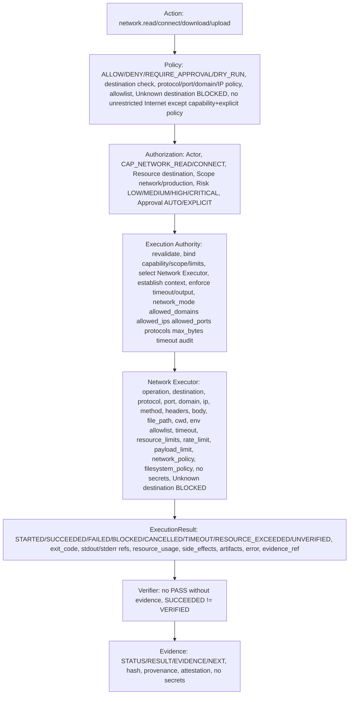

# Network Executor Contract — P10

> CONTRACTS ONLY — No implementation, no network client implementation, no package install, no system changes, repository-only.

## Purpose

Network Executor handles network operations: request, connect, download, upload, with capabilities CAP_NETWORK_READ, CAP_NETWORK_CONNECT, destination, protocol, port, domain/IP policy, allowlist, scope, timeout, rate limit, payload limit, audit, Unknown destination BLOCKED, no unrestricted Internet except capability + explicit policy.

```
network.read("https://github.com/...") → Network Executor → CAP_NETWORK_READ → LOW → AUTO with allowlist check → content hash/evidence, READ_ONLY
network.connect("https://example.com") → Network Executor → CAP_NETWORK_CONNECT → MEDIUM/HIGH/CRITICAL → EXPLICIT_APPROVAL → connection result + evidence, EXTERNAL_SIDE_EFFECT, allowlist + explicit policy required
```

## Capabilities

- CAP_NETWORK_READ (LOW, AUTO with allowlist check, official allowlisted, Network Executor, READ_ONLY)
- CAP_NETWORK_CONNECT (MEDIUM/HIGH/CRITICAL, EXPLICIT_APPROVAL, Network Executor, EXTERNAL_SIDE_EFFECT, allowlist + explicit policy required, Unknown destination BLOCKED, no unrestricted Internet except capability + explicit policy)

## Risk

- LOW for network.read official allowlisted, e.g., github.com, api.github.com, with allowlist check, no secret exfiltration, no unrestricted Internet
- MEDIUM for network.read with allowlist but not official, or network.connect with allowlist and explicit policy
- HIGH/CRITICAL for network.connect unrestricted, network.upload, network.download unrestricted, external API call, production API call, etc., EXPLICIT_APPROVAL, very strong auth may be required, production evidence, no MOCK→PRODUCTION, Unknown destination BLOCKED, no unrestricted Internet except capability + explicit policy
- Risk depends on destination, protocol, port, domain/IP policy, allowlist, scope, timeout, rate limit, payload limit, audit, etc.

## Operations

- request — HTTP request, e.g., GET, POST, with destination, protocol, port, domain/IP policy, allowlist, scope, timeout, rate limit, payload limit, audit, CAP_NETWORK_READ for read, CAP_NETWORK_CONNECT for connect/write, LOW/MEDIUM/HIGH depending, AUTO/EXPLICIT depending scope
- connect — TCP connect, e.g., connect to host:port, with destination, protocol, port, allowlist, scope, timeout, rate limit, audit, CAP_NETWORK_CONNECT, MEDIUM/HIGH/CRITICAL, EXPLICIT_APPROVAL, EXTERNAL_SIDE_EFFECT, Unknown destination BLOCKED, no unrestricted Internet except capability + explicit policy
- download — download file from URL, with destination, protocol, port, allowlist, scope, timeout, rate limit, payload limit, audit, CAP_NETWORK_READ/CONNECT, MEDIUM/HIGH, AUTO/EXPLICIT depending scope, file + evidence, no /tmp inside repo, no *.deb inside repo unless via Package Executor via Gate
- upload — upload file to URL, with destination, protocol, port, allowlist, scope, timeout, rate limit, payload limit, audit, CAP_NETWORK_CONNECT, HIGH/CRITICAL, EXPLICIT_APPROVAL, EXTERNAL_SIDE_EFFECT, Unknown destination BLOCKED, no unrestricted Internet except capability + explicit policy, no secret exfiltration, no secrets in payload unless SECRET_REFERENCE and explicitly authorized by future secret capability

## Input Schema

```json
{
  "operation": "request | connect | download | upload, must be known, unknown → BLOCKED",
  "destination": "string, e.g., 'https://github.com/elazamey/linex.os', 'https://api.github.com/repos/...', must be validated, must contain protocol, domain, port, path, no secrets, no path traversal, no command injection, no secret exfiltration, must be in allowlist or explicitly permitted via policy, Unknown destination → BLOCKED, no unrestricted Internet except capability CAP_NETWORK_CONNECT + explicit policy",
  "protocol": "string, e.g., 'https', 'http', 'tcp', must be validated, must be in allowed protocols, no arbitrary protocol",
  "port": "number | null, e.g., 443, 80, must be validated, must be in allowed ports, no arbitrary port unless explicit policy",
  "domain": "string, e.g., 'github.com', 'api.github.com', must be validated, must be in allowed domains, no random mirror, no undocumented proxy, no third-party, no untrusted binary, official sources only",
  "ip": "string | null, e.g., '140.82.114.4', must be validated, must be in allowed ips if specified",
  "method": "string | null, for request, e.g., 'GET', 'POST', must be validated",
  "headers": "object | null, for request, headers, no secrets, SECRET_REFERENCE only, no SECRET_VALUE, no stdout/stderr/event/result/evidence logging of secret, validated",
  "body": "string | object | null, for request/upload, body, no secrets, no secret exfiltration, validated, no path traversal, no command injection, no eval, no curl|bash executable",
  "file_path": "string | null, for download/upload, file path, must be validated, path normalization, canonicalization, workspace root, allowed roots, scope enforcement, symlink policy, path traversal defense, Unknown path scope → BLOCKED, no ../, no /etc/sudoers, no root filesystem mutation unless explicit host scope + very strong auth",
  "cwd": "string, working directory, must be within allowed_roots, canonicalized, no path traversal, Unknown path scope → BLOCKED",
  "environment_allowlist": ["string, explicit allowlist of env vars, e.g., ['PATH','HOME','LANG'], no full environment auto-pass, no secrets, SECRET_REFERENCE only"],
  "timeout": {
    "requested": "number, seconds",
    "enforced": "number, seconds, bounded"
  },
  "resource_limits": {
    "cpu": "number | null, design only",
    "memory": "number | null, design only",
    "disk": "number | null, design only",
    "process_count": "number | null",
    "file_descriptors": "number | null",
    "network": "boolean, must be true for Network Executor",
    "execution_time": "number, seconds",
    "output_size": "number, max bytes"
  },
  "rate_limit": "number | null, max requests per second, design only",
  "payload_limit": "number | null, max payload bytes, max_bytes, design only",
  "input": {
    "schema": "JSON Schema, validated, no secrets, invalid → DENY",
    "data": "actual input, no secrets"
  },
  "working_directory": "string, alias for cwd, must be within allowed_roots",
  "network_policy": {
    "mode": "allowlist | deny | unrestricted (only with CAP_NETWORK_CONNECT + explicit policy)",
    "allowed_domains": ["github.com", "api.github.com", "..., allowlist, no random mirror, no undocumented proxy, no third-party, no untrusted binary, official sources only"],
    "allowed_ips": ["..."],
    "allowed_ports": [443, 80, "..."],
    "protocols": ["https", "http", "..."],
    "max_bytes": "number, max payload, payload_limit",
    "timeout": "number, seconds",
    "audit": true
  },
  "filesystem_policy": {
    "workspace_root": "string, canonicalized",
    "repository_root": "string, canonicalized",
    "project_root": "string | null, canonicalized",
    "allowed_roots": ["workspace_root", "repository_root", "..., explicit, no /etc, no /etc/sudoers, no root filesystem unless explicit host scope + very strong auth"],
    "symlink_policy": "follow | no_follow | restricted",
    "path_traversal_defense": true
  },
  "evidence_requirements": {
    "required": true,
    "hash": "SHA256 required",
    "provenance": "who/when/how required",
    "attestation": "verifier_id required, not AI",
    "no_pass_without_evidence": true,
    "succeeded_not_verified": true
  },
  "correlation_id": "string, must be present",
  "idempotency_key": "string | null, for idempotency, prevents replay, especially network, package, external APIs, production",
  "sandbox_level": "0 | 1 | 2 | 3 | 4 | 5 | 6, design only, current 0 Gate"
}
```

Rules:

- Destination must be validated, must contain protocol, domain, port, path, no secrets, no path traversal, no command injection, no secret exfiltration, must be in allowlist or explicitly permitted via policy, Unknown destination → BLOCKED, no unrestricted Internet except capability CAP_NETWORK_CONNECT + explicit policy
- Protocol must be validated, must be in allowed protocols, no arbitrary protocol
- Port must be validated, must be in allowed ports, no arbitrary port unless explicit policy
- Domain must be validated, must be in allowed domains, no random mirror, no undocumented proxy, no third-party, no untrusted binary, official sources only, e.g., github.com, api.github.com, packages.microsoft.com (currently BLOCKED in Arena but official), deb.debian.org (currently BLOCKED in Arena but official)
- IP must be validated, must be in allowed ips if specified
- Method for request must be validated, e.g., GET, POST, no arbitrary method unless explicit policy
- Headers for request must be validated, no secrets, SECRET_REFERENCE only, no SECRET_VALUE, no stdout/stderr/event/result/evidence logging of secret
- Body for request/upload must be validated, no secrets, no secret exfiltration, no path traversal, no command injection, no eval, no curl|bash executable
- File_path for download/upload must be validated, path normalization, canonicalization, workspace root, allowed roots, scope enforcement, symlink policy, path traversal defense, Unknown path scope → BLOCKED, no ../, no /etc/sudoers, no root filesystem mutation unless explicit host scope + very strong auth
- Cwd must be within allowed_roots, canonicalized, no path traversal, Unknown path scope → BLOCKED
- Environment allowlist only, no full environment auto-pass, no secrets, SECRET_REFERENCE only
- Timeout bounded, must terminate or quarantine per policy, no auto SUCCESS
- Resource limits design only P10 but required, missing → policy-defined, high-risk requires limits, network must be true for Network Executor, execution_time bounded, output_size max_output_size truncation_policy
- Rate limit max requests per second design only, payload limit max payload bytes max_bytes design only
- Input schema validated, invalid → DENY, no secrets
- Network policy must contain mode allowlist/deny/unrestricted (only with CAP_NETWORK_CONNECT + explicit policy), allowed_domains allowlist no random mirror no undocumented proxy no third-party no untrusted binary official sources only, allowed_ips, allowed_ports, protocols, max_bytes payload_limit, timeout, audit true, No network policy BLOCKED for restricted operations
- Filesystem policy must contain workspace_root, repository_root, project_root, allowed_roots, symlink_policy, path traversal defense, Unknown path scope BLOCKED
- Evidence requirements required, hash SHA256, provenance who/when/how, attestation verifier_id, no_pass_without_evidence, succeeded_not_verified
- Correlation_id must be present, idempotency_key for idempotency prevents replay especially network package external APIs production
- Sandbox_level 0-6 design only current 0 Gate

## Output Schema

```json
{
  "execution_id": "string, reference",
  "status": "STARTED | SUCCEEDED | FAILED | BLOCKED | CANCELLED | TIMEOUT | RESOURCE_EXCEEDED | UNVERIFIED",
  "exit_code": "number | null, 0 for SUCCEEDED, non-zero for FAILED, null for BLOCKED/CANCELLED/TIMEOUT/RESOURCE_EXCEEDED",
  "stdout_reference": "string | null, reference to stdout artifact, e.g., response body hash, not inline if large, with hash, no secrets, max_output_size, truncation_policy",
  "stderr_reference": "string | null, reference to stderr artifact, not inline if large, with hash, no secrets",
  "output_metadata": {
    "stdout_size": "number, bytes",
    "stderr_size": "number, bytes",
    "stdout_hash": "string, SHA256 hash, no secrets",
    "stderr_hash": "string, SHA256 hash, no secrets",
    "truncated": "boolean",
    "truncation_policy": "head+tail | head | hash_only"
  },
  "resource_usage": {
    "cpu": "number, actual",
    "memory": "number, actual",
    "disk": "number, actual",
    "process_count": "number, actual",
    "file_descriptors": "number, actual",
    "network": "boolean, true, used",
    "execution_time": "number, seconds, actual",
    "output_size": "number, bytes, actual"
  },
  "duration": "number, seconds, actual",
  "started_at": "timestamp UTC",
  "completed_at": "timestamp UTC",
  "executor_id": "string, 'network-executor'",
  "executor_version": "string, version",
  "side_effects": {
    "classification": "READ_ONLY | NO_SIDE_EFFECT | REVERSIBLE_SIDE_EFFECT | IRREVERSIBLE_SIDE_EFFECT | EXTERNAL_SIDE_EFFECT | PRODUCTION_SIDE_EFFECT | SYSTEM_SIDE_EFFECT | DENY",
    "description": "string, e.g., 'network read github.com', 'network connect example.com', 'network upload', no secrets",
    "reversible": "boolean",
    "external": "boolean, true for Network Executor",
    "production": "boolean, true if production API"
  },
  "artifacts": ["artifact_id, list of artifacts, e.g., downloaded file, with owner, scope, hash SHA256, provenance, retention, no /tmp inside repo, no *.deb inside repo unless via Package Executor via Gate, no secrets"],
  "error": {
    "code": "string | null, e.g., 'execution.network_blocked', 'execution.timeout', 'execution.resource_exceeded', etc.",
    "message": "string | null, human readable, no secrets",
    "details": "object | null, error details, no secrets"
  },
  "evidence_reference": "string | null, reference to Evidence, must be present for VERIFIED, no PASS without evidence",
  "correlation_id": "string"
}
```

## Execution Context

See execution-authority.md.

## DRY-RUN

Network Executor must support DRY_RUN if risk_class requires (CLASS-4..5 mandatory, network.connect unrestricted, network.upload).

DRY-RUN must produce WOULD_EXECUTE but NO SIDE EFFECT and must mention executor, command/action abstraction (operation, destination, protocol, port, domain, method), scope, capability, policy, authorization, resource limits, expected side effects, no expose secrets.

Example:

```
ACTION: network.connect
CLASS: CLASS-4
POLICY: ALLOW with DRY_RUN + EXPLICIT_APPROVAL
DECISION: DRY_RUN
EXECUTION: WOULD_EXECUTE network.connect destination=https://example.com protocol=https port=443 domain=example.com via Network Executor
EXIT_CODE: N/A (DRY_RUN)
TIMESTAMP: 2026-10-04T18:12:00Z
SYSTEM_SUDO: AVAILABLE_NOPASSWD (EXTERNAL)
PROJECT_POLICY: CONTROLLED
SCOPE: network
CAPABILITY: CAP_NETWORK_CONNECT
AUTHORIZATION: AUTHORIZED
RESOURCE_LIMITS: ...
EXPECTED_SIDE_EFFECTS: EXTERNAL_SIDE_EFFECT (network connect)
EVIDENCE: evidence_id, hash SHA256, provenance, attestation, no secrets
```

## Side-Effect Classification

- network.read official allowlisted: READ_ONLY, CLASS-3, LOW/MEDIUM, AUTO with allowlist check, Network Executor, content hash/evidence
- network.connect official allowlisted: EXTERNAL_SIDE_EFFECT, CLASS-3..4, MEDIUM/HIGH, AUTO/EXPLICIT depending scope, Network Executor, allowlist + explicit policy
- network.connect unrestricted: EXTERNAL_SIDE_EFFECT, CLASS-4..5, HIGH/CRITICAL, EXPLICIT_APPROVAL, Network Executor, allowlist + explicit policy required, Unknown destination BLOCKED, no unrestricted Internet except capability + explicit policy
- network.download official allowlisted: READ_ONLY or REVERSIBLE_SIDE_EFFECT (file downloaded), CLASS-3, MEDIUM, AUTO with allowlist check
- network.upload: EXTERNAL_SIDE_EFFECT, CLASS-4..5, HIGH/CRITICAL, EXPLICIT_APPROVAL, Network Executor, no secret exfiltration, no secrets in payload unless SECRET_REFERENCE and explicitly authorized by future secret capability
- production API call: PRODUCTION_SIDE_EFFECT, CLASS-5, CRITICAL, EXPLICIT_APPROVAL + very strong auth + production evidence, production scope, no MOCK→PRODUCTION

## Resource Limits, Timeout, Cancellation, Retry, Idempotency, Workspace Isolation, Filesystem Isolation Roadmap, Network Policy, Secrets, Output Handling, Health, Trust, Events, Verification Hooks, Matrix, Mapping, Error Model, Security Invariants

See execution-authority.md and executor-matrix.md.

## Diagrams

```
Network Executor Flow:

Action (network.read, network.connect, network.download, network.upload)
  ↓
Policy (ALLOW/DENY/REQUIRE_APPROVAL/DRY_RUN, UNKNOWN→DENY, destination check, protocol/port/domain/IP policy, allowlist, scope, timeout, rate limit, payload limit, audit, Unknown destination BLOCKED, no unrestricted Internet except capability + explicit policy)
  ↓
Authorization (Actor, Capability CAP_NETWORK_READ/CONNECT, Resource destination, Scope network/production, Risk LOW/MEDIUM/HIGH/CRITICAL, Approval AUTO/EXPLICIT_APPROVAL)
  ↓
Execution Authority (revalidate contract, bind capability/scope/resource limits, select Network Executor, establish ExecutionContext, enforce timeout/output limits, network_mode allowed_domains allowed_ips allowed_ports protocols max_bytes timeout audit)
  ↓
Network Executor (operation, destination, protocol, port, domain, ip, method, headers, body, file_path, cwd, environment_allowlist, timeout, resource_limits, rate_limit, payload_limit, network_policy, filesystem_policy, etc., no secrets, Unknown destination BLOCKED, no unrestricted Internet except capability + explicit policy)
  ↓
Result (ExecutionResult STARTED/SUCCEEDED/FAILED/BLOCKED/CANCELLED/TIMEOUT/RESOURCE_EXCEEDED/UNVERIFIED, exit_code, stdout_reference/stderr_reference/output_metadata/resource_usage/duration/started_at/completed_at/executor_id/executor_version/side_effects/artifacts/error/evidence_reference/correlation_id, no secrets, SUCCEEDED≠VERIFIED)
  ↓
Verifier (no PASS without evidence, SUCCEEDED≠VERIFIED)
  ↓
Evidence (STATUS/RESULT/EVIDENCE/NEXT, hash, provenance, attestation, no secrets)
```

Mermaid:



```
Network Allowlist:

Official sources only (P2/P3/P4):
- github.com → PASS 200 via E2B proxy, api.github.com → PASS v7.6.6, packages.microsoft.com → BLOCKED SSL_ERROR_SYSCALL 13.107.213.70:443 (official but BLOCKED in Arena), deb.debian.org → BLOCKED Empty reply (official but BLOCKED in Arena), release-assets.githubusercontent.com → BLOCKED SSL_ERROR_SYSCALL 185.199.111.133:443 (official but BLOCKED in Arena)

No:
- random mirror
- undocumented proxy
- third-party
- untrusted binary

Policy:
- network.read official allowlisted: AUTO with allowlist check, CAP_NETWORK_READ, LOW
- network.connect official allowlisted: AUTO/EXPLICIT depending scope, CAP_NETWORK_CONNECT, MEDIUM/HIGH
- network.connect unrestricted: EXPLICIT_APPROVAL, CAP_NETWORK_CONNECT, HIGH/CRITICAL, allowlist + explicit policy required, Unknown destination BLOCKED, no unrestricted Internet except capability + explicit policy

Current Arena network PASS/BLOCKED evidence must be documented as known limitations, not design failure.
```

## May Do / Must Never Do

May Do: Define Network Executor Contract with operation, destination, protocol, port, domain, ip, method, headers, body, file_path, cwd, environment_allowlist, timeout, resource_limits, rate_limit, payload_limit, input, working_directory, network_policy, filesystem_policy, evidence_requirements, correlation_id, idempotency_key, sandbox_level, no secrets, schemas validated, unknown field handling fail-closed UNKNOWN→DENY/BLOCKED, unknown capability denied, unknown executor blocked, destination validation, protocol/port/domain/IP policy, allowlist, scope, timeout, rate limit, payload limit, audit, Unknown destination BLOCKED, no unrestricted Internet except capability + explicit policy, execute via Network Executor only after Policy AUTHORIZED, Authorization AUTHORIZED, capability, resource, scope, risk, approval verified, resource limits bound, timeout enforced, ExecutionContext established, support DRY_RUN if risk_class requires, produce WOULD_EXECUTE but NO SIDE EFFECT, mention executor, command/action abstraction, scope, capability, policy, authorization, resource limits, expected side effects, no expose secrets, classify side effects READ_ONLY/EXTERNAL/PRODUCTION/DENY and map to risk, enforce resource limits design only P10 but required, timeout bounded, cancellation no orphaned resources, retry bounded and reauthorized, idempotency prevents replay, know workspace_root/repository_root/project_root, workspace scope ≠ host scope, elevation needs explicit authorization, filesystem isolation roadmap Level 0-6 design only, network policy context network_mode allowed_domains allowed_ips allowed_ports protocols max_bytes timeout audit No network policy BLOCKED for restricted operations, secrets REFERENCE ONLY no logging, output handling with max_output_size truncation_policy hash artifact_reference, health() capabilities() version() status() but health does not grant authority, trust CONTROLLED/RESTRICTED BY POLICY even if trusted code, emit execution events with event_id execution_id action_id task_id run_id actor executor capability resource scope result correlation_id timestamp no secrets, support verification hooks before_execute/after_execute/on_block/on_fail/on_cancel/on_timeout/on_resource_exceeded but hook cannot authorize/bypass Policy/mark VERIFIED only provide evidence/context, support executor contract matrix and Action→Execution mapping and error model and security invariants.

Must Never Do: Choose implementation language, implement network client (no product code), install packages, modify system, commit/print/log secrets, create /tmp inside repo, *.deb inside repo, allow LLM→Executor direct, Planner→Executor direct, Agent→Executor direct, UI→Executor direct, MCP Server→Executor direct, bypass Policy, allow unknown capability/tool/executor, allow missing auth, allow missing evidence as PASS, implicit state jumps, auto-success, SUCCEEDED=VERIFIED, LOCAL=PRODUCTION, MOCK=PRODUCTION, events with secrets, mutable events, no event_id/timestamp/actor/correlation_id, evidence without STATUS/RESULT/EVIDENCE/NEXT, PASS without evidence, arbitrary sudo, arbitrary shell, unrestricted Internet without capability + explicit policy, random mirror, undocumented proxy, third-party, untrusted binary, Unknown destination as PASS, secret exfiltration, path traversal, command injection, eval, curl|bash executable, /etc/sudoers modification, rm -rf /, retry on Policy DENY/Authorization DENY/Capability DENY/Validation DENY/Security violation, orphaned resources on cancellation, auto-success on recovery, choose vendor for storage, require paid API/cloud DB, require GPU/K8s, violate P8 frozen baseline without ADR, violate P9 contracts without ADR.

## References

Same as Process Executor.

