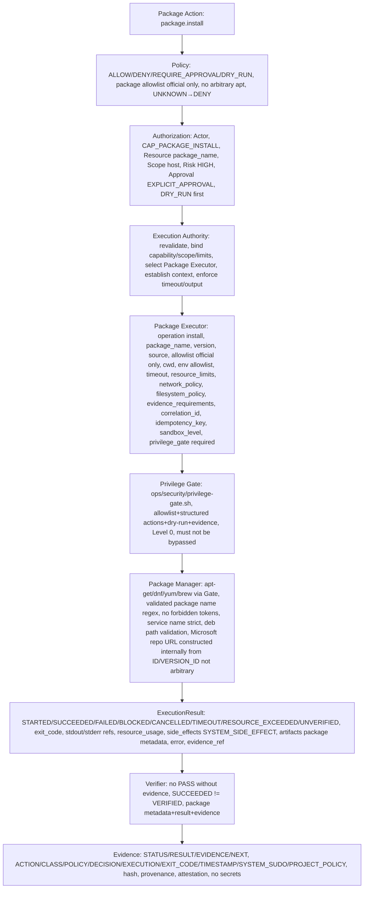

# Package Executor Contract — P10

> CONTRACTS ONLY — No implementation, no package installer implementation, no PowerShell installation, no package installation, no system changes, no production deployment, repository-only.

## Purpose

Package Executor handles package operations: install, with capability CAP_PACKAGE_INSTALL, future CAP_PACKAGE_REMOVE but P10 package-remove = DEFERRED / RESTRICTED, must use LINEX.OS Privilege Gate ops/security/privilege-gate.sh, no arbitrary apt, no sudo apt "$USER_INPUT", path Package Action→Policy→Authorization→Package Executor→Privilege Gate→Package Manager→Result→Verification.

```
package.install("powershell") → Package Executor → CAP_PACKAGE_INSTALL → HIGH → DRY_RUN + EXPLICIT → package metadata + result + evidence, SYSTEM_SIDE_EFFECT, host scope, via Privilege Gate
```

## Capabilities

- CAP_PACKAGE_INSTALL (HIGH, DRY_RUN + EXPLICIT, host scope, Package Executor via Privilege Gate, SYSTEM_SIDE_EFFECT, must use Gate, no arbitrary apt, no sudo apt "$USER_INPUT")
- CAP_PACKAGE_REMOVE (future, DEFERRED / RESTRICTED in P10, not allowed now without explicit ADR, if allowed future would be HIGH/CRITICAL, EXPLICIT_APPROVAL, DRY_RUN first, host scope, via Privilege Gate)

## Risk

- HIGH for package.install official allowlisted, e.g., powershell, gcc, g++, make, pkg-config, with allowlist official only, DRY_RUN first, --execute explicit, host scope, via Privilege Gate, SYSTEM_SIDE_EFFECT
- CRITICAL for package.install host scope with privileged operations, or package.install not in allowlist, or package.remove, etc. → DENY or REQUIRE_APPROVAL with very strong auth + production evidence + DRY_RUN first or DEFERRED/RESTRICTED
- Risk depends on package name, version, source, scope, etc.

## Operations

- install — install package, e.g., apt-get install powershell, with package name, version, source, allowlist, scope host, capability CAP_PACKAGE_INSTALL, HIGH, DRY_RUN + EXPLICIT, host scope, via Privilege Gate, no arbitrary apt, no sudo apt "$USER_INPUT", path Package Action→Policy→Authorization→Package Executor→Privilege Gate→Package Manager→Result→Verification, evidence package metadata + result + evidence, SYSTEM_SIDE_EFFECT
- remove — remove package, e.g., apt-get remove powershell, DEFERRED / RESTRICTED in P10, not allowed now without explicit ADR, future CAP_PACKAGE_REMOVE, if allowed future would be HIGH/CRITICAL, EXPLICIT_APPROVAL, DRY_RUN first, host scope, via Privilege Gate, no arbitrary apt, no sudo apt "$USER_INPUT", path Package Action→Policy→Authorization→Package Executor→Privilege Gate→Package Manager→Result→Verification

## Input Schema

```json
{
  "operation": "install | remove (remove DEFERRED/RESTRICTED in P10), must be known, unknown → BLOCKED, remove requires explicit ADR in P10",
  "package_name": "string, e.g., 'powershell', 'gcc', 'g++', 'make', 'pkg-config', must be validated, must be in allowlist official only, no arbitrary apt, no sudo apt \"$USER_INPUT\", no path traversal, no command injection, no secret exfiltration, no eval, no curl|bash executable, no rm -rf /, no mkfs, no /etc/sudoers modification, must be explicit, must have Policy AUTHORIZED, Authorization AUTHORIZED, capability CAP_PACKAGE_INSTALL, scope host, risk HIGH, approval EXPLICIT_APPROVAL, DRY_RUN first, via Privilege Gate",
  "package_version": "string | null, e.g., '7.6.6', 'latest', must be validated, must be in allowlist or known, no arbitrary version, no path traversal",
  "package_source": "string | null, e.g., 'packages.microsoft.com', 'deb.debian.org', 'github.com/PowerShell/PowerShell', must be validated, must be official source only, no random mirror, no undocumented proxy, no third-party, no untrusted binary, official sources only, e.g., packages.microsoft.com (currently BLOCKED in Arena but official), deb.debian.org (currently BLOCKED in Arena but official), github.com (PASS), api.github.com (PASS)",
  "allowlist": ["string, explicit allowlist of packages, e.g., ['powershell', 'gcc', 'g++', 'make', 'pkg-config'], official only, no third-party, no snap, no unofficial mirror"],
  "cwd": "string, working directory, must be within allowed_roots, canonicalized, no path traversal, Unknown path scope → BLOCKED",
  "environment_allowlist": ["string, explicit allowlist of env vars, e.g., ['PATH','HOME','LANG'], no full environment auto-pass, no secrets, SECRET_REFERENCE only"],
  "timeout": {
    "requested": "number, seconds",
    "enforced": "number, seconds, bounded"
  },
  "resource_limits": {
    "cpu": "number | null, design only",
    "memory": "number | null, design only",
    "disk": "number | null, design only",
    "process_count": "number | null",
    "file_descriptors": "number | null",
    "network": "boolean, must be true for Package Executor if package source requires network",
    "execution_time": "number, seconds",
    "output_size": "number, max bytes"
  },
  "input": {
    "schema": "JSON Schema, validated, no secrets, invalid → DENY",
    "data": "actual input, no secrets"
  },
  "working_directory": "string, alias for cwd, must be within allowed_roots",
  "network_policy": {
    "mode": "allowlist | deny | unrestricted (only with CAP_NETWORK_CONNECT + explicit policy)",
    "allowed_domains": ["packages.microsoft.com", "github.com", "api.github.com", "deb.debian.org", "..., allowlist, official only, no random mirror, no undocumented proxy, no third-party, no untrusted binary"],
    "allowed_ips": ["..."],
    "allowed_ports": [443, 80, "..."],
    "protocols": ["https", "http", "..."],
    "max_bytes": "number, max payload",
    "timeout": "number, seconds",
    "audit": true
  },
  "filesystem_policy": {
    "workspace_root": "string, canonicalized",
    "repository_root": "string, canonicalized",
    "project_root": "string | null, canonicalized",
    "allowed_roots": ["workspace_root", "repository_root", "..., explicit, no /etc, no /etc/sudoers, no root filesystem unless explicit host scope + very strong auth"],
    "symlink_policy": "follow | no_follow | restricted",
    "path_traversal_defense": true
  },
  "evidence_requirements": {
    "required": true,
    "hash": "SHA256 required",
    "provenance": "who/when/how required",
    "attestation": "verifier_id required, not AI",
    "no_pass_without_evidence": true,
    "succeeded_not_verified": true
  },
  "correlation_id": "string, must be present",
  "idempotency_key": "string | null, for idempotency, prevents replay, especially package install, e.g., package-install-powershell-7.6.6",
  "sandbox_level": "0 | 1 | 2 | 3 | 4 | 5 | 6, design only, current 0 Gate",
  "privilege_gate": {
    "required": true,
    "gate_path": "ops/security/privilege-gate.sh, must not be bypassed",
    "dry_run_first": true,
    "execute_explicit": true,
    "evidence": "ACTION/CLASS/POLICY/DECISION/EXECUTION/EXIT_CODE/TIMESTAMP/SYSTEM_SUDO/PROJECT_POLICY required"
  }
}
```

Rules:

- Package name must be validated, must be in allowlist official only, no arbitrary apt, no sudo apt "$USER_INPUT", no path traversal, no command injection, no secret exfiltration, no eval, no curl|bash executable, no rm -rf /, no mkfs, no /etc/sudoers modification, must be explicit, must have Policy AUTHORIZED, Authorization AUTHORIZED, capability CAP_PACKAGE_INSTALL, scope host, risk HIGH, approval EXPLICIT_APPROVAL, DRY_RUN first, via Privilege Gate
- Package version must be validated, must be in allowlist or known, no arbitrary version, no path traversal
- Package source must be validated, must be official source only, no random mirror, no undocumented proxy, no third-party, no untrusted binary, official sources only, e.g., packages.microsoft.com (currently BLOCKED in Arena but official), deb.debian.org (currently BLOCKED in Arena but official), github.com (PASS), api.github.com (PASS)
- Allowlist explicit allowlist of packages official only no third-party no snap no unofficial mirror
- Cwd must be within allowed_roots, canonicalized, no path traversal, Unknown path scope → BLOCKED
- Environment allowlist only, no full environment auto-pass, no secrets, SECRET_REFERENCE only
- Timeout bounded, must terminate or quarantine per policy, no auto SUCCESS
- Resource limits design only P10 but required, missing → policy-defined, high-risk requires limits, network must be true if package source requires network
- Input schema validated, invalid → DENY, no secrets
- Network policy must contain mode allowlist/deny/unrestricted (only with CAP_NETWORK_CONNECT + explicit policy), allowed_domains allowlist official only no random mirror no undocumented proxy no third-party no untrusted binary, allowed_ips, allowed_ports, protocols, max_bytes payload_limit, timeout, audit true, No network policy BLOCKED for restricted operations
- Filesystem policy must contain workspace_root, repository_root, project_root, allowed_roots, symlink_policy, path traversal defense, Unknown path scope BLOCKED
- Evidence requirements required, hash SHA256, provenance who/when/how, attestation verifier_id, no_pass_without_evidence, succeeded_not_verified
- Correlation_id must be present, idempotency_key for idempotency prevents replay especially package install
- Sandbox_level 0-6 design only current 0 Gate
- Privilege Gate required, gate_path ops/security/privilege-gate.sh must not be bypassed, dry_run_first true, execute_explicit true, evidence ACTION/CLASS/POLICY/DECISION/EXECUTION/EXIT_CODE/TIMESTAMP/SYSTEM_SUDO/PROJECT_POLICY required, Package Action→Policy→Authorization→Package Executor→Privilege Gate→Package Manager→Result→Verification

## Output Schema

```json
{
  "execution_id": "string, reference",
  "status": "STARTED | SUCCEEDED | FAILED | BLOCKED | CANCELLED | TIMEOUT | RESOURCE_EXCEEDED | UNVERIFIED",
  "exit_code": "number | null, 0 for SUCCEEDED, non-zero for FAILED, null for BLOCKED/CANCELLED/TIMEOUT/RESOURCE_EXCEEDED",
  "stdout_reference": "string | null, reference to stdout artifact, e.g., apt output, not inline if large, with hash, no secrets, max_output_size, truncation_policy",
  "stderr_reference": "string | null, reference to stderr artifact, not inline if large, with hash, no secrets",
  "output_metadata": {
    "stdout_size": "number, bytes",
    "stderr_size": "number, bytes",
    "stdout_hash": "string, SHA256 hash, no secrets",
    "stderr_hash": "string, SHA256 hash, no secrets",
    "truncated": "boolean",
    "truncation_policy": "head+tail | head | hash_only"
  },
  "resource_usage": {
    "cpu": "number, actual",
    "memory": "number, actual",
    "disk": "number, actual",
    "process_count": "number, actual",
    "file_descriptors": "number, actual",
    "network": "boolean, true if package source requires network",
    "execution_time": "number, seconds, actual",
    "output_size": "number, bytes, actual"
  },
  "duration": "number, seconds, actual",
  "started_at": "timestamp UTC",
  "completed_at": "timestamp UTC",
  "executor_id": "string, 'package-executor'",
  "executor_version": "string, version",
  "side_effects": {
    "classification": "SYSTEM_SIDE_EFFECT, for package.install, SYSTEM_SIDE_EFFECT, requires host scope, explicit authorization, DRY_RUN first, via Privilege Gate",
    "description": "string, e.g., 'installed package powershell', no secrets",
    "reversible": "boolean, false for package install (may be reversible via remove but remove DEFERRED/RESTRICTED in P10)",
    "external": "boolean, false, but network may be used for package source",
    "production": "boolean, false, but if package is production dependency, may be production"
  },
  "artifacts": ["artifact_id, list of artifacts, e.g., package metadata, with owner, scope, hash SHA256, provenance, retention, no /tmp inside repo, no *.deb inside repo unless via Gate and deleted after smoke, no secrets"],
  "error": {
    "code": "string | null, e.g., 'execution.package_blocked', 'execution.timeout', 'execution.resource_exceeded', etc.",
    "message": "string | null, human readable, no secrets",
    "details": "object | null, error details, no secrets"
  },
  "evidence_reference": "string | null, reference to Evidence, must be present for VERIFIED, no PASS without evidence",
  "correlation_id": "string"
}
```

## Execution Context

See execution-authority.md.

## DRY-RUN

Package Executor must support DRY_RUN, CLASS-4 mandatory, DRY_RUN first, --execute explicit.

DRY-RUN must produce WOULD_EXECUTE but NO SIDE EFFECT and must mention executor, command/action abstraction (operation, package_name, package_version, package_source, allowlist), scope, capability, policy, authorization, resource limits, expected side effects, no expose secrets, must use Privilege Gate, must show Gate would execute.

Example DRY-RUN evidence (from P2/P3/P4):

```
ACTION: package.install
CLASS: CLASS-4
POLICY: ALLOW with DRY_RUN + EXPLICIT_APPROVAL
DECISION: DRY_RUN
EXECUTION: WOULD_EXECUTE package.install powershell via Package Executor via Privilege Gate
EXIT_CODE: N/A (DRY_RUN)
TIMESTAMP: 2026-10-04T18:12:00Z
SYSTEM_SUDO: AVAILABLE_NOPASSWD (EXTERNAL)
PROJECT_POLICY: CONTROLLED (Gate allowlist, structured action, dry-run default, --execute explicit)
SCOPE: host
CAPABILITY: CAP_PACKAGE_INSTALL
AUTHORIZATION: AUTHORIZED
RESOURCE_LIMITS: ...
EXPECTED_SIDE_EFFECTS: SYSTEM_SIDE_EFFECT (package install)
EVIDENCE: evidence_id, hash SHA256, provenance, attestation, no secrets
```

## Side-Effect Classification

- package.install official allowlisted: SYSTEM_SIDE_EFFECT, CLASS-4, HIGH, DRY_RUN + EXPLICIT, host scope, via Privilege Gate, package metadata + result + evidence
- package.remove: DEFERRED/RESTRICTED in P10, not allowed now without explicit ADR, future CAP_PACKAGE_REMOVE, if allowed future would be SYSTEM_SIDE_EFFECT, CLASS-4..5, HIGH/CRITICAL, EXPLICIT_APPROVAL, DRY_RUN first, host scope, via Privilege Gate

## Resource Limits, Timeout, Cancellation, Retry, Idempotency, Workspace Isolation, Filesystem Isolation Roadmap, Network Policy, Secrets, Output Handling, Health, Trust, Events, Verification Hooks, Matrix, Mapping, Error Model, Security Invariants

See execution-authority.md and executor-matrix.md.

## Diagrams

```
Package Executor Flow (P2/P3/P4 pattern):

Package Action (package.install)
  ↓
Policy (ALLOW/DENY/REQUIRE_APPROVAL/DRY_RUN, UNKNOWN→DENY, package name allowlist official only, no arbitrary apt, no sudo apt "$USER_INPUT", no path traversal, no command injection, no secret exfiltration, no eval, no curl|bash executable, no rm -rf /, no mkfs, no /etc/sudoers modification)
  ↓
Authorization (Actor, Capability CAP_PACKAGE_INSTALL, Resource package_name, Scope host, Risk HIGH, Approval EXPLICIT_APPROVAL, DRY_RUN first)
  ↓
Execution Authority (revalidate contract, bind capability/scope/resource limits, select Package Executor, establish ExecutionContext, enforce timeout/output limits)
  ↓
Package Executor (operation install, package_name, package_version, package_source, allowlist official only, cwd, environment_allowlist, timeout, resource_limits, network_policy, filesystem_policy, evidence_requirements, correlation_id, idempotency_key, sandbox_level, privilege_gate required gate_path ops/security/privilege-gate.sh must not be bypassed dry_run_first true execute_explicit true evidence ACTION/CLASS/POLICY/DECISION/EXECUTION/EXIT_CODE/TIMESTAMP/SYSTEM_SUDO/PROJECT_POLICY required)
  ↓
Privilege Gate (ops/security/privilege-gate.sh, allowlist + structured actions + dry-run + evidence, no kernel sandbox, governance layer, Level 0, must not be bypassed, any Executor cannot bypass)
  ↓
Package Manager (apt-get, dnf, yum, brew, etc., via Gate, validated package name regex ^[a-z0-9][a-z0-9+._-]{0,63}$ no forbidden tokens ; & | $ ` \ " ' < > ( ) { } * ? ! ~ # no / or .. no leading - service name strict deb path validation /tmp/linex-os-powershell/*.deb pattern ^powershell(-lts)?_7\.[0-9]+\.[0-9]+.*\.deb$ Package=powershell Arch=amd64 via dpkg-deb --info Microsoft repo URL constructed internally from ID/VERSION_ID not arbitrary no eval as executable no bash -c uncontrolled no sh -c uncontrolled no curl|bash executable no sudo sh -c no sudo bash -c tests for injection ; BLOCKED && BLOCKED $() BLOCKED backticks BLOCKED | BLOCKED /etc/passwd BLOCKED .. BLOCKED -curl BLOCKED static security check)
  ↓
Result (ExecutionResult STARTED/SUCCEEDED/FAILED/BLOCKED/CANCELLED/TIMEOUT/RESOURCE_EXCEEDED/UNVERIFIED, exit_code, stdout_reference/stderr_reference/output_metadata/resource_usage/duration/started_at/completed_at/executor_id/executor_version/side_effects SYSTEM_SIDE_EFFECT/artifacts/error/evidence_reference/correlation_id, no secrets, SUCCEEDED≠VERIFIED)
  ↓
Verifier (no PASS without evidence, SUCCEEDED≠VERIFIED, package metadata + result + evidence)
  ↓
Evidence (STATUS/RESULT/EVIDENCE/NEXT, hash, provenance, attestation, no secrets, ACTION/CLASS/POLICY/DECISION/EXECUTION/EXIT_CODE/TIMESTAMP/SYSTEM_SUDO/PROJECT_POLICY for gate evidence)
```

Mermaid:



```
Privilege Gate Invariant:

No Executor can bypass ops/security/privilege-gate.sh

Package Executor must use Privilege Gate

Forbidden:
- sudo <arbitrary command>
- sudo bash
- sudo sh
- sudo -i
- sudo su
- sudo env
- sudo apt "$USER_INPUT" (arbitrary)
- arbitrary apt (must be via Gate with validated package/service names)

Path:
Package Action → Policy → Authorization → Package Executor → Privilege Gate → Package Manager → Result → Verification

Evidence must contain:
ACTION/CLASS/POLICY/DECISION/EXECUTION/EXIT_CODE/TIMESTAMP/SYSTEM_SUDO/PROJECT_POLICY

SYSTEM_SUDO_POLICY: EXTERNAL / NOT CONTROLLED (e.g., NOPASSWD:ALL in Arena)
PROJECT_POLICY: CONTROLLED BY LINEX.OS (Gate allowlist, structured actions, dry-run default, --execute explicit, evidence)
```

## May Do / Must Never Do

May Do: Define Package Executor Contract with operation install/remove (remove DEFERRED/RESTRICTED in P10), package_name, package_version, package_source, allowlist official only no third-party no snap no unofficial mirror, cwd, environment_allowlist, timeout, resource_limits, input, working_directory, network_policy, filesystem_policy, evidence_requirements, correlation_id, idempotency_key, sandbox_level, privilege_gate required gate_path ops/security/privilege-gate.sh must not be bypassed dry_run_first true execute_explicit true evidence ACTION/CLASS/POLICY/DECISION/EXECUTION/EXIT_CODE/TIMESTAMP/SYSTEM_SUDO/PROJECT_POLICY required, no secrets, schemas validated, unknown field handling fail-closed UNKNOWN→DENY/BLOCKED, unknown capability denied, unknown executor blocked, package name validation regex ^[a-z0-9][a-z0-9+._-]{0,63}$ no forbidden tokens ; & | $ ` \ " ' < > ( ) { } * ? ! ~ # no / or .. no leading - service name strict deb path validation /tmp/linex-os-powershell/*.deb pattern ^powershell(-lts)?_7\.[0-9]+\.[0-9]+.*\.deb$ Package=powershell Arch=amd64 via dpkg-deb --info Microsoft repo URL constructed internally from ID/VERSION_ID not arbitrary no eval as executable no bash -c uncontrolled no sh -c uncontrolled no curl|bash executable no sudo sh -c no sudo bash -c, execute via Package Executor only after Policy AUTHORIZED, Authorization AUTHORIZED, capability, resource, scope, risk, approval verified, resource limits bound, timeout enforced, ExecutionContext established, support DRY_RUN mandatory, produce WOULD_EXECUTE but NO SIDE EFFECT, mention executor, command/action abstraction, scope, capability, policy, authorization, resource limits, expected side effects SYSTEM_SIDE_EFFECT, no expose secrets, use Privilege Gate, must not be bypassed, classify side effects SYSTEM_SIDE_EFFECT and map to risk HIGH, enforce resource limits design only P10 but required, timeout bounded, cancellation no orphaned resources, retry bounded and reauthorized, idempotency prevents replay, know workspace_root/repository_root/project_root, workspace scope ≠ host scope, elevation needs explicit authorization, filesystem isolation roadmap Level 0-6 design only, network policy context network_mode allowed_domains allowed_ips allowed_ports protocols max_bytes timeout audit No network policy BLOCKED for restricted operations, secrets REFERENCE ONLY no logging, output handling with max_output_size truncation_policy hash artifact_reference, health() capabilities() version() status() but health does not grant authority, trust CONTROLLED/RESTRICTED BY POLICY even if trusted code, emit execution events with event_id execution_id action_id task_id run_id actor executor capability resource scope result correlation_id timestamp no secrets, support verification hooks before_execute/after_execute/on_block/on_fail/on_cancel/on_timeout/on_resource_exceeded but hook cannot authorize/bypass Policy/mark VERIFIED only provide evidence/context, support executor contract matrix and Action→Execution mapping and error model and security invariants.

Must Never Do: Choose implementation language, implement package installer (no product code), install packages as executable without Gate, modify system without Gate, commit/print/log secrets, create /tmp inside repo, *.deb inside repo, allow LLM→Executor direct, Planner→Executor direct, Agent→Executor direct, UI→Executor direct, MCP Server→Executor direct, bypass Policy, allow unknown capability/tool/executor, allow missing auth, allow missing evidence as PASS, implicit state jumps, auto-success, SUCCEEDED=VERIFIED, LOCAL=PRODUCTION, MOCK=PRODUCTION, events with secrets, mutable events, no event_id/timestamp/actor/correlation_id, evidence without STATUS/RESULT/EVIDENCE/NEXT, without ACTION/CLASS/POLICY/DECISION/EXECUTION/EXIT_CODE/TIMESTAMP/SYSTEM_SUDO/PROJECT_POLICY for gate evidence, without hash/provenance/attestation, PASS without evidence, arbitrary sudo, arbitrary apt, sudo apt "$USER_INPUT", sudo bash, sudo sh, sudo -i, sudo su, sudo env, bypass privilege-gate.sh, path traversal, secret exfiltration, command injection, eval, curl|bash executable, /etc/sudoers modification, rm -rf /, retry on Policy DENY/Authorization DENY/Capability DENY/Validation DENY/Security violation, orphaned resources on cancellation, auto-success on recovery, choose vendor for storage, require paid API/cloud DB, require GPU/K8s, violate P8 frozen baseline without ADR, violate P9 contracts without ADR, package.remove without explicit ADR (DEFERRED/RESTRICTED in P10).

## References

Same as Process Executor.

