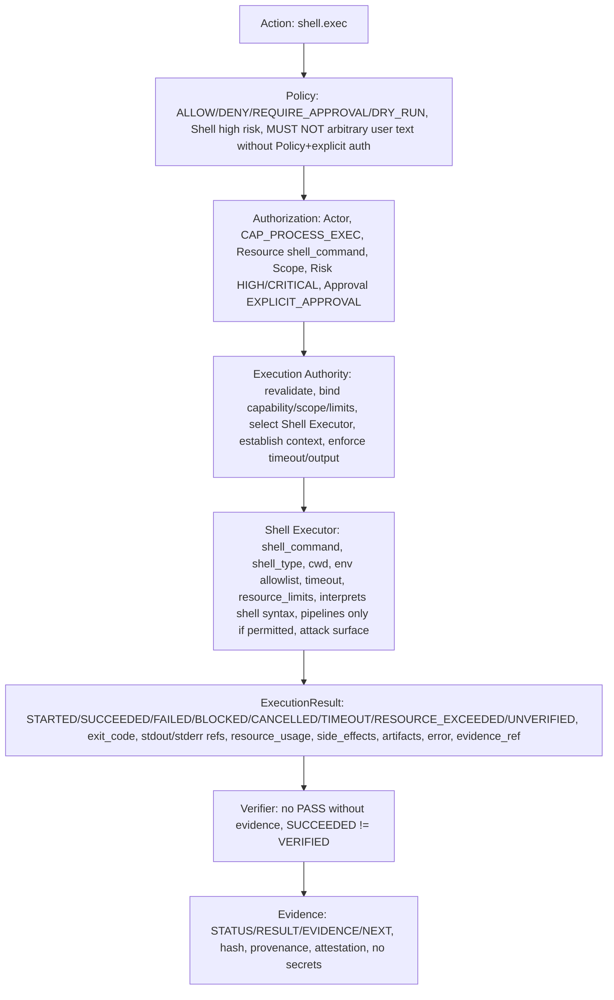

# Shell Executor Contract — P10

> CONTRACTS ONLY — No implementation, no shell execution framework, no package install, no system changes, repository-only.

## Purpose

Shell Executor executes shell commands with shell syntax interpretation (pipelines, &&, ||, $(), ``, |, >, <, etc.), has shell-specific attack surface, MUST NOT receive arbitrary user-generated command text without Policy and explicit authorization, capability separate and high risk, default REQUIRE_APPROVAL especially host scope, network connect, privileged operations, production.

```
shell.exec("git status && ...") → Shell Executor → CAP_PROCESS_EXEC → HIGH/CRITICAL → REQUIRE_APPROVAL → Output + Trace + Evidence
```

vs Process Executor:

```
process.exec(["git","status"]) → Process Executor → CAP_PROCESS_EXEC → HIGH → EXPLICIT_APPROVAL → Result + Evidence, ARGV MODE preferred, no shell parsing, safer
```

Shell Executor ≠ Process Executor. Shell interprets shell syntax, supports pipelines only if explicitly permitted, has shell-specific attack surface. Process Executor does not interpret shell syntax, uses direct argv, safer, preferred when no Shell semantics needed.

## Capability

- CAP_PROCESS_EXEC (HIGH/CRITICAL per scope, REQUIRE_APPROVAL, DRY_RUN may be required for host scope, network connect, privileged, production, especially for Shell Executor)
- Also may need CAP_FS_READ, CAP_FS_WRITE, CAP_NETWORK_READ, CAP_NETWORK_CONNECT depending on shell command and resource and scope, but primary capability is CAP_PROCESS_EXEC

## Risk

- HIGH by default for Shell Executor (shell syntax interpretation, pipelines, command injection risk, etc.)
- CRITICAL if scope is host, network, production, or shell command contains privileged operations, or resource is /etc/sudoers, root filesystem, etc. → DENY CLASS-6 FORBIDDEN or REQUIRE_APPROVAL with very strong auth + production evidence
- Risk higher than Process Executor because shell interprets syntax, supports command pipelines only if explicitly permitted, has shell-specific attack surface, MUST NOT receive arbitrary user-generated command text without Policy and explicit authorization
- Shell default REQUIRE_APPROVAL especially host scope, network connect, privileged operations, production

## Input Schema

```json
{
  "shell_command": "string, e.g., 'git status && make', must be validated, no arbitrary user-generated command text without Policy and explicit authorization, must be explicit, must be in allowlist or known, no /etc/sudoers, no root filesystem mutation unless explicit host scope + very strong auth + production evidence, no secret exfiltration, no command injection, no eval, no curl|bash executable, no rm -rf /, no mkfs, no path traversal, no secret, must be explicit, must have Policy AUTHORIZED, Authorization AUTHORIZED, capability CAP_PROCESS_EXEC, scope explicit, risk HIGH/CRITICAL, approval EXPLICIT_APPROVAL, DRY_RUN may be required",
  "shell_type": "string, e.g., 'bash', 'sh', 'bash -lc', 'sh -c', must be validated, no arbitrary shell, no bash -c with arbitrary user input, no sh -c with arbitrary user input, must be explicit, must be in allowlist",
  "cwd": "string, working directory, must be within allowed_roots, canonicalized, no path traversal, Unknown path scope → BLOCKED, must be workspace_root, repository_root, or project_root, not /etc, not /etc/sudoers, not root filesystem unless explicit host scope + very strong auth",
  "environment_allowlist": ["string, explicit allowlist of env vars, e.g., ['PATH','HOME','LANG'], no full environment auto-pass, no secrets, SECRET_REFERENCE only, no SECRET_VALUE, no stdout/stderr/event/result/evidence logging of secret"],
  "timeout": {
    "requested": "number, seconds, requested timeout",
    "enforced": "number, seconds, enforced timeout by Execution Authority, must be bounded"
  },
  "resource_limits": {
    "cpu": "number | null, design only, P10 no enforcement but required, missing → policy-defined, high-risk requires limits",
    "memory": "number | null, design only",
    "disk": "number | null, design only",
    "process_count": "number | null",
    "file_descriptors": "number | null",
    "network": "boolean",
    "execution_time": "number, seconds, max execution time, must be bounded",
    "output_size": "number, max bytes, max_output_size, truncation_policy"
  },
  "input": {
    "schema": "JSON Schema, validated, no secrets, invalid → DENY",
    "data": "actual input, no secrets, validated against schema"
  },
  "working_directory": "string, alias for cwd, must be within allowed_roots",
  "network_policy": {
    "mode": "allowlist | deny | unrestricted (only with CAP_NETWORK_CONNECT + explicit policy)",
    "allowed_domains": ["github.com", "..., allowlist"],
    "allowed_ips": ["..."],
    "allowed_ports": [443, 80, "..."],
    "protocols": ["https", "http", "..."],
    "max_bytes": "number, max payload",
    "timeout": "number, seconds",
    "audit": true
  },
  "filesystem_policy": {
    "workspace_root": "string, canonicalized",
    "repository_root": "string, canonicalized",
    "project_root": "string | null, canonicalized",
    "allowed_roots": ["workspace_root", "repository_root", "..., explicit, no /etc, no /etc/sudoers, no root filesystem unless explicit host scope + very strong auth"],
    "symlink_policy": "follow | no_follow | restricted",
    "path_traversal_defense": true
  },
  "evidence_requirements": {
    "required": true,
    "hash": "SHA256 required",
    "provenance": "who/when/how required",
    "attestation": "verifier_id required, not AI",
    "no_pass_without_evidence": true,
    "succeeded_not_verified": true
  },
  "correlation_id": "string, must be present",
  "idempotency_key": "string | null, for idempotency, prevents replay",
  "sandbox_level": "0 | 1 | 2 | 3 | 4 | 5 | 6, design only, current 0 Gate"
}
```

Rules:

- Shell interprets shell syntax, supports command pipelines only if explicitly permitted, has shell-specific attack surface, MUST NOT receive arbitrary user-generated command text without Policy and explicit authorization
- Separate shell.command vs process.argv, not same, Shell default REQUIRE_APPROVAL especially host scope, network connect, privileged operations, production
- No arbitrary user-generated command text without Policy and explicit authorization, must be explicit, must be in allowlist or known, no /etc/sudoers, no root filesystem mutation unless explicit host scope + very strong auth + production evidence, no secret exfiltration, no command injection, no eval, no curl|bash executable, no rm -rf /, no mkfs, no path traversal, no secret
- Shell type must be validated, no arbitrary shell, no bash -c with arbitrary user input, no sh -c with arbitrary user input, must be explicit, must be in allowlist
- Cwd must be within allowed_roots, canonicalized, no path traversal, Unknown path scope → BLOCKED
- Environment allowlist only, no full environment auto-pass, no secrets, SECRET_REFERENCE only, no SECRET_VALUE, no stdout/stderr/event/result/evidence logging of secret
- Timeout must be bounded, must terminate or quarantine per policy, no auto SUCCESS
- Resource limits design only P10 but required, missing → policy-defined behavior, high-risk requires limits
- Input schema validated, invalid → DENY, no secrets, no path traversal, no command injection, no secret exfiltration, no eval, no curl|bash executable
- Network policy must contain destination, protocol, port, domain/IP policy, allowlist, scope, timeout, rate limit, payload limit, audit, Unknown destination BLOCKED, no unrestricted Internet except capability + explicit policy
- Filesystem policy must contain workspace_root, repository_root, project_root, allowed_roots, symlink_policy, path traversal defense, Unknown path scope BLOCKED, no ../, no /etc/sudoers, no root filesystem mutation unless explicit host scope + very strong auth
- Evidence requirements required, hash SHA256, provenance who/when/how, attestation verifier_id, no_pass_without_evidence, succeeded_not_verified
- Correlation_id must be present, ties execution to workflow, task, run, action, events, results, evidence
- Idempotency_key for idempotency, prevents replay, especially network, package, external APIs, production
- Sandbox_level 0-6 design only current 0 Gate, P10 no isolation implementation, only contracts allow passing sandbox_level

## Output Schema

Same as Process Executor, but with shell-specific trace:

```json
{
  "execution_id": "string, reference",
  "status": "STARTED | SUCCEEDED | FAILED | BLOCKED | CANCELLED | TIMEOUT | RESOURCE_EXCEEDED | UNVERIFIED",
  "exit_code": "number | null, 0 for SUCCEEDED, non-zero for FAILED, null for BLOCKED/CANCELLED/TIMEOUT/RESOURCE_EXCEEDED",
  "stdout_reference": "string | null, reference to stdout artifact, not inline if large, with hash, no secrets, max_output_size, truncation_policy",
  "stderr_reference": "string | null, reference to stderr artifact, not inline if large, with hash, no secrets, max_output_size, truncation_policy",
  "output_metadata": {
    "stdout_size": "number, bytes",
    "stderr_size": "number, bytes",
    "stdout_hash": "string, SHA256 hash, no secrets",
    "stderr_hash": "string, SHA256 hash, no secrets",
    "truncated": "boolean, true if truncated due to max_output_size",
    "truncation_policy": "head+tail | head | hash_only"
  },
  "resource_usage": {
    "cpu": "number, actual",
    "memory": "number, actual",
    "disk": "number, actual",
    "process_count": "number, actual",
    "file_descriptors": "number, actual",
    "network": "boolean, used?",
    "execution_time": "number, seconds, actual",
    "output_size": "number, bytes, actual"
  },
  "duration": "number, seconds, actual",
  "started_at": "timestamp UTC",
  "completed_at": "timestamp UTC",
  "executor_id": "string, 'shell-executor'",
  "executor_version": "string, version",
  "side_effects": {
    "classification": "READ_ONLY | NO_SIDE_EFFECT | REVERSIBLE_SIDE_EFFECT | IRREVERSIBLE_SIDE_EFFECT | EXTERNAL_SIDE_EFFECT | PRODUCTION_SIDE_EFFECT | SYSTEM_SIDE_EFFECT | DENY",
    "description": "string, what side effects, e.g., 'executed shell command git status && make', no secrets",
    "reversible": "boolean",
    "external": "boolean",
    "production": "boolean"
  },
  "artifacts": ["artifact_id, list of artifacts produced, with owner, scope, hash SHA256, provenance, retention, no /tmp inside repo, no *.deb inside repo, no secrets"],
  "error": {
    "code": "string | null, e.g., 'execution.executor_failed', 'execution.timeout', etc.",
    "message": "string | null, human readable, no secrets",
    "details": "object | null, error details, no secrets"
  },
  "evidence_reference": "string | null, reference to Evidence, must be present for VERIFIED, no PASS without evidence",
  "correlation_id": "string"
}
```

## Execution Context

See execution-authority.md ExecutionContext.

## DRY-RUN

Shell Executor must support DRY_RUN if risk_class requires (CLASS-4..5 mandatory, CLASS-3 optional, Shell Executor high risk, REQUIRE_APPROVAL).

DRY-RUN must produce WOULD_EXECUTE but NO SIDE EFFECT and must mention executor, command/action abstraction (shell_command, shell_type, cwd), scope, capability, policy, authorization, resource limits, expected side effects, no expose secrets.

Example:

```
ACTION: shell.exec
CLASS: CLASS-4
POLICY: ALLOW with DRY_RUN + EXPLICIT_APPROVAL
DECISION: DRY_RUN
EXECUTION: WOULD_EXECUTE shell.exec shell_command="git status && make" shell_type="bash -lc" cwd=/home/user/linex.os via Shell Executor
EXIT_CODE: N/A (DRY_RUN)
TIMESTAMP: 2026-10-04T18:12:00Z
SYSTEM_SUDO: AVAILABLE_NOPASSWD (EXTERNAL)
PROJECT_POLICY: CONTROLLED
SCOPE: workspace
CAPABILITY: CAP_PROCESS_EXEC
AUTHORIZATION: AUTHORIZED
RESOURCE_LIMITS: cpu=null, memory=null, disk=null, process_count=null, fd=null, network=false, execution_time=60, output_size=1024
EXPECTED_SIDE_EFFECTS: REVERSIBLE_SIDE_EFFECT (git status && make)
EVIDENCE: evidence_id, hash SHA256, provenance, attestation, no secrets
```

## Side-Effect Classification

- READ_ONLY / NO_SIDE_EFFECT: e.g., git status via shell, but still shell syntax, so risk higher than Process Executor
- REVERSIBLE_SIDE_EFFECT: e.g., make (can be reverted)
- IRREVERSIBLE_SIDE_EFFECT: e.g., rm via shell
- EXTERNAL_SIDE_EFFECT: e.g., git push via shell
- PRODUCTION_SIDE_EFFECT: e.g., deploy via shell to production
- SYSTEM_SIDE_EFFECT: e.g., package install via shell (should use Package Executor via Gate, not Shell Executor for package install, but if shell used for package install, must still go via Gate, no arbitrary apt)
- DENY: destructive system operation, e.g., rm -rf /, mkfs, modify /etc/sudoers, CLASS-6 FORBIDDEN

## Resource Limits, Timeout, Cancellation, Retry, Idempotency, Workspace Isolation, Filesystem Isolation Roadmap, Network Policy, Secrets, Output Handling, Health, Trust, Events, Verification Hooks, Matrix, Mapping, Error Model, Security Invariants

See execution-authority.md and executor-matrix.md.

## Diagrams

```
Shell Executor Flow:

Action (shell.exec)
  ↓
Policy (ALLOW/DENY/REQUIRE_APPROVAL/DRY_RUN, UNKNOWN→DENY, Shell high risk, REQUIRE_APPROVAL especially host scope, network connect, privileged, production, MUST NOT receive arbitrary user-generated command text without Policy and explicit authorization)
  ↓
Authorization (Actor, Capability CAP_PROCESS_EXEC, Resource shell_command, Scope workspace/host/network/production explicit, Risk HIGH/CRITICAL, Approval EXPLICIT_APPROVAL)
  ↓
Execution Authority (revalidate contract, bind capability/scope/resource limits, select Shell Executor, establish ExecutionContext, enforce timeout/output limits)
  ↓
Shell Executor (shell_command, shell_type, cwd, environment_allowlist, timeout, resource_limits, interprets shell syntax, supports pipelines only if explicitly permitted, has shell-specific attack surface)
  ↓
Result (ExecutionResult STARTED/SUCCEEDED/FAILED/BLOCKED/CANCELLED/TIMEOUT/RESOURCE_EXCEEDED/UNVERIFIED, exit_code, stdout_reference/stderr_reference/output_metadata/resource_usage/duration/started_at/completed_at/executor_id/executor_version/side_effects/artifacts/error/evidence_reference/correlation_id, no secrets, SUCCEEDED≠VERIFIED)
  ↓
Verifier (no PASS without evidence, SUCCEEDED≠VERIFIED)
  ↓
Evidence (STATUS/RESULT/EVIDENCE/NEXT, hash, provenance, attestation, no secrets)
```

Mermaid:



```
Process vs Shell (repeated):

process.exec(["git","status"]) → Process Executor → direct argv → no shell parsing → safer → READ_ONLY → LOW/MEDIUM risk → AUTO/EXPLICIT depending scope

shell.exec("git status && ...") → Shell Executor → shell syntax → interprets pipelines, &&, ||, $(), ``, |, >, <, etc. → shell-specific attack surface → MUST NOT receive arbitrary user-generated command text without Policy and explicit authorization → HIGH/CRITICAL risk → REQUIRE_APPROVAL especially host scope, network connect, privileged, production → shell.command vs process.argv separated

Default: Process Executor preferred when no Shell semantics needed. Shell Executor capability separate and high risk.
```

## May Do / Must Never Do

Same as Process Executor, but with Shell-specific:

May Do: Define Shell Executor Contract with shell_command, shell_type, cwd, environment_allowlist, timeout, resource_limits, etc., no secrets, schemas validated, unknown field handling fail-closed UNKNOWN→DENY/BLOCKED, unknown capability denied, unknown executor blocked, execute via Shell Executor only after Policy AUTHORIZED, Authorization AUTHORIZED, capability, resource, scope, risk, approval verified, resource limits bound, timeout enforced, ExecutionContext established, support DRY_RUN if risk_class requires, produce WOULD_EXECUTE but NO SIDE EFFECT, mention executor, command/action abstraction, scope, capability, policy, authorization, resource limits, expected side effects, no expose secrets, classify side effects, enforce resource limits design only P10 but required, timeout bounded, cancellation no orphaned resources, retry bounded and reauthorized, idempotency prevents replay, know workspace_root/repository_root/project_root, workspace scope ≠ host scope, elevation needs explicit authorization, filesystem isolation roadmap Level 0-6 design only, network policy context, secrets REFERENCE ONLY no logging, output handling with max_output_size truncation_policy hash artifact_reference, health() capabilities() version() status() but health does not grant authority, trust CONTROLLED/RESTRICTED BY POLICY even if trusted code, emit execution events with event_id execution_id action_id task_id run_id actor executor capability resource scope result correlation_id timestamp no secrets, support verification hooks before_execute/after_execute/on_block/on_fail/on_cancel/on_timeout/on_resource_exceeded but hook cannot authorize/bypass Policy/mark VERIFIED only provide evidence/context, support executor contract matrix and Action→Execution mapping and error model and security invariants.

Must Never Do: Choose implementation language, implement shell execution framework (no product code), install packages, modify system, commit/print/log secrets, create /tmp inside repo, *.deb inside repo, allow LLM→Executor direct, Planner→Executor direct, Agent→Executor direct, UI→Executor direct, MCP Server→Executor direct, bypass Policy, allow unknown capability/tool/executor, allow missing auth, allow missing evidence as PASS, implicit state jumps, auto-success, SUCCEEDED=VERIFIED, LOCAL=PRODUCTION, MOCK=PRODUCTION, events with secrets, mutable events, no event_id/timestamp/actor/correlation_id, evidence without STATUS/RESULT/EVIDENCE/NEXT, PASS without evidence, arbitrary sudo, arbitrary shell, receive arbitrary user-generated command text without Policy and explicit authorization, bash -c with arbitrary user input, sh -c with arbitrary user input, shell parsing without explicit permission, pipelines without explicit permission, path traversal, secret exfiltration, command injection, eval, curl|bash executable, /etc/sudoers modification, rm -rf /, retry on Policy DENY/Authorization DENY/Capability DENY/Validation DENY/Security violation, orphaned resources on cancellation, auto-success on recovery, choose vendor for storage, require paid API/cloud DB, require GPU/K8s, violate P8 frozen baseline without ADR, violate P9 contracts without ADR.

## References

Same as Process Executor.

