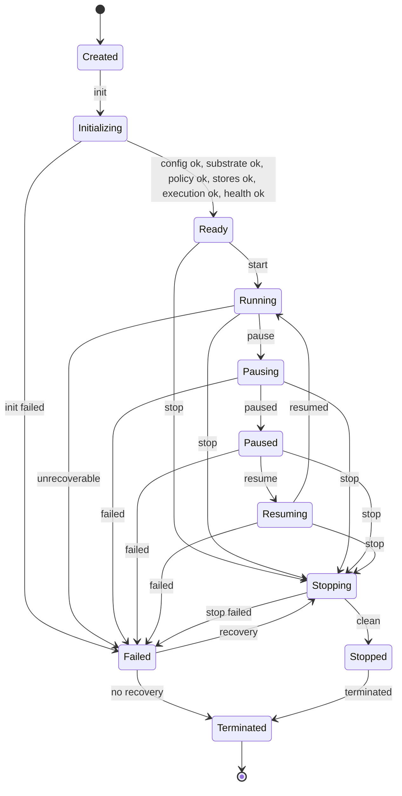
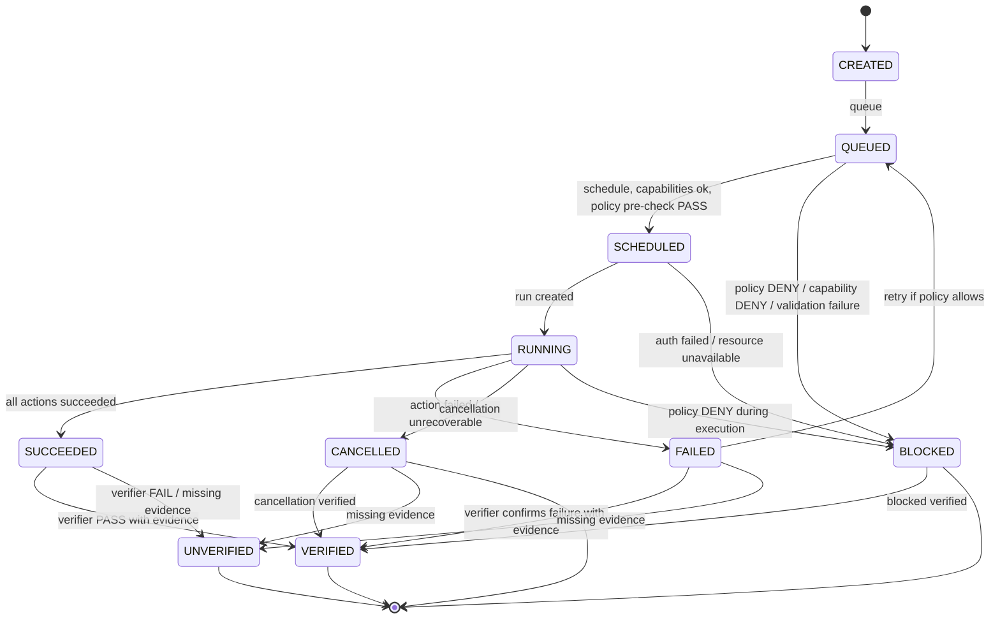
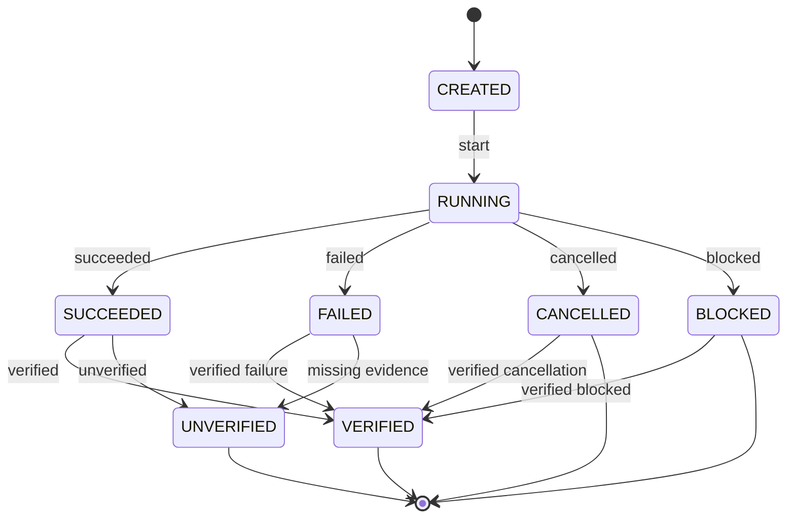
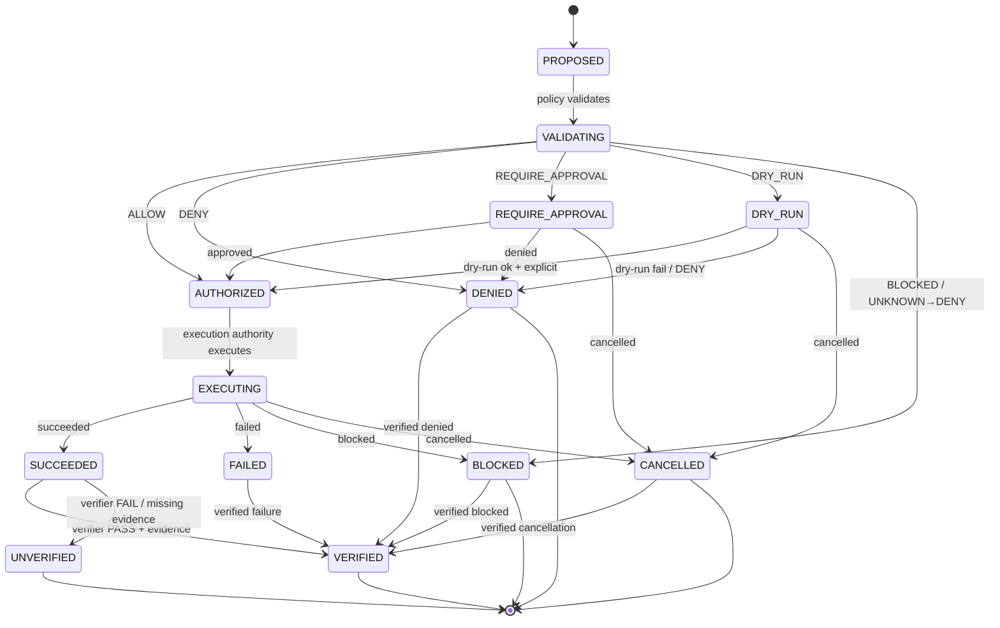

# Lifecycle — State Machines — P9

> Contract only, no implementation, no language chosen, respects P8 freeze.
> Explicit state machines, no implicit jumps, fail-closed, SUCCEEDED≠VERIFIED.

## Overview

P9 defines state machines for Runtime, Task/Run, Action, Event (not stateful but lifecycle), Result/Evidence.

All state machines explicit, no implicit jumps, fail-closed UNKNOWN→BLOCKED/UNVERIFIED, invalid transition→DENY + event + audit, no auto-success, SUCCEEDED≠VERIFIED, EXECUTED≠SAFE, LOCAL≠PRODUCTION, MOCK≠PRODUCTION.

```
Runtime: Created → Initializing → Ready → Running ↔ Pausing → Paused → Resuming → Running → Stopping → Stopped → Terminated
         Any → Failed → Stopping/Terminated

Task: CREATED → QUEUED → SCHEDULED → RUNNING → SUCCEEDED/FAILED/CANCELLED/BLOCKED → VERIFIED/UNVERIFIED
      Any → CANCELLED, Any → FAILED, FAILED → QUEUED retry if policy allows

Run: CREATED → RUNNING → SUCCEEDED/FAILED/CANCELLED/BLOCKED → VERIFIED/UNVERIFIED

Action: PROPOSED → VALIDATING → AUTHORIZED/DENIED/REQUIRE_APPROVAL/DRY_RUN/BLOCKED → EXECUTING → SUCCEEDED/FAILED/BLOCKED/CANCELLED → VERIFIED/UNVERIFIED

Event: append-only immutable, no state machine but lifecycle: created → appended → listed → subscribed → replayed → retained/deleted via policy with audit

Result: SUCCEEDED/FAILED/BLOCKED/CANCELLED/DENIED → needs Evidence → VERIFIED/UNVERIFIED

Evidence: PASS/FAIL/BLOCKED/NOT VERIFIED/VERIFIED/UNVERIFIED, append-only immutable, hash, provenance, attestation
```

## Runtime State Machine

```
States: Created, Initializing, Ready, Running, Pausing, Paused, Resuming, Stopping, Stopped, Failed, Terminated

Transitions:
Created → Initializing: init, load config, detect substrate, init stores, init policy, health check
Initializing → Ready: config ok, substrate ok, policy ok, stores ok, execution authority ok, health ok
Initializing → Failed: init failed, config invalid, substrate failed, policy failed, stores failed, execution authority failed
Ready → Running: start, start tasks
Ready → Stopping: stop request
Running → Pausing: pause request
Pausing → Paused: paused
Paused → Resuming: resume request
Resuming → Running: resumed
Running → Stopping: stop request
Pausing → Stopping: stop during pause
Paused → Stopping: stop
Resuming → Stopping: stop
Running → Failed: unrecoverable error, resource exhaustion, policy violation
Pausing → Failed: failed during pausing
Paused → Failed: failed during paused
Resuming → Failed: failed during resuming
Stopping → Stopped: clean stop, resources released, events flushed, state persisted, evidence produced
Stopping → Failed: stop failed
Failed → Stopping: recovery attempt, retry, resume, compensation if policy allows
Failed → Terminated: no recovery, terminated
Stopped → Terminated: terminated, final, no restart without new Created
Terminated → [*]: final

No implicit jumps, all explicit, logged as events runtime.* with event_id, timestamp, actor, correlation_id, no secrets.
Fail-closed: unknown state → BLOCKED, invalid transition → DENY + event + audit
```

Mermaid:



## Task State Machine

```
States: CREATED, QUEUED, SCHEDULED, RUNNING, SUCCEEDED, FAILED, CANCELLED, BLOCKED, VERIFIED, UNVERIFIED

Transitions:
CREATED → QUEUED: queue, task defined, not yet queued → queued in State Store
QUEUED → SCHEDULED: schedule, runtime selects, capabilities checked, policy pre-check PASS
QUEUED → BLOCKED: policy DENY / capability DENY / validation failure / invalid schema / ambiguous identity / untrusted network / missing auth
SCHEDULED → RUNNING: run created, actions executing
SCHEDULED → BLOCKED: auth failed / resource unavailable / policy DENY during scheduling
RUNNING → SUCCEEDED: all actions succeeded, results produced
RUNNING → FAILED: action failed / unrecoverable error / resource exhaustion
RUNNING → CANCELLED: cancellation cooperative/timeout/explicit
RUNNING → BLOCKED: policy DENY during execution / capability DENY / validation failure
SUCCEEDED → VERIFIED: verifier PASS with evidence, hash, provenance, attestation
SUCCEEDED → UNVERIFIED: verifier FAIL or missing evidence
FAILED → VERIFIED: verifier confirms failure with evidence
FAILED → UNVERIFIED: missing evidence
CANCELLED → VERIFIED: cancellation verified with evidence
CANCELLED → UNVERIFIED: missing evidence
BLOCKED → VERIFIED: blocked verified with evidence
BLOCKED → UNVERIFIED: missing evidence
FAILED → QUEUED: retry if retry policy allows, not on Policy DENY / capability DENY / validation failure / secret exfiltration / path traversal / command injection
Any → CANCELLED: cancellation request
Any → FAILED: unrecoverable error
```

Mermaid:



## Run State Machine

```
States: CREATED, RUNNING, SUCCEEDED, FAILED, CANCELLED, BLOCKED, VERIFIED, UNVERIFIED

Transitions: same as Task but per attempt
CREATED → RUNNING: run started
RUNNING → SUCCEEDED/FAILED/CANCELLED/BLOCKED: execution finished
SUCCEEDED/FAILED/CANCELLED/BLOCKED → VERIFIED/UNVERIFIED: verification
Any → CANCELLED, Any → FAILED
```

Mermaid:



## Action State Machine (P8 frozen, P9 contract)

```
States: PROPOSED, VALIDATING, AUTHORIZED, DENIED, REQUIRE_APPROVAL, DRY_RUN, EXECUTING, SUCCEEDED, FAILED, BLOCKED, CANCELLED, VERIFIED, UNVERIFIED

Transitions:
PROPOSED → VALIDATING: policy validates capability, resource, scope, risk, env, context, approval, network
VALIDATING → AUTHORIZED: ALLOW
VALIDATING → DENIED: DENY
VALIDATING → REQUIRE_APPROVAL: REQUIRE_APPROVAL
VALIDATING → DRY_RUN: DRY_RUN
VALIDATING → BLOCKED: BLOCKED / UNKNOWN→DENY / invalid schema / ambiguous identity / untrusted network / missing auth / missing evidence / secret exfiltration / path traversal / command injection
REQUIRE_APPROVAL → AUTHORIZED: approval granted
REQUIRE_APPROVAL → DENIED: approval denied
REQUIRE_APPROVAL → CANCELLED: cancelled
DRY_RUN → AUTHORIZED: dry-run ok, explicit approval for real
DRY_RUN → DENIED: dry-run shows would fail / policy DENY
DRY_RUN → CANCELLED: cancelled
AUTHORIZED → EXECUTING: execution authority executes via executor, resource limits design only, DRY_RUN if required
EXECUTING → SUCCEEDED: execution succeeded
EXECUTING → FAILED: execution failed
EXECUTING → BLOCKED: blocked during execution
EXECUTING → CANCELLED: cancelled
SUCCEEDED → VERIFIED: verifier PASS with evidence
SUCCEEDED → UNVERIFIED: verifier FAIL or missing evidence
FAILED → VERIFIED: verifier confirms failure with evidence
FAILED → UNVERIFIED: missing evidence
BLOCKED → VERIFIED: blocked verified with evidence
BLOCKED → UNVERIFIED: missing evidence
CANCELLED → VERIFIED: cancellation verified with evidence
DENIED → VERIFIED: denied verified with evidence
Any → CANCELLED, Any → FAILED, Any → BLOCKED
```

Mermaid:



## Event Lifecycle (not state machine, but append-only)

```
Created (event defined with event_id, timestamp, actor, correlation_id, no secrets, validated)
  ↓
Appended (appended to Event Bus, immutable, no secrets, hash)
  ↓
Listed (listed via filter, no secrets)
  ↓
Subscribed (handler called for matching events, no secrets)
  ↓
Replayed (replayed by correlation_id for recovery/learning, no secrets)
  ↓
Retained/Deleted (via retention policy with audit, ownership, access policy, encryption, deletion, design only P9)
```

No mutable events, no deletion without audit, no secrets, fail-closed invalid schema→DENY, missing fields→DENY.

## Result Lifecycle

```
SUCCEEDED / FAILED / BLOCKED / CANCELLED / DENIED (execution finished, result produced with outputs, error, metrics, resource_usage, evidence_id, events, created_at, created_by, correlation_id, no secrets)
  ↓
VERIFIED / UNVERIFIED (verifier checks result, produces evidence with STATUS/RESULT/EVIDENCE/NEXT, hash, provenance, attestation, no secrets, no PASS without evidence, SUCCEEDED≠VERIFIED)
```

## Evidence Lifecycle

```
PASS / FAIL / BLOCKED / NOT VERIFIED / VERIFIED / UNVERIFIED (verification with evidence, append-only immutable, hash SHA256, provenance who/when/how, attestation verifier_id, policy decision, execution authority/executor/exit_code/resource_usage/dry_run, verification checks passed/failed/blocked/total, no secrets, no PASS without evidence)
  ↓
Retained/Deleted via retention policy with audit
```

## Combined Flow (Task → Action → Event → Result → Evidence)

```
Task CREATED
  ↓ task.created event
Task QUEUED
  ↓ task.queued event
Task SCHEDULED
  ↓ task.scheduled event
Run CREATED
  ↓ run.created event
Action PROPOSED (Planner)
  ↓ action.proposed event
Action VALIDATING (Policy Engine)
  ↓ action.validated event
Action AUTHORIZED/DENIED/REQUIRE_APPROVAL/DRY_RUN/BLOCKED (Policy + Authorization)
  ↓ action.authorized/denied event
Action EXECUTING (Execution Authority)
  ↓ action.started event
Action SUCCEEDED/FAILED/BLOCKED/CANCELLED
  ↓ action.completed/failed/blocked/cancelled event
Result SUCCEEDED/FAILED/BLOCKED/CANCELLED/DENIED (outputs, error, metrics, resource_usage, evidence_id)
  ↓ result created
Verification STARTED
  ↓ verification.started event
Verification PASSED/FAILED
  ↓ verification.passed/failed event
Evidence CREATED (STATUS/RESULT/EVIDENCE/NEXT, hash, provenance, attestation, no secrets, no PASS without evidence)
  ↓ evidence.created event
Task SUCCEEDED/FAILED/CANCELLED/BLOCKED
  ↓ task.completed/failed/cancelled/blocked event
Task VERIFIED/UNVERIFIED
  ↓ task.verified/unverified event
Learn (optional via Memory Service)
```

All with same correlation_id, causation_id, parent_event_id, no secrets, append-only immutable, fail-closed, SUCCEEDED≠VERIFIED.

## Invariants

- All state machines explicit, no implicit jumps, fail-closed UNKNOWN→BLOCKED/UNVERIFIED, invalid transition→DENY + event + audit, no auto-success
- SUCCEEDED≠VERIFIED, EXECUTED≠SAFE, LOCAL≠PRODUCTION, MOCK≠PRODUCTION, no PASS without evidence, no production claims without production evidence
- Cancellation cooperative/timeout/explicit no orphaned resources CANCELLED≠FAILED but needs verification
- Recovery retry/resume/compensation no auto-success retry only transient not Policy DENY etc.
- Events append-only immutable no secrets with event_id timestamp actor correlation_id causation_id parent_event_id evidence hash
- Results with status SUCCEEDED/FAILED/BLOCKED/CANCELLED/DENIED outputs no secrets error code/message/details no secrets metrics duration/resource_usage evidence_id events created_at created_by correlation_id
- Evidence with status PASS/FAIL/BLOCKED/NOT VERIFIED/VERIFIED/UNVERIFIED result_summary no secrets evidence logs/artifacts/hash/provenance/attestation/policy/execution/verification next steps created_at created_by verifier not AI correlation_id append-only immutable no secrets hash SHA256 provenance who/when/how attestation verifier_id
- Observability distinction DEBUG LOG vs AUDIT EVENT vs SECURITY EVENT vs VERIFICATION EVIDENCE no mixing no secrets
- No implementation language chosen, no product code, no package installation, no system changes, no /tmp inside repo, no *.deb inside repo
- UI client only UI→API only, LLM→shell forbidden, capability explicit DEFAULT DENY UNKNOWN→DENY, MCP via Gateway no unbounded host access, storage abstraction interfaces local/optional remote/replaceable no vendor free-first vendor-neutral self-hostable local-capable no mandatory paid API/cloud DB
- Resource limits design only no enforcement P9, low-resource modes CORE/STANDARD/HEAVY respected no GPU/K8s assumed
- Respects P8 frozen baseline no violation without ADR
- Diagrams ASCII/Mermaid

## References

- docs/architecture/frozen-baseline.md
- docs/architecture/execution-model.md
- docs/architecture/data-model.md
- docs/architecture/event-model.md
- docs/contracts/README.md
- docs/contracts/runtime.md, task.md, action.md, event.md, result.md
```

