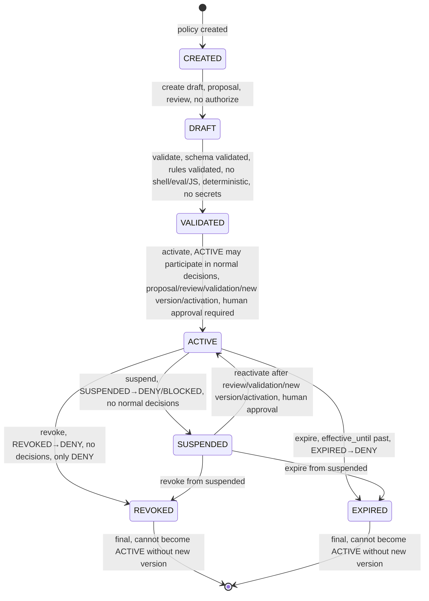
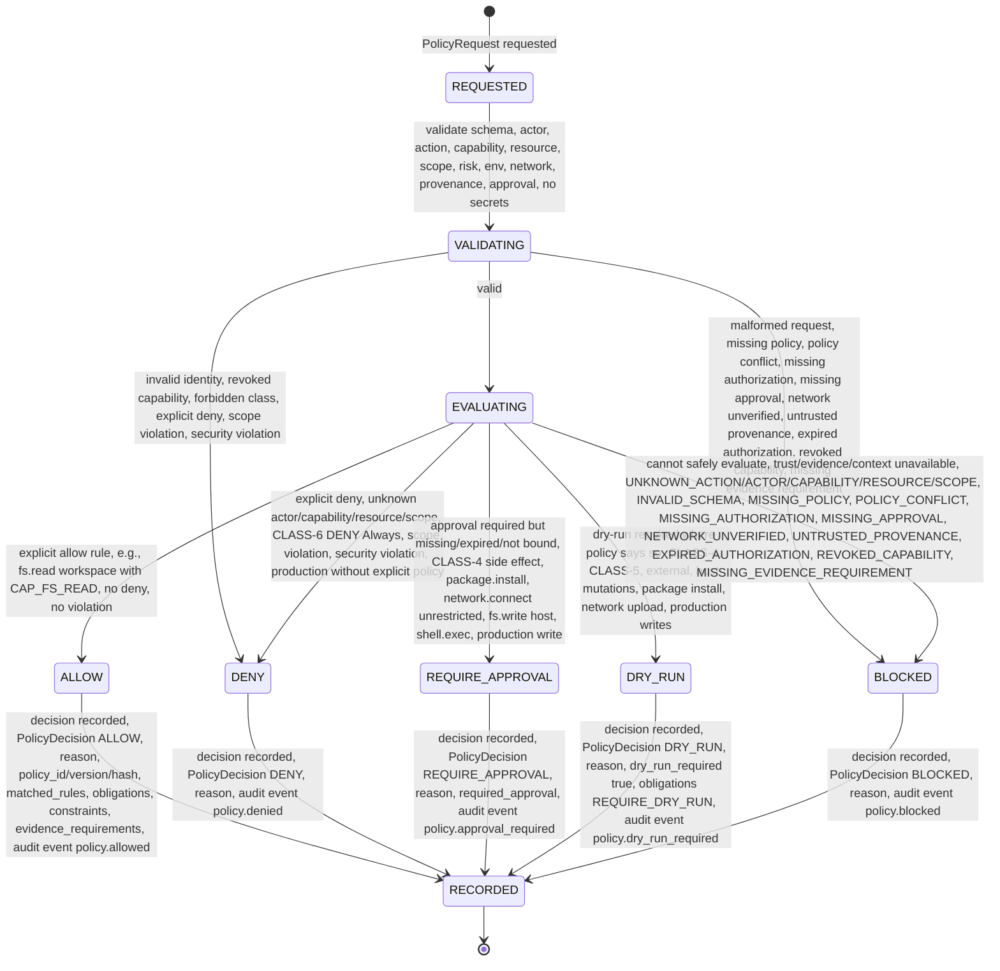
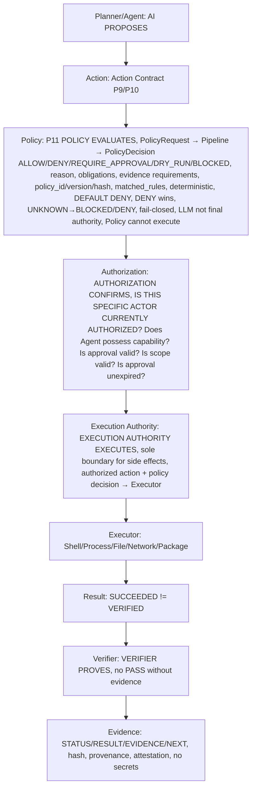

# Policy Lifecycle — State Machines — P11

> CONTRACTS ONLY — No implementation, no package install, no system changes, repository-only.
> Explicit state machines, no implicit transitions, fail-closed, DEFAULT DENY, DENY wins over ALLOW.

## Purpose

Policy Lifecycle defines state machines for Policies and Decisions, from CREATED to ACTIVE/REVOKED/EXPIRED and REQUESTED to RECORDED, with explicit transitions, no implicit jumps, fail-closed, DEFAULT DENY, DENY wins over ALLOW, UNKNOWN→BLOCKED/DENY.

## Policy Lifecycle

States:

- CREATED: policy created, not yet draft, no version, no hash, no rules, no decisions, no authorization
- DRAFT: draft, no authorize, policy draft, not yet validated, not yet active, no decisions, DRAFT→no authorize
- VALIDATED: validated, policy validated, schema validated, rules validated, no condition as shell, no eval, no arbitrary JS execution, conditions deterministic, typed, schema-constrained, no secrets, validated
- ACTIVE: active, policy active, may participate in normal decisions, only ACTIVE may participate in normal decisions, policy_id, policy_version, policy_hash, rules active, decisions with policy_id, policy_version, policy_hash, immutable for decision record, change policy new version no rewrite old decision, old decisions remain with old policy_id, policy_version, policy_hash, new decisions with new version
- SUSPENDED: suspended, DENY/BLOCKED, policy suspended, no longer active, SUSPENDED→DENY/BLOCKED, no normal decisions, only DENY/BLOCKED, may become ACTIVE again after review, validation, new version, activation
- REVOKED: revoked, DENY, policy revoked, no longer active, REVOKED→DENY, no decisions, only DENY, cannot become ACTIVE again without new version and activation
- EXPIRED: expired, DENY, policy expired, effective_until past, EXPIRED→DENY, no decisions, only DENY, cannot become ACTIVE again without new version and activation

Transitions:

```
CREATED → DRAFT: create draft, proposal, review, no authorize

DRAFT → VALIDATED: validate, schema validated, rules validated, no condition as shell, no eval, no arbitrary JS execution, conditions deterministic, typed, schema-constrained, no secrets, validated

VALIDATED → ACTIVE: activate, policy becomes ACTIVE, may participate in normal decisions, only ACTIVE may participate, DRAFT no authorize, SUSPENDED DENY/BLOCKED, REVOKED DENY, EXPIRED DENY, activation requires proposal, review, validation, new version, activation, human/policy owner approval required, learning system may propose, cannot activate automatically

ACTIVE → SUSPENDED: suspend, policy suspended, SUSPENDED→DENY/BLOCKED, no normal decisions, only DENY/BLOCKED, may be due to policy conflict, untrusted provenance, missing evidence requirement, etc., fail-closed

SUSPENDED → ACTIVE: reactivate, after review, validation, new version, activation, human/policy owner approval required, may become ACTIVE again

ACTIVE → REVOKED: revoke, policy revoked, REVOKED→DENY, no decisions, only DENY, cannot become ACTIVE again without new version and activation, e.g., policy found to be insecure, etc.

ACTIVE → EXPIRED: expire, policy expired, effective_until past, EXPIRED→DENY, no decisions, only DENY, cannot become ACTIVE again without new version and activation

SUSPENDED → REVOKED: revoke from suspended, REVOKED→DENY

SUSPENDED → EXPIRED: expire from suspended, EXPIRED→DENY

REVOKED → [*]: final, cannot become ACTIVE again without new version

EXPIRED → [*]: final, cannot become ACTIVE again without new version

No implicit transitions, all explicit, logged as events policy.created, draft, validated, active, suspended, revoked, expired, updated, activated, suspended, revoked, with event_id, policy_id, policy_version, policy_request_id, decision_id, actor, action, capability, resource, scope, decision, reason, correlation_id, timestamp, no secrets.

Fail-closed: unknown state → BLOCKED, invalid transition → BLOCKED + event + audit + SECURITY EVENT if injection, missing fields → DENY/BLOCKED.
```

Mermaid:



## Decision Lifecycle

States:

- REQUESTED: PolicyRequest requested, policy_request_id, actor, action, capability, resource, scope, risk_class, environment, context, approval, network_context, filesystem_context, time_context, provenance, requested_by, correlation_id, timestamp, no secrets, validated, typed, schema-constrained
- VALIDATING: validating PolicyRequest schema, actor validation, action validation, capability lookup, resource validation, scope check, risk check, environment check, network check, provenance check, approval check, no secrets, invalid → DENY/BLOCKED
- EVALUATING: evaluating PolicyRule rules, rule_id, version, priority, subject, action, capability, resource, scope, risk, environment, network, approval, conditions deterministic no shell/eval/JS, decision, obligations, reason, provenance, effective_from/effective_until, status, matched_rules, denied_rules
- ALLOW: ALLOW, Action may proceed to Authorization/Execution under existing constraints, e.g., fs.read workspace with CAP_FS_READ, policy allows, capability exists, scope workspace, risk CLASS-0, AUTO
- DENY: DENY, Policy explicitly forbids, e.g., unknown capability DENY, unknown actor DENY, unknown resource DENY, unknown scope DENY, CLASS-6 DENY, scope violation DENY, security violation DENY, production access without explicit policy DENY, etc., fail-closed
- REQUIRE_APPROVAL: REQUIRE_APPROVAL, Action may proceed only after required approval, e.g., CLASS-4 side effect, package.install, network.connect unrestricted, fs.write host scope, shell.exec, production write, approval must be fresh, bound_to_action, bound_to_scope, bound_to_resource, time_bounded, no generic approval "allow this Agent anything", approval replay protection bound to action_id, policy_version, capability, resource, scope, risk, input_hash, correlation_id, expiry, not reusable automatically for different Action
- DRY_RUN: DRY_RUN, Simulation required before real side effect, especially CLASS-4, CLASS-5, external side effects, host mutations, package installation, network upload, production writes, DRY_RUN does not mean execution authorized but simulation authorized, then new authorization for real execution
- BLOCKED: BLOCKED, Policy cannot safely evaluate or required trust/evidence/context is unavailable, e.g., UNKNOWN_ACTION, UNKNOWN_ACTOR, UNKNOWN_CAPABILITY, UNKNOWN_RESOURCE, UNKNOWN_SCOPE, INVALID_SCHEMA, MISSING_POLICY, POLICY_CONFLICT, MISSING_AUTHORIZATION, MISSING_APPROVAL, NETWORK_UNVERIFIED, UNTRUSTED_PROVENANCE, EXPIRED_AUTHORIZATION, REVOKED_CAPABILITY, MISSING_EVIDENCE_REQUIREMENT, etc., fail-closed, no ASSUME ALLOW
- RECORDED: RECORDED, decision recorded, PolicyDecision with decision_id, policy_request_id, decision ALLOW/DENY/REQUIRE_APPROVAL/DRY_RUN/BLOCKED, reason why decision, policy_id, policy_version, policy_hash, matched_rules, denied_rules, required_capabilities, required_approval, dry_run_required, obligations, constraints, risk_class, scope, resource, actor, network_status, provenance_status, evidence_requirements, created_at, expires_at, correlation_id, no secrets, deterministic for same Policy Version, Policy Input, Policy Context, LLM does not enter final authorization calculation, audit event emitted policy.requested, validated, evaluated, allowed, denied, approval_required, dry_run_required, blocked, conflict, failed, etc., with event_id, policy_id, policy_version, policy_request_id, decision_id, actor, action, capability, resource, scope, decision, reason, correlation_id, timestamp, no secrets, Event Bus append-only immutable

Transitions:

```
REQUESTED → VALIDATING: validate PolicyRequest schema, actor, action, capability, resource, scope, risk, environment, context, approval, network_context, filesystem_context, time_context, provenance, requested_by, correlation_id, timestamp, no secrets, validated, typed, schema-constrained, invalid → DENY/BLOCKED

VALIDATING → EVALUATING: actor validation, action validation, capability lookup, resource validation, scope check, risk check, environment check, network check, provenance check, approval check, no secrets, valid

VALIDATING → DENY: invalid identity, revoked capability, forbidden class, explicit deny, scope violation, security violation, etc., fail-closed, DENY

VALIDATING → BLOCKED: malformed request, missing policy, policy conflict, missing authorization, missing approval, network unverified, untrusted provenance, expired authorization, revoked capability, missing evidence requirement, etc., fail-closed, BLOCKED

EVALUATING → ALLOW: explicit allow rule, e.g., allow fs.read workspace with CAP_FS_READ, policy allows, capability exists, scope workspace, risk CLASS-0, AUTO, no other deny, no scope violation, no security violation, no missing approval, network allowlisted, provenance trusted, etc.

EVALUATING → DENY: explicit deny rule, unknown actor DENY, unknown capability DENY, unknown resource DENY, unknown scope DENY, CLASS-6 DENY Always, scope violation DENY, security violation DENY + SECURITY EVENT, production access without explicit policy DENY, etc., fail-closed, DENY wins over ALLOW

EVALUATING → REQUIRE_APPROVAL: approval required but missing or expired or not bound to action/context, e.g., CLASS-4 side effect, package.install, network.connect unrestricted, fs.write host scope, shell.exec, production write, approval must be fresh, bound_to_action, bound_to_scope, bound_to_resource, time_bounded, no generic approval

EVALUATING → DRY_RUN: dry-run required where policy says so, especially CLASS-4, CLASS-5, external side effects, host mutations, package installation, network upload, production writes, DRY_RUN does not mean execution authorized but simulation authorized, then new authorization for real execution

EVALUATING → BLOCKED: Policy cannot safely evaluate or required trust/evidence/context is unavailable, e.g., UNKNOWN_ACTION, UNKNOWN_ACTOR, UNKNOWN_CAPABILITY, UNKNOWN_RESOURCE, UNKNOWN_SCOPE, INVALID_SCHEMA, MISSING_POLICY, POLICY_CONFLICT, MISSING_AUTHORIZATION, MISSING_APPROVAL, NETWORK_UNVERIFIED, UNTRUSTED_PROVENANCE, EXPIRED_AUTHORIZATION, REVOKED_CAPABILITY, MISSING_EVIDENCE_REQUIREMENT, etc., fail-closed, no ASSUME ALLOW

ALLOW → RECORDED: decision recorded, PolicyDecision with decision_id, policy_request_id, decision ALLOW, reason, policy_id, policy_version, policy_hash, matched_rules, required_capabilities, required_approval, dry_run_required, obligations, constraints, risk_class, scope, resource, actor, network_status, provenance_status, evidence_requirements, created_at, expires_at, correlation_id, no secrets, deterministic, audit event policy.allowed

DENY → RECORDED: decision recorded, PolicyDecision DENY, reason capability missing, CLASS-6 FORBIDDEN, scope violation, security violation, etc., audit event policy.denied

REQUIRE_APPROVAL → RECORDED: decision recorded, PolicyDecision REQUIRE_APPROVAL, reason CLASS-4 side effect, etc., required_approval EXPLICIT_APPROVAL, approval must be fresh, bound_to_action, bound_to_scope, bound_to_resource, time_bounded, audit event policy.approval_required

DRY_RUN → RECORDED: decision recorded, PolicyDecision DRY_RUN, reason CLASS-4 side effect, external side effects, host mutations, package installation, network upload, production writes, dry_run_required true, obligations REQUIRE_DRY_RUN, audit event policy.dry_run_required

BLOCKED → RECORDED: decision recorded, PolicyDecision BLOCKED, reason network trust unavailable, untrusted provenance, missing evidence requirement, etc., audit event policy.blocked

No implicit transitions, all explicit, logged as events policy.requested, validated, evaluated, allowed, denied, approval_required, dry_run_required, blocked, conflict, failed, with event_id, policy_id, policy_version, policy_request_id, decision_id, actor, action, capability, resource, scope, decision, reason, correlation_id, timestamp, no secrets.

Invalid transition → BLOCKED, unknown state → BLOCKED, policy denial → DENIED/BLOCKED path, success must go through validation before ALLOW, fail-closed, DEFAULT DENY, DENY wins over ALLOW, UNKNOWN→BLOCKED/DENY, deterministic same Policy Version/Input/Context → same Decision.
```

Mermaid:



## Combined Flow (Policy Evaluation Pipeline)

```
INPUT (PolicyRequest)
  → SCHEMA VALIDATION (invalid → DENY/BLOCKED)
  → ACTOR VALIDATION (unknown/ambiguous/unauthenticated → DENY)
  → ACTION VALIDATION (unknown action → BLOCKED/DENY)
  → CAPABILITY LOOKUP (unknown/inactive/revoked/expired → DENY)
  → RESOURCE VALIDATION (unknown resource, outside actor scope → DENY)
  → SCOPE CHECK (unknown scope, scope violation, escalation → DENY)
  → RISK CHECK (CLASS-6 → DENY Always, CLASS-5→CLASS-2 never lower without explicit rule+review)
  → ENVIRONMENT CHECK (LOCAL≠PRODUCTION, MOCK≠PRODUCTION, ARENA≠PRODUCTION)
  → NETWORK CHECK (unknown destination → BLOCKED, untrusted → BLOCKED/DENY)
  → PROVENANCE CHECK (untrusted provenance → BLOCKED/DENY)
  → APPROVAL CHECK (missing/expired/not bound → REQUIRE_APPROVAL or DENY/BLOCKED)
  → RULE EVALUATION (PolicyRule, priority, subject, action, capability, resource, scope, risk, environment, network, approval, conditions deterministic no shell/eval/JS, decision, obligations, reason, provenance, effective_from/effective_until, status)
  → PRECEDENCE (1 malformed, 2 invalid identity, 3 revoked capability, 4 forbidden class, 5 explicit deny, 6 scope violation, 7 security violation, 8 missing approval, 9 network restriction, 10 risk requirement, 11 dry-run requirement, 12 explicit allow, DENY wins over ALLOW, UNKNOWN→BLOCKED/DENY, no last rule wins unless explicit precedence documented, deterministic)
  → DECISION (ALLOW/DENY/REQUIRE_APPROVAL/DRY_RUN/BLOCKED, reason, policy_id, policy_version, policy_hash, matched_rules, denied_rules, required_capabilities, required_approval, dry_run_required, obligations, constraints, risk_class, scope, resource, actor, network_status, provenance_status, evidence_requirements, created_at, expires_at, correlation_id, no secrets, deterministic)
  → OBLIGATIONS (REQUIRE_APPROVAL, REQUIRE_DRY_RUN, REQUIRE_VERIFICATION, LIMIT_SCOPE, LIMIT_NETWORK, LIMIT_OUTPUT, LIMIT_TIME, LIMIT_RESOURCE, AUDIT_REQUIRED → Authorization, Execution Authority, Verifier)
  → EVIDENCE REQUIREMENTS (required, hash, provenance, attestation, no_pass_without_evidence, succeeded_not_verified, every side-effect decision declares evidence requirements)
  → AUDIT EVENT (policy.requested, validated, evaluated, allowed, denied, approval_required, dry_run_required, blocked, conflict, failed, updated, activated, suspended, revoked, event_id, policy_id, policy_version, policy_request_id, decision_id, actor, action, capability, resource, scope, decision, reason, correlation_id, timestamp, no secrets)
```

Mermaid for combined flow see policy.md Policy Evaluation Flow diagram.

## System Execution Flow with Policy (P8/P9/P10 extended)

```
Planner / Agent
      ↓
Action (Task/Run Contract, Action Contract)
      ↓
Policy (P11: PolicyRequest → Policy Evaluation Pipeline → PolicyDecision ALLOW/DENY/REQUIRE_APPROVAL/DRY_RUN/BLOCKED, reason, obligations, evidence requirements, policy_id/version/hash, matched_rules, deterministic, LLM does not enter final authorization calculation, DEFAULT DENY, DENY wins over ALLOW, UNKNOWN→BLOCKED/DENY, fail-closed)
      ↓
Authorization (Actor, Capability, Resource, Scope, Risk, Approval, Is this specific actor currently authorized? Does Agent possess capability? Is approval valid? Is scope valid? Is approval unexpired? Is actor authenticated? Is provenance trusted? Is network trust available? Is evidence requirement satisfied?)
      ↓
Execution Authority (sole architectural boundary for host/external side effects, receives authorized Action, revalidates execution contract, binds capability/scope/resource limits, selects approved Executor, establishes execution context, enforces timeout/output limits, collects execution result, emits execution events, provides Result to Verifier)
      ↓
Executor (Shell, Process, File, Network, Package, future Browser, Computer, MCP, Tool, Skill, Workflow)
      ↓
Result (ExecutionResult → Result, SUCCEEDED≠VERIFIED)
      ↓
Verifier (no PASS without evidence, SUCCEEDED≠VERIFIED, Verifier not Authorization Authority, AI not Verifier)
      ↓
Evidence (STATUS/RESULT/EVIDENCE/NEXT, hash, provenance, attestation, no secrets, no PASS without evidence)
```

ASCII:

```
┌──────────────┐
│ Planner/Agent│  AI PROPOSES
└──────┬───────┘
       ↓
┌──────────────┐
│    Action    │  Action Contract P9/P10
└──────┬───────┘
       ↓
┌──────────────┐
│    Policy    │  P11 POLICY EVALUATES: PolicyRequest → Pipeline → PolicyDecision ALLOW/DENY/REQUIRE_APPROVAL/DRY_RUN/BLOCKED, reason, obligations, evidence requirements, policy_id/version/hash, matched_rules, deterministic, DEFAULT DENY, DENY wins, UNKNOWN→BLOCKED/DENY, fail-closed, LLM not final authority, Policy cannot execute, Policy cannot self-grant capabilities
└──────┬───────┘
       ↓
┌──────────────┐
│ Authorization│  AUTHORIZATION CONFIRMS: IS THIS SPECIFIC ACTOR CURRENTLY AUTHORIZED? Does Agent possess capability? Is approval valid? Is scope valid? Is approval unexpired? Is actor authenticated? Is provenance trusted? Is network trust available? Is evidence requirement satisfied?
└──────┬───────┘
       ↓
┌─────────────────────┐
│ Execution Authority │  EXECUTION AUTHORITY EXECUTES: sole boundary for side effects, authorized action + policy decision → Executor, revalidate, bind capability/scope/limits, select Executor, establish context, enforce timeout/output, emit events, provide Result to Verifier
└──────┬──────────────┘
       ↓
┌──────────────┐
│   Executor   │  Shell, Process, File, Network, Package, future Browser, Computer, MCP, Tool, Skill, Workflow
└──────┬───────┘
       ↓
┌──────────────┐
│    Result    │  Result, ExecutionResult, STARTED/SUCCEEDED/FAILED/BLOCKED/CANCELLED/TIMEOUT/RESOURCE_EXCEEDED/UNVERIFIED, SUCCEEDED≠VERIFIED
└──────┬───────┘
       ↓
┌──────────────┐
│   Verifier   │  VERIFIER PROVES: no PASS without evidence, SUCCEEDED≠VERIFIED, Verifier not Authorization Authority, AI not Verifier
└──────┬───────┘
       ↓
┌──────────────┐
│   Evidence   │  STATUS/RESULT/EVIDENCE/NEXT, hash, provenance, attestation, no secrets, no PASS without evidence
└──────────────┘
```

Mermaid:



## Invariants

- No implementation language chosen in P11, no product code, no package installation, no system changes, repository-only, only policy contracts, schemas, decision model, rule model, risk model, approval model, conflict model, evaluation state machine, policy invariants, ADR, tests, verification scripts, documentation, ASCII/Mermaid diagrams, respects P8 frozen baseline, P9 Core Runtime Contracts, P10 Execution Authority Contracts, any violation requires ADR
- Policy lifecycle CREATED, DRAFT, VALIDATED, ACTIVE, SUSPENDED, REVOKED, EXPIRED, DRAFT→no authorize, SUSPENDED→DENY/BLOCKED, REVOKED→DENY, EXPIRED→DENY, only ACTIVE may participate in normal decisions
- Decision lifecycle REQUESTED→VALIDATING→EVALUATING→ALLOW/DENY/REQUIRE_APPROVAL/DRY_RUN/BLOCKED→RECORDED, no implicit transitions, invalid transition→BLOCKED, unknown state→BLOCKED, policy denial→DENIED/BLOCKED path, success must go through validation before ALLOW, fail-closed, DEFAULT DENY, DENY wins over ALLOW, UNKNOWN→BLOCKED/DENY, deterministic same Policy Version/Input/Context→same Decision
- Combined flow INPUT→SCHEMA VALIDATION→ACTOR VALIDATION→ACTION VALIDATION→CAPABILITY LOOKUP→RESOURCE VALIDATION→SCOPE CHECK→RISK CHECK→ENVIRONMENT CHECK→NETWORK CHECK→PROVENANCE CHECK→APPROVAL CHECK→RULE EVALUATION→PRECEDENCE→DECISION→OBLIGATIONS→EVIDENCE REQUIREMENTS→AUDIT EVENT
- System execution flow with Policy ASCII+Mermaid Planner/Agent→Action→Policy→Authorization→Execution Authority→Executor→Result→Verifier→Evidence, AI PROPOSES→POLICY EVALUATES→AUTHORIZATION CONFIRMS→EXECUTION AUTHORITY EXECUTES→VERIFIER PROVES
- Diagrams ASCII+Mermaid Policy Lifecycle, Decision Lifecycle, Combined Flow, System Execution Flow with Policy
- Respects P8 frozen baseline and P9/P10 contracts, no violation without ADR, free-first vendor-neutral self-hostable local-capable no mandatory paid API/cloud DB, low-resource modes CORE/STANDARD/HEAVY respected no GPU/K8s assumed, open decisions PENDING with criteria no fill gap, no OPA Cedar Casbin OpenFGA custom language Rego JavaScript Python Rust Go in P11 can mention in FUTURE OPTIONS but DECISION PENDING Technology Selection remains P18

## References

- docs/contracts/policy.md (Policy Engine, PolicyRequest, PolicyDecision, PolicyRule, etc.)
- docs/contracts/policy-matrix.md (policy risk matrix)
- docs/architecture/frozen-baseline.md (P8 freeze)
- docs/architecture/adr/0007-core-runtime-contracts.md (P9), 0008-execution-authority-contract.md (P10), 0009-policy-engine-contract.md (P11)
- docs/contracts/runtime.md, task.md, action.md, event.md, result.md, lifecycle.md (P9)
- docs/contracts/execution-authority.md, executor-shell.md, executor-process.md, executor-file.md, executor-network.md, executor-package.md, executor-matrix.md, execution-lifecycle.md (P10)
```

