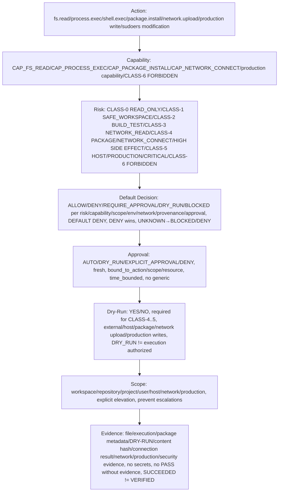

# Policy Risk Matrix — P11

> CONTRACTS ONLY — No implementation, no package install, no system changes, repository-only.

## Purpose

Policy Risk Matrix defines table Action, Capability, Risk, Default Decision, Approval, Dry-Run, Scope, Evidence with examples, for Policy Engine deterministic decision, fail-closed, default deny.

## Matrix

| Action | Capability | Risk | Default Decision | Approval | Dry-Run | Scope | Evidence |
|--------|------------|------|------------------|----------|---------|-------|----------|
| fs.read workspace | CAP_FS_READ | CLASS-0 READ_ONLY, LOW | ALLOW | AUTO | NO | workspace | file evidence (hash SHA256, provenance, attestation, no secrets) |
| fs.read repository | CAP_FS_READ | CLASS-0 READ_ONLY, LOW | ALLOW | AUTO | NO | repository | file evidence |
| fs.write workspace | CAP_FS_WRITE | CLASS-1 SAFE_WORKSPACE, MEDIUM | ALLOW with evidence | AUTO with evidence | NO (optional) | workspace | file evidence (hash, provenance, attestation) |
| fs.write workspace new file | CAP_FS_WRITE | CLASS-1 SAFE_WORKSPACE, MEDIUM | ALLOW with evidence | AUTO | NO | workspace | file evidence |
| fs.list workspace | CAP_FS_READ | CLASS-0 READ_ONLY, LOW | ALLOW | AUTO | NO | workspace | list + evidence |
| fs.stat workspace | CAP_FS_READ | CLASS-0 READ_ONLY, LOW | ALLOW | AUTO | NO | workspace | stat + evidence |
| fs.copy workspace | CAP_FS_WRITE (and CAP_FS_READ for source) | CLASS-1 SAFE_WORKSPACE, MEDIUM | ALLOW with evidence | AUTO | NO | workspace | evidence |
| fs.move workspace | CAP_FS_WRITE | CLASS-1 SAFE_WORKSPACE, MEDIUM | ALLOW with evidence | AUTO | NO | workspace | evidence (reversible) |
| fs.delete workspace | CAP_FS_WRITE | CLASS-2 BUILD_TEST, MEDIUM/HIGH | REQUIRE_APPROVAL may be required | REQUIRE_APPROVAL for high sensitivity | NO (optional) | workspace | evidence (irreversible) |
| fs.write host scope | CAP_FS_WRITE | CLASS-4 PACKAGE/NETWORK_CONNECT/HIGH SIDE EFFECT, HIGH/CRITICAL | REQUIRE_APPROVAL | EXPLICIT_APPROVAL + DRY_RUN first | YES | host (explicit + very strong auth + DRY_RUN first + production evidence, no /etc/sudoers) | file evidence + execution evidence + DRY-RUN evidence |
| fs.read host /etc/passwd | CAP_FS_READ | CLASS-4..5 HIGH/CRITICAL | REQUIRE_APPROVAL or DENY depending policy | EXPLICIT_APPROVAL + very strong auth | YES | host | file evidence + security evidence |
| fs.write /etc/sudoers | N/A (CLASS-6 FORBIDDEN) | CLASS-6 FORBIDDEN, CRITICAL | DENY Always | DENY | NO | host | security evidence, SECURITY EVENT, no execution |
| process.exec workspace ["git","status"] | CAP_PROCESS_EXEC | CLASS-2 BUILD_TEST, MEDIUM/HIGH | ALLOW or REQUIRE_APPROVAL per policy, possibly approval, possibly dry-run | AUTO or EXPLICIT_APPROVAL depending risk, e.g., git status AUTO, make REQUIRE_APPROVAL | Possibly (optional for CLASS-2, required for CLASS-4..5) | workspace | execution evidence (exit_code, stdout/stderr refs, resource_usage, side_effects, artifacts, evidence_ref, SUCCEEDED≠VERIFIED) |
| process.exec workspace ["make"] | CAP_PROCESS_EXEC | CLASS-2 BUILD_TEST, MEDIUM/HIGH | REQUIRE_APPROVAL may be required | EXPLICIT_APPROVAL | Possibly | workspace | execution evidence |
| shell.exec workspace "git status && make" | CAP_PROCESS_EXEC | HIGH / CLASS-3..4, HIGH/CRITICAL | REQUIRE_APPROVAL | EXPLICIT_APPROVAL + DRY_RUN first for high-risk | YES for high-risk | workspace/host (depending) | trace + result + evidence (output + trace + evidence, shell syntax, pipelines only if explicitly permitted, high risk, shell.command vs process.argv separated) |
| shell.exec host "rm -rf /tmp/*" | CAP_PROCESS_EXEC | CLASS-4..5 HIGH/CRITICAL | REQUIRE_APPROVAL | EXPLICIT_APPROVAL + DRY_RUN first + very strong auth | YES | host | trace + result + evidence |
| package.install powershell | CAP_PACKAGE_INSTALL | CLASS-4 PACKAGE/NETWORK_CONNECT/HIGH SIDE EFFECT, HIGH | REQUIRE_APPROVAL | EXPLICIT_APPROVAL + DRY_RUN first | YES (mandatory) | host (explicit host scope via Privilege Gate) | package metadata + execution evidence + DRY-RUN evidence + ACTION/CLASS/POLICY/DECISION/EXECUTION/EXIT_CODE/TIMESTAMP/SYSTEM_SUDO/PROJECT_POLICY |
| package.install gcc | CAP_PACKAGE_INSTALL | CLASS-4, HIGH | REQUIRE_APPROVAL | EXPLICIT_APPROVAL + DRY_RUN first | YES | host | package metadata + execution evidence |
| package.remove powershell | CAP_PACKAGE_REMOVE (future, DEFERRED/RESTRICTED in P10/P11) | CLASS-4..5 HIGH/CRITICAL | DEFERRED/RESTRICTED or REQUIRE_APPROVAL + very strong auth + DRY_RUN first (future) | EXPLICIT_APPROVAL + very strong auth + DRY_RUN first (future) | YES (future) | host | package metadata + execution evidence (future) |
| network.read official allowlisted github.com | CAP_NETWORK_READ | CLASS-3 NETWORK_READ, LOW/MEDIUM | ALLOW | AUTO with allowlist check | NO | network | content hash/evidence, READ_ONLY |
| network.read official allowlisted api.github.com | CAP_NETWORK_READ | CLASS-3, LOW/MEDIUM | ALLOW | AUTO with allowlist check | NO | network | content hash/evidence |
| network.connect official allowlisted github.com:443 | CAP_NETWORK_CONNECT | CLASS-3..4 MEDIUM/HIGH | ALLOW or REQUIRE_APPROVAL per policy, AUTO/EXPLICIT depending scope | AUTO with allowlist check for official / EXPLICIT for unrestricted | Possibly | network | connection result + evidence |
| network.connect unrestricted example.com:443 | CAP_NETWORK_CONNECT | CLASS-4..5 HIGH/CRITICAL | REQUIRE_APPROVAL | EXPLICIT_APPROVAL | YES | network (external) | connection result + evidence, EXTERNAL_SIDE_EFFECT, allowlist+explicit policy required, Unknown destination BLOCKED, no unrestricted Internet except capability+explicit policy |
| network.download official allowlisted | CAP_NETWORK_READ/CONNECT | CLASS-3..4 MEDIUM/HIGH | ALLOW or REQUIRE_APPROVAL, AUTO with allowlist check for official / EXPLICIT for unrestricted | AUTO/EXPLICIT | Possibly | network/workspace | file + evidence |
| network.upload | CAP_NETWORK_CONNECT | HIGH/CRITICAL, CLASS-4..5 | REQUIRE_APPROVAL | EXPLICIT_APPROVAL | YES | external (network) | network + evidence, EXTERNAL_SIDE_EFFECT, no secret exfiltration |
| production write production database | production capability e.g., CAP_NETWORK_CONNECT production or future CAP_DB_WRITE production | CLASS-5 HOST/PRODUCTION/CRITICAL, CRITICAL | REQUIRE_APPROVAL / DENY per policy, stronger policy, very strong auth + production evidence | strong approval (very strong auth + production evidence) | YES | production (explicit production scope, no MOCK→PRODUCTION, no LOCAL→PRODUCTION, no ARENA→PRODUCTION) | production evidence (hash, provenance, attestation, who verified when how, no secrets, no PASS without evidence, production evidence) |
| production write production API | production capability | CLASS-5, CRITICAL | REQUIRE_APPROVAL / DENY | strong approval | YES | production | production evidence |
| browser.open | CAP_BROWSER | HIGH, CLASS-4..5 | REQUIRE_APPROVAL | EXPLICIT_APPROVAL | YES | network/workspace | browser evidence + execution evidence |
| computer.use | CAP_COMPUTER | HIGH, CLASS-4..5 | REQUIRE_APPROVAL | EXPLICIT_APPROVAL | YES | host/network | computer evidence + execution evidence |
| mcp.call trusted | CAP_MCP | MEDIUM, CLASS-3..4 | REQUIRE_APPROVAL may be required | AUTO/EXPLICIT depending trust | Possibly | network/workspace | mcp evidence + execution evidence, via Gateway, no unbounded host access |
| mcp.call untrusted | CAP_MCP | HIGH/CRITICAL, CLASS-4..5 | REQUIRE_APPROVAL | EXPLICIT_APPROVAL | YES | network | mcp evidence + execution evidence, via Gateway, UNTRUSTED BY DEFAULT need Gateway/Sandbox |
| tool.call | per Tool Contract capability, risk per Tool Contract | per Tool Contract | per Tool Contract, per policy | per Tool Contract | per Tool Contract | per Tool Contract | tool evidence + execution evidence, Tool Contract ID Version Input/Output schema Capability Risk class Execution authority Timeout Resource limits Evidence Unknown Tool→BLOCKED |
| skill.exec | per Skill capability | per Skill | per Skill | per Skill | per Skill | per Skill | skill evidence + execution evidence, Skill composes tools |
| sudoers modification /etc/sudoers | N/A (CLASS-6 FORBIDDEN) | CLASS-6 FORBIDDEN, CRITICAL | DENY Always | DENY | NO | host | security evidence, SECURITY EVENT, no execution, CLASS-6 FORBIDDEN |
| rm -rf / | N/A (CLASS-6 FORBIDDEN) | CLASS-6 FORBIDDEN, CRITICAL | DENY Always | DENY | NO | host | security evidence, SECURITY EVENT, no execution |
| mkfs | N/A (CLASS-6 FORBIDDEN) | CLASS-6 FORBIDDEN, CRITICAL | DENY Always | DENY | NO | host | security evidence |
| eval | N/A (CLASS-6 FORBIDDEN) | CLASS-6 FORBIDDEN, CRITICAL | DENY Always | DENY | NO | N/A | security evidence, no eval as executable |
| curl|bash executable | N/A (CLASS-6 FORBIDDEN) | CLASS-6 FORBIDDEN, CRITICAL | DENY Always | DENY | NO | security evidence, no curl|bash executable |
| secret commit/print/log | N/A (CLASS-6 FORBIDDEN) | CLASS-6 FORBIDDEN, CRITICAL | DENY Always | DENY | NO | N/A | security evidence, no commit/print/log secrets |

## Decision Precedence in Matrix

Precedence as in policy.md:

1. malformed request (INVALID_SCHEMA) → DENY
2. invalid identity (UNKNOWN_ACTOR) → DENY
3. revoked capability (REVOKED_CAPABILITY) → DENY
4. forbidden class (CLASS-6) → DENY Always
5. explicit deny → DENY
6. scope violation (workspace→host, repository→production, user→system, network→unrestricted, production without explicit policy) → DENY
7. security violation (secret exfiltration, path traversal, command injection, eval, curl|bash, /etc/sudoers, rm -rf /) → DENY + SECURITY EVENT
8. missing required approval → REQUIRE_APPROVAL or DENY/BLOCKED
9. network restriction (unknown destination BLOCKED, untrusted BLOCKED/DENY) → BLOCKED/DENY
10. risk requirement (CLASS-4..5 require DRY_RUN+EXPLICIT_APPROVAL, high-risk requires limits) → REQUIRE_APPROVAL/DRY_RUN
11. dry-run requirement → DRY_RUN
12. explicit allow → ALLOW

Any contradiction deny vs allow: DENY wins
Any UNKNOWN: BLOCKED/DENY
No last rule wins unless explicit precedence documented
Deterministic same Policy Version/Input/Context → same Decision

## Default Deny

DEFAULT: DENY, any rule not existing DENY, any capability unknown DENY, any resource unknown DENY, any actor unknown DENY, any scope unclear DENY, any network destination untrusted BLOCKED, any production target unauthorized DENY, core invariant POL-01.

## Fail-Closed

Cases UNKNOWN_ACTION, UNKNOWN_ACTOR, UNKNOWN_CAPABILITY, UNKNOWN_RESOURCE, UNKNOWN_SCOPE, INVALID_SCHEMA, MISSING_POLICY, POLICY_CONFLICT, MISSING_AUTHORIZATION, MISSING_APPROVAL, NETWORK_UNVERIFIED, UNTRUSTED_PROVENANCE, EXPIRED_AUTHORIZATION, REVOKED_CAPABILITY, MISSING_EVIDENCE_REQUIREMENT must lead to BLOCKED or DENY per semantics, no ASSUME ALLOW.

## Diagrams

### Policy Risk Matrix Flow

ASCII:

```
Action (e.g., fs.read workspace, process.exec workspace, shell.exec, package.install, network.upload, production write, sudoers modification)
  ↓
Capability (e.g., CAP_FS_READ, CAP_PROCESS_EXEC, CAP_PACKAGE_INSTALL, CAP_NETWORK_CONNECT, production capability, CLASS-6 FORBIDDEN)
  ↓
Risk (CLASS-0 READ_ONLY, CLASS-1 SAFE_WORKSPACE, CLASS-2 BUILD_TEST, CLASS-3 NETWORK_READ, CLASS-4 PACKAGE/NETWORK_CONNECT/HIGH SIDE EFFECT, CLASS-5 HOST/PRODUCTION/CRITICAL, CLASS-6 FORBIDDEN)
  ↓
Default Decision (ALLOW, DENY, REQUIRE_APPROVAL, DRY_RUN, BLOCKED per risk, capability, scope, environment, network, provenance, approval, etc., DEFAULT DENY, DENY wins over ALLOW, UNKNOWN→BLOCKED/DENY)
  ↓
Approval (AUTO, DRY_RUN, EXPLICIT_APPROVAL, DENY, approval must be fresh, bound_to_action, bound_to_scope, bound_to_resource, time_bounded, no generic approval "allow this Agent anything", approval replay protection bound to action_id, policy_version, capability, resource, scope, risk, input_hash, correlation_id, expiry)
  ↓
Dry-Run (YES/NO, required for CLASS-4..5, external side effects, host mutations, package installation, network upload, production writes, DRY_RUN does not mean execution authorized but simulation authorized, then new authorization for real)
  ↓
Scope (workspace, repository, project, user, host, network, production, explicit elevation, must prevent escalations workspace→host, repository→production, user→system, network→unrestricted, production without explicit policy)
  ↓
Evidence (file evidence, execution evidence, package metadata + execution evidence + DRY-RUN evidence + ACTION/CLASS/POLICY/DECISION/EXECUTION/EXIT_CODE/TIMESTAMP/SYSTEM_SUDO/PROJECT_POLICY, content hash/evidence, connection result+evidence, network+evidence, production evidence, security evidence, no secrets, no PASS without evidence, SUCCEEDED≠VERIFIED)
```

Mermaid:



## Invariants

- No implementation language chosen in P11, no product code, no package installation, no system changes, repository-only, only policy contracts, schemas, decision model, rule model, risk model, approval model, conflict model, evaluation state machine, policy invariants, ADR, tests, verification scripts, documentation, ASCII/Mermaid diagrams, respects P8 frozen baseline, P9 Core Runtime Contracts, P10 Execution Authority Contracts, any violation requires ADR
- Policy Risk Matrix defines Action, Capability, Risk, Default Decision, Approval, Dry-Run, Scope, Evidence with examples fs.read workspace CAP_FS_READ CLASS-0 ALLOW AUTO NO workspace file evidence, process.exec workspace CAP_PROCESS_EXEC CLASS-2/HIGH per policy possibly approval possibly dry-run workspace execution evidence, shell.exec CAP_PROCESS_EXEC HIGH REQUIRE_APPROVAL YES YES workspace/host trace+result+evidence, package.install CAP_PACKAGE_INSTALL CLASS-4 REQUIRE_APPROVAL YES YES host package+execution evidence, network.upload CAP_NETWORK_CONNECT HIGH/CRITICAL REQUIRE_APPROVAL YES YES external network+evidence, production write production capability CLASS-5 REQUIRE_APPROVAL/DENY strong approval YES production production evidence, sudoers modification CLASS-6 DENY DENY NO host security evidence
- Decision precedence 1 malformed, 2 invalid identity, 3 revoked capability, 4 forbidden class, 5 explicit deny, 6 scope violation, 7 security violation, 8 missing approval, 9 network restriction, 10 risk requirement, 11 dry-run requirement, 12 explicit allow, DENY wins over ALLOW, UNKNOWN→BLOCKED/DENY, no last rule wins unless explicit precedence documented, deterministic
- Default deny DEFAULT DENY, any rule not existing DENY, any capability unknown DENY, any resource unknown DENY, any actor unknown DENY, any scope unclear DENY, any network destination untrusted BLOCKED, any production target unauthorized DENY, core invariant POL-01
- Fail-closed cases UNKNOWN_ACTION, UNKNOWN_ACTOR, UNKNOWN_CAPABILITY, UNKNOWN_RESOURCE, UNKNOWN_SCOPE, INVALID_SCHEMA, MISSING_POLICY, POLICY_CONFLICT, MISSING_AUTHORIZATION, MISSING_APPROVAL, NETWORK_UNVERIFIED, UNTRUSTED_PROVENANCE, EXPIRED_AUTHORIZATION, REVOKED_CAPABILITY, MISSING_EVIDENCE_REQUIREMENT must lead to BLOCKED or DENY per semantics, no ASSUME ALLOW
- Diagrams ASCII+Mermaid Policy Risk Matrix Flow
- Respects P8 frozen baseline and P9/P10 contracts, no violation without ADR, free-first vendor-neutral self-hostable local-capable no mandatory paid API/cloud DB, low-resource modes CORE/STANDARD/HEAVY respected no GPU/K8s assumed, open decisions PENDING with criteria no fill gap

## References

- docs/contracts/policy.md (Policy Engine, PolicyRequest, PolicyDecision, PolicyRule, etc.)
- docs/contracts/policy-lifecycle.md (policy lifecycle, decision lifecycle)
- docs/contracts/runtime.md, task.md, action.md, event.md, result.md, lifecycle.md (P9)
- docs/contracts/execution-authority.md, executor-shell.md, executor-process.md, executor-file.md, executor-network.md, executor-package.md, executor-matrix.md, execution-lifecycle.md (P10)
- docs/architecture/frozen-baseline.md (P8 freeze)
- docs/architecture/adr/0007-core-runtime-contracts.md (P9), 0008-execution-authority-contract.md (P10), 0009-policy-engine-contract.md (P11)
```

