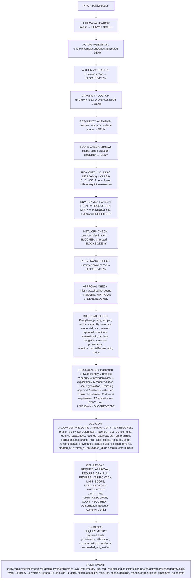
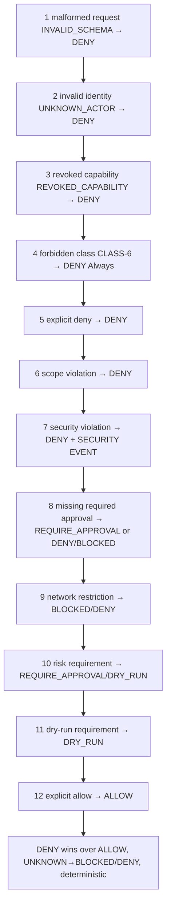
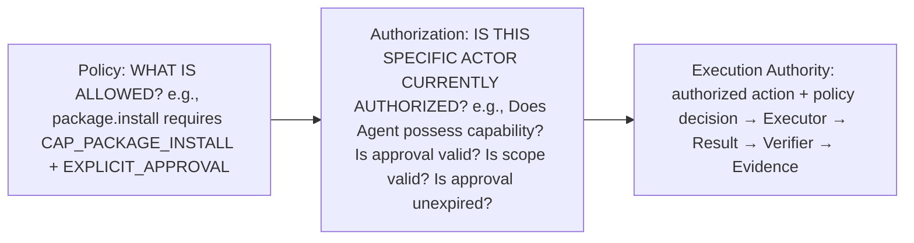
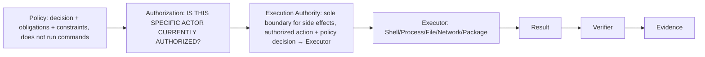
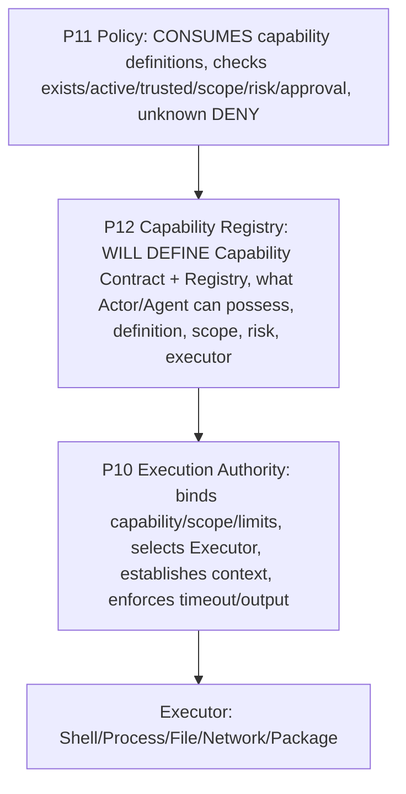
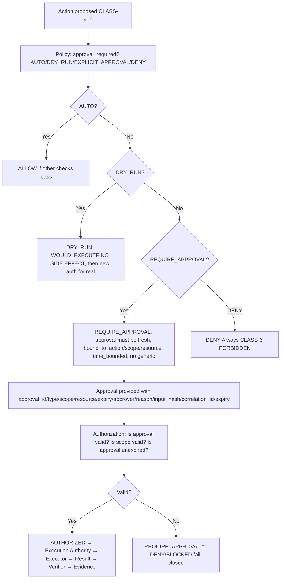

# Policy Engine Contract — P11

> **P11 = POLICY CONTRACT ONLY — No Policy Engine implementation, no Policy runtime, no Rule interpreter implementation, no database implementation, no API implementation, no UI implementation, no Agent implementation, no Capability Registry implementation, no Executor implementation, no package installation, no PowerShell installation, no Docker, no production deployment, no system changes.**
> Only policy contracts, schemas, decision model, rule model, risk model, approval model, conflict model, evaluation state machine, policy invariants, ADR, tests, verification scripts, documentation, ASCII/Mermaid diagrams.
> Respects P8 Architecture Freeze, P9 Core Runtime Contracts, P10 Execution Authority Contracts. Any violation requires ADR.
> **P11 does NOT redefine Capability Model.** Policy Engine consumes `capability_required` and Capability Registry data as inputs, while formal details of Capabilities themselves will be fixed in P12. This prevents duplicate authority between P11 and P12.

## Core Principle

```
AI PROPOSES
↓
POLICY EVALUATES
↓
AUTHORIZATION CONFIRMS
↓
EXECUTION AUTHORITY EXECUTES
↓
VERIFIER PROVES
```

Policy Engine:

- DOES decide policy (WHAT IS ALLOWED?).
- DOES NOT execute actions (no shell, no sudo, no file modification, no network request).
- DOES NOT grant itself capabilities.
- DOES NOT act as Executor (Executor is separate, via Execution Authority).
- DOES NOT act as Verifier (Verifier is separate, Verifier not Authorization Authority, AI not Verifier, no PASS without evidence).
- DOES NOT become an LLM (LLM proposes, Policy evaluates, LLM does not enter final authorization calculation, deterministic).
- DOES NOT infer permissions from natural-language intent alone (LLM intent → structured Action → validated schema → Policy evaluation, if not convertible to Action Contract → BLOCKED).

## Policy Engine Responsibility

Policy Engine responsible for:

- evaluate Action (from P9/P10 Action Contract, no redefine, but must check action_id, action_type, capability_required, resource, scope, risk_class, input_schema, approval requirement, dry_run requirement)
- validate policy applicability (which policy, which version, which rules, policy_id, policy_version, policy_hash, policy lifecycle ACTIVE only, DRAFT no authorize, SUSPENDED DENY/BLOCKED, REVOKED DENY, EXPIRED DENY)
- evaluate capability requirement (capability_required, reads capability definition from Capability Registry, but does not create Capability Registry semantics in P11, P12 will be Capability Contract, Policy only checks capability exists, active, trusted, scope, risk, approval requirement, unknown DENY, inactive DENY, revoked DENY, expired DENY)
- evaluate actor (actor_id, actor_type, role, trust_level, capabilities, scope, authentication_state, authorization_context, provenance, types user/agent/service/tool/mcp_server/execution_authority/system, unknown actor DENY, ambiguous actor DENY, unauthenticated actor for protected operation DENY/REQUIRE_AUTHENTICATION)
- evaluate resource (resource_type, resource_id, resource_scope, resource_owner, resource_environment, resource_sensitivity, examples workspace/repository/file/process/host/network/database/API/package/browser/computer/secret-reference, unknown resource DENY, resource outside actor scope DENY)
- evaluate scope (workspace/repository/project/user/host/network/production, must prevent workspace→host escalation, repository→production escalation, user→system escalation, network→unrestricted escalation, production access without explicit policy)
- evaluate risk (CLASS-0 READ_ONLY, CLASS-1 SAFE_WORKSPACE, CLASS-2 BUILD_TEST, CLASS-3 NETWORK_READ, CLASS-4 PACKAGE/NETWORK_CONNECT/HIGH SIDE EFFECT, CLASS-5 HOST/PRODUCTION/CRITICAL, CLASS-6 FORBIDDEN, must never lower CLASS-5→CLASS-2 without explicit policy rule and documented review, CLASS-6 DENY Always)
- evaluate environment (local, arena, ci, staging, production, LOCAL≠PRODUCTION, MOCK≠PRODUCTION, ARENA≠PRODUCTION, no accept local authorization as alternative for production)
- evaluate context (time_context, provenance, requested_by, correlation_id, timestamp, no secrets)
- evaluate approval state (AUTO, DRY_RUN, EXPLICIT_APPROVAL, DENY, approval_required, approval_type, approval_scope, approval_expiry, approver_identity, approval_reason, approval must be fresh, bound_to_action, bound_to_scope, bound_to_resource, time_bounded, no generic approval "allow this Agent anything", approval replay protection bound to action_id, policy_version, capability, resource, scope, risk, input_hash, correlation_id, expiry, not reusable automatically for different Action)
- evaluate network state (network_mode, destination, protocol, port, domain, ip, allowlist_status, trust_level, rate_limit, payload_limit, unknown destination BLOCKED, external connection per capability/risk/approval, production network stronger policy)
- evaluate policy constraints (policy constraints, obligations, conditions, no condition as shell, no eval, no arbitrary JS execution)
- return deterministic decision (ALLOW, DENY, REQUIRE_APPROVAL, DRY_RUN, BLOCKED, UNKNOWN must never escape as allow, deterministic for same Policy Version, Policy Input, Policy Context must produce same Decision even if Agent or LLM different, LLM does not enter final authorization calculation)
- return explanation/reason (WHY decision, e.g., DENY reason capability CAP_PACKAGE_INSTALL missing, REQUIRE_APPROVAL reason CLASS-4 side effect, BLOCKED reason network trust unavailable, not depend on LLM-generated justification, reason must come from policy evaluation itself)
- return obligations/requirements (REQUIRE_APPROVAL, REQUIRE_DRY_RUN, REQUIRE_VERIFICATION, LIMIT_SCOPE, LIMIT_NETWORK, LIMIT_OUTPUT, LIMIT_TIME, LIMIT_RESOURCE, AUDIT_REQUIRED, obligations must transfer to Authorization, Execution Authority, Verifier, but Policy does not execute itself)
- return policy version (policy_id, policy_version, policy_hash, immutable for decision record, change policy new version no rewrite old decision)
- emit policy decision event (policy.requested, validated, evaluated, allowed, denied, approval_required, dry_run_required, blocked, conflict, failed, updated, activated, suspended, revoked, every event event_id, policy_id, policy_version, policy_request_id, decision_id, actor, action, capability, resource, scope, decision, reason, correlation_id, timestamp, no secrets)

Policy Engine must NOT:

- execute shell (no shell, no bash -c, no sh -c)
- call sudo (no sudo, no sudo <arbitrary>, no sudo bash/sh/env/-i/su)
- modify files (no file mutation, File Executor is separate via Execution Authority)
- send network request (no network, Network Executor is separate via Execution Authority)
- modify Capability Registry (Capability Registry is separate, P12, Policy consumes capability definitions, does not create)
- silently authorize (no silent authorize, must have explicit decision, explanation, obligations, evidence requirements)
- silently downgrade risk (must never lower CLASS-5→CLASS-2 without explicit policy rule and documented review, CLASS-6 DENY Always)
- turn UNKNOWN into ALLOW (UNKNOWN must never escape as allow, must be BLOCKED/DENY, fail-closed)

## Policy Input Contract — PolicyRequest

File: docs/contracts/policy.md (this file)

PolicyRequest schema (contract, no implementation):

```json
{
  "policy_request_id": "string, unique, immutable, e.g., policy-req-uuid",
  "version": "string, semver, e.g., '1.0.0'",
  "actor": {
    "actor_id": "string, e.g., user-uuid, agent-uuid, service-uuid, tool-id, mcp_server-id, execution_authority-id, system",
    "actor_type": "user | agent | service | tool | mcp_server | execution_authority | system",
    "role": "string, role, e.g., 'developer', 'reviewer', 'executor'",
    "trust_level": "untrusted | semi_trusted | trusted, e.g., LLM untrusted, Agent semi_trusted, Policy/Execution Authority/Verifier trusted",
    "capabilities": ["CAP_* that actor has, e.g., CAP_FS_READ, CAP_FS_WRITE, CAP_PROCESS_EXEC, CAP_NETWORK_READ, CAP_NETWORK_CONNECT, CAP_PACKAGE_INSTALL, CAP_BROWSER, CAP_COMPUTER, CAP_MCP, CAP_SECRET_ACCESS"],
    "scope": "workspace | repository | project | user | host | network | production, explicit elevation, workspace scope ≠ host scope",
    "authentication_state": "authenticated | unauthenticated | expired, unknown actor DENY, ambiguous actor DENY, unauthenticated for protected DENY/REQUIRE_AUTHENTICATION",
    "authorization_context": "object, e.g., approval_id, approval_expiry, approval_scope, approval_resource, approval_type, no secrets",
    "provenance": {
      "source": "string, e.g., 'agent', 'tool', 'mcp_server', 'plugin', 'external', 'system'",
      "version": "string, version of source",
      "hash": "string, SHA256 hash of source if applicable",
      "issuer": "string, who issued, e.g., user, system",
      "trust_level": "trusted | semi_trusted | untrusted, untrusted provenance BLOCKED/DENY especially plugin, MCP server, external tool, binary, dependency",
      "timestamp": "timestamp UTC"
    }
  },
  "actor_type": "user | agent | service | tool | mcp_server | execution_authority | system, redundant with actor.actor_type but explicit for validation",
  "action": {
    "action_id": "string, reference to Action Contract from P9/P10, must exist, must be validated",
    "action_type": "string, e.g., 'fs.read', 'fs.write', 'process.exec', 'shell.exec', 'network.read', 'network.connect', 'package.install', 'browser.open', 'computer.use', 'mcp.call', 'tool.call', 'skill.exec', 'workflow.step'",
    "capability_required": "string, e.g., 'CAP_FS_READ', 'CAP_FS_WRITE', 'CAP_PROCESS_EXEC', 'CAP_NETWORK_READ', 'CAP_NETWORK_CONNECT', 'CAP_PACKAGE_INSTALL', explicit, DEFAULT DENY, UNKNOWN→DENY, must be in Capability Registry, must be subset of Task capabilities_required and actor capabilities",
    "resource": "string, e.g., file path, executable, URL, package name, must be validated, no path traversal, no /etc/sudoers, no root filesystem mutation unless explicit host scope + very strong auth + production evidence",
    "scope": "workspace | repository | project | user | host | network | production, explicit elevation, workspace scope ≠ host scope, must prevent workspace→host escalation, repository→production escalation, user→system escalation, network→unrestricted escalation, production access without explicit policy",
    "risk_class": "CLASS-0 | CLASS-1 | CLASS-2 | CLASS-3 | CLASS-4 | CLASS-5 | CLASS-6, from Action, must never lower CLASS-5→CLASS-2 without explicit policy rule and documented review, CLASS-6 DENY Always",
    "input_schema": "JSON Schema, defines expected inputs, no secrets, validated, invalid → DENY",
    "approval_requirement": "AUTO | DRY_RUN | EXPLICIT_APPROVAL | DENY, from Action",
    "dry_run_requirement": "boolean, true if DRY_RUN required where policy says so, especially CLASS-4, CLASS-5, external side effects, host mutations, package installation, network upload, production writes"
  },
  "action_type": "string, e.g., 'fs.read', redundant with action.action_type but explicit for validation",
  "task_id": "string | null, reference to Task",
  "run_id": "string | null, reference to Run",
  "action_id": "string, reference to Action, must exist",
  "capability_required": "string, e.g., 'CAP_FS_READ', explicit, DEFAULT DENY, UNKNOWN→DENY, must be in Capability Registry",
  "resource": {
    "resource_type": "string, e.g., 'workspace', 'repository', 'file', 'process', 'host', 'network', 'database', 'API', 'package', 'browser', 'computer', 'secret-reference'",
    "resource_id": "string, e.g., file path, executable, URL, package name, must be validated, no path traversal, no /etc/sudoers",
    "resource_scope": "workspace | repository | project | user | host | network | production, explicit",
    "resource_owner": "string, owner, e.g., user, agent, service",
    "resource_environment": "local | arena | ci | staging | production, LOCAL≠PRODUCTION, MOCK≠PRODUCTION, ARENA≠PRODUCTION",
    "resource_sensitivity": "low | medium | high | critical, e.g., workspace low, host high, production critical, secret-reference critical"
  },
  "scope": "workspace | repository | project | user | host | network | production, explicit elevation, must prevent escalations",
  "risk_class": "CLASS-0 | CLASS-1 | CLASS-2 | CLASS-3 | CLASS-4 | CLASS-5 | CLASS-6, must never lower CLASS-5→CLASS-2 without explicit rule and review, CLASS-6 DENY Always",
  "environment": "local | arena | ci | staging | production, LOCAL≠PRODUCTION, MOCK≠PRODUCTION, ARENA≠PRODUCTION, no accept local authorization as alternative for production",
  "context": {
    "time_context": "timestamp UTC, e.g., when requested",
    "provenance": {
      "source": "string, e.g., 'agent', 'tool', 'mcp_server', 'plugin', 'external', 'system'",
      "version": "string",
      "hash": "string, SHA256",
      "issuer": "string",
      "trust_level": "trusted | semi_trusted | untrusted, untrusted BLOCKED/DENY especially plugin, MCP server, external tool, binary, dependency",
      "timestamp": "timestamp UTC"
    },
    "requested_by": "string, who requested, e.g., user, agent, service",
    "correlation_id": "string, ties request to workflow, task, run, action, events, results, evidence, must be present",
    "custom": "object | null, custom context, no secrets, validated"
  },
  "approval": {
    "approval_id": "string | null, if approval exists",
    "approval_type": "AUTO | DRY_RUN | EXPLICIT_APPROVAL | DENY | null",
    "approval_scope": "workspace | repository | project | user | host | network | production | null, must be bound to specific action/context, no generic approval 'allow this Agent anything'",
    "approval_resource": "string | null, bound to resource",
    "approval_expiry": "timestamp UTC | null, approval must be fresh, time_bounded, expired → DENY/BLOCKED",
    "approver_identity": "string | null, who approved",
    "approval_reason": "string | null, why approved",
    "input_hash": "string | null, SHA256 hash of input, for replay protection, bound to action_id, policy_version, capability, resource, scope, risk, input_hash, correlation_id, expiry"
  },
  "network_context": {
    "network_mode": "allowlist | deny | unrestricted (only with CAP_NETWORK_CONNECT + explicit policy)",
    "destination": "string | null, e.g., 'https://github.com/...', must be validated, unknown destination BLOCKED, no unrestricted Internet except capability+explicit policy",
    "protocol": "string | null, e.g., 'https', 'http', 'tcp', must be validated",
    "port": "number | null, e.g., 443, 80, must be validated",
    "domain": "string | null, e.g., 'github.com', must be validated, allowlist official only, no random mirror",
    "ip": "string | null, must be validated",
    "allowlist_status": "allowlisted | not_allowlisted | unknown, unknown → BLOCKED for high-risk",
    "trust_level": "trusted | semi_trusted | untrusted, untrusted → BLOCKED/DENY for high-risk",
    "rate_limit": "number | null, max requests per second, design only",
    "payload_limit": "number | null, max payload bytes"
  },
  "filesystem_context": {
    "filesystem_scope": "workspace | repository | project | user | host | network | production, explicit",
    "root": "string, e.g., workspace_root, repository_root, project_root, must be validated, allowed roots, no /etc, no /etc/sudoers unless explicit host scope + very strong auth",
    "path": "string, e.g., file path, must be validated, canonicalized path, allowed roots, traversal check, symlink policy, host vs workspace, examples workspace/file.txt permitted according to capability, ../etc/passwd DENY, /etc/sudoers DENY/CLASS-6, unknown root BLOCKED",
    "operation": "read | write | list | stat | copy | move | delete, must be known",
    "sensitivity": "low | medium | high | critical"
  },
  "time_context": "timestamp UTC, when requested, for expiry checks, approval expiry, policy effective_from/effective_until",
  "provenance": {
    "source": "string, e.g., 'agent', 'tool', 'mcp_server', 'plugin', 'external', 'system'",
    "version": "string",
    "hash": "string, SHA256",
    "issuer": "string",
    "trust_level": "trusted | semi_trusted | untrusted, untrusted BLOCKED/DENY especially plugin, MCP server, external tool, binary, dependency",
    "timestamp": "timestamp UTC"
  },
  "requested_by": "string, who requested",
  "correlation_id": "string, must be present, ties request to workflow, task, run, action, events, results, evidence",
  "timestamp": "timestamp UTC, when request created, immutable"
}
```

Every input validated, typed, schema-constrained, no secrets (no API keys, tokens, private keys, credentials, no commit/print/log secrets, validated via secret-scan).

## Actor Model

Policy must receive Actor Identity:

- actor_id: string, e.g., user-uuid, agent-uuid, service-uuid, tool-id, mcp_server-id, execution_authority-id, system
- actor_type: user | agent | service | tool | mcp_server | execution_authority | system
- role: string, e.g., developer, reviewer, executor
- trust_level: untrusted | semi_trusted | trusted, e.g., LLM untrusted, Agent semi_trusted, Policy/Execution Authority/Verifier trusted
- capabilities: array CAP_* that actor has
- scope: workspace | repository | project | user | host | network | production, explicit elevation, workspace scope ≠ host scope
- authentication_state: authenticated | unauthenticated | expired, unknown actor DENY, ambiguous actor DENY, unauthenticated for protected DENY/REQUIRE_AUTHENTICATION
- authorization_context: object, e.g., approval_id, approval_expiry, approval_scope, approval_resource, approval_type, no secrets
- provenance: source, version, hash, issuer, trust_level, timestamp, untrusted provenance BLOCKED/DENY especially plugin, MCP server, external tool, binary, dependency

Actor types: user, agent, service, tool, mcp_server, execution_authority, system.

Unknown actor: DENY, fail-closed.

Ambiguous actor: DENY, fail-closed.

Unauthenticated actor for protected operation: DENY / REQUIRE_AUTHENTICATION, fail-closed.

## Action Model

Policy depends on Action Contract from P9/P10, does not redefine Action schema, but must check:

- action_id: reference to Action, must exist, must be validated
- action_type: e.g., fs.read, fs.write, process.exec, shell.exec, network.read, network.connect, package.install, browser.open, computer.use, mcp.call, tool.call, skill.exec, workflow.step
- capability_required: explicit CAP_*, DEFAULT DENY, UNKNOWN→DENY, must be in Capability Registry, must be subset of Task capabilities_required and actor capabilities
- resource: file path, executable, URL, package name, must be validated, no path traversal, no /etc/sudoers, no root filesystem mutation unless explicit host scope + very strong auth + production evidence
- scope: workspace/repository/project/user/host/network/production, explicit elevation, must prevent workspace→host escalation, repository→production escalation, user→system escalation, network→unrestricted escalation, production access without explicit policy
- risk_class: CLASS-0..6, must never lower CLASS-5→CLASS-2 without explicit policy rule and documented review, CLASS-6 DENY Always
- input_schema: JSON Schema, defines expected inputs, no secrets, validated, invalid → DENY
- approval requirement: AUTO/DRY_RUN/EXPLICIT_APPROVAL/DENY, from Action
- dry_run requirement: boolean, true if DRY_RUN required where policy says so, especially CLASS-4, CLASS-5, external side effects, host mutations, package installation, network upload, production writes

Unknown action: BLOCKED/DENY per source of failure, fail-closed, unknown action → BLOCKED/DENY, invalid schema → DENY, missing fields → DENY/BLOCKED.

## Capability Input

Policy uses capability_required and reads capability definition from Capability Registry, but does not create Capability Registry semantics in P11, P12 will be Capability Contract, Policy only checks:

- capability exists (must be in Capability Registry, unknown → DENY)
- capability active (must be active, inactive → DENY, revoked → DENY, expired → DENY)
- capability trusted (must be trusted, untrusted provenance BLOCKED/DENY especially plugin, MCP server, external tool, binary, dependency)
- capability scope (must match requested scope, workspace scope ≠ host scope, elevation needs explicit authorization, scope violation → DENY)
- capability risk (must match risk_class, must never lower CLASS-5→CLASS-2 without explicit rule and review, CLASS-6 DENY Always)
- capability approval requirement (must match approval requirement, AUTO/DRY_RUN/EXPLICIT_APPROVAL/DENY, approval must be fresh, bound_to_action, bound_to_scope, bound_to_resource, time_bounded, no generic approval)

Unknown capability: DENY, fail-closed.

Inactive capability: DENY.

Revoked capability: DENY.

Expired capability: DENY.

## Resource Model

- resource_type: string, e.g., workspace, repository, file, process, host, network, database, API, package, browser, computer, secret-reference
- resource_id: string, e.g., file path, executable, URL, package name, must be validated, no path traversal, no /etc/sudoers
- resource_scope: workspace/repository/project/user/host/network/production, explicit
- resource_owner: string, owner, e.g., user, agent, service
- resource_environment: local/arena/ci/staging/production, LOCAL≠PRODUCTION, MOCK≠PRODUCTION, ARENA≠PRODUCTION
- resource_sensitivity: low/medium/high/critical, e.g., workspace low, host high, production critical, secret-reference critical

Examples: workspace, repository, file, process, host, network, database, API, package, browser, computer, secret-reference.

Unknown resource: DENY, fail-closed.

Resource outside actor scope: DENY, fail-closed, e.g., actor with workspace scope trying to access host resource → DENY, must prevent workspace→host escalation, etc.

## Scope Model

Use P8/P9/P10: workspace, repository, project, user, host, network, production.

Policy must prevent:

- workspace → host escalation (workspace scope trying to access host resource without explicit host capability + explicit policy + very strong auth + DRY_RUN first + production evidence → DENY)
- repository → production escalation (repository scope trying to access production without explicit production policy → DENY)
- user → system escalation (user scope trying to access system without explicit system policy → DENY)
- network → unrestricted escalation (network scope trying to access unrestricted Internet without CAP_NETWORK_CONNECT + explicit policy + allowlist + approval → BLOCKED)
- production access without explicit policy (production access requires explicit production policy, very strong auth, production evidence, no MOCK→PRODUCTION, no LOCAL→PRODUCTION, no ARENA→PRODUCTION)

Scope required, unknown scope DENY, unclear scope DENY, fail-closed.

## Risk Model

- CLASS-0 READ_ONLY: read-only, low risk, e.g., fs.read workspace, process.exec read-only, network.read official allowlisted, AUTO
- CLASS-1 SAFE_WORKSPACE: safe workspace, medium low, e.g., fs.write workspace, fs.copy workspace, AUTO with evidence
- CLASS-2 BUILD_TEST: build/test, medium, e.g., process.exec workspace, build, test, DRY_RUN may be required
- CLASS-3 NETWORK_READ: network read, medium, e.g., network.read official allowlisted, AUTO with allowlist check
- CLASS-4 PACKAGE/NETWORK_CONNECT/HIGH SIDE EFFECT: package, network connect, high side effect, high, e.g., package.install, network.connect unrestricted, network.upload, fs.write host scope, shell.exec, REQUIRE_APPROVAL + DRY_RUN first + --execute explicit + allowlist official only + explicit policy
- CLASS-5 HOST/PRODUCTION/CRITICAL: host, production, critical, high/critical, e.g., host OS, production DB, production API, production database write, requires stronger authorization, very strong auth, production evidence, no MOCK→PRODUCTION, REQUIRE_APPROVAL + very strong auth + production evidence
- CLASS-6 FORBIDDEN: forbidden, e.g., modify sudoers, rm -rf /, mkfs, eval, curl|bash executable, secret commit/print/log, path traversal to /etc/sudoers, root filesystem mutation without explicit host scope + very strong auth, DENY Always, no execution, SECURITY EVENT

Policy must never lower CLASS-5 → CLASS-2 without explicit policy rule and documented review, must document reason, provenance, effective_from/effective_until, status, no silent downgrade.

CLASS-6 DENY Always.

## Decision Model

Allowed decisions:

- ALLOW: Action may proceed to Authorization/Execution under existing constraints, e.g., fs.read workspace with CAP_FS_READ, policy allows, capability exists, scope workspace, risk CLASS-0, AUTO
- DENY: Policy explicitly forbids, e.g., unknown capability DENY, unknown actor DENY, unknown resource DENY, unknown scope DENY, CLASS-6 DENY, scope violation DENY, security violation DENY, production access without explicit policy DENY, etc., fail-closed
- REQUIRE_APPROVAL: Action may proceed only after required approval, e.g., CLASS-4 side effect, package.install, network.connect unrestricted, fs.write host scope, shell.exec, production write, approval must be fresh, bound_to_action, bound_to_scope, bound_to_resource, time_bounded, no generic approval "allow this Agent anything", approval replay protection bound to action_id, policy_version, capability, resource, scope, risk, input_hash, correlation_id, expiry, not reusable automatically for different Action
- DRY_RUN: Simulation required before real side effect, especially CLASS-4, CLASS-5, external side effects, host mutations, package installation, network upload, production writes, DRY_RUN does not mean execution authorized but simulation authorized, then new authorization for real execution, DRY-RUN must produce WOULD_EXECUTE but NO SIDE EFFECT and must mention executor, command/action abstraction, scope, capability, policy, authorization, resource limits, expected side effects, no expose secrets, must use Privilege Gate if Package Executor
- BLOCKED: Policy cannot safely evaluate or required trust/evidence/context is unavailable, e.g., UNKNOWN_ACTION, UNKNOWN_ACTOR, UNKNOWN_CAPABILITY, UNKNOWN_RESOURCE, UNKNOWN_SCOPE, INVALID_SCHEMA, MISSING_POLICY, POLICY_CONFLICT, MISSING_AUTHORIZATION, MISSING_APPROVAL, NETWORK_UNVERIFIED, UNTRUSTED_PROVENANCE, EXPIRED_AUTHORIZATION, REVOKED_CAPABILITY, MISSING_EVIDENCE_REQUIREMENT, etc., fail-closed, no ASSUME ALLOW, must emit policy.blocked event, evidence

UNKNOWN must never escape Policy Engine as an allow decision, UNKNOWN → BLOCKED/DENY, fail-closed.

## Decision Precedence

Precedence clear:

1. malformed request (INVALID_SCHEMA, missing fields, invalid types, no secrets, invalid schema → DENY)
2. invalid identity (UNKNOWN_ACTOR, ambiguous actor, unauthenticated for protected → DENY/REQUIRE_AUTHENTICATION)
3. revoked capability (REVOKED_CAPABILITY, expired, inactive → DENY)
4. forbidden class (CLASS-6 FORBIDDEN → DENY Always)
5. explicit deny (explicit deny rule in policy, e.g., deny package.install for untrusted actor → DENY)
6. scope violation (resource outside actor scope, workspace→host escalation, repository→production escalation, user→system escalation, network→unrestricted escalation, production access without explicit policy → DENY)
7. security violation (secret exfiltration attempt, path traversal, command injection, eval, curl|bash executable, /etc/sudoers modification, rm -rf /, etc. → DENY + SECURITY EVENT)
8. missing required approval (approval required but missing or expired or not bound to action/context → REQUIRE_APPROVAL or DENY/BLOCKED per semantics)
9. network restriction (network destination untrusted, unknown destination BLOCKED, external connection per capability/risk/approval, production network stronger policy → BLOCKED/DENY)
10. risk requirement (risk_class requires approval, dry-run, resource limits, etc., CLASS-4..5 require DRY_RUN + EXPLICIT_APPROVAL, high-risk requires limits → REQUIRE_APPROVAL/DRY_RUN)
11. dry-run requirement (DRY_RUN required where policy says so, especially CLASS-4, CLASS-5, external side effects, host mutations, package installation, network upload, production writes → DRY_RUN)
12. explicit allow (explicit allow rule, e.g., allow fs.read workspace with CAP_FS_READ → ALLOW)

But any contradiction between deny and allow: DENY wins, fail-closed, e.g., ALLOW + DENY → DENY.

Any UNKNOWN: BLOCKED/DENY, fail-closed, no ASSUME ALLOW.

No last rule wins unless explicit precedence documented, precedence must be explicit, deterministic, same Policy Version, Policy Input, Policy Context must produce same Decision even if Agent or LLM different, LLM does not enter final authorization calculation.

## Default Deny

- DEFAULT: DENY, any rule not existing → DENY, fail-closed
- Any capability unknown → DENY
- Any resource unknown → DENY
- Any actor unknown → DENY
- Any scope unclear → DENY
- Any network destination untrusted → BLOCKED
- Any production target unauthorized → DENY
- Any rule non-existing → DENY
- Any capability non-existing → DENY
- Any resource non-existing → DENY
- Any actor non-existing → DENY
- Any scope non-existing → DENY
- Any network destination non-existing or untrusted → BLOCKED
- Any production target non-existing or unauthorized → DENY

Default deny is core invariant POL-01.

## Fail-Closed

Following cases must lead to BLOCKED or DENY per semantics, no ASSUME ALLOW, fail-closed:

- UNKNOWN_ACTION (unknown action, invalid action_id, invalid action_type, missing action, invalid schema → BLOCKED/DENY)
- UNKNOWN_ACTOR (unknown actor, invalid actor_id, ambiguous actor, unauthenticated for protected → DENY/REQUIRE_AUTHENTICATION)
- UNKNOWN_CAPABILITY (unknown capability, capability_required not in Capability Registry, inactive, revoked, expired → DENY)
- UNKNOWN_RESOURCE (unknown resource, resource_type unknown, resource_id unknown, resource outside actor scope → DENY)
- UNKNOWN_SCOPE (unknown scope, scope unclear, scope violation, workspace→host escalation, etc. → DENY)
- INVALID_SCHEMA (invalid schema, malformed request, missing fields, invalid types, no secrets, path traversal, command injection, secret exfiltration, eval, curl|bash executable, etc. → DENY + SECURITY EVENT if injection/secret)
- MISSING_POLICY (missing policy, no active policy, policy not found, policy version not found → BLOCKED/DENY)
- POLICY_CONFLICT (policy conflict, ALLOW+DENY, etc., DENY wins, conflict cannot resolve to implicit ALLOW, fail-closed)
- MISSING_AUTHORIZATION (missing authorization, authorization not found, actor not verified, capability not verified, resource not verified, scope not verified, approval not verified → DENY/BLOCKED)
- MISSING_APPROVAL (missing approval, approval required but missing or expired or not bound to action/context → REQUIRE_APPROVAL or DENY/BLOCKED)
- NETWORK_UNVERIFIED (network unverified, network trust unavailable, unknown destination, untrusted destination, network restriction, external connection per capability/risk/approval, production network stronger policy → BLOCKED/DENY)
- UNTRUSTED_PROVENANCE (untrusted provenance, source untrusted, e.g., plugin, MCP server, external tool, binary, dependency, provenance trust_level untrusted → BLOCKED/DENY)
- EXPIRED_AUTHORIZATION (expired authorization, approval expiry, authentication expiry, authorization expiry → DENY/BLOCKED)
- REVOKED_CAPABILITY (revoked capability, capability revoked, inactive, expired → DENY)
- MISSING_EVIDENCE_REQUIREMENT (missing evidence requirement, evidence required but missing, no PASS without evidence, SUCCEEDED≠VERIFIED, missing evidence_id/timestamp/actor/correlation_id/hash/provenance/attestation → BLOCKED/UNVERIFIED)

No ASSUME ALLOW, fail-closed, DEFAULT DENY, UNKNOWN→DENY/BLOCKED.

## Policy Version

Every decision must have:

- policy_id (string, unique, e.g., policy-uuid, which policy)
- policy_version (string, semver, e.g., '1.0.0', version of policy, immutable for decision record)
- policy_hash (string, SHA256 hash of policy, for integrity, e.g., hash of policy rules)

So can know which policy decided what.

Policy version immutable for a decision record, change policy new version no rewrite old decision, old decisions remain with old policy_id, policy_version, policy_hash, new decisions with new version.

Policy lifecycle: CREATED, DRAFT, VALIDATED, ACTIVE, SUSPENDED, REVOKED, EXPIRED, only ACTIVE may participate in normal decisions, DRAFT no authorize, SUSPENDED DENY/BLOCKED, REVOKED DENY, EXPIRED DENY.

## Policy Rule Contract

PolicyRule schema (contract, no implementation):

```json
{
  "rule_id": "string, unique, e.g., rule-uuid",
  "version": "string, semver",
  "priority": "number, priority, e.g., 1..100, higher priority first, but DENY wins over ALLOW regardless of priority unless explicit precedence documented, precedence must be explicit, deterministic",
  "subject": "string, e.g., actor_id, actor_type, role, trust_level, capabilities, scope, who rule applies to",
  "action": "string, e.g., action_type, e.g., 'fs.read', 'fs.write', 'process.exec', 'shell.exec', 'network.read', 'network.connect', 'package.install', etc.",
  "capability": "string, e.g., 'CAP_FS_READ', 'CAP_FS_WRITE', 'CAP_PROCESS_EXEC', 'CAP_NETWORK_READ', 'CAP_NETWORK_CONNECT', 'CAP_PACKAGE_INSTALL', etc., must be in Capability Registry",
  "resource": "string, e.g., resource_type, resource_id, resource_scope, resource_owner, resource_environment, resource_sensitivity, e.g., file path, executable, URL, package name, must be validated, no path traversal, no /etc/sudoers",
  "scope": "workspace | repository | project | user | host | network | production, explicit elevation, must prevent escalations",
  "risk": "CLASS-0 | CLASS-1 | CLASS-2 | CLASS-3 | CLASS-4 | CLASS-5 | CLASS-6, must never lower CLASS-5→CLASS-2 without explicit rule and review, CLASS-6 DENY Always",
  "environment": "local | arena | ci | staging | production, LOCAL≠PRODUCTION, MOCK≠PRODUCTION, ARENA≠PRODUCTION",
  "network": {
    "mode": "allowlist | deny | unrestricted (only with CAP_NETWORK_CONNECT + explicit policy)",
    "destination": "string | null, e.g., 'https://github.com/...', must be validated, unknown destination BLOCKED",
    "protocol": "string | null, e.g., 'https', 'http', 'tcp'",
    "port": "number | null",
    "domain": "string | null, e.g., 'github.com'",
    "ip": "string | null",
    "allowlist_status": "allowlisted | not_allowlisted | unknown, unknown → BLOCKED for high-risk",
    "trust_level": "trusted | semi_trusted | untrusted, untrusted → BLOCKED/DENY for high-risk",
    "rate_limit": "number | null",
    "payload_limit": "number | null"
  },
  "approval": "AUTO | DRY_RUN | EXPLICIT_APPROVAL | DENY, approval required",
  "conditions": "object, conditions, e.g., time_context, provenance, requested_by, correlation_id, no condition as shell, no eval, no arbitrary JavaScript execution, conditions must be deterministic, typed, schema-constrained, no secrets",
  "decision": "ALLOW | DENY | REQUIRE_APPROVAL | DRY_RUN | BLOCKED, decision for rule",
  "obligations": ["string, e.g., 'REQUIRE_APPROVAL', 'REQUIRE_DRY_RUN', 'REQUIRE_VERIFICATION', 'LIMIT_SCOPE', 'LIMIT_NETWORK', 'LIMIT_OUTPUT', 'LIMIT_TIME', 'LIMIT_RESOURCE', 'AUDIT_REQUIRED', obligations must transfer to Authorization, Execution Authority, Verifier, but Policy does not execute itself"],
  "reason": "string, why decision, e.g., 'capability CAP_PACKAGE_INSTALL missing', 'CLASS-4 side effect', 'network trust unavailable', not depend on LLM-generated justification, reason must come from policy evaluation itself, no secrets",
  "provenance": {
    "source": "string, e.g., 'policy-owner', 'system'",
    "version": "string",
    "hash": "string, SHA256",
    "issuer": "string",
    "trust_level": "trusted | semi_trusted | untrusted",
    "timestamp": "timestamp UTC"
  },
  "effective_from": "timestamp UTC | null, when rule becomes effective",
  "effective_until": "timestamp UTC | null, when rule expires, expired → DENY",
  "status": "active | draft | suspended | revoked | expired, only active may participate in normal decisions, draft no authorize, suspended DENY/BLOCKED, revoked DENY, expired DENY"
}
```

No condition as shell, no eval, no arbitrary JavaScript execution, conditions must be deterministic, typed, schema-constrained, no secrets, no path traversal, no command injection, no secret exfiltration.

## Determinism

Policy Engine must be deterministic for same Policy Version, Policy Input, Policy Context must produce same Decision even if Agent or LLM different, LLM does not enter final authorization calculation, deterministic, no randomness, no LLM-generated justification, reason must come from policy evaluation itself.

## Natural Language Boundary

LLM can propose "I want to install PowerShell" but Policy does not convert this sentence directly to ALLOW, must be LLM intent → structured Action → validated schema → Policy evaluation, if not convertible to Action Contract BLOCKED, no infer permissions from natural-language intent alone, LLM proposes, Policy evaluates, Authorization confirms, Execution Authority executes, Verifier proves.

Example:

- LLM: "أريد تثبيت PowerShell" → structured Action: action_type=package.install, capability_required=CAP_PACKAGE_INSTALL, resource=powershell, scope=host, risk_class=CLASS-4, input_schema validated, approval requirement EXPLICIT_APPROVAL, dry_run requirement true → Policy evaluation: capability exists? actor has capability? resource in allowlist? scope host requires explicit authorization? risk CLASS-4 requires DRY_RUN+EXPLICIT_APPROVAL? network destination allowlisted? provenance trusted? approval fresh? etc. → Decision REQUIRE_APPROVAL or DRY_RUN or ALLOW or DENY or BLOCKED with reason, obligations, evidence requirements, policy_id, policy_version, policy_hash, matched_rules, denied_rules, etc., not depend on LLM-generated justification.

If intent not convertible to Action Contract: BLOCKED, e.g., LLM says "do something" without structured Action → BLOCKED, invalid schema → DENY.

## Approval Model

- AUTO: auto, no explicit approval required, e.g., fs.read workspace CLASS-0 READ_ONLY, LOW, AUTO
- DRY_RUN: dry-run required, simulation required before real side effect, especially CLASS-4, CLASS-5, external side effects, host mutations, package installation, network upload, production writes, DRY_RUN does not mean execution authorized but simulation authorized, then new authorization for real execution
- EXPLICIT_APPROVAL: explicit approval required, e.g., CLASS-4 side effect, package.install, network.connect unrestricted, fs.write host scope, shell.exec, production write, approval must be fresh, bound_to_action, bound_to_scope, bound_to_resource, time_bounded, no generic approval "allow this Agent anything", approval replay protection bound to action_id, policy_version, capability, resource, scope, risk, input_hash, correlation_id, expiry, not reusable automatically for different Action
- DENY: deny, no approval can allow, e.g., CLASS-6 FORBIDDEN, modify sudoers, rm -rf /, etc., DENY Always

Policy determines:

- approval_required: AUTO/DRY_RUN/EXPLICIT_APPROVAL/DENY
- approval_type: AUTO/DRY_RUN/EXPLICIT_APPROVAL/DENY
- approval_scope: workspace/repository/project/user/host/network/production, must be bound to specific action/context, no generic approval "allow this Agent anything"
- approval_expiry: timestamp UTC, approval must be fresh, time_bounded, expired → DENY/BLOCKED
- approver_identity: who approved, e.g., user, system, policy-owner
- approval_reason: why approved, e.g., CLASS-4 side effect requires approval

Approval must be:

- fresh (not expired, approval_expiry future)
- bound_to_action (bound to action_id, action_type, capability, resource, scope, risk, input_hash, correlation_id, expiry, not reusable for different Action)
- bound_to_scope (bound to scope, e.g., workspace, host, etc., no generic)
- bound_to_resource (bound to resource, e.g., file path, executable, URL, package name, no generic)
- time_bounded (has expiry, approval_expiry, expired → DENY/BLOCKED)

No generic approval "allow this Agent anything", must be specific.

## Approval Replay Protection

Approval must be bound to:

- action_id (which action)
- policy_version (which policy version)
- capability (which capability)
- resource (which resource)
- scope (which scope)
- risk (which risk)
- input_hash (SHA256 hash of input, for replay protection)
- correlation_id (ties to workflow)
- expiry (when expires)

And must not be reusable automatically for different Action, must re-validate Policy, Authorization, Resource allocation, Evidence for every retry, bounded retry, no bypass.

## Dry-Run Policy

Policy must determine when DRY_RUN required, especially:

- CLASS-4 (PACKAGE/NETWORK_CONNECT/HIGH SIDE EFFECT, e.g., package.install, network.connect unrestricted, network.upload, fs.write host scope, shell.exec)
- CLASS-5 (HOST/PRODUCTION/CRITICAL, e.g., host OS, production DB, production API, production database write)
- external side effects (network.upload, external API call)
- host mutations (fs.write host scope, package.install, system config change)
- package installation (package.install)
- network upload (network.upload)
- production writes (production database write, production API call)

And DRY_RUN does not mean execution authorized but simulation authorized, then new authorization for real execution, DRY-RUN must produce WOULD_EXECUTE but NO SIDE EFFECT and must mention executor, command/action abstraction, scope, capability, policy, authorization, resource limits, expected side effects, no expose secrets, must use Privilege Gate if Package Executor.

## Environment Model

- local: local, e.g., developer machine, local env
- arena: arena, e.g., Arena sandbox, 21G disk, 3.8Gi memory, sudo NOPASSWD:ALL but PROJECT_POLICY CONTROLLED, packages.microsoft.com BLOCKED, etc.
- ci: ci, e.g., GitHub Actions, may differ from Arena, Remote CI NOT VERIFIED until real run
- staging: staging, e.g., staging env, may have production-like but not production
- production: production, e.g., production DB, production API, production env, requires stronger authorization, very strong auth, production evidence, no MOCK→PRODUCTION, no LOCAL→PRODUCTION, no ARENA→PRODUCTION

No accept local authorization as alternative for production authorization, LOCAL≠PRODUCTION, MOCK≠PRODUCTION, ARENA≠PRODUCTION, local authorization cannot be used for production, must have explicit production policy, very strong auth, production evidence.

## Network Policy Input

PolicyRequest must support:

- network_mode: allowlist | deny | unrestricted (only with CAP_NETWORK_CONNECT + explicit policy)
- destination: e.g., https://github.com/..., must be validated, unknown destination BLOCKED, no unrestricted Internet except capability+explicit policy
- protocol: e.g., https, http, tcp, must be validated
- port: e.g., 443, 80, must be validated
- domain: e.g., github.com, must be validated, allowlist official only, no random mirror
- ip: must be validated
- allowlist_status: allowlisted | not_allowlisted | unknown, unknown → BLOCKED for high-risk
- trust_level: trusted | semi_trusted | untrusted, untrusted → BLOCKED/DENY for high-risk
- rate_limit: max requests per second, design only
- payload_limit: max payload bytes

Unknown destination: BLOCKED, fail-closed.

External connection: per capability/risk/approval, e.g., network.read official allowlisted AUTO, network.connect unrestricted EXPLICIT_APPROVAL, etc.

Production network: stronger policy, e.g., production API requires very strong auth, production evidence, no MOCK→PRODUCTION.

## Filesystem Policy Input

Policy must support:

- filesystem_scope: workspace | repository | project | user | host | network | production, explicit
- root: e.g., workspace_root, repository_root, project_root, must be validated, allowed roots, no /etc, no /etc/sudoers unless explicit host scope + very strong auth
- path: e.g., file path, must be validated, canonicalized path, allowed roots, traversal check, symlink policy, host vs workspace, examples workspace/file.txt permitted according to capability, ../etc/passwd DENY, /etc/sudoers DENY/CLASS-6, unknown root BLOCKED
- operation: read | write | list | stat | copy | move | delete, must be known
- sensitivity: low | medium | high | critical

Check canonicalized path, allowed roots, traversal, symlink policy, host vs workspace, Unknown path scope BLOCKED, no ../, no /etc/sudoers, no root filesystem mutation unless explicit host scope + very strong auth + production evidence + DRY_RUN first.

Examples:

- workspace/file.txt → permitted according to capability, e.g., fs.read workspace CAP_FS_READ LOW AUTO → ALLOW
- ../etc/passwd → DENY, path traversal, outside allowed_roots, BLOCKED, execution.filesystem_blocked, SECURITY EVENT
- /etc/sudoers → DENY/CLASS-6, FORBIDDEN, BLOCKED always, no execution, SECURITY EVENT
- unknown root → BLOCKED, fail-closed

## Secret Policy

Policy must understand SECRET_REFERENCE not SECRET_VALUE, presence CAP_SECRET_ACCESS must be CRITICAL EXPLICIT_APPROVAL AUDIT_REQUIRED NO_LOG_VALUE, and not allow secret_value in action input except via future Secret Service contract, P11 does not implement Secret Service.

- SECRET_REFERENCE: reference to secret, e.g., secret_id, env var name, secret manager reference, not value, e.g., secret_id=github_token, env var GITHUB_TOKEN, etc.
- SECRET_VALUE: actual secret value, e.g., API key, token, private key, password, must NOT be in PolicyRequest, PolicyDecision, Action input, etc., unless explicitly authorized by future secret capability and even then must not be logged, no stdout/stderr/event/result/evidence logging of secret, validated via secret-scan.

CAP_SECRET_ACCESS must be CRITICAL, EXPLICIT_APPROVAL, AUDIT_REQUIRED, NO_LOG_VALUE, no log value, must be audited, must have explicit approval, must have very strong auth, must have production evidence if production secret, no MOCK→PRODUCTION.

Policy must not allow secret_value in action input except via future Secret Service contract, P11 does not implement Secret Service, only understands SECRET_REFERENCE.

## Provenance

PolicyRequest must contain:

- source: e.g., agent, tool, mcp_server, plugin, external, system
- version: version of source
- hash: SHA256 hash of source if applicable
- issuer: who issued, e.g., user, system
- trust_level: trusted | semi_trusted | untrusted, untrusted provenance BLOCKED/DENY especially plugin, MCP server, external tool, binary, dependency
- timestamp: timestamp UTC

Untrusted provenance: BLOCKED/DENY, especially plugin, MCP server, external tool, binary, dependency, e.g., plugin with untrusted provenance trying to access host resource → BLOCKED/DENY, must have explicit policy, very strong auth, production evidence, etc., fail-closed.

## Policy Obligations

Decision may return obligations, e.g.:

- REQUIRE_APPROVAL: approval required, must have explicit approval, fresh, bound_to_action, bound_to_scope, bound_to_resource, time_bounded
- REQUIRE_DRY_RUN: dry-run required, simulation required before real side effect, especially CLASS-4, CLASS-5, external side effects, host mutations, package installation, network upload, production writes
- REQUIRE_VERIFICATION: verification required, Verifier must verify Result, produce Evidence, no PASS without evidence, SUCCEEDED≠VERIFIED
- LIMIT_SCOPE: limit scope, e.g., only workspace, not host, must prevent workspace→host escalation
- LIMIT_NETWORK: limit network, e.g., only allowlisted domains, no unrestricted Internet, allowlist official only
- LIMIT_OUTPUT: limit output, e.g., max_output_size, truncation_policy, hash, artifact_reference
- LIMIT_TIME: limit time, e.g., timeout, execution_time, must be bounded
- LIMIT_RESOURCE: limit resource, e.g., cpu, memory, disk, process_count, file_descriptors, network, execution_time, output_size, must be bounded, high-risk requires limits
- AUDIT_REQUIRED: audit required, must emit audit event, e.g., policy.allowed, policy.denied, policy.approval_required, policy.dry_run_required, policy.blocked, etc., with event_id, policy_id, policy_version, policy_request_id, decision_id, actor, action, capability, resource, scope, decision, reason, correlation_id, timestamp, no secrets

Obligations must transfer to Authorization, Execution Authority, Verifier, but Policy does not execute itself, Policy returns decision+obligations+constraints, Authorization confirms IS THIS SPECIFIC ACTOR CURRENTLY AUTHORIZED?, Execution Authority consumes authorized action+policy decision, Verifier decides verification.

## Policy Decision Contract

PolicyDecision schema (contract, no implementation):

```json
{
  "decision_id": "string, unique, immutable, e.g., decision-uuid",
  "policy_request_id": "string, reference to PolicyRequest",
  "decision": "ALLOW | DENY | REQUIRE_APPROVAL | DRY_RUN | BLOCKED",
  "reason": "string, why decision, e.g., 'capability CAP_PACKAGE_INSTALL missing', 'CLASS-4 side effect', 'network trust unavailable', not depend on LLM-generated justification, reason must come from policy evaluation itself, no secrets",
  "policy_id": "string, e.g., policy-uuid, which policy",
  "policy_version": "string, semver, e.g., '1.0.0', version of policy, immutable for decision record",
  "policy_hash": "string, SHA256 hash of policy, for integrity",
  "matched_rules": ["rule_id, list of matched rules that led to decision, e.g., allow fs.read workspace with CAP_FS_READ"],
  "denied_rules": ["rule_id, list of denied rules that would have allowed but denied due to DENY wins, scope violation, security violation, etc."],
  "required_capabilities": ["CAP_* required, e.g., CAP_PACKAGE_INSTALL, CAP_FS_READ, etc."],
  "required_approval": "AUTO | DRY_RUN | EXPLICIT_APPROVAL | DENY | null, approval required, must be fresh, bound_to_action, bound_to_scope, bound_to_resource, time_bounded",
  "dry_run_required": "boolean, true if DRY_RUN required where policy says so, especially CLASS-4, CLASS-5, external side effects, host mutations, package installation, network upload, production writes",
  "obligations": ["string, e.g., 'REQUIRE_APPROVAL', 'REQUIRE_DRY_RUN', 'REQUIRE_VERIFICATION', 'LIMIT_SCOPE', 'LIMIT_NETWORK', 'LIMIT_OUTPUT', 'LIMIT_TIME', 'LIMIT_RESOURCE', 'AUDIT_REQUIRED'"],
  "constraints": {
    "scope": "workspace | repository | project | user | host | network | production, explicit, limited scope if obligation LIMIT_SCOPE",
    "network": {
      "mode": "allowlist | deny | unrestricted (only with CAP_NETWORK_CONNECT + explicit policy)",
      "allowed_domains": ["github.com", "..."],
      "allowed_ips": ["..."],
      "allowed_ports": [443, 80, "..."],
      "protocols": ["https", "http", "..."],
      "max_bytes": "number",
      "timeout": "number, seconds",
      "audit": true
    },
    "output": {
      "max_output_size": "number, bytes",
      "truncation_policy": "head+tail | head | hash_only"
    },
    "time": {
      "timeout": "number, seconds, must be bounded"
    },
    "resource": {
      "cpu": "number | null, design only",
      "memory": "number | null, design only",
      "disk": "number | null, design only",
      "process_count": "number | null",
      "file_descriptors": "number | null",
      "network": "boolean",
      "execution_time": "number, seconds",
      "output_size": "number, max bytes"
    }
  },
  "risk_class": "CLASS-0 | CLASS-1 | CLASS-2 | CLASS-3 | CLASS-4 | CLASS-5 | CLASS-6, from Action, must never lower CLASS-5→CLASS-2 without explicit rule and review, CLASS-6 DENY Always",
  "scope": "workspace | repository | project | user | host | network | production, explicit elevation, must prevent escalations",
  "resource": {
    "resource_type": "string, e.g., 'workspace', 'repository', 'file', 'process', 'host', 'network', 'database', 'API', 'package', 'browser', 'computer', 'secret-reference'",
    "resource_id": "string, e.g., file path, executable, URL, package name",
    "resource_scope": "workspace | repository | project | user | host | network | production",
    "resource_owner": "string",
    "resource_environment": "local | arena | ci | staging | production, LOCAL≠PRODUCTION, MOCK≠PRODUCTION, ARENA≠PRODUCTION",
    "resource_sensitivity": "low | medium | high | critical"
  },
  "actor": {
    "actor_id": "string",
    "actor_type": "user | agent | service | tool | mcp_server | execution_authority | system",
    "role": "string",
    "trust_level": "untrusted | semi_trusted | trusted",
    "capabilities": ["CAP_*"],
    "scope": "workspace | repository | project | user | host | network | production"
  },
  "network_status": "allowlisted | not_allowlisted | unknown | blocked, unknown → BLOCKED for high-risk, blocked → BLOCKED/DENY",
  "provenance_status": "trusted | semi_trusted | untrusted | blocked, untrusted → BLOCKED/DENY especially plugin, MCP server, external tool, binary, dependency",
  "evidence_requirements": {
    "required": true,
    "hash": "SHA256 required",
    "provenance": "who/when/how required",
    "attestation": "verifier_id required, not AI",
    "no_pass_without_evidence": true,
    "succeeded_not_verified": true
  },
  "created_at": "timestamp UTC, immutable",
  "expires_at": "timestamp UTC | null, when decision expires, e.g., approval expiry, time_bounded, expired → DENY/BLOCKED",
  "correlation_id": "string, must be present, ties decision to workflow, task, run, action, events, results, evidence"
}
```

No secrets (no API keys, tokens, private keys, credentials, no commit/print/log secrets).

## Decision Explanation

Must know WHY decision, e.g.:

- DENY reason capability CAP_PACKAGE_INSTALL missing, e.g., actor does not have CAP_PACKAGE_INSTALL, capability_required CAP_PACKAGE_INSTALL, but actor capabilities [CAP_FS_READ] does not include, → DENY reason capability CAP_PACKAGE_INSTALL missing
- REQUIRE_APPROVAL reason CLASS-4 side effect, e.g., action_type package.install, capability_required CAP_PACKAGE_INSTALL, resource powershell, scope host, risk_class CLASS-4, → REQUIRE_APPROVAL reason CLASS-4 side effect requires explicit approval + DRY_RUN first
- BLOCKED reason network trust unavailable, e.g., network destination unknown, untrusted, allowlist_status unknown, trust_level untrusted, → BLOCKED reason network trust unavailable, unknown destination BLOCKED

No depend explanation on LLM-generated justification, reason must come from policy evaluation itself, deterministic, same Policy Version, Policy Input, Policy Context must produce same Decision and same reason even if Agent or LLM different, LLM does not enter final authorization calculation.

## Conflict Model

If found:

- ALLOW + DENY → DENY, DENY wins, fail-closed, e.g., one rule allows fs.read workspace, another denies fs.read for untrusted actor → DENY wins
- ALLOW + REQUIRE_APPROVAL → REQUIRE_APPROVAL, e.g., one rule allows fs.write workspace, another requires approval for host scope → REQUIRE_APPROVAL wins, must have explicit approval fresh bound_to_action bound_to_scope bound_to_resource time_bounded
- Any decision + BLOCKED trust condition → BLOCKED unless explicit security rule determines DENY, e.g., ALLOW + BLOCKED trust state (network unverified, untrusted provenance, missing evidence requirement, etc.) → BLOCKED, fail-closed, no ASSUME ALLOW, except if explicit security rule says DENY for CLASS-6 FORBIDDEN → DENY

Document precedence, precedence must be explicit, deterministic, same Policy Version, Policy Input, Policy Context must produce same Decision even if Agent or LLM different.

## Policy States

- UNINITIALIZED: no authorization, Policy Engine not initialized, no active policy, no decisions, fail-closed, no authorization
- LOADING: no authorization, Policy Engine loading policy, policy not yet READY, no decisions, fail-closed
- READY: normal evaluation, Policy Engine ready, active policy, can evaluate PolicyRequest, return deterministic decision ALLOW/DENY/REQUIRE_APPROVAL/DRY_RUN/BLOCKED with reason, obligations, evidence requirements, policy_id, policy_version, policy_hash, matched_rules, denied_rules, etc.
- DEGRADED: only explicitly safe operations, Policy Engine degraded, e.g., Capability Registry unavailable, network trust unavailable, etc., only safe operations allowed, e.g., fs.read workspace with CAP_FS_READ CLASS-0 READ_ONLY AUTO, others BLOCKED/DENY
- BLOCKED: no privileged decision, Policy Engine blocked, e.g., policy conflict, missing policy, untrusted provenance, etc., no privileged decision, only safe operations or BLOCKED/DENY, fail-closed
- FAILED: fail-closed, Policy Engine failed, e.g., invalid schema, malformed request, etc., fail-closed, no authorization, no privileged decision, only DENY/BLOCKED

Rules: UNINITIALIZED→no authorization, LOADING→no authorization, DEGRADED→only explicitly safe operations, BLOCKED→no privileged decision, FAILED→fail-closed, READY→normal evaluation.

## Policy Lifecycle

- CREATED: policy created, not yet draft, no version, no hash, no rules, no decisions
- DRAFT: draft, no authorize, policy draft, not yet validated, not yet active, no decisions, DRAFT→no authorize
- VALIDATED: validated, policy validated, schema validated, rules validated, no condition as shell, no eval, no arbitrary JS execution, conditions deterministic, typed, schema-constrained, no secrets, validated
- ACTIVE: active, policy active, may participate in normal decisions, only ACTIVE may participate in normal decisions, policy_id, policy_version, policy_hash, rules active, decisions with policy_id, policy_version, policy_hash, immutable for decision record, change policy new version no rewrite old decision
- SUSPENDED: suspended, DENY/BLOCKED, policy suspended, no longer active, SUSPENDED→DENY/BLOCKED, no normal decisions, only DENY/BLOCKED
- REVOKED: revoked, DENY, policy revoked, no longer active, REVOKED→DENY, no decisions, only DENY
- EXPIRED: expired, DENY, policy expired, effective_until past, EXPIRED→DENY, no decisions, only DENY

Only ACTIVE may participate in normal decisions, DRAFT no authorize, SUSPENDED DENY/BLOCKED, REVOKED DENY, EXPIRED DENY.

## Policy Update

Policy Engine must NOT allow Agent/LLM to silently mutate active policy, policy changes require proposal, review, validation, new version, activation, learning system may propose policy changes, cannot activate automatically, human/policy owner approval required.

- proposal: policy change proposal, e.g., new rule, new version, new policy, must have source, version, hash, issuer, trust_level, timestamp, provenance, reason, obligations, etc., no condition as shell, no eval, no arbitrary JS execution
- review: review by human/policy owner, must check policy applicability, capability requirement, actor, resource, scope, risk, environment, context, approval state, network state, policy constraints, deterministic decision, explanation/reason, obligations/requirements, policy version, evidence requirements, etc.
- validation: validation, schema validated, rules validated, conditions deterministic, typed, schema-constrained, no secrets, no path traversal, no command injection, no secret exfiltration, no eval, no curl|bash executable, no rm -rf /, no mkfs, no /etc/sudoers modification
- new version: new version, policy_version new, policy_hash new, immutable for decision record, change policy new version no rewrite old decision, old decisions remain with old policy_id, policy_version, policy_hash, new decisions with new version
- activation: activation, policy becomes ACTIVE, may participate in normal decisions, only ACTIVE may participate, DRAFT no authorize, SUSPENDED DENY/BLOCKED, REVOKED DENY, EXPIRED DENY

Learning system may propose policy changes, cannot activate automatically, human/policy owner approval required.

## Learning Boundary

- Experience → feedback → policy-change proposal, e.g., agent experience, tool execution result, verification result, evidence, etc., may propose policy change, e.g., new rule, new version, etc.
- But policy-change proposal ≠ policy activation, proposal does not equal activation, human/policy owner approval required, learning cannot activate policy changes, learning system may propose, cannot activate automatically.

## Audit Events

Emit conceptual events:

- policy.requested (PolicyRequest requested, policy_request_id, actor, action, capability, resource, scope, risk_class, environment, context, approval, network_context, filesystem_context, time_context, provenance, requested_by, correlation_id, timestamp, no secrets)
- policy.validated (PolicyRequest validated, schema validated, actor validated, action validated, capability lookup, resource validation, scope check, risk check, environment check, network check, provenance check, approval check, no secrets)
- policy.evaluated (PolicyRequest evaluated, rule evaluation, precedence, decision, obligations, evidence requirements, policy_id, policy_version, policy_hash, matched_rules, denied_rules, etc., no secrets)
- policy.allowed (PolicyDecision ALLOW, decision_id, policy_request_id, decision ALLOW, reason, policy_id, policy_version, policy_hash, matched_rules, required_capabilities, required_approval, dry_run_required, obligations, constraints, risk_class, scope, resource, actor, network_status, provenance_status, evidence_requirements, created_at, expires_at, correlation_id, no secrets)
- policy.denied (PolicyDecision DENY, reason capability missing, CLASS-6 FORBIDDEN, scope violation, security violation, etc.)
- policy.approval_required (PolicyDecision REQUIRE_APPROVAL, reason CLASS-4 side effect, etc.)
- policy.dry_run_required (PolicyDecision DRY_RUN, reason CLASS-4 side effect, external side effects, host mutations, package installation, network upload, production writes, etc.)
- policy.blocked (PolicyDecision BLOCKED, reason network trust unavailable, untrusted provenance, missing evidence requirement, etc.)
- policy.conflict (Policy conflict, ALLOW+DENY → DENY, ALLOW+REQUIRE_APPROVAL → REQUIRE_APPROVAL, any decision+BLOCKED trust condition → BLOCKED unless explicit security rule determines DENY, precedence explicit)
- policy.failed (Policy failed, e.g., malformed request, invalid identity, revoked capability, forbidden class, explicit deny, scope violation, security violation, missing required approval, network restriction, risk requirement, dry-run requirement, explicit allow, but fail-closed, no ASSUME ALLOW)
- policy.updated (Policy updated, new version, proposal, review, validation, new version, activation, human/policy owner approval required, learning system may propose, cannot activate automatically)
- policy.activated (Policy activated, policy becomes ACTIVE, may participate in normal decisions)
- policy.suspended (Policy suspended, SUSPENDED→DENY/BLOCKED)
- policy.revoked (Policy revoked, REVOKED→DENY)

Every event:

- event_id (unique, immutable)
- policy_id (which policy)
- policy_version (version of policy)
- policy_request_id (which request)
- decision_id (which decision)
- actor (user, agent, service, tool, mcp_server, execution_authority, system)
- action (action_id, action_type)
- capability (CAP_*)
- resource (file path, executable, URL, package name, no secrets, validated)
- scope (workspace, repository, project, user, host, network, production, explicit)
- decision (ALLOW, DENY, REQUIRE_APPROVAL, DRY_RUN, BLOCKED)
- reason (why decision, e.g., capability CAP_PACKAGE_INSTALL missing, CLASS-4 side effect, network trust unavailable, not depend on LLM-generated justification, reason must come from policy evaluation itself, no secrets)
- correlation_id (ties event to workflow, task, run, action, events, results, evidence)
- timestamp (UTC, immutable)
- no secrets (no API keys, tokens, private keys, credentials, no commit/print/log secrets)

Event Bus append-only immutable, no secrets, ordering best-effort, retention policy, replay protection future, local/optional remote/replaceable, no vendor, free-first, vendor-neutral, self-hostable, local-capable, no mandatory paid API/cloud DB.

## Policy Verification

Policy Engine decisions must be verifiable, Verifier should be able to determine:

- Policy Version (policy_id, policy_version, policy_hash, immutable for decision record)
- Input Hash (SHA256 hash of PolicyRequest input, no secrets, for integrity, for replay protection, for idempotency)
- Matched Rules (matched_rules list of rule_id that led to decision)
- Decision (ALLOW, DENY, REQUIRE_APPROVAL, DRY_RUN, BLOCKED)
- Obligations (REQUIRE_APPROVAL, REQUIRE_DRY_RUN, REQUIRE_VERIFICATION, LIMIT_SCOPE, LIMIT_NETWORK, LIMIT_OUTPUT, LIMIT_TIME, LIMIT_RESOURCE, AUDIT_REQUIRED)
- Approval (required_approval AUTO/DRY_RUN/EXPLICIT_APPROVAL/DENY, approval must be fresh, bound_to_action, bound_to_scope, bound_to_resource, time_bounded, no generic approval)
- Scope (workspace/repository/project/user/host/network/production, explicit elevation, must prevent escalations)
- Capability (capability_required, required_capabilities, CAP_*, DEFAULT DENY, UNKNOWN→DENY)

Do not require LLM to verify Policy, Policy verification must be deterministic, same Policy Version, Policy Input, Policy Context must produce same Decision even if Agent or LLM different, LLM does not enter final authorization calculation, reason must come from policy evaluation itself, not LLM-generated justification.

## Policy + Authorization Boundary

Policy: WHAT IS ALLOWED? (e.g., package.install requires CAP_PACKAGE_INSTALL + EXPLICIT_APPROVAL, fs.read workspace requires CAP_FS_READ, etc., Policy defines what is allowed, under which conditions, with which capabilities, scopes, risks, approvals, environments, network, provenance, etc.)

Authorization: IS THIS SPECIFIC ACTOR CURRENTLY AUTHORIZED? (e.g., Does this Agent possess capability? Is approval valid? Is scope valid? Is approval unexpired? Is actor authenticated? Is actor trusted? Is provenance trusted? Is network trust available? Is evidence requirement satisfied? etc., Authorization confirms IS THIS SPECIFIC ACTOR CURRENTLY AUTHORIZED?)

Do not merge the two, Policy and Authorization are separate, Policy evaluates WHAT IS ALLOWED?, Authorization confirms IS THIS SPECIFIC ACTOR CURRENTLY AUTHORIZED?, separation is core principle P8 ADR 0004 Policy vs Execution Separation.

Example:

- Policy: package.install requires CAP_PACKAGE_INSTALL + EXPLICIT_APPROVAL (WHAT IS ALLOWED?)
- Authorization: Does this Agent possess capability? Is approval valid? Is scope valid? Is approval unexpired? (IS THIS SPECIFIC ACTOR CURRENTLY AUTHORIZED?)

## Policy + Execution Boundary

Policy does not run commands, Policy returns decision + obligations + constraints, Execution Authority consumes authorized action + policy decision, Execution Authority is sole architectural boundary for host/external side effects, receives authorized Action, revalidates execution contract, binds capability, binds scope, binds resource limits, selects approved Executor, establishes execution context, enforces timeout, enforces output limits, collects execution result, emits execution events, provides Result to Verifier.

Policy does not: execute shell, call sudo, modify files, send network request, modify Capability Registry, silently authorize, silently downgrade risk, turn UNKNOWN into ALLOW.

## Policy + Verifier Boundary

Policy may specify verification requirements (e.g., evidence_requirements required, hash SHA256, provenance who/when/how, attestation verifier_id, no_pass_without_evidence, succeeded_not_verified, REQUIRE_VERIFICATION obligation), but does not decide "this execution succeeded", Verifier decides verification, Verifier not Authorization Authority, AI not Verifier, no PASS without evidence, SUCCEEDED≠VERIFIED, EXECUTED≠SAFE, LOCAL≠PRODUCTION, MOCK≠PRODUCTION, no production claims without production evidence.

Policy cannot mark execution VERIFIED, Policy cannot call Executor, Policy cannot bypass Execution Authority.

## Policy + Capability Registry Boundary

P11 CONSUMES capability definitions, P12 WILL DEFINE Capability Contract + Registry, do not duplicate registry implementation, P11 only requires capability lookup contract.

- P11: CONSUMES capability definitions (capability_required, reads capability definition from Capability Registry, checks capability exists, active, trusted, scope, risk, approval requirement, unknown DENY, inactive DENY, revoked DENY, expired DENY)
- P12: WILL DEFINE Capability Contract + Registry (formal details of Capabilities themselves, what Actor/Agent can possess, definition of capability, scope, risk, executor, etc.)

Do not duplicate registry implementation, P11 only requires capability lookup contract, e.g., get_capability(capability_id) → Capability|null, get_active_capabilities() → Capabilities, capability_status() → CapabilityStatus, no implementation in P11, only contract.

## Policy Contract Interface

Define conceptual (no implementation):

- evaluate(request: PolicyRequest) → PolicyDecision (evaluate PolicyRequest, return deterministic decision ALLOW/DENY/REQUIRE_APPROVAL/DRY_RUN/BLOCKED with reason, obligations, evidence requirements, policy_id, policy_version, policy_hash, matched_rules, denied_rules, etc., deterministic for same Policy Version, Policy Input, Policy Context, LLM does not enter final authorization calculation)
- validate(request: PolicyRequest) → ValidationResult (validate PolicyRequest schema, actor validation, action validation, capability lookup, resource validation, scope check, risk check, environment check, network check, provenance check, approval check, no secrets, invalid → DENY/BLOCKED)
- explain(decision_id: string) → PolicyDecisionExplanation (explain decision, WHY decision, reason must come from policy evaluation itself, not LLM-generated justification, e.g., DENY reason capability CAP_PACKAGE_INSTALL missing, REQUIRE_APPROVAL reason CLASS-4 side effect, BLOCKED reason network trust unavailable)
- get_policy(policy_id: string, version: string) → Policy|null (get policy by id and version, policy_id, policy_version, policy_hash, rules, lifecycle CREATED/DRAFT/VALIDATED/ACTIVE/SUSPENDED/REVOKED/EXPIRED, only ACTIVE may participate in normal decisions)
- get_active_policy() → Policy (get active policy, ACTIVE only)
- policy_status() → PolicyStatus (policy status UNINITIALIZED/LOADING/READY/DEGRADED/BLOCKED/FAILED, rules UNINITIALIZED→no authorization, LOADING→no authorization, DEGRADED→only explicitly safe operations, BLOCKED→no privileged decision, FAILED→fail-closed, READY→normal evaluation)

No implementation, only contract, no database implementation, no API implementation, no UI implementation, no Agent implementation, no Capability Registry implementation, no Executor implementation, no package installation, no PowerShell installation, no Docker, no production deployment, no system changes, repository-only.

## Policy Evaluation Pipeline

```
INPUT (PolicyRequest with policy_request_id, version, actor, actor_type, action, action_type, task_id, run_id, action_id, capability_required, resource, scope, risk_class, environment, context, approval, network_context, filesystem_context, time_context, provenance, requested_by, correlation_id, timestamp, no secrets, validated, typed, schema-constrained)

→ SCHEMA VALIDATION (validate PolicyRequest schema, actor, action, capability, resource, scope, risk, environment, context, approval, network_context, filesystem_context, time_context, provenance, requested_by, correlation_id, timestamp, no secrets, invalid schema → DENY/BLOCKED, fail-closed)

→ ACTOR VALIDATION (validate Actor Identity actor_id, actor_type, role, trust_level, capabilities, scope, authentication_state, authorization_context, provenance, types user/agent/service/tool/mcp_server/execution_authority/system, unknown actor DENY, ambiguous actor DENY, unauthenticated for protected DENY/REQUIRE_AUTHENTICATION)

→ ACTION VALIDATION (validate Action Contract from P9/P10, check action_id, action_type, capability_required, resource, scope, risk_class, input_schema, approval requirement, dry_run requirement, unknown action BLOCKED/DENY per source)

→ CAPABILITY LOOKUP (lookup capability_required from Capability Registry, check capability exists, active, trusted, scope, risk, approval requirement, unknown DENY, inactive DENY, revoked DENY, expired DENY, P11 CONSUMES capability definitions, P12 WILL DEFINE Capability Contract+Registry, do not duplicate registry implementation, only capability lookup contract)

→ RESOURCE VALIDATION (validate resource resource_type, resource_id, resource_scope, resource_owner, resource_environment, resource_sensitivity, examples workspace/repository/file/process/host/network/database/API/package/browser/computer/secret-reference, unknown resource DENY, resource outside actor scope DENY)

→ SCOPE CHECK (check scope workspace/repository/project/user/host/network/production, must prevent workspace→host escalation, repository→production escalation, user→system escalation, network→unrestricted escalation, production access without explicit policy, unknown scope DENY, unclear scope DENY)

→ RISK CHECK (check risk_class CLASS-0 READ_ONLY, CLASS-1 SAFE_WORKSPACE, CLASS-2 BUILD_TEST, CLASS-3 NETWORK_READ, CLASS-4 PACKAGE/NETWORK_CONNECT/HIGH SIDE EFFECT, CLASS-5 HOST/PRODUCTION/CRITICAL, CLASS-6 FORBIDDEN, must never lower CLASS-5→CLASS-2 without explicit policy rule and documented review, CLASS-6 DENY Always)

→ ENVIRONMENT CHECK (check environment local/arena/ci/staging/production, LOCAL≠PRODUCTION, MOCK≠PRODUCTION, ARENA≠PRODUCTION, no accept local authorization as alternative for production)

→ NETWORK CHECK (check network_context network_mode, destination, protocol, port, domain, ip, allowlist_status, trust_level, rate_limit, payload_limit, unknown destination BLOCKED, external connection per capability/risk/approval, production network stronger policy)

→ PROVENANCE CHECK (check provenance source, version, hash, issuer, trust_level, timestamp, untrusted provenance BLOCKED/DENY especially plugin, MCP server, external tool, binary, dependency)

→ APPROVAL CHECK (check approval approval_id, approval_type, approval_scope, approval_resource, approval_expiry, approver_identity, approval_reason, input_hash, must be fresh, bound_to_action, bound_to_scope, bound_to_resource, time_bounded, no generic approval "allow this Agent anything", approval replay protection bound to action_id, policy_version, capability, resource, scope, risk, input_hash, correlation_id, expiry, not reusable automatically for different Action, missing required approval → REQUIRE_APPROVAL or DENY/BLOCKED)

→ RULE EVALUATION (evaluate PolicyRule rules, rule_id, version, priority, subject, action, capability, resource, scope, risk, environment, network, approval, conditions, decision, obligations, reason, provenance, effective_from, effective_until, status, no condition as shell, no eval, no arbitrary JS execution, conditions deterministic, typed, schema-constrained, no secrets, matched_rules, denied_rules)

→ PRECEDENCE (precedence 1 malformed request, 2 invalid identity, 3 revoked capability, 4 forbidden class, 5 explicit deny, 6 scope violation, 7 security violation, 8 missing required approval, 9 network restriction, 10 risk requirement, 11 dry-run requirement, 12 explicit allow, any contradiction between deny and allow DENY wins, any UNKNOWN BLOCKED/DENY, no last rule wins unless explicit precedence documented, deterministic)

→ DECISION (decision ALLOW/DENY/REQUIRE_APPROVAL/DRY_RUN/BLOCKED, reason why decision, policy_id, policy_version, policy_hash, matched_rules, denied_rules, required_capabilities, required_approval, dry_run_required, obligations, constraints, risk_class, scope, resource, actor, network_status, provenance_status, evidence_requirements, created_at, expires_at, correlation_id, no secrets, deterministic for same Policy Version, Policy Input, Policy Context, LLM does not enter final authorization calculation)

→ OBLIGATIONS (obligations REQUIRE_APPROVAL, REQUIRE_DRY_RUN, REQUIRE_VERIFICATION, LIMIT_SCOPE, LIMIT_NETWORK, LIMIT_OUTPUT, LIMIT_TIME, LIMIT_RESOURCE, AUDIT_REQUIRED, obligations must transfer to Authorization, Execution Authority, Verifier, but Policy does not execute itself)

→ EVIDENCE REQUIREMENTS (evidence_requirements required, hash SHA256, provenance who/when/how, attestation verifier_id, no_pass_without_evidence, succeeded_not_verified, every side-effect decision declares evidence requirements)

→ AUDIT EVENT (emit audit event policy.requested, validated, evaluated, allowed, denied, approval_required, dry_run_required, blocked, conflict, failed, updated, activated, suspended, revoked, every event event_id, policy_id, policy_version, policy_request_id, decision_id, actor, action, capability, resource, scope, decision, reason, correlation_id, timestamp, no secrets, Event Bus append-only immutable, no secrets)
```

## Security Invariants — POL-01 to POL-30

```
POL-01: Default DENY (DEFAULT: DENY, any rule not existing DENY, fail-closed)
POL-02: Unknown actor DENY (unknown actor DENY, ambiguous actor DENY, unauthenticated for protected DENY/REQUIRE_AUTHENTICATION)
POL-03: Unknown action BLOCKED/DENY (unknown action BLOCKED/DENY per source, invalid schema DENY)
POL-04: Unknown capability DENY (unknown capability DENY, inactive DENY, revoked DENY, expired DENY)
POL-05: Unknown resource DENY (unknown resource DENY, resource outside actor scope DENY)
POL-06: Unknown scope DENY (unknown scope DENY, unclear scope DENY, scope violation DENY, must prevent escalations workspace→host, repository→production, user→system, network→unrestricted, production without explicit policy)
POL-07: CLASS-6 DENY (CLASS-6 FORBIDDEN DENY Always, no execution, SECURITY EVENT)
POL-08: DENY overrides ALLOW (any contradiction between deny and allow DENY wins, ALLOW+DENY→DENY, fail-closed)
POL-09: BLOCKED trust state cannot become ALLOW (BLOCKED trust state cannot become ALLOW, any decision+BLOCKED trust condition→BLOCKED unless explicit security rule determines DENY, e.g., network unverified, untrusted provenance, missing evidence requirement → BLOCKED/DENY)
POL-10: LLM cannot be final authority (LLM proposes, Policy evaluates, Authorization confirms, Execution Authority executes, Verifier proves, LLM does not enter final authorization calculation, deterministic, LLM intent→structured Action→validated schema→Policy evaluation, if not convertible to Action Contract BLOCKED, natural language boundary)
POL-11: Policy cannot execute (Policy does not run commands, does not execute shell, does not call sudo, does not modify files, does not send network request, does not modify Capability Registry, Policy returns decision+obligations+constraints, Execution Authority consumes authorized action+policy decision)
POL-12: Policy cannot self-grant capabilities (Policy cannot grant itself capabilities, cannot modify Capability Registry, capabilities from Capability Registry, P12 WILL DEFINE Capability Contract+Registry, P11 only consumes)
POL-13: Agent cannot modify active policy silently (Policy Engine must NOT allow Agent/LLM to silently mutate active policy, policy changes require proposal, review, validation, new version, activation, human/policy owner approval required, learning system may propose, cannot activate automatically)
POL-14: Learning cannot activate policy changes (Experience→feedback→policy-change proposal but policy-change proposal ≠ policy activation, human/policy owner approval required, learning cannot activate policy changes)
POL-15: Approval is bound to specific action/context (approval must be fresh, bound_to_action, bound_to_scope, bound_to_resource, time_bounded, no generic approval "allow this Agent anything", approval replay protection bound to action_id, policy_version, capability, resource, scope, risk, input_hash, correlation_id, expiry, not reusable automatically for different Action)
POL-16: Approval expires (approval_expiry, time_bounded, expired → DENY/BLOCKED)
POL-17: Dry-run authorization ≠ real execution authorization (DRY_RUN does not mean execution authorized but simulation authorized, then new authorization for real execution, DRY_RUN must produce WOULD_EXECUTE but NO SIDE EFFECT)
POL-18: Production requires stronger policy (production requires stronger policy, very strong auth, production evidence, no MOCK→PRODUCTION, no LOCAL→PRODUCTION, no ARENA→PRODUCTION, production network stronger policy, production side effects PRODUCTION_SIDE_EFFECT require stronger authorization)
POL-19: Network-unverified high-risk action BLOCKED (network-unverified high-risk action BLOCKED, unknown destination BLOCKED, untrusted destination BLOCKED/DENY, network restriction, external connection per capability/risk/approval, production network stronger policy)
POL-20: Untrusted provenance BLOCKED (untrusted provenance BLOCKED/DENY especially plugin, MCP server, external tool, binary, dependency, provenance trust_level untrusted → BLOCKED/DENY)
POL-21: Secret values never belong in ordinary PolicyRequest (Policy must understand SECRET_REFERENCE not SECRET_VALUE, presence CAP_SECRET_ACCESS must be CRITICAL EXPLICIT_APPROVAL AUDIT_REQUIRED NO_LOG_VALUE, not allow secret_value in action input except via future Secret Service contract, P11 does not implement Secret Service, SECRET_REFERENCE not SECRET_VALUE, no stdout/stderr/event/result/evidence logging of secret)
POL-22: Local authorization ≠ production authorization (LOCAL≠PRODUCTION, MOCK≠PRODUCTION, ARENA≠PRODUCTION, no accept local authorization as alternative for production, local authorization cannot be used for production)
POL-23: Policy version is immutable for a decision (every decision must have policy_id, policy_version, policy_hash, immutable for decision record, change policy new version no rewrite old decision, old decisions remain with old policy_id, policy_version, policy_hash, new decisions with new version)
POL-24: Every decision has explanation/reason (must know WHY decision, e.g., DENY reason capability CAP_PACKAGE_INSTALL missing, REQUIRE_APPROVAL reason CLASS-4 side effect, BLOCKED reason network trust unavailable, not depend on LLM-generated justification, reason must come from policy evaluation itself, no secrets)
POL-25: Every side-effect decision declares evidence requirements (every side-effect decision declares evidence requirements, evidence_requirements required, hash SHA256, provenance who/when/how, attestation verifier_id, no_pass_without_evidence, succeeded_not_verified)
POL-26: Policy conflict cannot resolve to implicit ALLOW (conflict cannot resolve to implicit ALLOW, ALLOW+DENY→DENY, ALLOW+REQUIRE_APPROVAL→REQUIRE_APPROVAL, any decision+BLOCKED trust condition→BLOCKED unless explicit security rule determines DENY, precedence explicit, deterministic, fail-closed, no last rule wins unless explicit precedence documented)
POL-27: Policy failure is fail-closed (policy failure is fail-closed, e.g., malformed request, invalid identity, revoked capability, forbidden class, explicit deny, scope violation, security violation, missing required approval, network restriction, risk requirement, dry-run requirement, explicit allow, but fail-closed, no ASSUME ALLOW, UNKNOWN→DENY/BLOCKED, DEFAULT DENY)
POL-28: Policy cannot mark execution VERIFIED (Policy may specify verification requirements but does not decide "this execution succeeded", Verifier decides verification, Policy cannot mark execution VERIFIED, Verifier not Authorization Authority, AI not Verifier, no PASS without evidence, SUCCEEDED≠VERIFIED)
POL-29: Policy cannot call Executor (Policy does not act as Executor, Executor is separate via Execution Authority, Execution Authority is sole architectural boundary for host/external side effects, Policy returns decision+obligations+constraints, Execution Authority consumes authorized action+policy decision, Policy cannot call Executor)
POL-30: Policy cannot bypass Execution Authority (Policy cannot bypass Execution Authority, Execution Authority is sole boundary, receives authorized Action, revalidates execution contract, binds capability/scope/resource limits, selects approved Executor, establishes execution context, enforces timeout/output limits, collects execution result, emits execution events, provides Result to Verifier, Policy does NOT replace Privilege Gate, package installation path remains Action→Policy→Authorization→Package Executor→Privilege Gate→Package Manager→Result→Verification→Evidence)
```

## Policy Risk Matrix

See docs/contracts/policy-matrix.md for table Action, Capability, Risk, Default Decision, Approval, Dry-Run, Scope, Evidence with examples fs.read workspace CAP_FS_READ CLASS-0 ALLOW AUTO NO workspace file evidence, process.exec workspace CAP_PROCESS_EXEC CLASS-2/HIGH per policy possibly approval possibly dry-run workspace execution evidence, shell.exec CAP_PROCESS_EXEC HIGH REQUIRE_APPROVAL YES YES workspace/host trace+result+evidence, package.install CAP_PACKAGE_INSTALL CLASS-4 REQUIRE_APPROVAL YES YES host package+execution evidence, network.upload CAP_NETWORK_CONNECT HIGH/CRITICAL REQUIRE_APPROVAL YES YES external network+evidence, production write production capability CLASS-5 REQUIRE_APPROVAL/DENY strong approval YES production production evidence, sudoers modification CLASS-6 DENY DENY NO host security evidence.

## Policy State Machine

See docs/contracts/policy-lifecycle.md for Policies DRAFT→VALIDATED→ACTIVE→SUSPENDED→ACTIVE→REVOKED→EXPIRED, Decisions REQUESTED→VALIDATING→EVALUATING→ALLOW/DENY/REQUIRE_APPROVAL/DRY_RUN/BLOCKED→RECORDED, no implicit transitions.

## Diagrams

Need:

1. Policy Evaluation Flow
2. Decision Precedence
3. Policy vs Authorization
4. Policy vs Execution
5. Policy vs Capability Registry
6. Approval Flow

All ASCII + Mermaid, see policy-lifecycle.md and policy-matrix.md and this file.

### Policy Evaluation Flow (ASCII)

```
INPUT (PolicyRequest)
  ↓
SCHEMA VALIDATION (invalid → DENY/BLOCKED)
  ↓
ACTOR VALIDATION (unknown/ambiguous/unauthenticated → DENY)
  ↓
ACTION VALIDATION (unknown action → BLOCKED/DENY)
  ↓
CAPABILITY LOOKUP (unknown/inactive/revoked/expired → DENY)
  ↓
RESOURCE VALIDATION (unknown resource, outside actor scope → DENY)
  ↓
SCOPE CHECK (unknown scope, scope violation, escalation → DENY)
  ↓
RISK CHECK (CLASS-6 → DENY Always, CLASS-5→CLASS-2 never lower without explicit rule+review)
  ↓
ENVIRONMENT CHECK (LOCAL≠PRODUCTION, MOCK≠PRODUCTION, ARENA≠PRODUCTION)
  ↓
NETWORK CHECK (unknown destination → BLOCKED, untrusted → BLOCKED/DENY)
  ↓
PROVENANCE CHECK (untrusted provenance → BLOCKED/DENY)
  ↓
APPROVAL CHECK (missing/expired/not bound → REQUIRE_APPROVAL or DENY/BLOCKED)
  ↓
RULE EVALUATION (PolicyRule, priority, subject, action, capability, resource, scope, risk, environment, network, approval, conditions deterministic no shell/eval/JS, decision, obligations, reason, provenance, effective_from/effective_until, status)
  ↓
PRECEDENCE (1 malformed, 2 invalid identity, 3 revoked capability, 4 forbidden class, 5 explicit deny, 6 scope violation, 7 security violation, 8 missing approval, 9 network restriction, 10 risk requirement, 11 dry-run requirement, 12 explicit allow, DENY wins over ALLOW, UNKNOWN→BLOCKED/DENY, no last rule wins unless explicit precedence documented)
  ↓
DECISION (ALLOW/DENY/REQUIRE_APPROVAL/DRY_RUN/BLOCKED, reason, policy_id, policy_version, policy_hash, matched_rules, denied_rules, required_capabilities, required_approval, dry_run_required, obligations, constraints, risk_class, scope, resource, actor, network_status, provenance_status, evidence_requirements, created_at, expires_at, correlation_id, no secrets, deterministic)
  ↓
OBLIGATIONS (REQUIRE_APPROVAL, REQUIRE_DRY_RUN, REQUIRE_VERIFICATION, LIMIT_SCOPE, LIMIT_NETWORK, LIMIT_OUTPUT, LIMIT_TIME, LIMIT_RESOURCE, AUDIT_REQUIRED → Authorization, Execution Authority, Verifier)
  ↓
EVIDENCE REQUIREMENTS (required, hash, provenance, attestation, no_pass_without_evidence, succeeded_not_verified, every side-effect decision declares evidence requirements)
  ↓
AUDIT EVENT (policy.requested, validated, evaluated, allowed, denied, approval_required, dry_run_required, blocked, conflict, failed, updated, activated, suspended, revoked, event_id, policy_id, policy_version, policy_request_id, decision_id, actor, action, capability, resource, scope, decision, reason, correlation_id, timestamp, no secrets)
```

Mermaid:



### Decision Precedence Diagram

ASCII:

```
1. malformed request (INVALID_SCHEMA) → DENY
2. invalid identity (UNKNOWN_ACTOR, ambiguous, unauthenticated) → DENY
3. revoked capability (REVOKED_CAPABILITY, expired, inactive) → DENY
4. forbidden class (CLASS-6) → DENY Always
5. explicit deny (explicit deny rule) → DENY
6. scope violation (workspace→host, repository→production, user→system, network→unrestricted, production without explicit policy) → DENY
7. security violation (secret exfiltration, path traversal, command injection, eval, curl|bash, /etc/sudoers, rm -rf /) → DENY + SECURITY EVENT
8. missing required approval (approval required but missing/expired/not bound) → REQUIRE_APPROVAL or DENY/BLOCKED
9. network restriction (unknown destination BLOCKED, untrusted BLOCKED/DENY) → BLOCKED/DENY
10. risk requirement (CLASS-4..5 require DRY_RUN+EXPLICIT_APPROVAL, high-risk requires limits) → REQUIRE_APPROVAL/DRY_RUN
11. dry-run requirement (DRY_RUN required where policy says so) → DRY_RUN
12. explicit allow (explicit allow rule) → ALLOW

Any contradiction deny vs allow: DENY wins
Any UNKNOWN: BLOCKED/DENY
No last rule wins unless explicit precedence documented
Deterministic same Policy Version/Input/Context → same Decision
```

Mermaid:



### Policy vs Authorization

ASCII:

```
Policy: WHAT IS ALLOWED?
  e.g., package.install requires CAP_PACKAGE_INSTALL + EXPLICIT_APPROVAL
  e.g., fs.read workspace requires CAP_FS_READ
  Defines what is allowed, under which conditions, with which capabilities, scopes, risks, approvals, environments, network, provenance

Authorization: IS THIS SPECIFIC ACTOR CURRENTLY AUTHORIZED?
  e.g., Does this Agent possess capability?
        Is approval valid?
        Is scope valid?
        Is approval unexpired?
        Is actor authenticated?
        Is actor trusted?
        Is provenance trusted?
        Is network trust available?
        Is evidence requirement satisfied?

Do not merge the two, separation is core principle P8 ADR 0004 Policy vs Execution Separation

Example:
Policy: package.install requires CAP_PACKAGE_INSTALL + EXPLICIT_APPROVAL (WHAT IS ALLOWED?)
Authorization: Does this Agent possess capability? Is approval valid? Is scope valid? Is approval unexpired? (IS THIS SPECIFIC ACTOR CURRENTLY AUTHORIZED?)
```

Mermaid:



### Policy vs Execution

ASCII:

```
Policy does not run commands, returns decision + obligations + constraints
Execution Authority consumes authorized action + policy decision, is sole boundary for host/external side effects, receives authorized Action, revalidates execution contract, binds capability/scope/resource limits, selects approved Executor, establishes execution context, enforces timeout/output limits, collects execution result, emits execution events, provides Result to Verifier

Policy → Authorization → Execution Authority → Executor → Result → Verifier → Evidence

Policy does NOT replace Privilege Gate, package installation path remains Action→Policy→Authorization→Package Executor→Privilege Gate→Package Manager→Result→Verification→Evidence
```

Mermaid:



### Policy vs Capability Registry

ASCII:

```
P11: CONSUMES capability definitions (capability_required, reads capability definition from Capability Registry, checks capability exists, active, trusted, scope, risk, approval requirement, unknown DENY, inactive DENY, revoked DENY, expired DENY)

P12: WILL DEFINE Capability Contract + Registry (formal details of Capabilities themselves, what Actor/Agent can possess, definition of capability, scope, risk, executor, etc.)

Do not duplicate registry implementation, P11 only requires capability lookup contract, e.g., get_capability(capability_id) → Capability|null, get_active_capabilities() → Capabilities, capability_status() → CapabilityStatus, no implementation in P11, only contract

P11 Policy → P12 Capability Registry → P10 Execution Authority

This prevents hidden permissions inside Agent or Executor
```

Mermaid:



### Approval Flow

ASCII:

```
Action proposed (e.g., package.install, network.connect unrestricted, fs.write host scope, shell.exec, production write, CLASS-4..5)

  ↓

Policy evaluation: approval_required? AUTO/DRY_RUN/EXPLICIT_APPROVAL/DENY, risk_class CLASS-4..5 requires DRY_RUN+EXPLICIT_APPROVAL, high-risk requires limits, production requires stronger policy

  ↓

If AUTO: ALLOW (if other checks pass)

If DRY_RUN: DRY_RUN decision, simulation required before real side effect, DRY_RUN must produce WOULD_EXECUTE but NO SIDE EFFECT, then new authorization for real execution

If REQUIRE_APPROVAL: REQUIRE_APPROVAL decision, approval must be fresh, bound_to_action, bound_to_scope, bound_to_resource, time_bounded, no generic approval "allow this Agent anything", approval replay protection bound to action_id, policy_version, capability, resource, scope, risk, input_hash, correlation_id, expiry, not reusable automatically for different Action, approval must be bound to specific action/context, approval expires, approval must have approver_identity, approval_reason, approval_scope, approval_resource, approval_expiry, input_hash

  ↓

Approval provided (e.g., user approval, system approval, policy-owner approval, with approval_id, approval_type, approval_scope, approval_resource, approval_expiry, approver_identity, approval_reason, input_hash, correlation_id, expiry)

  ↓

Authorization: Is approval valid? Is scope valid? Is approval unexpired? Is actor authenticated? Is provenance trusted? Is network trust available? Is evidence requirement satisfied? etc.

  ↓

If approval valid and fresh and bound: AUTHORIZED → Execution Authority → Executor → Result → Verifier → Evidence

If approval missing/expired/not bound: REQUIRE_APPROVAL or DENY/BLOCKED per semantics, fail-closed

No generic approval "allow this Agent anything", must be specific, bound_to_action, bound_to_scope, bound_to_resource, time_bounded, fresh, approval replay protection bound to action_id, policy_version, capability, resource, scope, risk, input_hash, correlation_id, expiry, not reusable automatically for different Action
```

Mermaid:



## Invariants (P11)

- No implementation language chosen in P11, no product code, no package installation, no system changes, repository-only, only policy contracts, schemas, decision model, rule model, risk model, approval model, conflict model, evaluation state machine, policy invariants, ADR, tests, verification scripts, documentation, ASCII/Mermaid diagrams, respects P8 frozen baseline, P9 Core Runtime Contracts, P10 Execution Authority Contracts, any violation requires ADR
- P11 does NOT redefine Capability Model, Policy Engine consumes capability_required and Capability Registry data as inputs, while formal details of Capabilities themselves will be fixed in P12, prevents duplicate authority between P11 and P12
- Core principle AI PROPOSES → POLICY EVALUATES → AUTHORIZATION CONFIRMS → EXECUTION AUTHORITY EXECUTES → VERIFIER PROVES, Policy Engine DOES decide policy, DOES NOT execute actions, DOES NOT grant itself capabilities, DOES NOT act as Executor, DOES NOT act as Verifier, DOES NOT become an LLM, DOES NOT infer permissions from natural-language intent alone
- Policy Engine responsibility evaluate Action, validate policy applicability, evaluate capability requirement, actor, resource, scope, risk, environment, context, approval state, network state, policy constraints, return deterministic decision, explanation/reason, obligations/requirements, policy version, emit policy decision event, must NOT execute shell, call sudo, modify files, send network request, modify Capability Registry, silently authorize, silently downgrade risk, turn UNKNOWN into ALLOW
- PolicyRequest with fields policy_request_id, version, actor, actor_type, action, action_type, task_id, run_id, action_id, capability_required, resource, scope, risk_class, environment, context, approval, network_context, filesystem_context, time_context, provenance, requested_by, correlation_id, timestamp, all validated, typed, schema-constrained, no secrets
- Actor model actor_id, actor_type, role, trust_level, capabilities, scope, authentication_state, authorization_context, provenance, types user/agent/service/tool/mcp_server/execution_authority/system, unknown actor DENY, ambiguous actor DENY, unauthenticated for protected DENY/REQUIRE_AUTHENTICATION
- Action model depends on Action Contract from P9/P10, no redefine, but must check action_id, action_type, capability_required, resource, scope, risk_class, input_schema, approval requirement, dry_run requirement, unknown action BLOCKED/DENY per source
- Capability input uses capability_required and reads capability definition from Capability Registry but does not create Capability Registry semantics in P11, P12 will be Capability Contract, Policy only checks capability exists, active, trusted, scope, risk, approval requirement, unknown DENY, inactive DENY, revoked DENY, expired DENY
- Resource model resource_type, resource_id, resource_scope, resource_owner, resource_environment, resource_sensitivity, examples workspace/repository/file/process/host/network/database/API/package/browser/computer/secret-reference, unknown resource DENY, resource outside actor scope DENY
- Scope model use P8/P9/P10 workspace/repository/project/user/host/network/production, Policy must prevent workspace→host escalation, repository→production escalation, user→system escalation, network→unrestricted escalation, production access without explicit policy
- Risk model CLASS-0 READ_ONLY, CLASS-1 SAFE_WORKSPACE, CLASS-2 BUILD_TEST, CLASS-3 NETWORK_READ, CLASS-4 PACKAGE/NETWORK_CONNECT/HIGH SIDE EFFECT, CLASS-5 HOST/PRODUCTION/CRITICAL, CLASS-6 FORBIDDEN, Policy must never lower CLASS-5→CLASS-2 without explicit policy rule and documented review, CLASS-6 DENY Always
- Decision model ALLOW, DENY, REQUIRE_APPROVAL, DRY_RUN, BLOCKED, UNKNOWN must never escape as allow, with meanings
- Decision precedence 1 malformed request, 2 invalid identity, 3 revoked capability, 4 forbidden class, 5 explicit deny, 6 scope violation, 7 security violation, 8 missing required approval, 9 network restriction, 10 risk requirement, 11 dry-run requirement, 12 explicit allow, any contradiction between deny and allow DENY wins, any UNKNOWN BLOCKED/DENY, no last rule wins unless explicit precedence documented, deterministic
- Default deny DEFAULT DENY, any rule not existing DENY, any capability unknown DENY, any resource unknown DENY, any actor unknown DENY, any scope unclear DENY, any network destination untrusted BLOCKED, any production target unauthorized DENY, core invariant POL-01
- Fail-closed cases UNKNOWN_ACTION, UNKNOWN_ACTOR, UNKNOWN_CAPABILITY, UNKNOWN_RESOURCE, UNKNOWN_SCOPE, INVALID_SCHEMA, MISSING_POLICY, POLICY_CONFLICT, MISSING_AUTHORIZATION, MISSING_APPROVAL, NETWORK_UNVERIFIED, UNTRUSTED_PROVENANCE, EXPIRED_AUTHORIZATION, REVOKED_CAPABILITY, MISSING_EVIDENCE_REQUIREMENT must lead to BLOCKED or DENY per semantics, no ASSUME ALLOW
- Policy version every decision must have policy_id, policy_version, policy_hash, immutable for decision record, change policy new version no rewrite old decision
- PolicyRule contract fields rule_id, version, priority, subject, action, capability, resource, scope, risk, environment, network, approval, conditions, decision, obligations, reason, provenance, effective_from, effective_until, status, no condition as shell, no eval, no arbitrary JS execution, conditions deterministic, typed, schema-constrained, no secrets
- Determinism Policy Engine must be deterministic for same Policy Version, Policy Input, Policy Context must produce same Decision even if Agent or LLM different, LLM does not enter final authorization calculation
- Natural language boundary LLM can propose "I want to install PowerShell" but Policy does not convert directly to ALLOW, must be LLM intent→structured Action→validated schema→Policy evaluation, if not convertible to Action Contract BLOCKED
- Approval model AUTO, DRY_RUN, EXPLICIT_APPROVAL, DENY, Policy determines approval_required, approval_type, approval_scope, approval_expiry, approver_identity, approval_reason, approval must be fresh, bound_to_action, bound_to_scope, bound_to_resource, time_bounded, no generic approval "allow this Agent anything"
- Approval replay protection approval must be bound to action_id, policy_version, capability, resource, scope, risk, input_hash, correlation_id, expiry, not reusable automatically for different Action
- Dry-run policy Policy must determine when DRY_RUN required especially CLASS-4, CLASS-5, external side effects, host mutations, package installation, network upload, production writes, and DRY_RUN does not mean execution authorized but simulation authorized, then new authorization for real execution
- Environment model local, arena, ci, staging, production, no accept local authorization as alternative for production authorization, LOCAL≠PRODUCTION, MOCK≠PRODUCTION, ARENA≠PRODUCTION
- Network policy input network_mode, destination, protocol, port, domain, ip, allowlist_status, trust_level, rate_limit, payload_limit, unknown destination BLOCKED, external connection per capability/risk/approval, production network stronger policy
- Filesystem policy input filesystem_scope, root, path, operation, sensitivity, check canonicalized path, allowed roots, traversal, symlink policy, host vs workspace, examples workspace/file.txt permitted according to capability, ../etc/passwd DENY, /etc/sudoers DENY/CLASS-6, unknown root BLOCKED
- Secret policy Policy must understand SECRET_REFERENCE not SECRET_VALUE, presence CAP_SECRET_ACCESS must be CRITICAL EXPLICIT_APPROVAL AUDIT_REQUIRED NO_LOG_VALUE, not allow secret_value in action input except via future Secret Service contract, P11 does not implement Secret Service
- Provenance source, version, hash, issuer, trust_level, timestamp, untrusted provenance BLOCKED/DENY especially plugin, MCP server, external tool, binary, dependency
- Policy obligations REQUIRE_APPROVAL, REQUIRE_DRY_RUN, REQUIRE_VERIFICATION, LIMIT_SCOPE, LIMIT_NETWORK, LIMIT_OUTPUT, LIMIT_TIME, LIMIT_RESOURCE, AUDIT_REQUIRED, obligations must transfer to Authorization, Execution Authority, Verifier, but Policy does not execute itself
- PolicyDecision contract fields decision_id, policy_request_id, decision, reason, policy_id, policy_version, policy_hash, matched_rules, denied_rules, required_capabilities, required_approval, dry_run_required, obligations, constraints, risk_class, scope, resource, actor, network_status, provenance_status, evidence_requirements, created_at, expires_at, correlation_id, no secrets
- Decision explanation must know WHY decision, e.g., DENY reason capability CAP_PACKAGE_INSTALL missing, REQUIRE_APPROVAL reason CLASS-4 side effect, BLOCKED reason network trust unavailable, not depend on LLM-generated justification, reason must come from policy evaluation itself, no secrets
- Conflict model ALLOW+DENY→DENY, ALLOW+REQUIRE_APPROVAL→REQUIRE_APPROVAL, any decision+BLOCKED trust condition→BLOCKED unless explicit security rule determines DENY, document precedence
- Policy states UNINITIALIZED, LOADING, READY, DEGRADED, BLOCKED, FAILED, rules UNINITIALIZED→no authorization, LOADING→no authorization, DEGRADED→only explicitly safe operations, BLOCKED→no privileged decision, FAILED→fail-closed, READY→normal evaluation
- Policy lifecycle CREATED, DRAFT, VALIDATED, ACTIVE, SUSPENDED, REVOKED, EXPIRED, DRAFT→no authorize, SUSPENDED→DENY/BLOCKED, REVOKED→DENY, EXPIRED→DENY, only ACTIVE may participate in normal decisions
- Policy update must NOT allow Agent/LLM to silently mutate active policy, changes require proposal, review, validation, new version, activation, learning system may propose, cannot activate automatically
- Learning boundary Experience→feedback→policy-change proposal but policy-change proposal ≠ policy activation, human/policy owner approval required
- Audit events policy.requested, validated, evaluated, allowed, denied, approval_required, dry_run_required, blocked, conflict, failed, updated, activated, suspended, revoked, every event event_id, policy_id, policy_version, policy_request_id, decision_id, actor, action, capability, resource, scope, decision, reason, correlation_id, timestamp, no secrets, Event Bus append-only immutable
- Policy verification decisions must be verifiable, Verifier should be able to determine Policy Version, Input Hash, Matched Rules, Decision, Obligations, Approval, Scope, Capability, do not require LLM to verify Policy
- Policy + Authorization boundary Policy WHAT IS ALLOWED? Authorization IS THIS SPECIFIC ACTOR CURRENTLY AUTHORIZED? Do not merge, example Policy package.install requires CAP_PACKAGE_INSTALL+EXPLICIT_APPROVAL, Authorization Does this Agent possess capability? Is approval valid? Is scope valid? Is approval unexpired?
- Policy + Execution boundary Policy does not run commands, returns decision+obligations+constraints, Execution Authority consumes authorized action+policy decision
- Policy + Verifier boundary Policy may specify verification requirements but does not decide "this execution succeeded", Verifier decides verification
- Policy + Capability Registry boundary P11 CONSUMES capability definitions, P12 WILL DEFINE Capability Contract+Registry, do not duplicate registry implementation, P11 only requires capability lookup contract
- Policy contract interface evaluate(request)→PolicyDecision, validate(request)→ValidationResult, explain(decision_id)→PolicyDecisionExplanation, get_policy(policy_id, version)→Policy|null, get_active_policy()→Policy, policy_status()→PolicyStatus, no implementation
- Policy evaluation pipeline INPUT→SCHEMA VALIDATION→ACTOR VALIDATION→ACTION VALIDATION→CAPABILITY LOOKUP→RESOURCE VALIDATION→SCOPE CHECK→RISK CHECK→ENVIRONMENT CHECK→NETWORK CHECK→PROVENANCE CHECK→APPROVAL CHECK→RULE EVALUATION→PRECEDENCE→DECISION→OBLIGATIONS→EVIDENCE REQUIREMENTS→AUDIT EVENT
- Security invariants POL-01 to POL-30, default deny, unknown actor deny, unknown action blocked/deny, unknown capability deny, unknown resource deny, unknown scope deny, CLASS-6 deny, DENY overrides ALLOW, BLOCKED trust state cannot become ALLOW, LLM cannot be final authority, Policy cannot execute, Policy cannot self-grant capabilities, Agent cannot modify active policy silently, Learning cannot activate policy changes, Approval is bound to specific action/context, Approval expires, Dry-run authorization ≠ real execution authorization, Production requires stronger policy, Network-unverified high-risk action BLOCKED, Untrusted provenance BLOCKED, Secret values never belong in ordinary PolicyRequest, Local authorization ≠ production authorization, Policy version is immutable for a decision, Every decision has explanation/reason, Every side-effect decision declares evidence requirements, Policy conflict cannot resolve to implicit ALLOW, Policy failure is fail-closed, Policy cannot mark execution VERIFIED, Policy cannot call Executor, Policy cannot bypass Execution Authority
- Policy risk matrix docs/contracts/policy-matrix.md with Action Capability Risk Default Decision Approval Dry-Run Scope Evidence examples
- Policy state machine docs/contracts/policy-lifecycle.md Policies DRAFT→VALIDATED→ACTIVE→SUSPENDED→ACTIVE→REVOKED→EXPIRED, Decisions REQUESTED→VALIDATING→EVALUATING→ALLOW/DENY/REQUIRE_APPROVAL/DRY_RUN/BLOCKED→RECORDED, no implicit transitions
- Diagrams Policy Evaluation Flow, Decision Precedence, Policy vs Authorization, Policy vs Execution, Policy vs Capability Registry, Approval Flow ASCII+Mermaid
- ADR 0009, Tests 40 tests, Verification script, P2/P10 compatibility package installation path remains Action→Policy→Authorization→Package Executor→Privilege Gate→Package Manager→Result→Verification→Evidence Policy does NOT replace Privilege Gate, P4 remains BLOCKED no change, Technology decision no OPA Cedar Casbin OpenFGA custom language Rego JavaScript Python Rust Go in P11 can mention in FUTURE OPTIONS but DECISION PENDING Technology Selection remains P18, System changes repository-only forbidden apt sudo systemctl user/group changes firewall disk changes PowerShell Docker package installation, Git no commit push merge reset clean branch deletion
- No implementation language chosen, no product code, no package installation, no system changes, repository-only, only policy contracts/schemas/decision model/rule model/risk model/approval model/conflict model/evaluation state machine/policy invariants/ADR/tests/verification scripts/documentation/ASCII/Mermaid diagrams, respects P8 frozen baseline, P9 Core Runtime Contracts, P10 Execution Authority Contracts, any violation requires ADR, free-first vendor-neutral self-hostable local-capable no mandatory paid API/cloud DB, low-resource modes CORE/STANDARD/HEAVY respected no GPU/K8s assumed, open decisions PENDING with criteria no fill gap

## References

- docs/architecture/frozen-baseline.md (P8 freeze)
- docs/architecture/adr/0001-0006 (P8), 0007 (P9), 0008 (P10), 0009 (P11)
- docs/architecture/execution-model.md (LLM→Planner→Policy→Execution→Verifier)
- docs/architecture/security-boundaries.md (trust boundaries, Test/Policy Boundary)
- docs/architecture/capability-model.md (CAP_*)
- docs/contracts/README.md (P9 overview, Contract First)
- docs/contracts/runtime.md, task.md, action.md, event.md, result.md, lifecycle.md (P9)
- docs/contracts/execution-authority.md, executor-shell.md, executor-process.md, executor-file.md, executor-network.md, executor-package.md, executor-matrix.md, execution-lifecycle.md (P10)
- docs/contracts/policy-matrix.md, policy-lifecycle.md (P11)
- docs/agent-contract.md (AI PROPOSES→POLICY→EXECUTION→VERIFIER, evidence model)
- ops/security/privilege-policy.md, ops/security/privilege-gate.sh (Gate, must not be bypassed, P2/P10 compatibility)
- AGENTS.md, ARENA.md, privilege-policy.md, security.md
