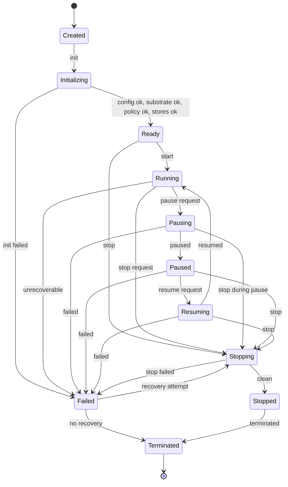

# Runtime Contract — P9

> Contract only, no implementation, no language chosen, respects P8 freeze.

## Purpose

CoreRuntime is the orchestrator of LINEX.OS above Linux. It manages lifecycle, task execution, state transitions, cancellation, recovery, configuration, health, events, verification hooks — without being tied to Linux distro or LLM provider.

```
CoreRuntime
  ├── lifecycle
  ├── task execution
  ├── state transitions
  ├── cancellation
  ├── recovery
  ├── configuration
  ├── health
  ├── events
  └── verification hooks
```

## Inputs

- Configuration: runtime config (env, resource limits, capabilities, storage interfaces, policy references, no secrets)
- Substrate: OS detection, arch detection, package manager abstraction (read-only)
- Policy Engine reference (trusted)
- Execution Authority reference (trusted, Level 0 Gate current)
- Event Bus reference (append-only, no secrets)
- State Store reference (lifecycle PROPOSED→VERIFIED)
- Memory Store reference (Ephemeral, Session, Project, User, System)
- Artifact Store reference (Source, Build, Execution, Evidence, User)
- Evidence Store reference (append-only immutable)
- Identity/Auth reference (User, Agent, Service, Tool, MCP Server, Execution Authority separate)

## Outputs

- Runtime state (Created, Initializing, Ready, Running, Pausing, Paused, Resuming, Stopping, Stopped, Failed, Terminated)
- Task/Run lifecycle events
- Action proposals → Policy → Execution → Results
- Events (task.*, action.*, runtime.*, verification.*, evidence.*)
- Results/Evidence with STATUS/RESULT/EVIDENCE/NEXT
- Health status (/health, readiness, liveness, resource usage)
- Observability: DEBUG LOG vs AUDIT EVENT vs SECURITY EVENT vs VERIFICATION EVIDENCE, no secrets, no mixing

## Trust

- Trusted component (Core Runtime) but depends on Policy/Authorization (more trusted)
- Must not bypass Policy, must not allow LLM→shell direct, UI→privileged direct, Agent→prod DB direct, MCP→unrestricted host
- Fail-closed: unknown state → BLOCKED, missing auth → DENY, missing evidence → UNVERIFIED

## Dependencies

- Substrate (read-only)
- Policy Engine (ALLOW/DENY/REQUIRE_APPROVAL/DRY_RUN, UNKNOWN→DENY)
- Authorization Layer (Actor, Action, Capability, Resource, Scope, Risk, Env, Context, Approval, Network)
- Execution Authority (Shell, Process, File, Network, Package executors via Policy, resource limits design only)
- Event Bus (append-only, event_id, timestamp, actor, correlation_id, no secrets)
- State Store (lifecycle explicit, no implicit jumps)
- Memory Store, Artifact Store, Evidence Store (interfaces local/optional remote/replaceable, no vendor, free-first)
- Identity/Auth
- Configuration Service (no secrets in files)
- Observability

May depend on: Policy, Auth, Execution, Event, State, Memory, Artifact, Evidence, Identity, Config, Observability
Must not depend on: UI (UI→API→Runtime, not Runtime→UI), LLM directly (LLM→Planner→Policy→Runtime)

## Lifecycle State Machine

```
Created
  ↓
Initializing (load config, detect substrate, init stores, init policy, health check)
  ↓
Ready (ready to accept tasks, /health OK)
  ↓
Running (executing tasks)
  ↔ Pausing → Paused → Resuming → Running
  ↓
Stopping (graceful shutdown, cancel tasks, flush events, persist state)
  ↓
Stopped (clean stop, resources released)
  ↓
Terminated (final, no restart without new Created)

Any state → Failed (on unrecoverable error, resource exhaustion, policy violation)
Failed → Stopping → Stopped or Failed → Terminated (depending on recovery policy)

No implicit jumps, all transitions explicit, logged as events with event_id, timestamp, actor, correlation_id, no secrets.
```

Mermaid:



## Task Execution

```
Task created (via API, Agent, or Workflow)
  → Task queued (State Store)
  → Task scheduled (Runtime selects, checks capabilities, policy pre-check)
  → Run created (execution instance)
  → Actions proposed (Planner)
  → Policy validated (Policy Engine)
  → Authorization (Authorization Layer)
  → Execution (Execution Authority via capability, resource limits design only, DRY-RUN if required)
  → Result produced
  → Verification (Verifier)
  → Evidence created (Evidence Store)
  → Task completed (Succeeded/Failed/Cancelled)
  → Task verified (Verified/Unverified)
  → Learn (optional, via Memory Service)

No Task execution without capability check, no Action execution without Policy, no Result without Evidence, no PASS without evidence.
```

## State Transitions

- Explicit only, no implicit
- Fail-closed: unknown state → BLOCKED, invalid transition → DENY + event + audit
- Idempotent where possible, but no auto-success
- All transitions emit event with event_id, timestamp, actor, correlation_id, no secrets
- State Store is source of truth, append-only history, not mutable in place without event

## Cancellation

- Cooperative cancellation: Runtime signals cancellation, Task/Run/Action checks and stops gracefully
- Timeout cancellation: if execution exceeds timeout (resource limits design only), Runtime cancels, emits event, evidence
- Explicit cancellation: User/Agent/Service requests cancel via API → Policy → Authorization → Runtime → Task/Run/Action cancelled
- No orphaned resources: on cancellation, Runtime must release resources, flush events, persist state, produce evidence
- Cancellation states: CANCELLING → CANCELLED, with evidence
- Cancellation is not failure: CANCELLED ≠ FAILED, but needs verification

## Recovery

- Retry: Task/Run can retry on transient failures (network, dependency) with backoff, but not on Policy DENY or capability DENY or validation failure
- Resume: Paused Task/Run can resume from last checkpoint (if checkpoint exists via State Store)
- Compensation: on failure, Runtime may trigger compensation actions (rollback, cleanup) via Policy + Execution Authority
- No auto-success: recovery does not automatically mark Succeeded, must go through Verification → Evidence → Verified
- Recovery policy: defined in Task Contract (retry count, backoff, compensation), not hardcoded
- Failed → Stopping → Stopped or Failed → Terminated depending on recovery policy and explicit approval

## Configuration

- Runtime config schema (no secrets):
  ```json
  {
    "runtime_id": "string, unique, immutable",
    "version": "string, semver",
    "env": "local | arena | ci | production",
    "resource_limits": {
      "cpu": "number | null, design only",
      "memory": "number | null, design only",
      "disk": "number | null, design only",
      "process_count": "number | null",
      "fd": "number | null",
      "network": "boolean, allow outbound?",
      "execution_time": "number, seconds, timeout",
      "output_size": "number, max output bytes"
    },
    "capabilities": ["CAP_FS_READ", "CAP_FS_WRITE", "..."],
    "storage": {
      "state_store": "local | interface reference, no vendor",
      "event_store": "local | interface reference",
      "memory_store": "local | interface reference",
      "artifact_store": "local | interface reference",
      "evidence_store": "local | interface reference"
    },
    "policy": {
      "policy_engine": "interface reference",
      "authorization": "interface reference",
      "capability_registry": "interface reference"
    },
    "execution": {
      "authority": "interface reference",
      "executors": ["shell", "process", "file", "network", "package", "browser?", "computer?"],
      "sandbox_level": "0 | 1 | 2 | 3 | 4 | 5 | 6, design only, current 0 Gate"
    },
    "observability": {
      "log_level": "DEBUG | INFO | WARN | ERROR",
      "audit": "boolean",
      "metrics": "boolean",
      "tracing": "boolean"
    },
    "health": {
      "check_interval": "number, seconds",
      "readiness": "boolean",
      "liveness": "boolean"
    }
  }
  ```
- No secrets in config files: no API keys, tokens, private keys, credentials — must use env vars / secret manager / platform secrets, not log value
- Config via Configuration Service, not file mutation directly, validated, no path traversal
- Env: local, arena, ci, production — LOCAL≠PRODUCTION, MOCK≠PRODUCTION, production requires production evidence

## Health

- /health conceptual endpoint (no implementation P9): returns runtime_id, version, state, uptime, resource usage, readiness, liveness, no secrets, no privileged logic
- Readiness: Ready to accept tasks? (config ok, substrate ok, policy ok, stores ok, execution authority ok)
- Liveness: Running? (not Failed, not Terminated, event bus responsive, state store responsive)
- Resource usage: CPU, memory, disk, process count, FD, network state, execution time, output size — design only, no enforcement in P9, but reported
- Health checks emit events: runtime.health with event_id, timestamp, actor system, correlation_id, no secrets
- Health does not bypass Policy, does not expose secrets, does not allow privileged execution

## Events

- Runtime emits: runtime.created, runtime.initializing, runtime.ready, runtime.running, runtime.pausing, runtime.paused, runtime.resuming, runtime.stopping, runtime.stopped, runtime.failed, runtime.terminated, runtime.health
- Each event with event_id (unique, immutable), timestamp UTC, actor (system, user, agent, service), action (state transition), capability, resource (runtime_id), scope (system), result (success/failure), correlation_id (ties to task/run/action if applicable), evidence hash (SHA256), no secrets
- Event Bus append-only immutable, no secrets, ordering best-effort, retention policy, replay protection future
- Observability distinction: DEBUG LOG (detailed) vs AUDIT EVENT (who did what when) vs SECURITY EVENT (policy violation, capability DENY) vs VERIFICATION EVIDENCE (PASS/FAIL with evidence) — no mixing, no secrets

## Verification Hooks

- Runtime provides hooks for Verifier to produce evidence: on state transition, on task execution, on action execution, on cancellation, on recovery, on health check, on config change
- Hooks: before_transition, after_transition, before_task, after_task, before_action, after_action, on_cancel, on_recover, on_health, on_config
- Verifier is not Authorization Authority, AI is not Verifier, no PASS without evidence, SUCCEEDED≠VERIFIED
- Evidence model: STATUS (PASS/FAIL/BLOCKED/NOT VERIFIED), RESULT (summary), EVIDENCE (logs, hashes, attestation), NEXT (next steps)
- Verification hooks must not allow bypass: no hook can skip Policy, no hook can allow LLM→shell direct, no hook can produce PASS without evidence
- Evidence Store append-only immutable, no secrets, hash SHA256, provenance, attestation who verified when how

## Invariants

- No implementation language chosen
- No product code
- No package installation
- No system changes
- No secrets in repo
- No /tmp inside repo, no *.deb inside repo
- Fail-closed: unknown state → BLOCKED, invalid transition → DENY, missing auth → DENY, missing evidence → UNVERIFIED
- State transitions explicit, no implicit jumps
- No auto-success, SUCCEEDED≠VERIFIED, EXECUTED≠SAFE, LOCAL≠PRODUCTION, MOCK≠PRODUCTION
- Events append-only immutable, no secrets, with event_id, timestamp, actor, correlation_id
- Evidence with STATUS/RESULT/EVIDENCE/NEXT, no PASS without evidence
- UI client only, UI→API only, no privileged logic in UI
- LLM→shell forbidden, must go via Planner→Policy→Execution→Verifier
- Capability explicit, DEFAULT DENY, UNKNOWN→DENY
- MCP via Gateway, no unbounded host access
- Storage abstraction interfaces local/optional remote/replaceable, no vendor, free-first, vendor-neutral, self-hostable, local-capable, no mandatory paid API/cloud DB
- Resource limits design only, no enforcement in P9
- Low-resource modes CORE/STANDARD/HEAVY respected, no GPU/K8s assumed
- Diagrams ASCII/Mermaid
- Respects P8 frozen baseline, no violation without ADR

## May Do

- Define lifecycle, task execution, state transitions, cancellation, recovery, configuration, health, events, verification hooks as contracts
- Emit events with event_id, timestamp, actor, correlation_id, no secrets
- Provide hooks for Verifier
- Check capabilities via Capability Registry, Policy via Policy Engine, Authorization via Authorization Layer
- Use Execution Authority via Policy, with resource limits design only
- Persist state via State Store interface, events via Event Bus, evidence via Evidence Store, all local/optional remote/replaceable
- Report health via /health conceptual, no secrets
- Support low-resource modes CORE/STANDARD/HEAVY

## Must Never Do

- Choose implementation language in P9
- Implement runtime (no product code)
- Install packages (no apt install as executable)
- Modify system (no sudo, systemctl, user/group, firewall, disk, boot, PowerShell, Docker)
- Commit/print/log secrets
- Create /tmp inside repo, or *.deb inside repo
- Allow LLM→shell direct, UI→privileged direct, Agent→prod DB direct, MCP→unrestricted host
- Bypass Policy, allow unknown capability/tool/executor, allow missing auth, allow missing evidence as PASS
- Implicit state jumps, auto-success, SUCCEEDED=VERIFIED, LOCAL=PRODUCTION, MOCK=PRODUCTION
- Events with secrets, mutable events, no event_id/timestamp/actor/correlation_id
- Evidence without STATUS/RESULT/EVIDENCE/NEXT, PASS without evidence
- Privileged logic in UI, UI→sudo/shell
- Choose vendor for storage, require paid API/cloud DB, require GPU/K8s
- Violate P8 frozen baseline without ADR

## References

- docs/architecture/frozen-baseline.md
- docs/architecture/execution-model.md
- docs/architecture/components.md (23 components)
- docs/architecture/security-boundaries.md
- docs/contracts/README.md
- docs/contracts/lifecycle.md (state machines)
- docs/contracts/task.md, action.md, event.md, result.md
