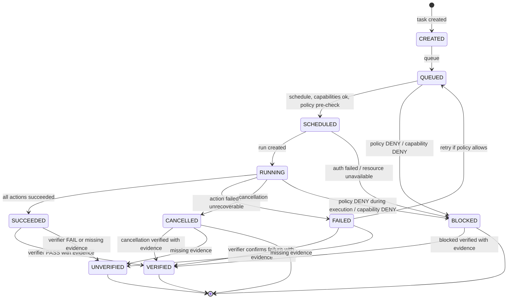

# Task/Run Contract — P9

> Contract only, no implementation, no language chosen, respects P8 freeze.

## Purpose

Task is unit of work, Run is execution instance of Task. Task defines what to do, Run tracks execution of Task via Actions → Results → Evidence.

```
Task created
→ Plan
→ Action proposed
→ Policy
→ Execute
→ Result
→ Verify
→ Evidence
→ Learn
```

Without being tied to Linux or LLM provider.

## Task Definition

Task is declarative, not imperative, not tied to implementation language.

Schema (contract, no implementation):

```json
{
  "task_id": "string, unique, immutable, e.g., task-uuid",
  "version": "string, semver, immutable for this task_id",
  "name": "string, human readable, e.g., 'Build toolchain'",
  "description": "string, what task does, why",
  "inputs": {
    "schema": "JSON Schema, defines expected inputs, no secrets",
    "example": {}
  },
  "outputs": {
    "schema": "JSON Schema, defines expected outputs, no secrets",
    "example": {}
  },
  "capabilities_required": ["CAP_FS_READ", "CAP_FS_WRITE", "CAP_PROCESS_EXEC", "..."],
  "risk_class": "CLASS-0 | CLASS-1 | CLASS-2 | CLASS-3 | CLASS-4 | CLASS-5 | CLASS-6",
  "timeout": "number, seconds, max execution time, resource limits design only",
  "resource_limits": {
    "cpu": "number | null, design only",
    "memory": "number | null, design only",
    "disk": "number | null, design only",
    "process_count": "number | null",
    "fd": "number | null",
    "network": "boolean",
    "execution_time": "number, seconds",
    "output_size": "number, max bytes"
  },
  "retry_policy": {
    "max_retries": "number, 0..n, no retry on Policy DENY or validation failure",
    "backoff": "exponential | fixed, design only",
    "retry_on": ["network failure", "dependency failure", "resource temporarily unavailable"],
    "no_retry_on": ["policy DENY", "capability DENY", "validation failure", "secret exfiltration attempt", "path traversal", "command injection"]
  },
  "cancellation_policy": "cooperative | timeout | explicit, no orphaned resources",
  "recovery_policy": "retry | resume | compensation | fail, no auto-success",
  "configuration": {
    "env": "local | arena | ci | production, LOCAL≠PRODUCTION",
    "storage": "local | interface reference, no vendor",
    "policy": "interface reference",
    "execution": "interface reference"
  },
  "dependencies": ["task_id of dependencies, if any, no cycles"],
  "artifacts": {
    "inputs": ["artifact_id, source artifacts"],
    "outputs": ["artifact_id, expected output artifacts, with owner, scope, hash, provenance"]
  },
  "events": ["task.created", "task.queued", "task.scheduled", "task.started", "task.completed", "task.failed", "task.cancelled", "task.verified", "task.unverified"],
  "verification": {
    "hooks": ["before_task", "after_task", "on_cancel", "on_recover"],
    "evidence_required": true,
    "no_pass_without_evidence": true,
    "succeeded_not_verified": true
  },
  "owner": "user | agent | service, with identity",
  "scope": "workspace | repository | project | user | host | network | production, explicit elevation",
  "created_at": "timestamp UTC, immutable",
  "created_by": "actor id, user/agent/service",
  "correlation_id": "string, ties task to workflow, run, actions, events, evidence"
}
```

### Task Risk Classes (from AGENTS.md)

- CLASS-0 READ/INSPECT: read-only, low risk, AUTO
- CLASS-1 CREATE/EDIT: create/edit files in workspace, medium low, AUTO with evidence
- CLASS-2 PROCESS/TOOL: process execution, tool use, medium, DRY_RUN may be required
- CLASS-3 NETWORK: network read official allowlisted, medium, AUTO with allowlist check
- CLASS-4 PACKAGE/NETWORK CONNECT: package install, unrestricted network, high, REQUIRE_APPROVAL + DRY_RUN first + --execute explicit + allowlist official only
- CLASS-5 HOST/PRODUCTION: host OS, production DB, high/critical, REQUIRE_APPROVAL + very strong auth + production evidence, no MOCK→PRODUCTION
- CLASS-6 FORBIDDEN: modify sudoers, rm -rf /, mkfs, eval, curl|bash executable, secret commit/print/log, path traversal to /etc/sudoers, etc. → DENY always

Task risk class determines Policy decision and approval required.

## Run Definition

Run is execution instance of Task, tracks state, attempts, events, results, evidence.

Schema:

```json
{
  "run_id": "string, unique, immutable, e.g., run-uuid",
  "task_id": "string, reference to Task",
  "attempt": "number, 1..max_retries+1",
  "state": "CREATED | QUEUED | SCHEDULED | RUNNING | SUCCEEDED | FAILED | CANCELLED | VERIFIED | UNVERIFIED | BLOCKED",
  "inputs": "actual inputs for this run, validated against Task inputs schema, no secrets",
  "outputs": "actual outputs for this run, validated against Task outputs schema, no secrets",
  "capabilities_used": ["CAP_FS_READ", "..., actual capabilities used, must be subset of Task capabilities_required"],
  "actions": ["action_id, list of actions executed in this run"],
  "events": ["event_id, list of events emitted in this run"],
  "results": ["result_id, list of results produced in this run"],
  "evidence": ["evidence_id, list of evidence produced in this run"],
  "resource_usage": {
    "cpu": "number, actual",
    "memory": "number, actual",
    "disk": "number, actual",
    "process_count": "number, actual",
    "fd": "number, actual",
    "network": "boolean, used?",
    "execution_time": "number, seconds, actual",
    "output_size": "number, bytes, actual"
  },
  "started_at": "timestamp UTC",
  "completed_at": "timestamp UTC | null",
  "duration": "number, seconds | null",
  "actor": "user | agent | service who triggered run",
  "scope": "workspace | repository | project | user | host | network | production, explicit",
  "result": "SUCCEEDED | FAILED | CANCELLED | BLOCKED",
  "verification": "VERIFIED | UNVERIFIED | NOT VERIFIED",
  "evidence_required": true,
  "correlation_id": "string, ties run to task, workflow, actions, events, evidence"
}
```

## Task State Machine

```
CREATED (task defined, not yet queued)
  ↓
QUEUED (task queued in State Store, waiting scheduling)
  ↓
SCHEDULED (runtime selected, capabilities checked, policy pre-check PASS)
  ↓
RUNNING (run created, actions executing)
  ↓
SUCCEEDED / FAILED / CANCELLED / BLOCKED (execution finished)
  ↓
VERIFIED / UNVERIFIED (verifier produced evidence, checked)

Any state → CANCELLED on cancellation request (cooperative, timeout, explicit)
Any state → FAILED on unrecoverable error
FAILED → QUEUED on retry (if retry policy allows, not on Policy DENY)
```

Mermaid:



## Run State Machine

```
CREATED (run defined)
  ↓
RUNNING (executing actions)
  ↓
SUCCEEDED / FAILED / CANCELLED / BLOCKED
  ↓
VERIFIED / UNVERIFIED

Same as Task but per attempt.
```

## Cancellation

- Task cancellation: cooperative, timeout, explicit
  - Cooperative: Runtime signals cancellation, Task checks and stops gracefully, no orphaned resources, emits task.cancelled event, evidence
  - Timeout: if execution exceeds Task timeout, Runtime cancels, emits event, evidence
  - Explicit: User/Agent/Service requests cancel via API → Policy → Authorization → Runtime → Task cancelled
- Run cancellation: same, per run instance
- No orphaned resources: on cancellation, must release resources, flush events, persist state, produce evidence
- Cancellation states: CANCELLING → CANCELLED, with evidence
- CANCELLED ≠ FAILED, but needs verification

## Recovery

- Retry: Task can retry on transient failures (network, dependency, resource temporarily unavailable) with backoff, max_retries, but NOT on Policy DENY, capability DENY, validation failure, secret exfiltration, path traversal, command injection
- Resume: Paused Task/Run can resume from last checkpoint if checkpoint exists via State Store (checkpoint is artifact with hash, provenance)
- Compensation: on failure, Runtime may trigger compensation actions (rollback, cleanup) via Policy + Execution Authority, compensation actions themselves need Policy, Execution, Verification, Evidence
- No auto-success: recovery does not automatically mark Succeeded, must go through Verification → Evidence → Verified
- Recovery policy defined in Task Contract, not hardcoded

## Configuration

- Task config via Task definition, not file mutation directly
- No secrets in Task inputs/outputs: no API keys, tokens, private keys, credentials — must use env vars / secret manager / platform secrets, not log value
- Env: local, arena, ci, production — LOCAL≠PRODUCTION, MOCK≠PRODUCTION, production requires production evidence
- Resource limits design only, no enforcement in P9, but defined and reported

## Health

- Task health via events: task.started, task.completed, task.failed, task.cancelled, with event_id, timestamp, actor, correlation_id, no secrets
- Run health via resource_usage, duration, result, verification
- Health does not bypass Policy, does not expose secrets

## Events

- Task emits: task.created, task.queued, task.scheduled, task.started, task.completed, task.failed, task.cancelled, task.verified, task.unverified
- Run emits: run.created, run.running, run.succeeded, run.failed, run.cancelled, run.blocked, run.verified, run.unverified
- Each event with event_id, timestamp, actor, task_id, run_id, action_id if applicable, capability, resource, scope, result, correlation_id, evidence hash, no secrets
- Event Bus append-only immutable, no secrets

## Verification Hooks

- Task provides hooks: before_task, after_task, on_cancel, on_recover
- Run provides hooks: before_run, after_run
- Verifier uses hooks to produce evidence, no PASS without evidence, SUCCEEDED≠VERIFIED
- Evidence model STATUS/RESULT/EVIDENCE/NEXT, ACTION/CLASS/POLICY/DECISION/EXECUTION/EXIT_CODE/TIMESTAMP/SYSTEM_SUDO/PROJECT_POLICY

## Invariants

- Task is declarative, not imperative, not tied to implementation language
- Task has unique immutable task_id, version, name, description, inputs/outputs schemas, capabilities_required, risk_class, timeout, resource_limits, retry_policy, cancellation_policy, recovery_policy, configuration, dependencies, artifacts, events, verification, owner, scope, created_at, created_by, correlation_id
- Run has unique immutable run_id, task_id, attempt, state, inputs/outputs validated, capabilities_used subset of required, actions, events, results, evidence, resource_usage, started_at, completed_at, duration, actor, scope, result, verification, correlation_id
- State transitions explicit, no implicit jumps, fail-closed UNKNOWN→BLOCKED/UNVERIFIED, invalid transition→DENY
- No auto-success, SUCCEEDED≠VERIFIED, EXECUTED≠SAFE, LOCAL≠PRODUCTION, MOCK≠PRODUCTION
- Cancellation cooperative/timeout/explicit, no orphaned resources, CANCELLED≠FAILED
- Recovery retry/resume/compensation, no auto-success, retry only on transient, not on Policy DENY
- No secrets in inputs/outputs, no commit/print/log secrets
- Events append-only immutable, no secrets, with event_id, timestamp, actor, task_id, run_id, correlation_id
- Evidence with STATUS/RESULT/EVIDENCE/NEXT, no PASS without evidence
- UI client only, UI→API only
- LLM→shell forbidden
- Capability explicit DEFAULT DENY UNKNOWN→DENY
- Storage abstraction interfaces local/optional remote/replaceable no vendor
- Resource limits design only no enforcement P9
- Respects P8 frozen baseline no violation without ADR

## May Do

- Define Task as unit of work with declarative schema
- Define Run as execution instance tracking state, attempts, events, results, evidence
- Emit task.* and run.* events with event_id, timestamp, actor, correlation_id, no secrets
- Provide hooks for Verifier
- Check capabilities, Policy, Authorization
- Use Execution Authority via Policy
- Persist state via State Store, events via Event Bus, evidence via Evidence Store
- Support cancellation cooperative/timeout/explicit with no orphaned resources
- Support recovery retry/resume/compensation with no auto-success
- Support low-resource modes CORE/STANDARD/HEAVY

## Must Never Do

- Choose implementation language
- Implement Task/Run execution (no product code)
- Install packages
- Modify system
- Commit/print/log secrets, include secrets in inputs/outputs
- Create /tmp inside repo, *.deb inside repo
- Allow LLM→shell direct, UI→privileged direct, Agent→prod DB direct, MCP→unrestricted host
- Bypass Policy, allow unknown capability, allow missing auth, allow missing evidence as PASS
- Implicit state jumps, auto-success, SUCCEEDED=VERIFIED, LOCAL=PRODUCTION, MOCK=PRODUCTION
- Events with secrets, mutable events, no event_id/timestamp/actor/correlation_id
- Evidence without STATUS/RESULT/EVIDENCE/NEXT, PASS without evidence
- Retry on Policy DENY, capability DENY, validation failure, secret exfiltration, path traversal, command injection
- Orphaned resources on cancellation
- Auto-success on recovery
- Choose vendor for storage, require paid API/cloud DB, require GPU/K8s
- Violate P8 frozen baseline without ADR

## References

- docs/architecture/frozen-baseline.md
- docs/architecture/execution-model.md
- docs/architecture/data-model.md
- docs/contracts/README.md
- docs/contracts/runtime.md
- docs/contracts/lifecycle.md
- docs/contracts/action.md, event.md, result.md
